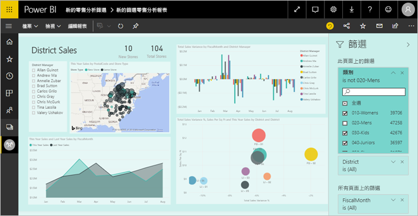
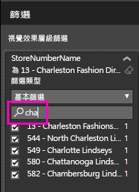
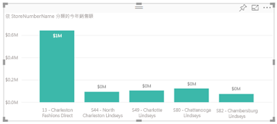
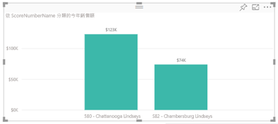

# 將篩選加入 Power BI 報表

本文說明如何將頁面篩選、視覺效果篩選、報表篩選或鑽研篩選新增到 Power BI 中的報表。 本文中的範例是在 Power BI 服務中。 這些步驟幾乎與 Power BI Desktop 完全相同。

**您知道嗎？** Power BI 已推出新的篩選體驗，目前正處於預覽狀態。 深入了解 [Power BI 報表中的新篩選體驗](power-bi-report-filter.md)。

Power BI 提供許多不同種類的篩選條件，從手動和自動到鑽研和傳遞。 閱讀[各種不同的篩選類型](power-bi-report-filter-types.md)。

## 編輯檢視或閱讀檢視中的篩選
您可以在兩個不同檢視中與報表互動：[閱讀] 檢視和 [編輯] 檢視。 篩選功能會依據您使用的檢視來提供。 如需詳細資料，請參閱[在 Power BI 報表中進行篩選和醒目提示的相關事項](power-bi-reports-filters-and-highlighting.md)。

本文將說明如何在報表的 [編輯檢視]  中建立篩選。  如需 [閱讀檢視] 中篩選的資訊，請參閱[在報表的閱讀檢視中與篩選互動](consumer/end-user-report-filter.md)。

因為篩選「可持續」  ，當您離開報表，Power BI 會保留篩選、交叉分析篩選器和您所做的其他資料檢視變更。 因此，當您返回報表時可以從先前離開的地方繼續。 如果您不想要保存篩選的變更，請從頂端功能表列選取 [重設為預設]  。

## [篩選] 窗格中的篩選條件層級
無論您使用 Desktop 或 Power BI 服務，[篩選] 窗格都會顯示於報表畫布右方。 若未看見 [篩選] 窗格，請選取右上角的 ">" 圖示展開窗格。

您可以針對報表設定三個不同層級的篩選條件：視覺效果層級、頁面層級和報表層級篩選條件。 您也可以設定鑽研篩選條件。 本文說明不同的層級。

![[讀取] 檢視中的 [篩選] 窗格](media/power-bi-report-add-filter/power-bi-add-filter-reading-view.png)

## 將篩選新增到視覺效果
您可以透過兩種不同方式，將視覺效果層級篩選條件新增至特定視覺效果。 

* 篩選某個視覺效果已使用的欄位。
* 識別視覺效果尚未使用的欄位，並將該欄位直接新增至 [視覺效果層級篩選]  貯體。

順帶一提，此程序使用零售分析範例，您可以視需要下載並跟著操作。 下載[零售分析範例](sample-retail-analysis.md)。

### 篩選視覺效果中的欄位

1. 選取 [編輯報表]  以在 [編輯] 檢視中開啟報表。
   
   ![[編輯報表] 按鈕](media/power-bi-report-add-filter/power-bi-edit-view.png)

2. 開啟 [視覺效果和篩選] 窗格和 [欄位] 窗格 (如果尚未開啟的話)。
   
   ![[視覺效果]、[篩選] 和 [欄位] 窗格](media/power-bi-report-add-filter/power-bi-display-panes.png)
3. 選取要啟用的視覺效果。 視覺效果所使用的所有欄位都是位在 [視覺效果層級篩選]  標題下的 [欄位]  窗格中，也會列在 [篩選]  窗格中。
   
   
4. 目前，我們會將篩選新增至已由視覺效果使用的欄位。 
   
    向下捲動至 [視覺效果層級篩選]  區域，然後選取箭號以展開您想要篩選的欄位。 在此範例中，我們將篩選 **StoreNumberName**。
     
     
    
    設定 [基本]  、[進階]  或 [前 N 個]  篩選控制項。 在此範例中，我們將在基本篩選中搜尋 **cha**，並選取那五家商店。
     
     
   
    視覺效果會依據新的篩選而變更。 如果您將報表與篩選一起儲存，報表讀者一開始會看到視覺效果篩選，並且在 [閱讀檢視] 中透過選取或清除值的方式與篩選互動。
     
    
    
    當您在用於視覺效果的欄位上使用篩選時，若欄位已彙總 (例如已加總、平均或計數)，則您將針對每個資料點中的「彙總」  值進行篩選。 因此，要求以**本年度銷售額 > 500000** 篩選上面的視覺效果，表示您只會在結果中看到 **13 - Charleston Fashion Direct** 資料點。 [模型量值](desktop-measures.md)上篩選一律會套用至資料點的彙總值。

### 使用不在視覺效果中的欄位篩選

現在，讓我們將新欄位以視覺效果層級篩選形式新增至視覺效果。
   
1. 從 [欄位] 窗格選取您要新增為新視覺效果層級篩選的欄位，並將它拖曳到 [視覺效果層級篩選]  區域。  在此範例中，我們會將 [區域經理]  拖曳至 [視覺效果層級篩選]  貯體，搜尋 **an**，然後選取那三個經理。 
     
    ![將欄位新增至 [篩選] 窗格](media/power-bi-report-add-filter/power-bi-search-add-visual-filter.png)

    請注意，[區域經理]  「未」  新增至視覺效果本身。 視覺效果仍然是由 [StoreNumberName]  作為 [軸] 且 [This Year Sales]\(本年度銷售額)  作為 [值] 所組成。  
     
    

    而且，現在會篩選視覺效果本身，只顯示那些經理所指定商店的本年度銷售額。
     
    

    如果您將報表與此篩選一起儲存，則報表讀者可以在 [閱讀檢視] 中透過選取或清除值的方式與 [區域經理]  篩選互動。
    
    如果您將「數值資料行」  拖曳至 [篩選] 窗格以建立視覺效果層級篩選，則該篩選會套用至「基礎資料列」  。 例如，在 [UnitCost]  欄位上新增篩選並將它設定為 **UnitCost** > 20，則不論視覺效果中所顯示資料點的總單位成本為何，都只會顯示單位成本大於 20 的產品資料列。

## 將篩選新增至整個頁面

您也可以新增頁面層級篩選條件，以篩選整個頁面。

1. 選取 [編輯報表]  以在 [編輯] 檢視中開啟報表。
   
   ![[編輯報表] 按鈕](media/power-bi-report-add-filter/power-bi-edit-view.png)
2. 開啟 [視覺效果和篩選] 窗格和 [欄位] 窗格 (如果尚未開啟的話)。
3. 從 [欄位] 窗格選取您要新增為新頁面層級篩選的欄位，並將它拖曳至 [頁面層級篩選]  區域。  
4. 選取您想要篩選的值，然後設定 [基本]  或 [進階]  篩選控制項。
   
   系統會重新繪製頁面上的所有視覺效果，以反映變更。
   
   

    如果您將報表與篩選一起儲存，則報表讀者可以在 [閱讀檢視] 中透過選取或清除值的方式與篩選互動。

## 新增鑽研篩選
使用 Power BI 服務和 Power BI Desktop 中的鑽研，您可以建立「目的地」  報表分頁，著重於特定的實體 - 例如供應商、客戶或製造商。 現在，使用者可以從其他報表分頁以滑鼠右鍵按一下該實體的資料點，就會鑽研至焦點分頁。

### 建立鑽研篩選
若要跟著做，請下載[客戶獲利率範例](sample-customer-profitability.md)。 假設您想要一個著重於主管業務區域的分頁。

1. 選取 [編輯報表]  以在 [編輯檢視] 中開啟報表。
   
   ![[編輯報表] 按鈕](media/power-bi-report-add-filter/power-bi-edit-view.png)

1. 將新分頁新增至報表，並將其命名為「小組主管」  。 這個分頁將會是鑽研「目的地」  。
2. 新增視覺效果，該視覺效果會追蹤小組主管業務區域的關鍵計量。    
3. 將 [主管 > 主管姓名]  新增至鑽研篩選。    
   
    
   
    請注意，Power BI 會將上一步箭頭新增至報表分頁。  選取上一步箭頭讓使用者返回「來源」  報表分頁 -- 使用者選擇鑽研時所在的分頁。 上一步箭頭只適用於 [閱讀] 檢視。
   
     

### 使用鑽研篩選
讓我們看看鑽研篩選的運作方式。

1. 從 [小組計分卡]  報表分頁開始。    
2. 假設您是 Andrew Ma，而且您想要查看 [小組主管] 報表分頁篩選為只有您的資料。  從左上方區域圖表，以滑鼠右鍵按一下任何綠色的資料點，以開啟 [鑽研] 功能表選項。
   
    
3. 選取 [鑽研 > 小組主管]  以鑽研至名稱為 [小組主管]  的報表分頁。 分頁會篩選為顯示他們以滑鼠右鍵按一下之資料點的相關資訊，在這個案例中為 Andrew Ma。 只有鑽研篩選中的欄位會傳遞至鑽研報表分頁。  
   
    

## 新增報表層級篩選條件來篩選整個報表

1. 選取 [編輯報表]  以在 [編輯檢視] 中開啟報表。
   
   ![[編輯報表] 按鈕](media/power-bi-report-add-filter/power-bi-edit-view.png)

2. 開啟 [視覺效果和篩選] 窗格和 [欄位] 窗格 (如果尚未開啟的話)。
3. 從 [欄位] 窗格選取您要新增為新報表層級篩選的欄位，並將它拖曳到 [報表層級篩選]  區域。  
4. 選取要篩選的值。

    使用中頁面上的視覺效果以及報表中所有頁面的視覺效果，都會依據新的篩選而變更。 如果您將報表與篩選一起儲存，則報表讀者可以在 [閱讀檢視] 中透過選取或清除值的方式與篩選互動。

1. 選取上一步箭頭以返回先前的報表分頁。

## 考量與疑難排解

- 如果您看不到 [欄位] 窗格，請確定您是處於報表[編輯檢視](service-interact-with-a-report-in-editing-view.md)。    
- 如果您已對篩選進行大量變更，並想要返回至報表作者預設設定，請從頂端功能表列選取 [重設為預設]  。

## 後續步驟
[報表 [篩選] 窗格概觀](consumer/end-user-report-filter.md)

[報表的篩選和醒目提示](power-bi-reports-filters-and-highlighting.md)

[Power BI 中各種不同的篩選類型](power-bi-report-filter-types.md)

有其他問題嗎？ [試試 Power BI 社群](http://community.powerbi.com/)

