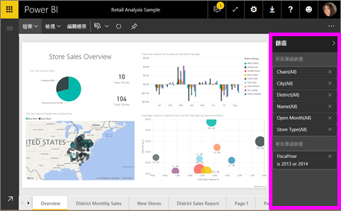
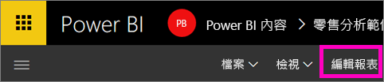
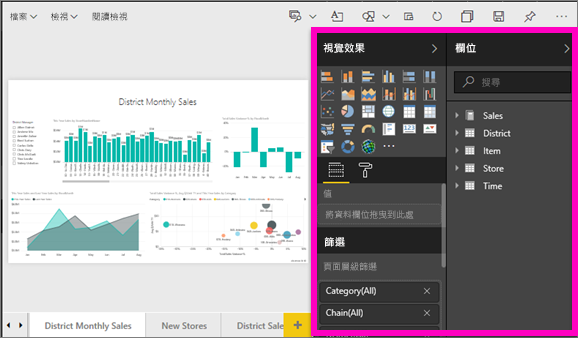
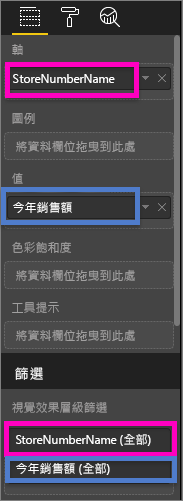
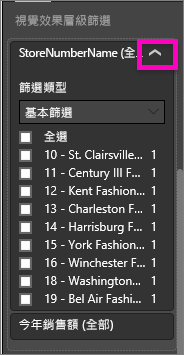
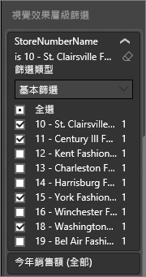
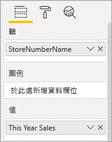
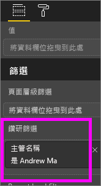
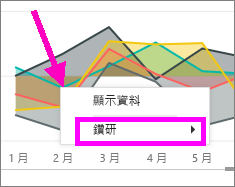
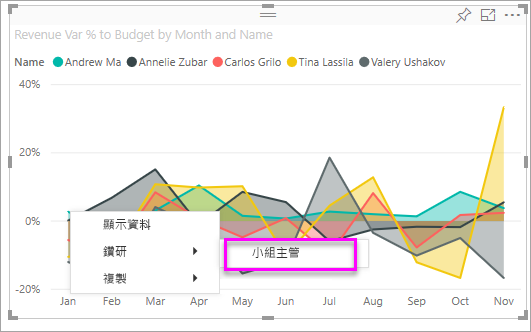

# 將篩選新增至 Power BI 服務報表 (在 [編輯檢視] 中)
> [!TIP]
> 建議先閱讀[在 Power BI 報表中進行篩選和醒目提示的相關事項](power-bi-reports-filters-and-highlighting.md)。

本文中的範例說明 Power BI 服務。 不過，這些步驟幾乎與 Power BI Desktop 完全相同。
> 
> 

## [讀取檢視] 與 [編輯檢視] 中的報表篩選之間的差異為何
您可使用下列兩種模式與報表互動：[閱讀檢視](service-reading-view-and-editing-view.md) 和 [編輯檢視](service-interact-with-a-report-in-editing-view.md)。  而篩選功能會依據您使用的模式來提供。

* 在 [編輯檢視] 中，您可以新增報表、頁面和視覺效果篩選。 當您儲存報表時，也會將篩選一起儲存。 在 [閱讀檢視] 中檢視報表的人員可以與您新增的篩選互動。
* 在 [閱讀檢視] 中，您可以與報表中已存在的任何報表、鑽研、頁面和視覺效果篩選互動，但無法新增篩選。 即使您在行動裝置應用程式中檢視報表，您在 [篩選] 窗格中所做的變更也會與報表一起儲存。  

> [!NOTE]
> 本文將說明如何在報表的 [編輯檢視] 中建立篩選。  如需 [閱讀檢視] 中篩選的資訊，請參閱[在報表的閱讀檢視中與篩選互動](service-reading-view-and-editing-view.md)。

## Power BI [篩選] 窗格中可用的篩選
無論您使用 Desktop 或 Power BI 服務，[篩選] 窗格都會顯示於報表畫布右方。 若未看見 [篩選] 窗格，請選取右上角的 ">" 圖示展開窗格。

有四種類型的篩選。

- [頁面篩選] 會套用至報表頁面上的所有視覺效果     
- [視覺效果篩選] 會套用至報表頁面上的單一視覺效果    
- [鑽研篩選] 會套用至報表中的單一實體    
- [報表篩選] 會套用至報表的所有頁面    

    

## 將篩選加入特定視覺效果中 (也稱為視覺效果篩選)
有 2 種方式可以執行這項作業︰ 

* 篩選視覺效果已使用的欄位
* 識別視覺效果尚未使用的欄位，並將該欄位直接新增至 [視覺效果層級篩選] 貯體。

### 篩選視覺效果中的現有欄位
1. [在 [編輯檢視] 中開啟報表](service-reading-view-and-editing-view.md).
   
   
2. 開啟 [視覺效果和篩選] 窗格和 [欄位] 窗格 (如果尚未開啟的話)。
   
   
3. 選取要啟用的視覺效果。 視覺效果所使用的所有欄位都是位在 [視覺效果層級篩選] 標題下的 [欄位] 窗格中，也會列在 [篩選] 窗格中。
   
   
4. 目前，我們將篩選新增至視覺效果中已使用的欄位。 
   
   * 向下捲動至 [視覺效果層級篩選] 區域，然後選取箭號以展開您想要篩選的欄位。 在此範例中，我們將篩選 **StoreNumberName**
     
       
   * 設定 [基本]、[進階] 或 [前 N 個] 篩選控制項 (請參閱[如何使用報表篩選](power-bi-how-to-report-filter.md))。 在此範例中，我們將選取 [基本篩選]，並在數字 10、11、15 和 18 旁邊放上核取記號。
     
       
   * 視覺效果會依據新的篩選而變更。 如果您將報表與篩選一起儲存，則報表讀取者可以在 [閱讀檢視] 中透過選取或清除值的方式與篩選互動。
     
      
5. 現在，讓我們將全新欄位以視覺效果層級篩選形式新增至視覺效果。
   
   * 從 [欄位] 窗格選取您要新增為新視覺效果層級篩選的欄位，並將它拖曳到 [視覺效果層級篩選] 區域。  在此範例中，我們會將 [區域經理] 拖曳至 [視覺效果層級篩選] 貯體，然後只選取 Andrew Ma。 
     
      
   * 請注意，[區域經理]「未」新增至視覺效果本身。 視覺效果仍然是由 [StoreNumberName] 作為 [軸] 且 [This Year Sales]\(本年度銷售額) 作為 [值] 所組成。  
     
      
   * 而且，現在會篩選視覺效果本身，只顯示 Andrew 所指定商店的本年度銷售額。
     
     

## 將篩選加入整個頁面中 (也稱為網頁檢視篩選)
1. [在 [編輯檢視] 中開啟報表](service-reading-view-and-editing-view.md).
2. 開啟 [視覺效果和篩選] 窗格和 [欄位] 窗格 (如果尚未開啟的話)。
3. 從 [欄位] 窗格選取您要新增為新分頁層級篩選的欄位，並將它拖曳至 [分頁層級篩選] 區域。  
4. 選取您想要篩選的值，然後設定 [基本] 或 [進階] 篩選控制項 (請參閱[如何使用報表篩選](power-bi-how-to-report-filter.md))。
   
   會重新繪製頁面上受此篩選影響的所有視覺效果，以反映變更。 
   
   

如果您將報表與篩選一起儲存，則報表讀取者可以在 [閱讀檢視] 中透過選取或清除值的方式與篩選互動。

## 新增鑽研篩選
使用 Power BI 服務和 Power BI Desktop 中的鑽研，您可以建立「目的地」報表分頁，著重於特定的實體 - 例如供應商、客戶或製造商。 現在，使用者可以從其他報表分頁以滑鼠右鍵按一下該實體的資料點，就會鑽研至焦點分頁。

### 建立鑽研篩選
若要跟著做，請在 [編輯] 檢視中開啟客戶獲利率範例。 假設您想要一個著重於主管業務區域的分頁。   

1. 將新分頁新增至報表，並將其命名為「小組主管」。 這是鑽研「目的地」分頁。
2. 新增視覺效果，該視覺效果會追蹤小組主管業務區域的關鍵計量。    
3. 將 [主管 > 主管姓名] 新增至鑽研篩選。    
   
    
   
    請注意，Power BI 會將上一步箭頭新增至報表分頁。  選取上一步箭頭讓使用者返回「來源」報表分頁 -- 使用者選擇鑽研時所在的分頁。 上一步箭頭只適用於 [閱讀] 檢視。
   
     

### 使用鑽研篩選
讓我們看看鑽研篩選的運作方式。

1. 從 [小組計分卡] 報表分頁開始。    
2. 假設您是 Andrew Ma，而且您想要查看 [小組主管] 報表分頁篩選為只有您的資料。  從左上方區域圖表，以滑鼠右鍵按一下任何綠色的資料點，以開啟 [鑽研] 功能表選項。
   
    
3. 選取 [鑽研 > 小組主管] 以鑽研至名稱為 [小組主管] 的報表分頁。 分頁會篩選為顯示他們以滑鼠右鍵按一下之資料點的相關資訊，在這個案例中為 Andrew Ma。 只有鑽研篩選中的欄位會傳遞至鑽研報表分頁。  
   
    

## 將篩選加入整份報表 (也稱為 [報表] 篩選)
1. [在 [編輯檢視] 中開啟報表](service-reading-view-and-editing-view.md).
2. 開啟 [視覺效果和篩選] 窗格和 [欄位] 窗格 (如果尚未開啟的話)。
3. 從 [欄位] 窗格選取您要新增為新報表層級篩選的欄位，並將它拖曳到 [報表層級篩選] 區域。  
4. 選取您想要篩選的值 (請參閱[如何使用報表篩選](power-bi-how-to-report-filter.md)).

    使用中頁面上的視覺效果以及報表中所有頁面的視覺效果，都會依據新的篩選而變更。 如果您將報表與篩選一起儲存，則報表讀取者可以在 [閱讀檢視] 中透過選取或清除值的方式與篩選互動。

1. 選取上一步箭頭以返回先前的報表分頁。

## 考量與疑難排解
### 為什麼您的視覺效果層級篩選與頁面層級篩選可能會傳回不同的結果
當您加入視覺效果層級篩選時，Power BI 會篩選彙總結果。  預設彙總為加總，不過您也可以[變更彙總類型](service-aggregates.md).  

當您加入頁面層級篩選時，Power BI 會篩選但不彙總。  這是因為一個頁面可能會有多個視覺效果，而且每個視覺效果可能會使用不同的彙總類型。  因此會將篩選套用至每個資料列。

如果您看不到 [欄位] 窗格，請確定您是處於報表[編輯檢視](service-interact-with-a-report-in-editing-view.md)。

## 後續步驟
 [如何使用報表篩選](power-bi-how-to-report-filter.md)

  [報表的篩選和醒目提示](power-bi-reports-filters-and-highlighting.md)

[在 [閱讀檢視] 中與篩選條件及醒目提示互動](service-reading-view-and-editing-view.md)

[變更報表視覺效果相互交叉篩選及交叉醒目提示的方式](service-reports-visual-interactions.md)

有其他問題嗎？ [試試 Power BI 社群](http://community.powerbi.com/)

