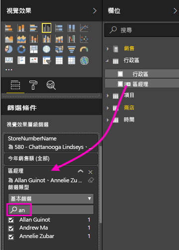

# 將篩選新增至 Power BI 服務報表 (在 [編輯檢視] 中)

本文說明如何將頁面篩選、視覺效果篩選、報表篩選或鑽研篩選新增到 Power BI 中的報表。 本文中的範例是在 Power BI 服務中。 這些步驟幾乎與 Power BI Desktop 完全相同。

## 編輯檢視或閱讀檢視中的篩選
您可以透過兩種不同檢視來與報表互動：閱讀檢視和編輯檢視。 篩選功能會依據您使用的檢視來提供。 如需詳細資料，請參閱[在 Power BI 報表中進行篩選和醒目提示的相關事項](power-bi-reports-filters-and-highlighting.md)。

本文將說明如何在報表的 [編輯檢視] 中建立篩選。  如需 [閱讀檢視] 中篩選的資訊，請參閱[在報表的閱讀檢視中與篩選互動](consumer/end-user-reading-view.md)。

## 在 [篩選] 窗格中的篩選類型
無論您使用 Desktop 或 Power BI 服務，[篩選] 窗格都會顯示於報表畫布右方。 若未看見 [篩選] 窗格，請選取右上角的 ">" 圖示展開窗格。

篩選類型有四種：**頁面篩選**、**視覺效果篩選**、**鑽研篩選**和**報表篩選**。

![[讀取] 檢視中的 [篩選] 窗格](media/power-bi-report-add-filter/power-bi-add-filter-reading-view.png)

因為篩選「可持續」，當您離開報表，Power BI 會保留篩選、交叉分析篩選器和您所做的其他資料檢視變更。 因此，當您返回報表時可以從先前離開的地方繼續。 如果您不想要保存篩選的變更，請從頂端功能表列選取 [重設為預設]。

## 將篩選新增到視覺效果
您可以透過兩種不同方式，將篩選新增到特定視覺效果 (也稱為視覺效果篩選)。 

* 篩選某個視覺效果已使用的欄位。
* 識別視覺效果尚未使用的欄位，並將該欄位直接新增至 [視覺效果層級篩選] 貯體。

順帶一提，此程序使用零售分析範例，您可以視需要下載並跟著操作。 下載[零售分析範例](sample-retail-analysis.md)。

### 篩選視覺效果中的欄位

1. [在 [編輯檢視] 中開啟報表](service-the-report-editor-take-a-tour.md)。
   
   
2. 開啟 [視覺效果和篩選] 窗格和 [欄位] 窗格 (如果尚未開啟的話)。
   
   
3. 選取要啟用的視覺效果。 視覺效果所使用的所有欄位都是位在 [視覺效果層級篩選] 標題下的 [欄位] 窗格中，也會列在 [篩選] 窗格中。
   
   
4. 目前，我們將篩選新增至視覺效果中已使用的欄位。 
   
    向下捲動至 [視覺效果層級篩選] 區域，然後選取箭號以展開您想要篩選的欄位。 在此範例中，我們將篩選 **StoreNumberName**。
     
     
    
    設定 [基本]、[進階] 或 [前 N 個] 篩選控制項。 在此範例中，我們將在基本篩選中搜尋 **cha**，並選取那五家商店。
     
     
   
    視覺效果會依據新的篩選而變更。 如果您將報表與篩選一起儲存，報表讀者一開始會看到視覺效果篩選，並且在 [閱讀檢視] 中透過選取或清除值的方式與篩選互動。
     
    

### 使用不在視覺效果中的欄位篩選

現在，讓我們將新欄位以視覺效果層級篩選形式新增至視覺效果。
   
1. 從 [欄位] 窗格選取您要新增為新視覺效果層級篩選的欄位，並將它拖曳到 [視覺效果層級篩選] 區域。  在此範例中，我們會將 [區域經理] 拖曳至 [視覺效果層級篩選] 貯體，搜尋 **an**，然後選取那三個經理。 
     
    

    請注意，[區域經理]「未」新增至視覺效果本身。 視覺效果仍然是由 [StoreNumberName] 作為 [軸] 且 [This Year Sales] \(本年度銷售額\) 作為 [值] 所組成。  
     
    

    而且，現在會篩選視覺效果本身，只顯示那些經理所指定商店的本年度銷售額。
     
    

    如果您將報表與此篩選一起儲存，則報表讀者可以在 [閱讀檢視] 中透過選取或清除值的方式與 [區域經理] 篩選互動。

## 將篩選新增至整個頁面

您也可以將篩選新增到整個頁面中 (也稱為頁面檢視篩選)
1. [在 [編輯檢視] 中開啟報表](service-the-report-editor-take-a-tour.md)。
2. 開啟 [視覺效果和篩選] 窗格和 [欄位] 窗格 (如果尚未開啟的話)。
3. 從 [欄位] 窗格選取您要新增為新頁面層級篩選的欄位，並將它拖曳至 [頁面層級篩選] 區域。  
4. 選取您想要篩選的值，然後設定 [基本] 或 [進階] 篩選控制項。
   
   會重新繪製頁面上受此篩選影響的所有視覺效果，以反映變更。 
   
   

    如果您將報表與篩選一起儲存，則報表讀者可以在 [閱讀檢視] 中透過選取或清除值的方式與篩選互動。

## 新增鑽研篩選
使用 Power BI 服務和 Power BI Desktop 中的鑽研，您可以建立「目的地」報表分頁，著重於特定的實體 - 例如供應商、客戶或製造商。 現在，使用者可以從其他報表分頁以滑鼠右鍵按一下該實體的資料點，就會鑽研至焦點分頁。

### 建立鑽研篩選
若要跟著做，請在 [編輯] 檢視中開啟客戶獲利率範例。 假設您想要一個著重於主管業務區域的分頁。   

1. 將新分頁新增至報表，並將其命名為「小組主管」。 這是鑽研「目的地」分頁。
2. 新增視覺效果，該視覺效果會追蹤小組主管業務區域的關鍵計量。    
3. 將 [主管 > 主管姓名] 新增至鑽研篩選。    
   
    
   
    請注意，Power BI 會將上一步箭頭新增至報表分頁。  選取上一步箭頭讓使用者返回「來源」報表分頁 -- 使用者選擇鑽研時所在的分頁。 上一步箭頭只適用於 [閱讀] 檢視。
   
     

### 使用鑽研篩選
讓我們看看鑽研篩選的運作方式。

1. 從 [小組計分卡] 報表分頁開始。    
2. 假設您是 Andrew Ma，而且您想要查看 [小組主管] 報表分頁篩選為只有您的資料。  從左上方區域圖表，以滑鼠右鍵按一下任何綠色的資料點，以開啟 [鑽研] 功能表選項。
   
    
3. 選取 [鑽研 > 小組主管] 以鑽研至名稱為 [小組主管] 的報表分頁。 分頁會篩選為顯示他們以滑鼠右鍵按一下之資料點的相關資訊，在這個案例中為 Andrew Ma。 只有鑽研篩選中的欄位會傳遞至鑽研報表分頁。  
   
    

## 將篩選加入整份報表 (也稱為 [報表] 篩選)
1. [在 [編輯檢視] 中開啟報表](service-the-report-editor-take-a-tour.md)。
2. 開啟 [視覺效果和篩選] 窗格和 [欄位] 窗格 (如果尚未開啟的話)。
3. 從 [欄位] 窗格選取您要新增為新報表層級篩選的欄位，並將它拖曳到 [報表層級篩選] 區域。  
4. 選取要篩選的值。

    使用中頁面上的視覺效果以及報表中所有頁面的視覺效果，都會依據新的篩選而變更。 如果您將報表與篩選一起儲存，則報表讀者可以在 [閱讀檢視] 中透過選取或清除值的方式與篩選互動。

1. 選取上一步箭頭以返回先前的報表分頁。

## 考量與疑難排解

- 在某些情況下，您的視覺效果層級篩選與頁面層級篩選可能會傳回不同結果。  例如，當您新增視覺效果層級篩選時，Power BI 會篩選彙總結果。  預設彙總為加總，不過您也可以[變更彙總類型](service-aggregates.md).  

    當您新增頁面層級篩選時，Power BI 會篩選但不彙總。  這是因為一個頁面可能會有多個視覺效果，而且每個視覺效果可能會使用不同的彙總類型。  因此會將篩選套用至每個資料列。

- 如果您看不到 [欄位] 窗格，請確定您是處於報表[編輯檢視](service-interact-with-a-report-in-editing-view.md)。    
- 如果您已對篩選進行大量變更，並想要返回至報表作者預設設定，請從頂端功能表列選取 [重設為預設]。

## 後續步驟
[報表 [篩選] 窗格概觀](consumer/end-user-report-filter.md)

[報表的篩選和醒目提示](power-bi-reports-filters-and-highlighting.md)

[在 [閱讀檢視] 中與篩選互動和醒目提示](consumer/end-user-reading-view.md)

[變更報表視覺效果相互交叉篩選及交叉醒目提示的方式](consumer/end-user-interactions.md)

有其他問題嗎？ [試試 Power BI 社群](http://community.powerbi.com/)

