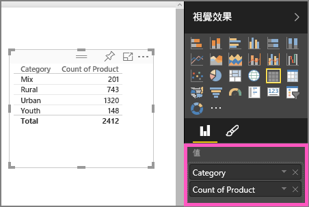
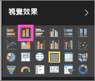

# 第一部分，在 Power BI 報表中新增視覺效果 (教學課程)
本文提供在報表中建立視覺效果的快速簡介。  如需更進一步的內容，請[參閱第二部分](power-bi-report-add-visualizations-ii.md)。 觀看 Amanda 示範數種不同方式，以在報表畫布上建立、編輯和格式化視覺效果。 接著，自己試著使用[銷售和行銷範例](sample-datasets.md)來建立專屬報表。

<iframe width="560" height="315" src="https://www.youtube.com/embed/IkJda4O7oGs" frameborder="0" allowfullscreen></iframe>

## 開啟報表並新增頁面
1. [在 [編輯檢視] 中開啟報表](service-reading-view-and-editing-view.md)。 本教學課程使用[銷售與行銷範例](sample-datasets.md)。
2. 如果看不到 [欄位] 窗格，請選取箭號圖示開啟它。 
   
   
3. [在報表中新增空白頁面](power-bi-report-add-page.md)。

## 將視覺效果新增至報表
1. 從 [欄位]  窗格選取欄位來建立視覺效果。  
   
   **從數值欄位開始**，例如銷售 > 銷售 $：Power BI 使用單一資料行建立直條圖。
   
   
   
   **從類別欄位開始**，例如 [名稱] 或 [產品]：Power BI 會建立資料表並將該欄位新增至 [值]。
   
   
   
   **從地理位置欄位開始**，例如 地理位置 > 城市。 Power BI 與 Bing 地圖服務會建立地圖視覺效果。
   
   
2. 建立視覺效果，然後變更其類型。 選取 [產品 > 產品計數] 和 [產品 > 類別]，以將其新增至 [值]。
   
   
3. 選取直條圖圖示將視覺效果變更為直條圖。
   
   
4. 當您在報表中建立視覺效果時，您可以[把它們釘選至儀表板](service-dashboard-pin-tile-from-report.md)。 若要釘選視覺效果，請選取釘選圖示 。
   
   
5. 現在您可以：
   
   繼續[第 2 部分：在 Power BI 報表中加入視覺效果](power-bi-report-add-visualizations-ii.md)
   
   在報表中[與視覺效果互動](service-interact-with-a-report-in-reading-view.md)。
   
   [執行更多的視覺效果](power-bi-report-visualizations.md)。
   
   [儲存報表](service-report-save.md)。

## 後續步驟
深入了解 [Power BI 報表中的視覺效果](power-bi-report-visualizations.md)。

[Power BI 中的報表](service-reports.md)

有其他問題嗎？ [試試 Power BI 社群](http://community.powerbi.com/)

