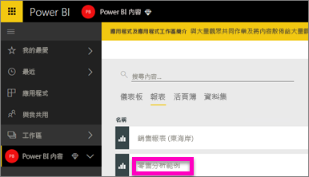
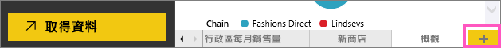
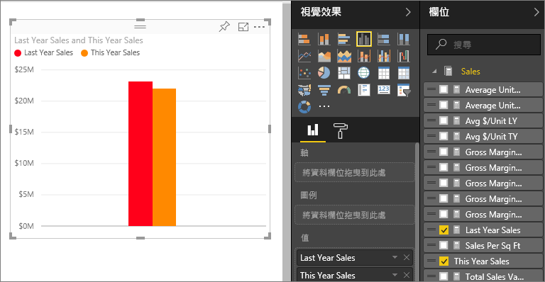
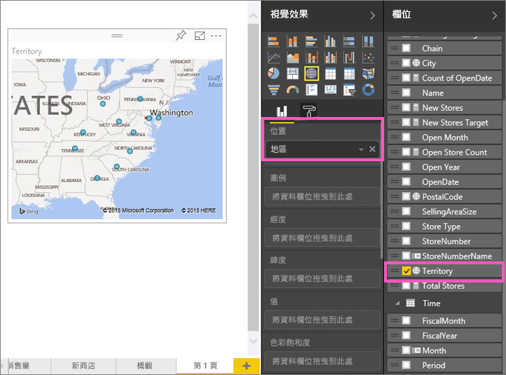
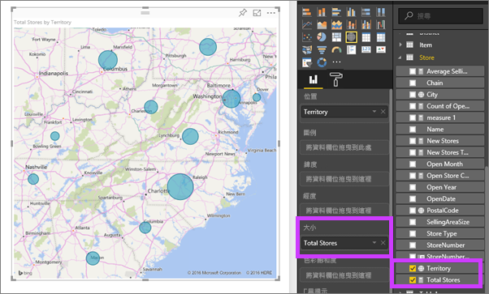
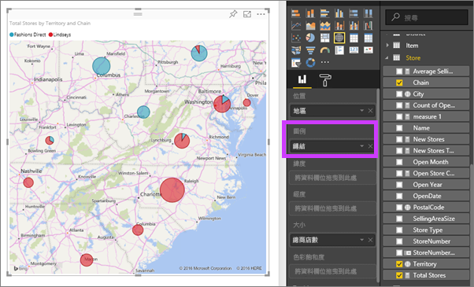

# 第 2 部分：在 Power BI 報表中新增視覺效果
在[第 1 部分](power-bi-report-add-visualizations-ii.md)，您選取了欄位名稱旁邊的核取方塊來建立基本的視覺效果。  在第 2 部分，您會學習如何使用拖放及充分利用 [欄位]  和 [視覺效果]  窗格來建立和修改視覺效果。

### 先決條件
- [第 1 部分](power-bi-report-add-visualizations-ii.md)
- Power BI 服務 - 可以使用 Power BI 服務和 Power BI Desktop 將視覺效果新增至報表。 本教學課程會使用 Power BI 服務。 
- 零售分析範例

## 建立新的視覺效果
本教學課程中，我們要深入探討零售分析資料集，並建立幾個重要的視覺效果。

### 開啟報表並加入新的空白頁面。
1. 開啟您已儲存零售分析範例的工作區。 選取 [零售分析範例]，以閱讀檢視開啟報表。
   
   
2. 選取 [編輯報表]  ，在編輯檢視中開啟報表。
   
   
3. 選取畫布底部的黃色加號圖示以[新增頁面](power-bi-report-add-page.md)。
   
   

### 加入視覺效果，查看本年度與去年度的比較銷售額。
1. 從 [銷售] 資料表中選取 [本年度銷售額] >  [值] 和 [去年度銷售額]。 Power BI 建立了直條圖。  這個有點意思，而您想要更進一步探討。 每月的銷售額又會是如何呢？  
   
   
2. 從 [時間] 資料表中，將 [月份] 拖曳到 [軸] 區域。  
   
3. [將視覺效果變更](power-bi-report-change-visualization-type.md)為區域圖。  有許多視覺效果類型可從中選擇，請參閱[其中各項說明、最佳做法的秘訣和教學課程](power-bi-visualization-types-for-reports-and-q-and-a.md)，協助您決定要使用哪種類型。 從 [視覺效果] 窗格中選取區域圖圖示。
4. 選取省略符號，然後選擇 [依月份排序]，排序視覺效果。
5. 選取視覺效果、抓取一個圓形外框，然後拖曳以[調整視覺效果大小](power-bi-visualization-move-and-resize.md)。 讓它寬到消除捲軸，但提供足夠的空間以新增另一個視覺效果。
   
   
6. [儲存報表](service-report-save.md)。

### 加入地圖視覺效果來依位置查看銷售
1. 從 [門市]  資料表中選取 [領域]。 Power BI 能夠辨識「領域」是一個位置，並建立地圖視覺效果。  
   
2. 將 [門市總額] 拖曳到 [大小] 區域。  
   
3. 加入圖例。  若要依門市名稱查看資料，請將 [連鎖店]  拖曳到 [圖例] 區域。  
   

## 後續步驟
* 如需有關 [欄位] 窗格的詳細資訊，請參閱[報表編輯器... 導覽](service-the-report-editor-take-a-tour.md).   
* 若要了解如何篩選及醒目提示視覺效果，請參閱 [Power BI 報表的篩選和醒目提示](power-bi-reports-filters-and-highlighting.md).  
* 深入了解 [Power BI 報表中的視覺效果](power-bi-report-visualizations.md)。  
* 有其他問題嗎？ [試試 Power BI 社群](http://community.powerbi.com/)

