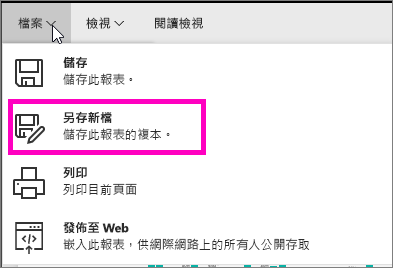
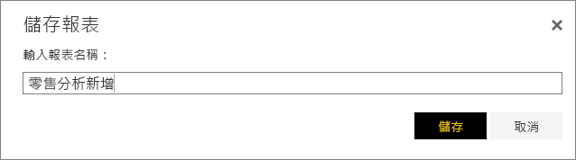

# 從現有的報表建立新的報表 (複製報表)
或許您有已經連接至資料集的報表，而且有些想要重複使用或修改的視覺效果。  為什麼不乾脆複製該報表當作新報表的基礎呢？  若要這樣做：

1. [開啟報表](consumer/end-user-report-open.md).
2. 從 [檔案]  功能表中選取 [另存新檔] 。
   
   
3. 輸入新報表的名稱並選取 [儲存] 。
   
   
   
   成功訊息可讓您知道新報表已儲存至 Power BI 中的目前工作區。
   
   
4. 開啟工作區的 [報表] 索引標籤，然後選取新的報表予以開啟。 或者刪除不想保留的視覺效果、修改其他視覺效果，以及加入新的視覺效果。
   
   
5. 享受更新和編輯新報表的樂趣。

## 後續步驟：
[建立新的視覺效果](visuals/power-bi-report-add-visualizations-ii.md)

[刪除不需要的視覺效果](consumer/end-user-delete.md)

[使用 Power BI Desktop 建立報表](desktop-report-view.md)
