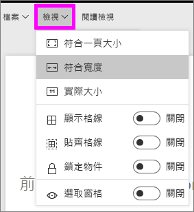

# Power BI 報表的頁面顯示設定
我們了解保持報表版面配置像素完美的重要性。 有時候這會有點困難，因為您和您的同事使用外觀比例和大小不同的螢幕檢視這些報表。 

預設顯示檢視為 [調整成一頁]，而預設顯示大小為 **16:9**。 如果您想要鎖定不同的外觀比例，或想要用不同方式以符合報表，有兩種工具可幫助您：[頁面檢視] 設定和 [頁面大小] 設定。

<iframe width="560" height="315" src="https://www.youtube.com/embed/5tg-OXzxe2g" frameborder="0" allowfullscreen></iframe>

## 在 Power BI 服務和 Power BI Desktop 中何處可找到頁面檢視設定
頁面檢視設定可用於 Power BI 服務和 Power BI Desktop 中，但介面稍有不同。 以下兩節說明您可以在每個 Power BI 工具中的何處找到檢視設定。

### 在 Power BI Desktop 中
在報告檢視中，選取 [檢視] 索引標籤，以開啟頁面檢視設定及電話配置設定。

  

### 在 Power BI 服務 (app.powerbi.com) 中
在 Power BI 服務中，開啟報告並從左上方功能表列選取 [檢視]。

[閱讀檢視和編輯檢視](service-reading-view-and-editing-view.md)中都可使用 [頁面檢視] 設定。 在 [編輯檢視] 中，報告擁有者可以將頁面檢視設定指派給個別的報告頁面，而這些設定會隨報告一起儲存。 當同事在 [閱讀檢視] 中開啟該報告時，她看到的是以擁有者設定所顯示的報告頁面。  同事可以在 [閱讀檢視] 中，變更「某些」頁面檢視設定，但是在離開報告時不會儲存所做的變更。

##    頁面檢視設定
第一組 [頁面檢視] 設定可控制報告頁面相對於瀏覽器視窗的顯示。  選擇如下：

* **調整成一頁** (預設值)：縮放內容到最能符合頁面的程度
* **符合寬度**：縮放內容到符合頁面的寬度
* **實際大小**：內容以完整大小顯示

第二組 [頁面檢視] 設定可控制報告畫布上物件的位置

* **顯示格線**：開啟格線可協助您在報告畫布上放置物件
* **貼齊格線**：搭配 [顯示格線] 使用，可在報告畫布上精確地放置和對齊物件 
* **鎖定物件**：鎖定畫布上的所有物件，使其無法移動或調整大小
* **選取窗格**：[選取] 窗格會列出畫布上的所有物件，而您可以決定要顯示和隱藏的物件

    

## [頁面大小] 設定

只有報告擁有者可以使用 [頁面大小] 設定。 在 Power BI 服務 (app.powerbi.com) 中，這表示能夠在[編輯檢視](service-reading-view-and-editing-view.md)中開啟報告。 這些設定可控制報告畫布的顯示比例和實際大小 (以像素為單位)。   

* 4:3 比例
* 16:9 比例 (預設值)
* Cortana
* Letter
* 自訂 (以像素為單位的高度和寬度)

## 後續步驟
[了解如何在您自己的 Power BI 報告中使用 [頁面檢視] 和 [頁面大小] 設定](power-bi-change-report-display-settings.md)。

深入了解 [Power BI 中的報表](service-reports.md)

[Power BI - 基本概念](service-basic-concepts.md)

有其他問題嗎？ [試試 Power BI 社群](http://community.powerbi.com/)

