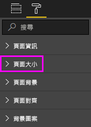

# Power BI 報表的頁面顯示設定
我們了解，請務必保持您的報表版面配置像素完美。 有時候，可能並不容易，因為您和同事可能具有不同的外觀比例和大小的螢幕上檢視這些報表。 

預設顯示檢視為 [調整成一頁]  ，而預設顯示大小為 **16:9**。 如果您想要鎖定為不同的外觀比例，或想要以不同的方式調整報表，有兩個工具可協助您：***頁面檢視***設定並***頁面大小***設定。

<iframe width="560" height="315" src="https://www.youtube.com/embed/5tg-OXzxe2g" frameborder="0" allowfullscreen></iframe>

## 哪裡可以找到在 Power BI 服務和 Power BI Desktop 中的頁面檢視設定
頁面檢視設定會適用於 Power BI 服務和 Power BI Desktop，但介面稍有不同。 下列各節說明您可以在其中找到每個 Power BI 工具中檢視設定。

### 在 Power BI Desktop 中
在報告檢視中，選取 [檢視]  索引標籤，以開啟頁面檢視設定及電話配置設定。

  

### 在 Power BI 服務 (app.powerbi.com)
在 Power BI 服務中，開啟報表，然後選取**檢視**從左上方的功能表列。

頁面檢視設定都可同時[閱讀檢視和編輯檢視](consumer/end-user-reading-view.md)。 在編輯檢視中，報表擁有者可以將頁面檢視設定指派給個別的報表頁面，以及這些設定會與報表一起儲存。 當同事在 [閱讀檢視] 中開啟該報告時，她看到的是以擁有者設定所顯示的報告頁面。 在 閱讀檢視，可以變更同事*某些*的**頁面上檢視**設定，但所做的變更時不會儲存在離開報告。

## 頁面檢視設定
第一組頁面檢視設定會控制報表頁面相對於瀏覽器視窗的顯示。 選擇如下：

* **調整成一頁**（預設值）：縮放內容到最能符合頁面
* **調整成視窗寬度**:縮放內容到符合頁面的寬度
* **實際大小**:內容以完整大小顯示

第二個頁面檢視設定控制項的設定物件在報表畫布上的位置。 選擇如下：

* **顯示格線**:開啟格線可協助您放置在報表畫布上的物件。
* **貼齊格線**:搭配使用**顯示格線**精確地放置和對齊報表畫布上的物件。 
* **鎖定物件**:鎖定在畫布上的所有物件，如此無法移動或調整大小。
* **選取窗格**:**選取項目**窗格會列出畫布上的所有物件。 您可以決定要顯示和隱藏。

    

## 頁面大小設定

**頁面大小**設定是僅適用於報表擁有者。 在 Power BI 服務 (app.powerbi.com) 中，這表示能夠開啟報表[編輯檢視](consumer/end-user-reading-view.md)。 **頁面大小**設定位於**視覺效果**窗格和控制顯示比例和實際大小 （以像素為單位），於報表畫布：   

* 4:3 比例
* 16:9 比例 (預設值)
* Cortana
* Letter
* 自訂 (以像素為單位的高度和寬度)

## 後續步驟
[在 Power BI Desktop 中的報表檢視](desktop-report-view.md)

[變更頁面檢視] 和 [在 Power BI 報表的頁面大小設定](consumer/end-user-report-view.md)

深入了解 [Power BI 中的報表](consumer/end-user-reports.md)

[Power BI 服務的取用者的的基本概念](consumer/end-user-basic-concepts.md)

有其他問題嗎？ [試試 Power BI 社群](http://community.powerbi.com/)

