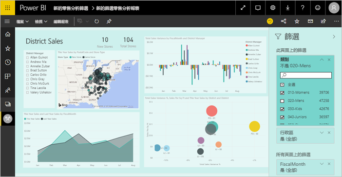
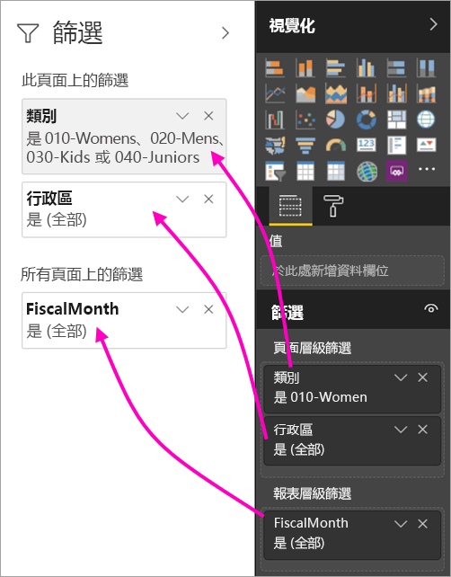
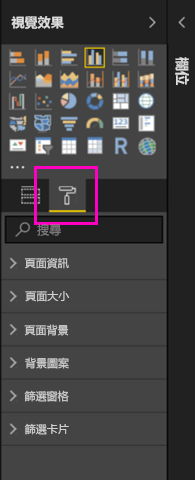
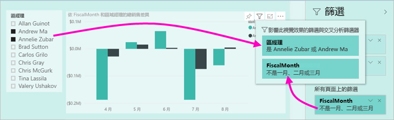

# Power BI 報表中新的篩選條件體驗 (預覽)

本文詳細說明新的篩選體驗：Power BI 中的篩選條件有新功能和新設計。 當您在 Power BI Desktop 或 Power BI 服務中設計報表時，您可以讓 [篩選] 窗格融入整個報表且與其行為一致。 在新的體驗中，舊的 [篩選] 窗格當作篩選條件編輯窗格，而報表使用者只會看到新的 [篩選窗格]。 
 

身為報表設計師，您可以使用新的篩選條件執行以下動作：

- 在視覺效果標題中顯示篩選條件的唯讀檢視，這樣取用者就知道哪些篩選條件或交叉分析篩選器影響了顯示的視覺效果。
- 對篩選條件窗格進行格式化和自訂，使它融入您的報表。
- 定義當取用者開啟報表時，[篩選] 窗格預設是開啟或折疊的。
- 隱藏整個篩選條件窗格，或您不想要報表取用者看到的特定篩選條件。
- 控制可見度 (新篩選條件窗格的開啟和摺疊狀態) 或甚至將它加入書籤。
- 將您不想要取用者看到的篩選條件鎖定。

## 開啟新的篩選條件體驗 

開啟 Power BI Desktop 中的新體驗。 然後您就可以在該位置或在 Power BI 服務 (https://app.powerbi.com)) 中修改篩選條件。 因為這個新篩選條件體驗處於預覽狀態，所以您必須先在 Power BI Desktop 中啟用它。 若您透過在 Power BI 服務中建立報表來開始，它不能有新篩選。

### 為所有新報表開啟新篩選條件

1. 在 Power BI Desktop 中，選取 [檔案] > [選項及設定] > [選項] > [預覽功能]，然後選取 [新的篩選體驗] 核取方塊。 
2. 重新啟動 Power BI Desktop，以在所有新報表中看到新的篩選條件體驗。

重新啟動 Power BI Desktop 之後，您建立的所有新報表預設都會啟用新體驗。  

### 為現有報表開啟新篩選條件

您也可以為現有報表開啟新篩選條件。

1. 在 Power BI Desktop 中的現有報表中，選取 [檔案] > [選項及設定] > [選項]
2. 在 [報表設定] 底下，選取 [啟用更新的篩選窗格，並在此報表的視覺效果標題中顯示篩選]。

## 建立新的篩選條件窗格

啟用新的篩選條件窗格之後，您會看到它在報表頁面的右邊，預設會根據您目前的報表設定來設定格式。 舊的篩選條件窗現在當作篩選條件編輯窗格。 新的篩選條件窗格會顯示當您發行報表時，報表取用者會看到哪些報表。 您可以在新窗格中更新現有的篩選條件，但您使用舊的篩選條件窗格來設定要包含篩選條件。

1. 首先，決定是否要讓報表取用者查看篩選條件窗格。 如果您想要他們看到它，請選取篩選條件旁邊的眼睛圖示  。

2. 若要開始建置新篩選條件窗格，請將感興趣的欄位拖曳到篩選條件編輯窗格，當作視覺效果、頁面或報表層級篩選條件。 您會在新的 [篩選] 窗格看到它們。

    

當您將視覺效果新增到報表畫布時，Power BI 會將篩選條件自動新增到視覺效果中的每個欄位。 Power BI 不會將那些自動篩選條件新增到唯讀篩選條件窗格。 您必須選取眼睛圖示，以明確地新增它們。

 
## 鎖定或隱藏篩選條件

您可以將個別篩選條件卡片鎖定或隱藏。 如果您將篩選條件鎖定，則您的報表取用者可以看到它，但不能變更。 如果您隱藏篩選條件，他們就完全不能看到它。 如果您需要隱藏排除 Null 或非預期值的資料清除篩選條件，則隱藏篩選條件卡片很有用。 

- 在篩選編輯窗格中，選取或清除篩選卡片中的**鎖定篩選**或**隱藏篩選**圖示。

   

當您在篩選條件編輯窗格中開啟和關閉這些設定時，您會看到變更反映在新的篩選條件窗格中。 隱藏的篩選條件不會在視覺效果的篩選條件快顯視窗中顯示。

您也可以使用報表書籤將篩選條件窗格的狀態設定為流動。 窗格的開啟、關閉和可見度狀態都可以設定為書籤。
 
## 設定新 [篩選] 窗格的格式

此新體驗的一個重點是，您現在可以設定篩選條件窗格的格式，以符合您報表的設計。 您可以針對報表中的每個頁面，將篩選條件窗格設定為不同的格式。 以下是您可以進行格式設定的元素： 

- 背景色彩
- 背景透明度
- [篩選窗格] 框線開啟或關閉
- [篩選窗格] 框線色彩

視這些元素是否已套用 (設定為某個值) 或可取得 (已清除)，您也可以針對篩選條件卡片設定其格式： 

- 背景色彩
- 背景透明度
- 框線：開啟或關閉
- 框線色彩

### 設定 [篩選] 窗格和卡片的格式

1. 在報表中，按一下報表本身或背景 (「桌布」)，然後在 [視覺效果] 窗格中，選取 [格式]。 
    您會看到設定報表頁面、桌布，以及 [篩選窗格] 和 [篩選卡片] 的選項。

        

1. 展開 [篩選窗格] 來設定背景、圖示和左框線的色彩，以搭配報表頁面。

    ![展開 [篩選窗格]](media/power-bi-report-filter-preview/power-bi-filter-format-pane.png)

1. 展開 [篩選卡片] 來設定 [可用] 與 [已套用] 色彩和框線。 如果您讓可用和已套用卡片使用不同的色彩，已套用哪些篩選條件就很清楚。 
  
    

## 在 [閱讀] 模式中檢視視覺效果的篩選條件

在 [閱讀] 模式中，您可以暫留在視覺效果上，並查看包含影響該視覺效果的所有篩選條件、交叉分析篩選器等項目的快顯視窗。 快顯視窗的格式設定和篩選條件窗格的格式設定一樣。 

以下是此檢視顯示的篩選條件類型： 
- 基本篩選條件
- 交叉分析篩選器
- 交叉醒目提示 
- 交叉篩選
- 進階篩選條件
- 前 N 個篩選條件
- 相對日期篩選條件
- 同步交叉分析篩選器
- 包含/排除篩選條件
- 透過 URL 傳遞的篩選條件

## 即將推出

在未來幾個月我們計劃要併入下列增強功能：
- 變更篩選條件卡片的能力
- 適用於報表建立者的單一篩選條件窗格體驗 
- 更多格式化選項

請試用新的篩選條件。 請針對此功能及如何繼續改善此體驗，提供意見反應給我們。 

## 後續步驟
[如何使用報表篩選](consumer/end-user-report-filter.md)

[報表的篩選和醒目提示](power-bi-reports-filters-and-highlighting.md)

[在 [閱讀檢視] 中與篩選條件及醒目提示互動](consumer/end-user-reading-view.md)

[變更報表視覺效果相互交叉篩選及交叉醒目提示的方式](consumer/end-user-interactions.md)

有其他問題嗎？ [試試 Power BI 社群](http://community.powerbi.com/)

