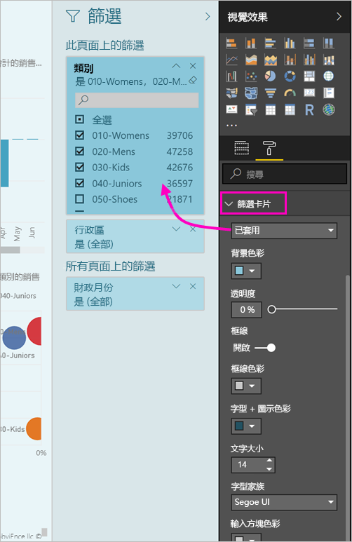

# <a name="the-new-filter-experience-in-power-bi-reports-preview"></a>Power BI 報表中新的篩選條件體驗 (預覽)

在 Power BI 中的篩選器有新功能，以及新的設計。 當您選擇在新的篩選器體驗時，您可以格式化 [篩選] 窗格看起來像是報表的其餘部分。 您可以鎖定及甚至是隱藏 篩選條件。 在設計報表時，您無法再看到 [視覺效果] 窗格中的所有舊的 [篩選] 窗格。 您進行編輯和格式化單一的 [篩選] 窗格中所有篩選條件。 


> [!NOTE]
> 新的篩選體驗處於預覽階段。 新的組建可能覆寫您已設定的格式。

為報表設計師中，以下是您可以新的單一篩選 窗格中：

- 新增和移除篩選所依據的欄位。 
- 變更篩選條件狀態。
- 格式化並自訂篩選 窗格，讓您感覺您報表的一部分。
- 定義當取用者開啟報表時，[篩選] 窗格預設是開啟或折疊的。
- 隱藏整個篩選 窗格或您不想查看的報表取用者的特定篩選器。
- 控制，而且即使書籤的可見性、 新的 [篩選] 窗格開啟時，和摺疊狀態。
- 將您不想要取用者看到的篩選條件鎖定。

新的篩選器體驗，與報表取用者也可以停留任何視覺效果，以查看所有篩選或交叉分析篩選器會影響該視覺效果的唯讀清單。


## <a name="turn-on-the-new-filter-experience"></a>開啟新的篩選條件體驗 

開啟 Power BI Desktop 中的新體驗。 然後您就可以在該位置或在 Power BI 服務 (https://app.powerbi.com)) 中修改篩選條件。 因為這個新篩選條件體驗處於預覽狀態，所以您必須先在 Power BI Desktop 中啟用它。 若您透過在 Power BI 服務中建立報表來開始，它不能有新篩選。

### <a name="turn-on-new-filters-for-all-new-reports"></a>為所有新報表開啟新篩選條件

1. 在 Power BI Desktop 中，選取 [檔案]   > [選項及設定]   > [選項]   > [預覽功能]  ，然後選取 [新的篩選體驗]  核取方塊。 
2. 重新啟動 Power BI Desktop，以在所有新報表中看到新的篩選條件體驗。

重新啟動 Power BI Desktop 之後，您建立的所有新報表預設都會啟用新體驗。  

### <a name="turn-on-new-filters-for-an-existing-report"></a>為現有報表開啟新篩選條件

您也可以為現有報表開啟新篩選條件。

1. 在 Power BI Desktop 中的現有報表中，選取 [檔案]   > [選項及設定]   > [選項] 
2. 在左側的導覽列中，在**目前的檔案**，選取**報告設定**。
3. 底下**篩選體驗**，選取**啟用更新的篩選] 窗格中，並在 [視覺效果的標頭，此報表顯示篩選**。

## <a name="view-filters-for-a-visual-in-reading-mode"></a>在 [閱讀] 模式中檢視視覺效果的篩選條件

在 [閱讀] 模式中，將滑鼠停在篩選圖示上，以查看包含影響該視覺效果的所有篩選條件、交叉分析篩選器等項目的快顯視窗。 快顯視窗中的格式是相同的篩選窗格格式設定。 


以下是此檢視顯示的篩選條件類型： 
- 基本篩選條件
- 交叉分析篩選器
- 交叉醒目提示 
- 交叉篩選
- 進階篩選條件
- 前 N 個篩選條件
- 相對日期篩選條件
- 同步交叉分析篩選器
- 包含/排除篩選條件
- 透過 URL 傳遞的篩選條件

## <a name="build-the-new-filters-pane"></a>建立新的 [篩選] 窗格

啟用新的 [篩選] 窗格之後，您會看到它右邊的報表頁面上，根據您目前的報表設定的預設格式。 您可以使用新的 [篩選] 窗格來設定篩選條件來包含此項目，並更新現有的篩選條件，在新的窗格中。 新的 [篩選] 窗格會顯示哪些報表取用者時，會看到在您發行報表。 

1. 根據預設，報表取用者可以看到 [篩選] 窗格。 如果您不想要看到它，選取眼睛圖示旁**篩選器**。

    

2. 若要開始建置新的 [篩選] 窗格，以作為視覺效果，頁面上，將感興趣的欄位拖曳到新的 [篩選] 窗格或報表層級篩選。

當您將視覺效果加入報表畫布時，Power BI 會自動新增篩選至視覺效果中的每個欄位的篩選窗格。 

## <a name="lock-or-hide-filters"></a>鎖定或隱藏篩選條件

您可以將個別篩選條件卡片鎖定或隱藏。 如果您將篩選條件鎖定，則您的報表取用者可以看到它，但不能變更。 如果您隱藏篩選條件，他們就完全不能看到它。 如果您需要隱藏排除 Null 或非預期值的資料清除篩選條件，則隱藏篩選條件卡片很有用。 

- 在新的 [篩選] 窗格中，選取或清除**Zamknout filtr**或是**隱藏篩選**篩選卡片中的圖示。

   

因為您可以開啟和關閉這些設定新的 [篩選] 窗格中，您會看到反映報表中的變更。 隱藏的篩選條件不會在視覺效果的篩選條件快顯視窗中顯示。

您也可以設定新的篩選窗格狀態流向您報表的書籤。 窗格的開啟、關閉和可見度狀態都可以設定為書籤。
 
## <a name="format-the-new-filters-pane"></a>設定新 [篩選] 窗格的格式

這個新體驗的很大一部份是您可以格式化 [篩選] 窗格，以符合您報表的外觀與風格。 您可以設定不同的報表中的每個頁面的 [篩選] 窗格的格式。 以下是您可以進行格式設定的元素： 

- 背景色彩
- 背景透明度
- 開啟或關閉的框線
- 框線色彩
- 標題和標頭的字型、 色彩和文字大小

視這些元素是否已套用 (設定為某個值) 或可取得 (已清除)，您也可以針對篩選條件卡片設定其格式： 

- 背景色彩
- 背景透明度
- 框線：開啟或關閉
- 框線色彩
- 字型、色彩及文字大小
- 輸入方塊色彩

### <a name="format-the-filters-pane-and-cards"></a>格式化 [篩選] 窗格和卡片

1. 在報表中，按一下報表本身或背景 (「桌布」  )，然後在 [視覺效果]  窗格中，選取 [格式]  。 
    您會看到報表頁面、 底色圖案，以及 [篩選] 窗格和篩選卡格式化選項。

        

1. 展開 [篩選窗格]  來設定背景、圖示和左框線的色彩，以搭配報表頁面。

    ![展開 [篩選窗格]](media/power-bi-report-filter-preview/power-bi-filter-format-pane-font.png)

1. 展開 [篩選卡片]  來設定 [可用]  與 [已套用]  色彩和框線。 如果您讓可用和已套用卡片使用不同的色彩，已套用哪些篩選條件就很清楚。 
  
    

## <a name="theming-for-filter-pane"></a>佈景主題的篩選窗格
您現在可以修改與佈景主題檔案的 [篩選] 窗格的預設設定。 以下是範例佈景主題程式碼片段可協助您開始：

 
```
"outspacePane": [{ 

"backgroundColor": {"solid": {"color": "#0000ff"}}, 

"foregroundColor": {"solid": {"color": "#00ff00"}}, 

"transparency": 50, 

"titleSize": 35, 

"headerSize": 8, 

"fontFamily": "Georgia", 

"border": true, 

"borderColor": {"solid": {"color": "#ff0000"}} 

}], 

"filterCard": [ 

{ 

"$id": "Applied", 

"transparency": 0, 

"backgroundColor": {"solid": {"color": "#ff0000"}}, 

"foregroundColor": {"solid": {"color": "#45f442"}}, 

"textSize": 30, 

"fontFamily": "Arial", 

"border": true, 

"borderColor": {"solid": {"color": "#ffffff"}}, 

"inputBoxColor": {"solid": {"color": "#C8C8C8"}} 

}, 

{ 

"$id": "Available", 

"transparency": 40, 

"backgroundColor": {"solid": {"color": "#00ff00"}}, 

"foregroundColor": {"solid": {"color": "#ffffff"}}, 

"textSize": 10, 

"fontFamily": "Times New Roman", 

"border": true, 

"borderColor": {"solid": {"color": "#123456"}}, 

"inputBoxColor": {"solid": {"color": "#777777"}} 

}] 
```

## <a name="sort-the-filter-pane"></a>排序 [篩選] 窗格

自訂的排序功能是新的篩選窗格體驗的一部分。 報表建立者可以拖放到他們想要的順序重新排列篩選條件。


預設的排序順序是依字母順序排列篩選條件。 若要啟動自訂的排序模式，直接將任何篩選器拖曳到新位置。 您只可以排序它們套用至--例如，視覺效果層級、 頁面層級或報表層級篩選層級內的篩選條件。

## <a name="filters-pane-scaling"></a>篩選窗格調整

新的 [篩選] 窗格進行調整的報表頁面和視覺效果，因此報表頁面，並篩選窗格保持彼此的比例。

## <a name="improved-filters-pane-accessibility"></a>改善的篩選窗格中協助工具

我們已改進新的 [篩選] 窗格的鍵盤導覽。 您可以透過 [篩選] 窗格的每個部分的索引標籤上及使用內容金鑰鍵盤或 Shift + f10 鍵以開啟操作功能表。


## <a name="rename-filters"></a>重新命名的篩選器
當您編輯篩選 窗格時，您可以按兩下要編輯的標題。 重新命名，是很有用，如果您想要更新終端使用者會比較合理的篩選卡片。 請注意，重新命名篩選卡沒有*不*重新命名欄位 清單中欄位的顯示名稱。 它只會變更用於篩選卡片的顯示名稱。


## <a name="restrict-changes-to-filter-type"></a>限制變更篩選類型

在篩選體驗有選項可用來控制，如果使用者可以變更篩選類型的報表設定 區段。


## <a name="next-steps"></a>後續步驟

請試用新的篩選條件。 提供這項功能，和如何我們可以持續改善該資料庫，在您意見反應[Power BI Ideas 網站](https://ideas.powerbi.com/forums/265200-power-bi)。 

- [如何使用報表篩選](consumer/end-user-report-filter.md)
- [報表的篩選和醒目提示](power-bi-reports-filters-and-highlighting.md)

有其他問題嗎？ [試試 Power BI 社群](http://community.powerbi.com/)

