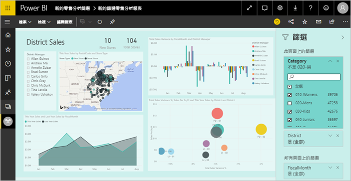
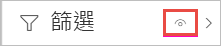
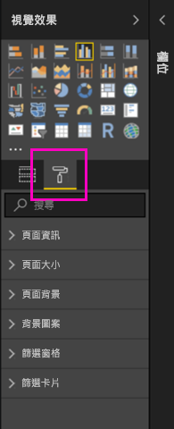
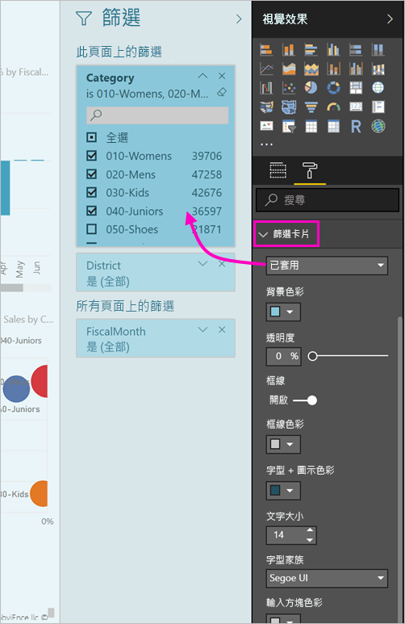
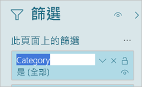

# <a name="the-new-filter-experience-in-power-bi-reports"></a>Power BI 報表的全新篩選體驗

Power BI 中的篩選有新功能和新設計。 當您加入新的篩選體驗時，您可以設定 [篩選] 窗格的格式，使它看起來像報表的其餘部分。 您可以鎖定甚至是隱藏篩選。 設計報表時，您不會再於 [視覺效果] 窗格中看到舊的 [篩選] 窗格。 您會在單一 [篩選] 窗格中，執行您所有的篩選編輯和格式設定。 



身為報表設計師，您可以在新的 [篩選] 窗格中執行以下動作：

- 新增和移除要篩選的欄位。 
- 變更篩選狀態。
- 對 [篩選] 窗格進行格式設定和自訂，使它融入您的報表。
- 定義當取用者開啟報表時，[篩選] 窗格預設是開啟或折疊的。
- 隱藏整個 [篩選] 窗格，或您不想要報表取用者看到的特定篩選。
- 控制可見度 (新 [篩選] 窗格的開啟和摺疊狀態) 或甚至將它加入書籤。
- 將您不想要取用者看到的篩選條件鎖定。

透過新的篩選體驗，報表取用者也可以將滑鼠停留在任何視覺效果上，來查看影響該視覺效果的所有篩選或交叉分析篩選器唯讀清單。


## <a name="turn-on-the-new-filter-experience"></a>開啟新的篩選條件體驗 

新報表預設會開啟全新的篩選體驗。 您可以在 Power BI Desktop 或 Power BI 服務中啟用現有報表的新體驗。

### <a name="turn-on-new-filters-for-an-existing-report-in-power-bi-desktop"></a>在 Power BI Desktop 中為現有報表開啟新的篩選

1. 在 Power BI Desktop 中的現有報表中，選取 [檔案]   > [選項及設定]   > [選項] 
2. 在左側導覽列中，選取 [目前檔案]  下的 [報表設定]  。
3. 在 [篩選體驗]  下，選取 [啟用更新的篩選窗格，並在此報表的視覺效果標題中顯示篩選]  。

### <a name="turn-on-new-filters-for-an-existing-report-in-the-service"></a>在服務中為現有報表開啟新的篩選

1. 在 Power BI 服務中，選取工作區內容清單中的 [報表]  索引標籤。
2. 尋找您要啟用的報表，然後選取該報表的**設定**圖示 。
3. 在 [篩選體驗]  下，選取 [啟用更新的篩選窗格，並在此報表的視覺效果標題中顯示篩選]  。

    

## <a name="view-filters-for-a-visual-in-reading-mode"></a>在 [閱讀] 模式中檢視視覺效果的篩選條件

在 [閱讀] 模式中，將滑鼠停在篩選圖示上，以查看影響該視覺效果的所有篩選條件、交叉分析篩選器等項目的快顯篩選清單。 快顯篩選清單和 [篩選] 窗格的格式設定一樣。 


以下是此檢視顯示的篩選條件類型： 
- 基本篩選條件
- 交叉分析篩選器
- 交叉醒目提示 
- 交叉篩選
- 進階篩選條件
- 前 N 個篩選條件
- 相對日期篩選條件
- 同步交叉分析篩選器
- 包含/排除篩選條件
- 透過 URL 傳遞的篩選條件

## <a name="build-the-new-filters-pane"></a>建置新的篩選窗格

啟用新的 [篩選] 窗格之後，您可以在報表頁面的右邊看到，預設會根據您目前的報表設定來設定格式。 您可以使用新的 [篩選] 窗格來設定要包含哪些篩選，以及更新新窗格中的現有篩選。 新的 [篩選] 窗格會顯示當您發佈報表時，報表取用者會看到哪些報表。 

1. 根據預設，您的報表取用者可以看到 [篩選] 窗格。 如果您不想讓報表取用者看到，請選取 [篩選]  旁的眼睛圖示。

    

2. 若要開始建置新的 [篩選] 窗格，請將感興趣的欄位拖曳至新的 [篩選] 窗格作為視覺效果、頁面或報表層級篩選。

當您將視覺效果新增至報表畫布時，Power BI 會自動將篩選新增至視覺效果中每個欄位的 [篩選] 窗格。 

## <a name="lock-or-hide-filters"></a>鎖定或隱藏篩選條件

您可以將個別篩選條件卡片鎖定或隱藏。 如果您將篩選條件鎖定，則您的報表取用者可以看到它，但不能變更。 如果您隱藏篩選條件，他們就完全不能看到它。 如果您需要隱藏排除 Null 或非預期值的資料清除篩選條件，則隱藏篩選條件卡片很有用。 

- 在新的 [篩選] 窗格中，選取或清除篩選卡片中的**鎖定篩選**或**隱藏篩選**圖示。

   

當您在新的 [篩選] 窗格中開啟和關閉這些設定時，您會看到變更反映在報表中。 視覺效果的快顯篩選清單不會顯示所隱藏篩選條件。

您也可以將新的 [篩選] 窗格狀態設定為隨報表書籤改變。 窗格的開啟、關閉和可見度狀態都可以設定為書籤。
 
## <a name="format-the-new-filters-pane"></a>設定新 [篩選] 窗格的格式

此新體驗的一個重點是，您可以設定 [篩選] 窗格的格式，符合您報表的外觀及操作。 您可以針對報表中的每個頁面，將 [篩選] 窗格設定為不同的格式。 以下是您可以進行格式設定的元素： 

- 背景色彩
- 背景透明度
- 開啟或關閉框線
- 框線色彩
- 標題與標題字型、色彩及文字大小

視這些元素是否已套用 (設定為某個值) 或可取得 (已清除)，您也可以針對篩選條件卡片設定其格式： 

- 背景色彩
- 背景透明度
- 框線：開啟或關閉
- 框線色彩
- 字型、色彩及文字大小
- 輸入方塊色彩

### <a name="format-the-filters-pane-and-cards"></a>設定篩選窗格和卡片的格式

1. 在報表中，按一下報表本身或背景 (「桌布」  )，然後在 [視覺效果]  窗格中，選取 [格式]  。 
    您會看到報表頁面、桌布，以及篩選窗格和篩選卡片的格式設定選項。

        

1. 展開 [篩選窗格]  來設定背景、圖示和左框線的色彩，以搭配報表頁面。

    ![展開 [篩選窗格]](media/power-bi-report-filter/power-bi-filter-format-pane-font.png)

1. 展開 [篩選卡片]  來設定 [可用]  與 [已套用]  色彩和框線。 如果您讓可用和已套用卡片使用不同的色彩，已套用哪些篩選條件就很清楚。 
  
    

## <a name="theming-for-filter-pane"></a>篩選窗格的佈景主題設定
您現在可以使用佈景主題檔案，修改篩選窗格的預設設定。 以下是可協助您開始的範例佈景主題程式碼片段：

 
```
"outspacePane": [{ 

"backgroundColor": {"solid": {"color": "#0000ff"}}, 

"foregroundColor": {"solid": {"color": "#00ff00"}}, 

"transparency": 50, 

"titleSize": 35, 

"headerSize": 8, 

"fontFamily": "Georgia", 

"border": true, 

"borderColor": {"solid": {"color": "#ff0000"}} 

}], 

"filterCard": [ 

{ 

"$id": "Applied", 

"transparency": 0, 

"backgroundColor": {"solid": {"color": "#ff0000"}}, 

"foregroundColor": {"solid": {"color": "#45f442"}}, 

"textSize": 30, 

"fontFamily": "Arial", 

"border": true, 

"borderColor": {"solid": {"color": "#ffffff"}}, 

"inputBoxColor": {"solid": {"color": "#C8C8C8"}} 

}, 

{ 

"$id": "Available", 

"transparency": 40, 

"backgroundColor": {"solid": {"color": "#00ff00"}}, 

"foregroundColor": {"solid": {"color": "#ffffff"}}, 

"textSize": 10, 

"fontFamily": "Times New Roman", 

"border": true, 

"borderColor": {"solid": {"color": "#123456"}}, 

"inputBoxColor": {"solid": {"color": "#777777"}} 

}] 
```

## <a name="sort-the-filter-pane"></a>排序篩選窗格

自訂排序功能是新 [篩選] 窗格體驗的一部分。 報表建立者可以拖放篩選，以他們想要的順序來重新排列這些篩選。


篩選的預設排序次序是依字母順序。 若要啟動自訂排序模式，只要將任何篩選拖曳至新位置即可。 您只能在套用篩選的層級排序篩選，例如視覺效果層級、頁面層級或報表層級篩選。

## <a name="improved-filters-pane-accessibility"></a>改善篩選窗格協助工具

我們已改善新 [篩選] 窗格的鍵盤瀏覽。 您可以按 Tab 鍵移至 [篩選] 窗格的每個部分，並使用鍵盤上的內容索引鍵或 Shift+F10 開啟操作功能表。


## <a name="rename-filters"></a>重新命名篩選
當您想要編輯 [篩選] 窗格時，您可以按兩下標題進行編輯。 如果您想要更新篩選卡片，重新命名對終端使用者會很有幫助。 請記住，重新命名篩選卡片「不會」  重新命名該欄位在欄位清單中的顯示名稱。 只會變更篩選卡片中所使用的顯示名稱。



## <a name="restrict-changes-to-filter-type"></a>限制變更篩選類型

在報表設定的 [篩選體驗] 區段下有一個選項，可控制使用者是否可以變更篩選類型。


## <a name="next-steps"></a>後續步驟

請試用新的篩選條件。 請在 [Power BI Ideas 網站](https://ideas.powerbi.com/forums/265200-power-bi)上，針對此功能及如何繼續改善此體驗，提供意見反應給我們。 

- [如何使用報表篩選](consumer/end-user-report-filter.md)
- [報表的篩選和醒目提示](power-bi-reports-filters-and-highlighting.md)
- [Power BI 中各種不同的篩選類型](power-bi-report-filter-types.md)

有其他問題嗎？ [試試 Power BI 社群](http://community.powerbi.com/)

