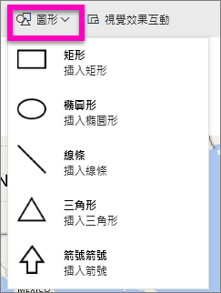

# Power BI 報表中的靜態內容
在 Power BI 服務中，在 [編輯] 檢視中將文字方塊和圖形新增至報表。 

> **注意**︰在 Power BI Desktop 中，您也可以[將靜態影像新增至報表](guided-learning/visualizations.yml#step-11)，如這段影片中所示。
> 
> <iframe width="560" height="315" src="https://www.youtube.com/embed/_3q6VEBhGew" frameborder="0" allowfullscreen></iframe>
> 
> 

## 將文字方塊加入報表
1. 將游標置於報表畫布上的任意位置，然後選取 [文字方塊] 。
   
   
2. 將您的文字輸入文字方塊中，也可以輸入格式字型、色彩和文字對齊方式 (選擇性)。 
   
   
3. 若要調整文字方塊的位置，請選取上方的灰色區域並拖曳。 若要調整文字方塊的大小，請選取並拖曳任一個外框控點。 
   
   
4. 若要關閉文字方塊，請在報表畫布上選取任何空白區域。
5. 選取釘選圖示 ，藉此將文字方塊釘選至儀表板。 

## 新增圖形至報表
1. 將游標置於報表畫布上的任意位置，然後選取 [圖形]。
   
   
2. 從下拉式清單中選取圖形，將它新增至報表畫布。 讓我們新增箭號，將注意力導向至具有最高總銷售變異數的泡泡圖。 
   
   在 [格式化圖案] 窗格中，自訂您的圖形。 我們在本例中建立了一個旋轉 90 度、有深紅色框線的紅色箭號。
   
   
3. 若要調整圖形的位置，請選取並拖曳上方的灰色區域。 若要調整圖形的大小，請選取並拖曳任一個外框控點。 

> **注意**：圖形無法釘選到儀表板。 
> 
> 

### 後續步驟
[將超連結新增至文字方塊](service-add-hyperlink-to-text-box.md)

[Power BI 中的報表](service-reports.md)

[Power BI 報表的視覺效果](power-bi-report-visualizations.md)

[Power BI - 基本概念](service-basic-concepts.md)

有其他問題嗎？ [試試 Power BI 社群](http://community.powerbi.com/)

