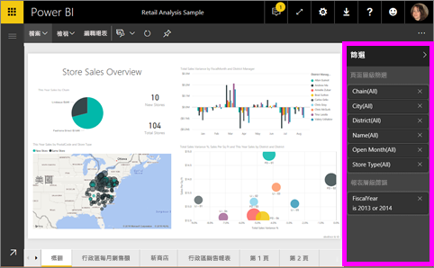
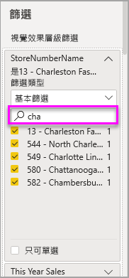
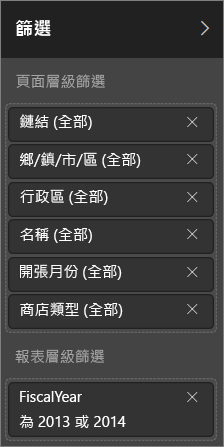
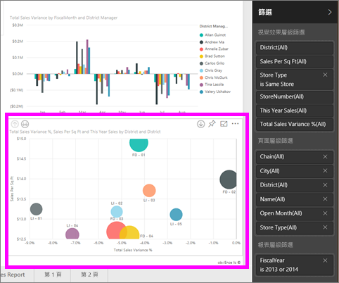
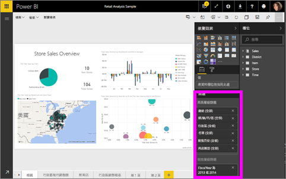

# 在 Power BI 報表中進行篩選和醒目提示的相關事項
 本文介紹如何在 Power BI 服務中進行篩選和醒目提示。 其體驗幾乎與 Power BI Desktop 完全相同。 ***篩選***會保留您最關切的資料，而將其他所有資料移除。 「醒目提示」與篩選不同。 它不會移除資料，而是將一部分可見資料醒目提示，未醒目提示的資料會保持可見但呈現暗灰色。

若要篩選 Power BI 中的報表並將其醒目提示，有許多種不同的方式。 將所有該類資訊放在同篇文章中會容易混淆，因此我們已加以細分成這些小節︰

* 篩選及反白顯示簡介 (您現正閱讀的文章)
* 於報表中[在 [編輯檢視] 中建立及使用篩選](power-bi-report-add-filter.md)的方式。 若您具有報表編輯權限，即可建立、修改及刪除報表中的篩選。
* [在與您共用之報表的 [閱讀檢視] 中使用篩選和醒目提示](consumer/end-user-reading-view.md)的方式。 您可執行的動作較少，但您仍然有廣泛的篩選及醒目提示選項。  
* [[編輯檢視] 中可用的篩選及醒目提示控制項](consumer/end-user-report-filter.md)詳細介紹內含多種篩選類型的深入探討 (例如日期與時間、數值、文字)，以及基本與進階選項之間的差異。
* 在您了解篩選及醒目提示的預設運作方式之後，再了解[如何變更頁面上的視覺效果彼此進行篩選及醒目提示的方式](consumer/end-user-interactions.md)

## [篩選] 窗格簡介

您可以在 [篩選] 窗格中套用篩選，或是直接在報表本身的[交叉分析篩選器中進行選取](visuals/power-bi-visualization-slicers.md)。 [篩選] 窗格會顯示報表中使用的資料表及欄位，以及已套用的篩選 (如果有的話)。 

有四種類型的篩選。

- [頁面篩選] 會套用至報表頁面上的所有視覺效果     
- [視覺效果篩選] 會套用至報表頁面上的單一視覺效果。 只有在您已選取報表畫布上的視覺效果時，才會看到視覺效果層級篩選。    
- [報表篩選] 會套用至報表的所有頁面    
- [鑽研篩選] 會套用至報表中的單一實體    

您可以在 [閱讀檢視] 或 [編輯檢視] 中的頁面、視覺效果和報表篩選中搜尋，以尋找和選取所需的值。 

如果篩選旁邊有 **All** 這個字詞，表示欄位中的所有值都包含在篩選中。  例如，下方螢幕擷取畫面中的 **Chain(All)** 表示此報表頁面包含所有連鎖店的相關資料。  相反地，[FiscalYear is 2013 or 2014] 的報表層級篩選表示報表只包含 2013 年及 2014 年會計年度的資料。

## [閱讀檢視] 或 [編輯檢視] 中的篩選
您可使用下列兩種模式與報表互動：[閱讀檢視](consumer/end-user-reading-view.md)和編輯檢視。 系統會依據您使用的模式提供篩選功能。

* 在 [編輯檢視] 中，您可以新增報表、頁面、鑽研和視覺效果篩選。 當您儲存報表時，篩選會與報表一起儲存，即使您在行動裝置應用程式中開啟它亦然。 在 [閱讀檢視] 中檢視報表的人員可以與您新增的篩選互動，但無法新增篩選。
* 在 [閱讀檢視] 中，您可以與報表中已存在的任何篩選互動，並儲存您做的選擇。 您無法新增新的篩選。

### [閱讀檢視] 中的篩選
如果您只有在 [閱讀檢視] 中才可存取報表，[篩選] 窗格看起來會像這樣︰

所以報表的此頁面具有六個頁面層級篩選及一個報表層級篩選。

針對視覺效果中的所有欄位，每個視覺效果都能進行篩選，且報表作者可能會新增更多篩選。 在下圖中，泡泡圖有六個篩選。

在 [讀取檢視] 中，透過修改現有的篩選來瀏覽資料。 即使您在行動裝置應用程式中開啟報表，您所做的變更也會與報表一起儲存。 了解[進行報表 [篩選] 窗格概觀](consumer/end-user-report-filter.md)時的做法

當您結束報表時，會儲存您的篩選。 若要復原您的篩選並返回至預設篩選、切割、鑽研並依報表作者排序：請從頂端功能表列選取 [重設為預設]。

### [編輯檢視] 中的篩選
若您具備報表的擁有者權限，並以 [編輯檢視] 加以開啟，則會看到 [篩選] 只是可用的數個編輯窗格中的一項。

在 [閱讀檢視] 中，我們會看到報表的此頁面具有六個頁面層級篩選及一個報表層級篩選。 且透過選取泡泡圖，我們看見其已套用 6 個視覺效果層級篩選。

在 [編輯檢視] 中，我們可以透過篩選和醒目提示來進行更多作業。 主要可以新增新的篩選。 了解如何[新增報表篩選](power-bi-report-add-filter.md)等更多功能。

## 特定醒目提示
選取報表畫布上的欄位以將頁面上的其他視覺效果醒目提示。 選取相同視覺效果的任意空白區域，即可加以移除。 此類的醒目提示對於快速瀏覽資料的影響而言是項有趣的方式。 若要微調此類交叉醒目提示的運作方式，請參閱[視覺效果互動](consumer/end-user-interactions.md)。

## 後續步驟
[將篩選新增至報表 (在 [編輯檢視] 中)](power-bi-report-add-filter.md)

[報表篩選概觀](consumer/end-user-report-filter.md)

[變更報表視覺效果相互交叉篩選及交叉醒目提示的方式](consumer/end-user-interactions.md)

有其他問題嗎？ [試試 Power BI 社群](http://community.powerbi.com/)

