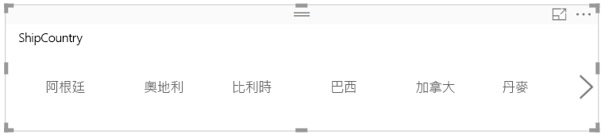

# 在 Power BI 中建立可以調整大小的回應式交叉分析篩選器

您可以將回應式交叉分析篩選器調整成報表上的任何空間大小。 使用回應式交叉分析篩選器時，您可以將它們調整成不同大小和形狀；可以從水平改成正方形和垂直排列，而且交叉分析篩選器中的值也會自動重新排列。 在 Power BI Desktop 和 Power BI 服務中，您可以將水平交叉分析篩選器和日期/範圍交叉分析篩選器設為回應式。 此外，日期/範圍交叉分析篩選器也改善了觸控區域，您可以輕鬆用手指對其進行變更。 您可以視需要將回應式交叉分析篩選器調小或調大；它們也會自動調整成 Power BI 服務和 Power BI 行動版應用程式中的報表大小。 

## 建立交叉分析篩選器

若要建立動態交叉分析篩選器，第一個步驟是先建立基本的交叉分析篩選器。 

1. 在 [視覺效果] 窗格中，選取**交叉分析篩選器**圖示 。
2. 將您想要篩選的欄位拖曳至 [欄位]。

    

## 轉換成水平交叉分析篩選器

1. 選取交叉分析篩選器，然後在 [視覺效果] 窗格中選取 [格式] 索引標籤。
2. 展開 [一般] 區段，然後針對 [方向] 選取 [水平]。

     

1.  您可以把寬度設得更寬一點，以顯示更多的值。

     

## 將其設為回應式，並進行嘗試

這個步驟很容易。 

1. 在 [格式] 索引標籤上，[一般] 區段正下方的 [方向] 中，將 [Responsive] (回應式) 滑動至 [開啟]。  

    

1. 現在您可以開始試用看看。 拖曳邊角，即可進行長、寬、高的變化。 如果您將它設得很小，它就會變成一個篩選圖示。

    

## 將該圖示新增至手機報表配置

在 Power BI Desktop 中，您可以為每一頁報表建立手機配置。 如果頁面有手機配置，即會在手機中顯示為直向檢視。 否則，您就必須以橫向檢視來檢視該頁面。 

1. 在 [檢視] 功能表上，選取 [手機配置]。

     ![手機配置圖示，[檢視] 功能表](media/power-bi-slicer-filter-responsive/power-bi-slicer-filter-responsive-6-phone-layout-button.png)
    
1. 將手機報表中您需要的所有視覺效果拖曳至方格中。 當您拖曳回應式交叉分析篩選器時，可以將其設為您想要的大小 (在此案例中為篩選圖示大小)。

    

深入了解如何建立[針對 Power BI 行動版應用程式最佳化的報表](desktop-create-phone-report.md)。

## 將時間/範圍交叉分析篩選器設為回應式

您可以遵循相同的步驟，將時間或範圍交叉分析篩選器設為回應式。 將 [回應式] 設為 [開啟] 之後，請注意下列事項：

- 視覺效果會依據畫布允許的大小，將輸入方塊的順序最佳化。 
- 系統即會依據畫布允許的大小，最佳化資料元素的顯示，讓交叉分析篩選器盡可能地適用。 
- 滑桿上新增的圓形把手可最佳化觸控互動。 
- 當某個視覺效果變得太小而無法使用時，即會就地變成代表該視覺效果類型的圖示。 若要與磚互動，請點兩下磚，並在焦點模式中開啟。 這可以節省報表頁面的寶貴空間，而不會遺失任何功能。

## 後續步驟

- [Power BI 服務中的交叉分析篩選器](power-bi-visualization-slicers.md)
- 有其他問題嗎？ [嘗試在 Power BI 社群提問](http://community.powerbi.com/)