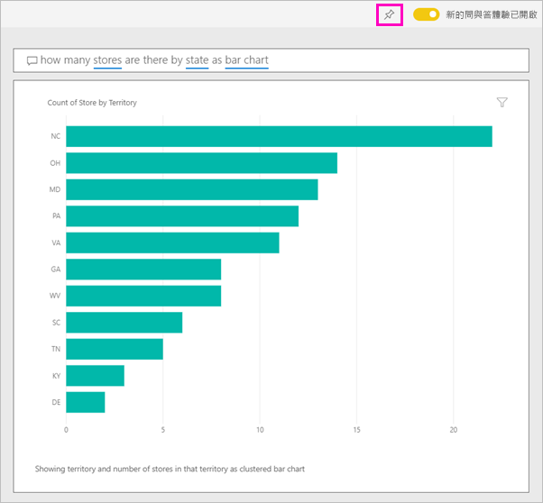

# 使用 Power BI 問與答來瀏覽資料並建立視覺效果

有時若要從您的資料獲得解答，最快的方法是使用自然語言詢問問題。 Power BI 問與答功能可讓您探索在您自己的文字資料。  這篇文章的第一個部分示範如何在 Power BI 服務中的儀表板中使用問與答。 第二個部分示範用途使用問與答在 Power BI 服務或 Power BI Desktop 建立報表時。 如需詳細背景，請參閱 <<c0> [ 問與答的消費者](consumer/end-user-q-and-a.md)文章。 

[問與答在 Power BI mobile apps](consumer/mobile/mobile-apps-ios-qna.md)並[問與答與 Power BI Embedded](developer/qanda.md)個別文章所述。 

問與答是互動式，甚至充滿樂趣。 通常，一個問題會導致其他視覺效果會顯示，代價來追求的有趣路徑。 觀看 Amanda 示範使用問與答來建立視覺效果、深入探討這些視覺效果，以及將其釘選至儀表板。

<iframe width="560" height="315" src="https://www.youtube.com/embed/qMf7OLJfCz8?list=PL1N57mwBHtN0JFoKSR0n-tBkUJHeMP2cP" frameborder="0" allowfullscreen></iframe>

## 第 1 部分：使用問與答在 Power BI 服務中的儀表板

在 Power BI 服務 (app.powerbi.com) 中，儀表板包含磚釘選來自一或多個資料集，因此您可以詢問有關任何這些資料集所包含的資料的問題。 若要查看哪些報表和資料集用來建立儀表板，請選取**檢視相關項目**從功能表列。

問與答] 問題方塊位於左上角的 [儀表板，輸入使用自然語言問題的地方。 沒有看到問與答方塊嗎？ 請參閱[考量與疑難排解](consumer/end-user-q-and-a.md#considerations-and-troubleshooting)中**問與答的消費者**文章。  問與答可辨識的單字輸入，然後找出位置 （哪個資料集） 中，以尋找解答。 問與答也可以用自動完成、重新描述，和其他文字及視覺輔助工具，協助您建立問題。

您問題的答案會顯示為互動式的視覺效果，而且每當您修改問題時便會更新。

1. 請開啟儀表板並將游標放在問題方塊中。 選取右上角**新的問與答體驗**。

    

1. 即使您還沒開始輸入，問與答也會顯示包含建議的新畫面，以協助您提出問題。 您看到片語和完整的問題，其中包含在基礎資料集中資料表的名稱，並甚至可能會看到完整的問題，如果資料集擁有者已建立列出[精選問題](service-q-and-a-create-featured-questions.md)，

   

   您可以選擇這些問題的其中一個做為起點，並繼續精簡問題，若要尋找特定的回應。 或者，使用資料表名稱來幫助您撰寫新的問題。

2. 選取清單中的問題，或輸入您自己的問題並選取從下拉式清單中的建議。

   

3. 當您輸入問題時，問與答會挑選最佳的視覺效果，以顯示您的答案。

   

4. 視覺效果會變更為您以動態方式修改這個問題。

   

1. 當您輸入問題時，Power BI 會使用在儀表板上有磚的任何資料集尋找最佳解答。  如果所有的圖格都來自 *datasetA* ，則您的答案將來自 *datasetA* 。  如果有磚來自*datasetA*並*datasetB*，則問與答會搜尋這 2 個資料集的最佳回應。

   > [!TIP]
   > 所以要小心，如果只有一個磚來自 *datasetA* ，而您從儀表板中移除了，問與答將不再有權存取 *datasetA* 。
   >

5. 當您滿意結果，藉由選取右上角的釘選圖示的儀表板視覺效果釘選。 如果儀表板已與您共用或為應用程式的一部分，您就無法釘選。

   

## 第 2 部分：在 Power BI 服務或 Power BI Desktop 中的報表使用問與答

使用問與答瀏覽您的資料集，以及將視覺效果新增至報表和儀表板。 報表是以單一資料集為基礎，且可能是完全空白或包含充滿視覺效果的頁面。 但是，只因為報表是空的並不表示沒有任何資料讓您探索 -- 資料集連結到報表，且正在等候您瀏覽並建立視覺效果。  若要查看使用哪個資料集來建立報表，請在 Power BI 服務的閱讀檢視中開啟報表，然後從功能表列選取 [檢視相關項目]  。

若要在報表中使用問與答，您必須使用報表與基礎資料集的編輯權限。 在 [問與答的消費者](consumer/end-user-q-and-a.md)我們將這篇文章中， *creator*案例。 如果您是改用*耗用*已與您，問與答共用的報表無法使用。

1. 編輯檢視 （Power BI 服務） 或報表檢視 (Power BI Desktop) 中開啟報表，然後選取**發問**從功能表列。

    **Power BI Desktop**    
    

    **服務**    
    

2. 問與答問題方塊會顯示在報表畫布上。 下列範例中，問題方塊顯示在另一個視覺效果之上。 這是正常的，但將空白頁面新增至報表然後才提問，可能會是比較好的做法。

    

3. 請將游標放在 [問題] 方塊中。 當您輸入時，問與答會顯示可協助您形成問題的建議。

   

4. 當您輸入問題時，問與答會挑選最佳的[視覺效果](visuals/power-bi-visualization-types-for-reports-and-q-and-a.md)來顯示您的答案；而當您修改這個問題時，視覺效果就會動態改變。

   

5. 當您有喜歡的視覺效果時，請選取 ENTER。 若要儲存報表的視覺效果，請選取 [檔案] > [儲存]  。

6. 與新的視覺效果互動。 您建立視覺效果的方式並不重要 -- 可以使用相同的所有互動性、格式和功能。

   

   如果您在 Power BI 服務中建立視覺效果，您甚至可以[將它釘選至儀表板](service-dashboard-pin-tile-from-q-and-a.md)。

## 告訴問與答要使用的視覺效果
在使用問與答的時候，您不只可以要求要說明資料，也可以告訴 Power BI 要如何顯示答案。 只需在問題結尾加上「為<visualization type>」。  例如「依工廠顯示庫存量為地圖」和「顯示總庫存為卡片」。  請自己試試看吧。

## 考量與疑難排解
- 如果您已使用即時連線或閘道連線到資料集，必須[針對該資料集啟用](service-q-and-a-direct-query.md)問與答。

- 您已開啟報表且沒有看到問與答的選項。 如果您使用 Power BI 服務，請務必在編輯檢視中開啟報表。 如果您無法開啟編輯檢視，這表示您沒有該報表的編輯權限，而且您可以使用 問與答與該特定報表。

## 後續步驟

- [問與答的取用者](consumer/end-user-q-and-a.md)   
- [在問與答中詢問問題的秘訣](consumer/end-user-q-and-a-tips.md)   
- [準備適用於問與答的活頁簿](service-prepare-data-for-q-and-a.md)  
- [準備內部部署資料集問與答](service-q-and-a-direct-query.md)   
- [從問與答將磚釘選至儀表板](service-dashboard-pin-tile-from-q-and-a.md)
