# Power BI 服務及 Power BI Desktop 中由 Esri 提供的 ArcGIS 地圖
此教學課程是從 ArcGIS 地圖建立者的觀點來撰寫。 一旦建立者與同事共用 ArcGIS 地圖，該同事雖然可以檢視地圖並與其互動，但無法儲存變更。 若要深入了解如何檢視 ArcGIS 地圖，請參閱[與 ArcGIS 地圖互動](visuals/power-bi-visualizations-arcgis.md)。

ArcGIS 地圖與 Power BI 的結合，把在點之外加上地圖的做法帶到了全新境界。 從基礎地圖、位置類型、佈景主題、符號樣式及參考圖層中選擇，以建立具有豐富資訊的優異地圖視覺效果。 地圖上的官方資料圖層與空間分析結合之後，能讓人更深入了解視覺效果中的資料。

 雖然您無法在行動裝置上建立 ArcGIS 地圖，但可以檢視地圖並與其互動。 請參閱[與 ArcGIS 地圖互動](visuals/power-bi-visualizations-arcgis.md)。

> [!TIP]
> GIS 是 Geographic Information Science (地理資訊科學) 的縮寫。

下方範例以 2016 年可支配所得中位數的人口統計圖層為背景，使用深灰色畫布以熱度圖形式顯示區域銷售額。 如同您在閱讀時看到的，ArcGIS Maps 提供幾乎無限制的增強式對應功能、人口統計資料，以及更吸引人的地圖視覺效果，讓您可以呈現更精彩的故事。

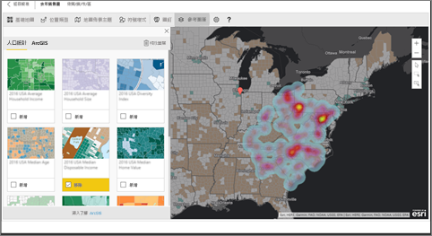

> [!TIP]
> 若要查看多個範例及閱讀見證，請前往 [Power BI 上的 Esri 頁面](https://www.esri.com/powerbi)。 接著請參閱 Esri 的 [ArcGIS Maps for Power BI Getting Started (ArcGIS Maps for Power BI 使用者入門) 頁面](https://doc.arcgis.com/en/maps-for-powerbi/get-started/about-maps-for-power-bi.htm)。

## 使用者同意
ArcGIS Maps for Power BI 由 Esri (www.esri.com) 提供。 因此，您的 ArcGIS Maps for Power BI 使用方式受到 Esri 的條款及隱私權原則的規範。 如果 Power BI 使用者想要使用 ArcGIS Maps for Power BI 的視覺效果，就必須接受同意對話方塊。

**資源**

[條款](https://go.microsoft.com/fwlink/?LinkID=826322)

[隱私權原則](https://go.microsoft.com/fwlink/?LinkID=826323)

[ArcGIS Maps for Power BI 產品頁面](https://www.esri.com/powerbi)

 

## 啟用 ArcGIS 地圖
ArcGIS 地圖目前可在 Power BI 服務、Power BI Desktop 及 Power BI Mobile 中使用。 本文提供適用於服務及 Desktop 的指示。

### ***在 Power BI 服務 (app.powerbi.com)*** 中啟用 ArcGIS 地圖
本教學課程使用[零售分析範例](sample-retail-analysis.md)。 若要啟用 **ArcGIS Maps for Power BI**：

1. 從功能表列的右上區塊選取齒輪圖示，開啟 [設定]
   
    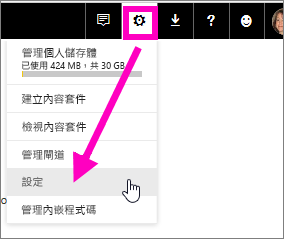
2. 選取 [ArcGIS Maps for Power BI] 核取方塊。 完成選取後，您必須重新啟動 Power BI。
   
    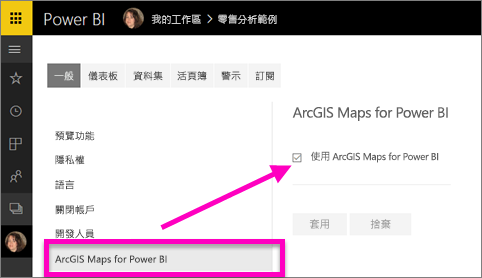
3. 在[編輯檢視](consumer/end-user-reading-view.md)中開啟報表，再從 [視覺效果] 窗格中選取 ArcGIS Maps for Power BI 圖示。
   
    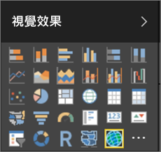
4. Power BI 會將空白的 ArcGIS 地圖範本新增至報表畫布中。
   
   

 

## 建立 ArcGIS 地圖視覺效果
看 Will 建立幾個不同的 ArcGIS 地圖視覺效果，然後使用下方步驟，用[零售分析範例](sample-datasets.md)親自試試看。

<iframe width="560" height="315" src="https://www.youtube.com/embed/EKVvOZmxg9s" frameborder="0" allowfullscreen></iframe>

1. 將資料欄位從 [欄位] 窗格拖曳到 [位置] 或 [緯度] 及 (或) [經度] 貯體。 在本例中，我們使用 [門市] > [城市]。
   
   > [!NOTE]
   > ArcGIS Maps for Power BI 會自動偵測您所選取的欄位，檢查是否最適合以地圖上的圖形或點來檢視。 您可以調整設定中的預設值 (請見下方資訊)。
   > 
   > 
   
    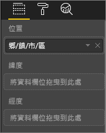
2. 從 [視覺效果] 窗格  選取範本，以將視覺效果轉換成 ArcGIS 地圖。
3. 將量值從 [欄位] 窗格拖曳到 [大小] 貯體，以調整資料的顯示方式。 在本例中，我們使用 [銷售額] > [去年銷售額]。
   
    

## 設定和格式化 ArcGIS 地圖
若要存取 **ArcGIS Maps for Power BI** 的格式設定功能︰

1. 選取視覺效果右上角的省略符號再選擇 [編輯]，即可存取其他功能。
   
   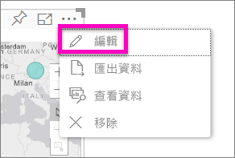
   
   可用的功能會顯示在視覺效果上方。 選取每項功能時，皆會開啟工作窗格並提供詳細的選項。 
   
   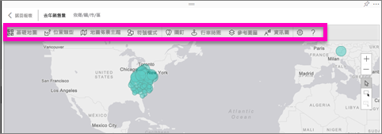
   
   > [!NOTE]
   > 如需設定和功能的詳細資訊，請參閱下方的**詳細文件**。
   > 
   > 
2. 若要返回報表，請選取報表畫布左上角的 [返回報表]。

 

## 詳細文件
**Esri** 有提供 **ArcGIS Maps for Power BI** 功能集的[完整文件](https://go.microsoft.com/fwlink/?LinkID=828772)。

## 功能概觀
### 基本地圖
提供四種基本地圖︰深灰色畫布、淺灰色畫布、OpenStreetMap 和街道名。  街道名是 ArcGIS 的標準基本地圖。

若要套用基本地圖，請在工作窗格中加以選取。

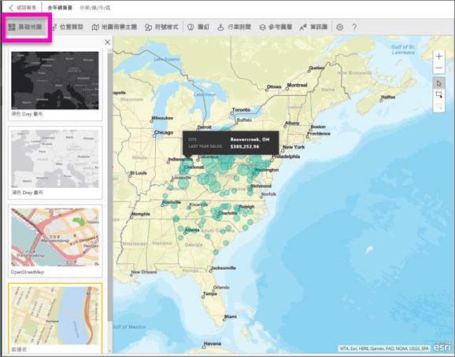

### 位置類型
ArgGIS Maps for Power BI 會自動偵測在地圖上顯示資料的最佳方式。 它會從「點」或「界限」當中進行選擇。 [位置類型] 選項可讓您微調這些選取項目。

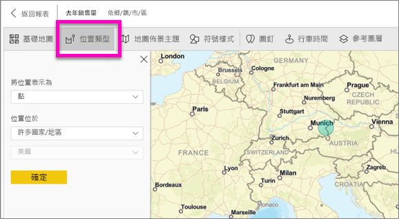

**界限**：僅有當您的資料包含標準地理值時，才適用此項目。 Esri 會自動找出要在地圖上顯示的圖形。 標準地理值包括國家/地區、州/省、郵遞區號等。但就像使用地理編碼一樣，Power BI 可能無法偵測應該預設為界限的欄位，或可能找不到資料的界限。  

### 地圖佈景主題
提供四種地圖佈景主題。 系統會自動根據您繫結到位置的欄位選擇「僅限位置」和「大小」佈景主題，並新增到 Power BI [欄位] 窗格中的 [大小] 貯體。 我們目前是使用「大小」，因此我們將其變更為「熱度圖」。  

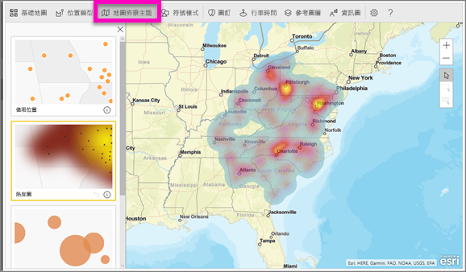

<table>
<tr><th>佈景主題</th><th>描述</th>
<tr>
<td>僅限位置</td>
<td>依據 [位置類型] 的設定，在地圖上繪製資料點或區域分布界線。</td>
</tr>
<tr>
<td>熱度圖</td>
<td>在地圖上繪製資料的濃度圖。</td>
</tr>
<tr>
<td>大小</td>
<td>在地圖上，繪製資料點 (且該地圖已根據 [欄位] 窗格中「大小」貯體的值調整大小)。</td>
</tr>
<tr>
<td>叢集</td>
<td>在地圖上的區域中，繪製資料點的計數。 </td>
</tr>
</table>

### 符號樣式
符號樣式可讓您微調地圖上的資料呈現方式。 符號樣式會根據選取的 [位置類型] 和 [地圖佈景主題]，與內容保持相關。 下列範例顯示 [位置類型] 設定為 [大小]，並對透明度、樣式和大小進行一些調整。

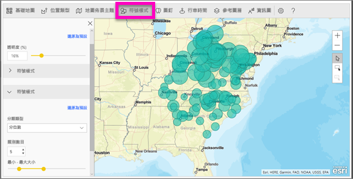

### 圖釘
新增圖釘，讓人將注意力放到地圖上的點。  

1. 選取 [圖釘] 索引標籤。
2. 在搜尋方塊中鍵入關鍵字 (例如地址、地點和景點)，然後從下拉式清單中選取。 地圖上會出現一個符號，而且地圖會自動縮放至該位置。 搜尋結果會儲存為 [圖釘] 窗格中的位置卡片。 您最多可以儲存 10 張位置卡片。
   
   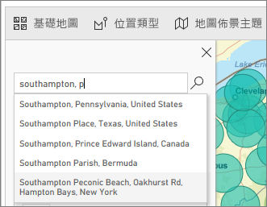
3. Power BI 會將圖釘新增到該地點，而您可以變更圖釘的色彩。
   
   
4. 新增及刪除圖釘。
   
   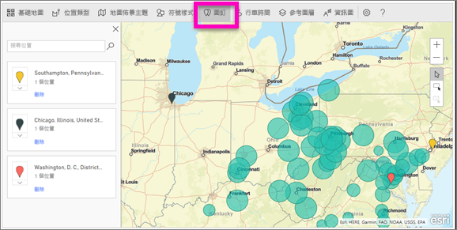

### 行車時間
[Drive time]\(行車時間) 窗格可讓您選取一個位置，然後判斷指定半徑範圍或行車時間內還有哪些其他地圖功能。  
    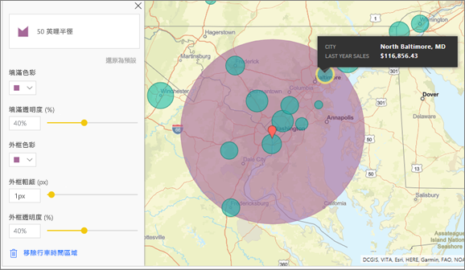

1. 選取 [Drive time]\(行車時間) 索引標籤，然後選擇單一選取或多重選取工具。 單一選取華盛頓特區的圖釘。
    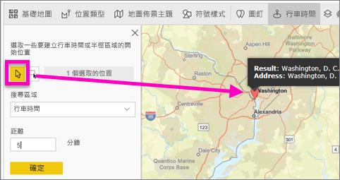
   
   > [!TIP]
   > 如果您放大地圖 (使用 + 圖示)，就能更輕易選取位置。
   > 
   > 
2. 假設您要飛往華盛頓特區 幾天，並想知道在合理行車距離內有哪些門市。 將 [搜尋區域] 變更為 [半徑] 並將 [距離] 變更為 **50** 英哩，然後選取 [確定]。    
   
    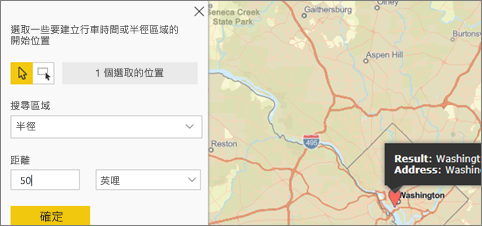
3. 即會以紫色顯示半徑範圍。 選取任何位置以顯示其詳細資料。 選擇性地變更色彩和外框來格式化半徑。
   
    

### 參考圖層
#### 參考圖層 - 人口統計
ArcGIS Maps for Power BI 提供人口統計圖層的選項，有助於將來自 Power BI 的資料與內容保持相關。

1. 選取 [Reference layer] \(參考圖層) 索引標籤，然後選擇 [人口統計]。
2. 列出的每個圖層都有一個核取方塊。 加入勾選記號即可將該圖層新增至地圖。  在此範例中，我們已新增平均家庭收入的圖層。 
   
    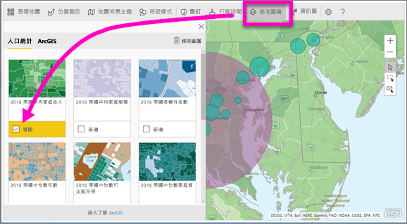
3. 每個圖層皆為互動式。 您可以將游標暫留在泡泡圖上以檢視詳細資訊，也可以按一下地圖上的陰影區域以查看詳細資訊。 
   
    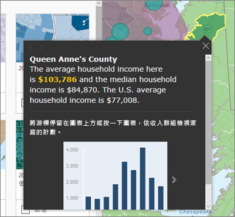

#### 參考圖層 - ArcGIS
ArcGIS Online 可讓您的組織發行公用網站的地圖。 此外，Esri 也透過 Living Atlas 提供網站地圖的豐富組合。 在 [ArcGIS] 索引標籤中，您可以搜尋所有公用網站地圖或 Living Atlas 地圖，並將其新增至地圖以作為參考圖層。

1. 選取 [Reference layer] \(參考圖層) 索引標籤，然後選擇 [ArcGIS]。
2. 輸入搜尋字詞，然後選取地圖圖層。 在此範例中，我們選擇美國國會區域。
   
    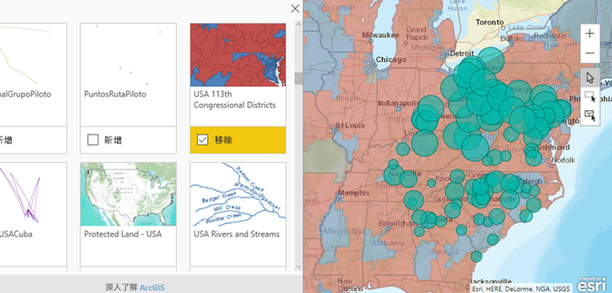
3. 若要查看詳細資訊，請選取陰影區域，開啟 [Select from reference layer] \(從參考圖層選取)：使用參考圖層選取工具，來選取參考圖層上的界限或物件。

 

## 選取資料點
ArcGIS Maps for Power BI 具有三個選取模式。

若要變更選取模式，請使用下列參數：

選取個別資料點。

在地圖上繪製一個矩形，並選取包含的資料點。

可讓您使用參考圖層內的界限或多邊形，進而選取包含的資料點。

> [!NOTE]
> 一次最多可以選取 250 個資料點。
> 
> 

 

## 取得說明
**Esri** 有提供 **ArcGIS Maps for Power BI** 功能集的[完整文件](https://go.microsoft.com/fwlink/?LinkID=828772)。

您可以參與 [**ArcGIS Maps for Power BI** 相關的 Power BI 社群對話](https://go.microsoft.com/fwlink/?LinkID=828771)，提出問題、了解最新資訊、回報問題及尋找解答。

如果您有建議的改進項目，請將其提交到 [Power BI 的集思廣益清單](https://ideas.powerbi.com)。

 

## 管理組織內的 ArcGIS Maps for Power BI 使用情況
Power BI 可讓使用者、租用戶系統管理員及 IT 系統管理員來管理是否要使用 ArcGIS Maps for Power BI。

**使用者選項**：在 Power BI Desktop 中，使用者可以在 [選項] 中的 [安全性] 索引標籤上停用 ArcGIS Maps for Power BI，以停止使用。 停用時，就不會預設載入 ArcGIS 地圖。

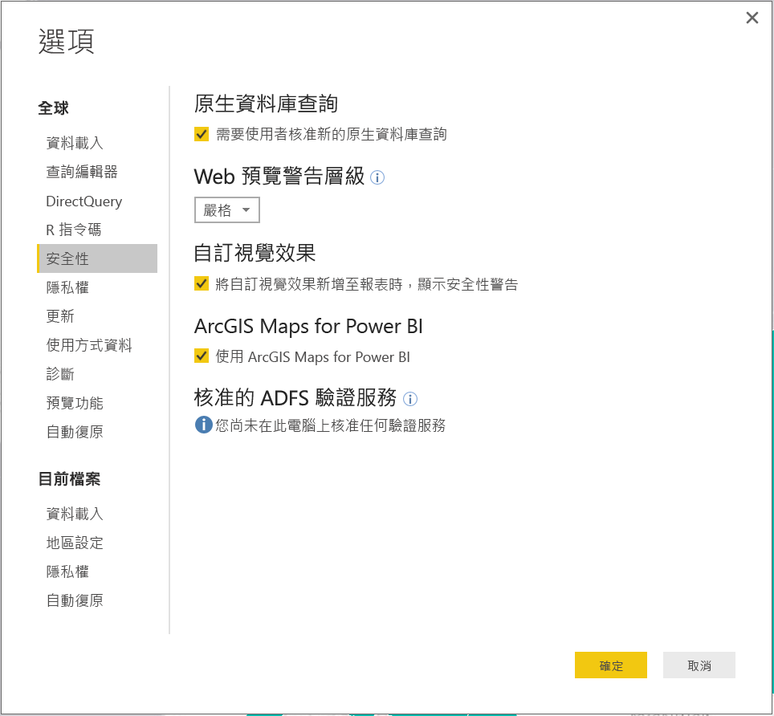

在 Power BI 服務中，使用者可以從 [使用者設定] 中的 [ArcGIS Maps for Power BI] 索引標籤上停用 ArcGIS Maps for Power BI 來加以停用。 停用時，就不會預設載入 ArcGIS 地圖。

**租用戶系統管理員選項**：在 PowerBI.com 中，租用戶系統管理員可以停用 ArcGIS Maps for Power BI，以防止所有租用戶使用者使用。 若為此情況，Power BI 的 [視覺效果] 窗格中就不會再顯示 ArcGIS Maps for Power BI 圖示。

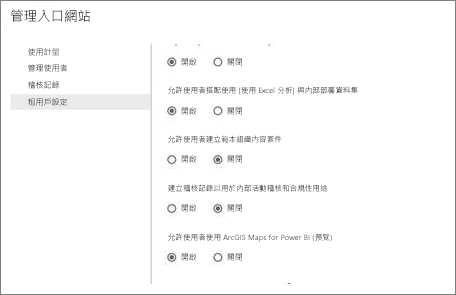

**IT 系統管理員選項**：Power BI Desktop 支援使用 [群組原則] 來停用整個組織部署電腦的 ArcGIS Maps for Power BI。

<table>
<tr><th>屬性</th><th>值</th>
</tr>
<tr>
<td>索引鍵</td>
<td>Software\Policies\Microsoft\Power BI Desktop&lt;/td&gt;
</tr>
<tr>
<td>valueName</td>
<td>EnableArcGISMaps</td>
</tr>
</table>

值為 1 (十進位) 時，表示啟用 ArcGIS Maps for Power BI。

值為 0 (十進位) 時，表示停用 ArcGIS Maps for Power BI。

## 考量與限制
ArcGIS Maps for Power BI 可在下列服務和應用程式中使用：

<table>
<tr><th>服務/應用程式</th><th>可用性</th></tr>
<tr>
<td>Power BI Desktop</td>
<td>是</td>
</tr>
<tr>
<td>Power BI 服務 (PowerBI.com)</td>
<td>是</td>
</tr>
<tr>
<td>Power BI 行動應用程式</td>
<td>是</td>
</tr>
<tr>
<td>Power BI 的發佈至網路功能</td>
<td>否</td>
</tr>
<tr>
<td>Power BI Embedded</td>
<td>否</td>
</tr>
<tr>
<td>Power BI 服務內嵌 (PowerBI.com)</td>
<td>否</td>
</tr>
</table>

在無法使用 ArcGIS Maps for Power BI 的服務或應用程式中，視覺效果將顯示為帶有 Power BI 標誌的空白視覺效果。

當為街道地址進行地理編碼時，僅限為前 1500 個地址進行地理編碼。 為位置的名稱或國家進行地理編碼時，不受 1500 個地址的限制。

 

**如何搭配 ArcGIS Maps for Power BI 運作？**
ArcGIS Maps for Power BI 由 Esri (www.esri.com) 提供。 因此，您的 ArcGIS Maps for Power BI 使用方式受到 Esri 的[條款](https://go.microsoft.com/fwlink/?LinkID=8263222)及[隱私權原則](https://go.microsoft.com/fwlink/?LinkID=826323)的規範。 如果 Power BI 使用者想要使用 ArcGIS Maps for Power BI 的視覺效果，就必須接受同意對話方塊 (如需詳細資訊，請參閱＜使用者同意＞)。  Esri 的 ArcGIS Maps for Power BI 使用方式受到 Esri 的條款及隱私權原則的規範，同意對話方塊也提供相關連結。 每位使用者第一次使用 ArcGIS Maps for Power BI 之前都必須先同意。 一旦使用者接受同意對話方塊，繫結至視覺效果的資料就會傳送至 Esri 服務至少進行地理編碼，這表示會將位置資訊轉換成可在地圖上表示的緯度和經度資訊。 您應該假設任何繫結至資料視覺效果的資料都可能會傳送至 Esri 服務。 Esri 提供基本地圖、空間分析、地理編碼等服務。ArcGIS Maps for Power BI 視覺效果透過受到 Esri 所提供及維護的憑證保護的 SSL 連線與這些服務互動。 您可以從 Esri 的 [ArcGIS Maps for Power BI 產品頁面](https://www.esri.com/powerbi)取得 ArcGIS Maps for Power BI 的其他資訊。

當使用者透過 ArcGIS Maps for Power BI 註冊由 Esri 提供的 Plus 訂閱時，即進入與 Esri 的直接關聯性。 Power BI 不會將使用者的個人資訊傳送至 Esri。 使用者使用自己的 AAD 身分識別登入並信任 Esri 提供的 AAD 應用程式。 如此一來，使用者便可以直接與 Esri 共用其個人資訊。 一旦使用者將 Plus 內容新增至 ArcGIS Maps for Power BI 視覺效果，其他 Power BI 使用者也需要 Esri 的 Plus 訂閱才能檢視或編輯該內容。 

如有 Esri 之 ArcGIS Maps for Power BI 運作方式的詳細技術性問題，請透過其支援網站與 Esri 聯繫。

**使用 ArcGIS Maps for Power BI 會產生任何費用嗎？**

所有 Power BI 使用者皆可免費使用 ArcGIS Map for Power BI。 它是一個由 **Esri** 所提供的元件，因此，您的使用方式受到 **Esri** 的條款及隱私權原則的規範 (如本文稍早所述)。

**我在 Power BI Desktop 中收到有關快取將滿的錯誤訊息**

目前正在解決此 BUG。  在此同時，若要清除快取，請嘗試刪除位於 C:\Users\\AppData\Local\Microsoft\Power BI Desktop\CEF 中的檔案，然後重新啟動 Power BI。

**ArcGIS Maps for Power BI 是否支援 Esri 形狀檔？**

ArcGIS Maps for Power BI 會自動偵測國家/地區、州/省和郵遞區號等標準界限。 如果您想提供自己的圖形，則可以使用 [Power BI Desktop (預覽) 中的圖形地圖](visuals/desktop-shape-map.md)。

**我可以離線檢視我的 ArcGIS 地圖嗎？**

不能，Power BI 需要網路連線才能顯示地圖。

**我可以從 Power BI 連接至我的 ArcGIS Online 帳戶嗎？**

目前還不行。 [請為這個提議進行投票](https://ideas.powerbi.com/forums/265200-power-bi-ideas/suggestions/9154765-arcgis-geodatabases)，日後當我們開始處理這項功能時，即會傳送電子郵件通知您。  

## 後續步驟
[與已和您共用的 ArcGIS 地圖互動](visuals/power-bi-visualizations-arcgis.md)

[宣布 ArcGIS maps for Power BI 正式運作的部落格文章](https://powerbi.microsoft.com/blog/announcing-arcgis-maps-for-power-bi-by-esri-preview/)

有其他問題嗎？ [嘗試在 Power BI 社群提問](http://community.powerbi.com/)

