# 報表和視覺效果的最佳設計做法
<!-- Shared newnav Include -->
[!INCLUDE [newnavbydefault](./includes/newnavbydefault.md)]

## 簡介
本白皮書提供在 Power BI 中設計報表的最佳作法。 從規劃開始，它將討論您可以套用至報表和構成該報表之頁面與個別視覺效果的設計原則。  這些最佳作法有許多也適用於儀表板設計。

我們希望這份白皮書將是您的起點、您可將學習到的資訊套用至自己的報表和視覺效果，而且您將繼續在 community.powerbi.com 上進行對話。BI 報表設計和視覺效果的使用現在是熱門話題，而且有許多思想領袖、部落客和網站可廣泛且深入地查看本主題 (我們在結尾列出一些)。   

> [!NOTE]
> 本白皮書中所提供的建議是您要在適用時機和地點時套用的指導方針。 針對我們在下方描述的每個原則，通常都會有正當的理由可「打破規則」。
> 
> 

我們被資訊淹沒的原因不是資訊太多，而是不知道如何有效駕馭它。
-- Stephen Few

## 看看地標和術語
在 Power BI 中，報表可以有一個或多個報表頁面，而且所有頁面統稱為報表。 報表的基本元素是視覺效果、獨立影像和文字方塊。 從個別資料點，到報表元素，再到報表頁面本身，有數不清的格式化選項。

我們將開始報表規劃階段，並繼續執行基本報表設計原則，然後討論視覺效果設計原則，並完成個別視覺效果類型最佳作法的討論。

建立和使用 Power BI 報表的深入指引和指示位於 [powerbi.com] > [了解]。

## 在您建置第一個視覺效果之前，請專注於需求
因為良好的報表需要進行規劃，所以請在建置第一個視覺效果之前開始建立報表。  了解您必須使用的資料，並寫下報表需求。 請問您自己：「商務需求為何、如何使用這項資料，以及由誰使用？」 關鍵問題是「讀者想要根據這份報表進行的決策為何？」

這些問題的答案將驅動您的設計。 每份報表都是一個故事。 請確定該故事符合商務需求。 您可能迫不及待想要新增可顯示大量深入資訊的視覺效果，但是，如果這些深入資訊不符合商務需求，則報表不實用，而且這些視覺效果事實上可能會讓您的使用者分心。 您也可能會發現無法從這項資料收集決策所需的資訊。 這份報表是否可以用來測量所需項目？

報表可以用來進行監視、發掘、追蹤、預測、測量、管理、測試和其他作業。 例如，如果商務需求是測量效能的銷售報表，則您可以設計報表來查看目前銷售、與先前的銷售進行比較、與競爭對手進行比較，以及包含一些可觸發警示的 KPI。  讀者可能會向下鑽研至銷售數據，以查看可能影響銷售的商店關閉或供應鏈問題。  另一個向下鑽研可能是可查看依商店、地區、產品、季節等的銷售量。

了解報表的客戶，並設計報表，這份報表使用熟悉的詞彙，並提供資料，而其詳細層級和複雜度等同於客戶知識層級。 是否有多種類型的客戶？ 單一大小不一定適合所有情況；請根據專業知識來設計不同的報表頁面，並且一定要清楚標示，讓客戶可以自行識別。 另一個選項是使用交叉分析篩選器，讓客戶可以調整頁面以放入它們。 讓客戶參與規劃階段，並避免錯誤地建置您認為他們需要的項目。  請準備好從頭開始，並逐一查看。

找到您想要包含的商務需求、客戶和度量之後，下一步就是挑選正確的視覺效果適當地呈現，並以最有效的方式呈現這些視覺效果。 這涵蓋的主題甚廣，我們將從報表設計的一些基本原則開始。

## 報表設計原則
報表頁面的空間有限，最困難的事情之一是將所有您想要的元素放入該空間，並且仍然可以輕鬆地該資訊。 而且不要淡化「美觀」值的重要性。 關鍵在於找出美觀與實用的平衡。

讓我們看看配置、清晰度和美學。

### 配置 - 報表畫布
報表畫布的空間量有限。  如果您無法將所有元素放入單一報表頁面，則請將報表分成頁面。  報表頁面可以針對特定對象 (例如 HR、IT、銷售、SLT) 或特定商務問題 (例如，缺失對停機的影響為何？我們的行銷活動對情感的影響為何？) 調整，或調整為漸進式故事 (例如，第一頁當成概觀和引起注意的「勾點」、第 2 頁繼續說明資料故事、第 3 頁更深入探討故事等)。  如果整個報表可以放入單一頁面，那不錯。 否則，請建立將內容邏輯分段的不同報表頁面。  而且別忘了提供頁面的有意義且實用的名稱。

請考慮填入藝術師圖庫。 您不會將 50 項藝術品放入小房間、放入椅子，並用不同的色彩繪製每面牆。 身為館長，您只會選擇具有一般主題的物件、將它們部置在房間周圍以讓訪客有足夠的空間進行移動和思考，並放入描述他們所查看之項目的資訊卡。 這是現今大部分藝廊都有素牆的原因！
在本文中，我們將從需要進行很多工作的報告範例開始。  我們會套用我們的設計最佳作法和原則，因而改善報表。

**圖 1︰這個不美觀的報表頁面需要一番心力**

上述範例有許多我們將在下面討論的空間相關 (配置) 設計問題︰

* 對齊、順序和鄰近性使用
* 不恰當地使用空間和排序
* 雜亂

### 對齊、順序和鄰近性
報表元素的配置會影響理解力，並引導讀者瀏覽報表頁面。 放置和置放元素的方式可表達其意涵。  表達的意涵可能是「從這裡開始，然後查看這裡」或「這 3 個元素彼此相關」。

* 在大部分文化中，人會從左到右並從上到下進行掃描。 請將最重要的元素放在報表左上角。 並組織其餘視覺效果，以邏輯巡覽和理解資訊。
* 將需要讀者選擇的元素放到所選擇元素將影響之視覺效果的左邊︰例如交叉分析篩選器。
* 放入彼此接近的相關元素；鄰近性表示元素相關。
* 另一種傳達關聯性的方式是在相關元素周圍新增框線或色彩背景。 相反地，新增分割線，以區分報表的不同區段。
* 您可以使用白色空間，以視覺化方式將報表頁面的區段進行分段。
* 填寫報表頁面。 如果您發現您有大量額外白色空間，請放大視覺效果，或縮小畫布。
* 請刻意調整您的報表元素。 請不要讓空間可用性描述視覺效果大小。
* 讓重要元素大於其他元素，或新增吸引注意的箭頭這類的視覺效果元素。
* 請對稱或蓄意非對稱地對齊報表頁面上的元素。

讓我們深入探討對齊。

#### 對齊
對齊不表示不同元件的大小必須相同，或您在報表的每個資料列上都必須有相同數目的元件。 這只是表示頁面有一種結構可協助進行瀏覽和可讀性。

我們可以在下面的已更新報表中看到報表元件現在對齊左邊和右邊，而且每個報表資料列也會水平和垂直對齊。 我們的交叉分析篩選器是在它們所影響之視覺效果的左邊。

**圖 2︰使版面配置編輯改善的不美觀報表範例**

Power BI 包含可協助您對齊視覺效果的工具。 在 Power BI Desktop 中，選取多個視覺效果之後，您可以使用 [視覺效果] 功能區索引標籤上的 [對齊或等距分佈]\ (Align and Distribute) 選項，以放入視覺效果的位置。

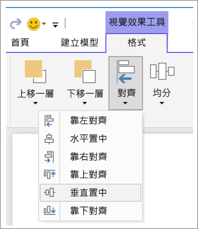

**圖 3：在 Power BI Desktop 中對齊視覺效果**

在 Power BI 線上和 Power BI Desktop 中，您也可以透過所有視覺效果之 [格式化] 窗格上的 [一般] 索引標籤，精確地控制視覺效果的大小和位置︰

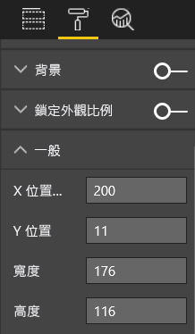

**圖 4︰設定視覺效果的確切位置**

在我們的範例報表頁面 (圖 2) 中，2 張卡片和大型框線會對齊 **X 位置**：200。

#### 放入空間
請善用您擁有的空間。  如果您知道報表的檢視/顯示方式，設計時請記得該方式。 請減少空白空間，以填滿畫布。  請盡一切可能讓個別視覺效果上不要出現捲軸。  填寫空間，而不讓視覺效果看起來擁擠。

##### 調整頁面大小
透過減少頁面大小，相對於整體頁面，個別元素會變得更大。 作法是取消選取頁面上的任何視覺效果，並使用 [格式化] 窗格中的 [頁面大小] 索引標籤。  

以下是先使用頁面大小 4:3 然後使用 16:9 的報表頁面。 請注意，配置如何放入 16:9，以變得更好。 實際上有足夠的空間可移除第二個視覺效果中的捲軸。

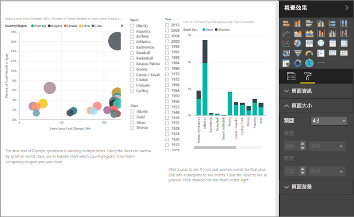

**圖 5a：4:3 頁面大小的報表**

**圖 5b︰16:9 頁面大小比率的報表**

您的報表將以 4:3、16:9 還是另一個比率進行檢視？ 在小螢幕還是大螢幕上？ 或者根據所有可能的螢幕外觀比例和大小？  設計時請記得這些。

我們的範例報表頁面似乎有些擁擠。 未選取任何視覺效果之後，請選取油漆滾筒圖示，開啟 [格式化] 窗格。 展開 [頁面大小]，並將 [高度] 變更為 900。

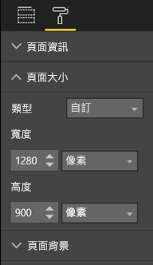

**圖 6：增加頁面高度**

#### 降低雜亂
雜亂的報表頁面很難一眼了解，甚至讓讀者不想嘗試。  請去除所有不必要的報表元素。 請不要新增對理解或瀏覽沒有幫助的裝飾用配件。 您的報表頁面必須盡可能清楚、快速且團結地傳達資訊。

Edward Tufte 在他的《The Visual Display of Quantitative Information》這本書中，將它稱為 "data to ink ratio" (資料/墨水比)。  基本上，請移除任何不必要的元素。

您移除的雜亂將增加報表頁面上的白色空間，並讓您有更多的不動產可套用我們在＜對齊、順序和鄰近性＞一節中所學習到有關上述項目的最佳作法。

在這裡，我們的範例看起來已經不錯。 我們已移除一些雜亂，並新增圖形以將元素群組在一起。  背景影像會消失、不必要的箭號圖形和文字方塊會消失、已將一個視覺效果移至報表的另一個頁面等。我們也已經加長頁面大小，以增加白色 (黃色？) 空間。

**圖 7︰去除不美觀報表範例的雜亂部份**

### 概略表達意涵
整體測試應該是沒有先前知識的某個人可以在沒有人進行說明的情況下快速了解報表。 運用快速概覽，讀者應該能夠快速查看頁面的用途以及每個圖表/資料表的用途。   

讀者在查看您的報表時，應該先看到您要讓他們看到的元素，然後繼續進行從左到右、從上到下地查看。  變更這項行為的方式是新增視覺效果提示 (例如文字方塊標籤、圖形、框線、大小和色彩)。  

#### 文字方塊
有時，視覺效果上的標題不足以表達其意涵。  新增文字方塊，以與檢視您報表的人員進行通訊。  文字方塊可以描述報表頁面、一組視覺效果，或描述個別視覺效果。 它們可以解釋結果，或更適當地定義視覺效果、視覺效果中的元件，或視覺物件之間的關聯性。 文字方塊可以用來根據文字方塊中所呼叫的不同準則來進行強調。

在 Power BI 服務中，從頂端功能表列中選取 [文字方塊]\ (在 Power BI Desktop 中，從功能區的 [插入] 區域中選取 [文字方塊])。

**圖 8：新增文字方塊**

輸入空白方塊，然後使用底端的控制項來設定字體、大小、對齊和其他項目。 您可以使用控點來調整方塊大小。

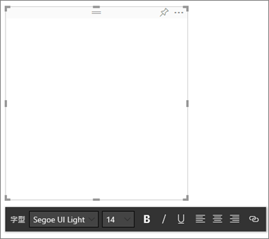

**圖 9：將文字方塊格式化**

但請不要濫用！ 報表上的文字太多會轉移視覺效果的注意力。 如果發現您的報表頁面需要大量文字才更容易了解，則請重新開始。  您是否可以選擇不同的視覺效果更適當地自行說明？ 您是否可以調整視覺效果的原生標題，使其更容易理解？   

#### 文字
建立文字樣式指南，並將它套用至報表的所有頁面。 請只挑選幾個字體、文字大小和色彩。  此樣式指南不只套用至文字元素，也套用至您在視覺效果內進行的字型選項 (請參閱下面的＜屬於視覺效果一部分的標題和標籤＞)。 設定將使用粗體、斜體、增加的字型大小、特定色彩和其他項目的規則。  請嘗試避免使用所有大寫或加上底線。

#### 圖形
圖形對瀏覽和理解也有幫助。 使用圖形將相關資訊群組在一起、反白顯示重要資料，以及使用箭號來指示目光所及位置。 圖形可協助讀者了解要從何處開始以及如何解譯您的報表。 在設計術語中，這通常稱為「對比」。

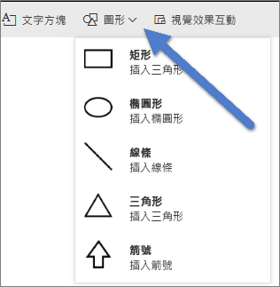

**圖 10a：Power BI 服務中的圖形**

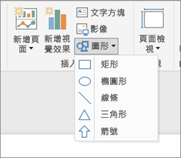

**圖 10b：Power BI Desktop 中的圖形**

我們範例頁面的外觀目前為何？  圖 11 顯示更乾淨但不雜亂的頁面，而且這個頁面使用一致的字體、字型和色彩。  我們在左上角的頁面標題會告訴我們頁面的用途。

**圖 11︰已套用文字指導方針並新增標題的報表範例**

在範例中，已在左上角新增報表頁面標題；這是讀者看到的第一個位置。 字型大小是 28 且字型為 Segoe Bold，有助於在頁面的其餘部分讓它更為醒目。  我們的文字樣式指南需要無背景、黑色標題、圖例和標籤，並盡可能全部套用至頁面上的所有視覺效果 (組合圖軸和標籤不可進行編輯)。  此外︰

* 卡片︰[目錄標籤] 設定為 [關閉]、將 [標題] 設定為 [開啟]，並設定為 12 點黑色置中。
* 視覺效果標題︰如果已開啟，請設定為 12 點並靠左對齊。
* 交叉分析篩選器：[標頭] 設定為 [關閉]、[標題] 設定為 [開啟]。 請將 [項目] > [文字] 保持為灰色和 10 點。
* 散佈圖和直條圖︰黑色字型用於 X 和 Y 軸以及 X 和 Y 軸標題 (使用時)。

#### 色彩
請基於一致性來使用色彩。  我們將在下面的＜視覺效果設計原則＞中深入討論色彩。 但在這裡，指的是謹慎選取色彩，讓讀者可以快速了解您的報表，而不分心。  太多明亮的色彩會對感官造成衝擊。 本節不只是有關色彩的使用。

#### 背景
設定報表頁面的背景時，請選擇不要讓報表失色的色彩、不要與頁面上的其他色彩衝突的色彩，或一般會損害眼睛的色彩。 請注意，有些色彩具有固有意義。  例如，在美國，報表中的紅色通常解譯為「錯誤」。

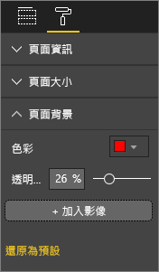

**圖 12︰設定報表背景**

您不是建立藝術品，而是實用報表。 請選擇色彩，以提升報表元素的可讀性和重要性。  

一項對於網頁內色彩和視覺效果運用的研究，發現色彩之間對比度較高者會增加理解速度 (*「文字和背景色彩對網頁之視覺效果搜尋的影響」 和 「判斷使用者對網頁視覺效果複雜性和美學特性的認知」*)。

我們已經將一些色彩最佳作法套用至下面的範例報表 (圖 20 和 21)。 最值得注意的是我們已將背景色彩變更為黑色。  黃色太亮，會傷害我們的眼睛。  此外，在「依年份和類別的運動員名稱計數」圖表上，橫條的黃色部分會在黃色背景中消失。  使用黑色 (或白色) 背景時，可提供最大對比，並讓視覺效果成為焦點。

以下是我們改善範例報表所採取的額外步驟︰

**頁面標題**

將背景變更為黑色時，標題就會消失，原因是文字方塊欄位只允許黑色字型。   若要修正此問題，請改為新增文字標題。  選取文字方塊之後，請清除文字，並選取 [視覺效果] 索引標籤中的 [標題]，將它開啟。 選取箭頭以展開 [標題] 選項，並在 [標題文字] 欄位中輸入 **Summer Olympic Games**，然後將 [字型色彩] 選取為白色。

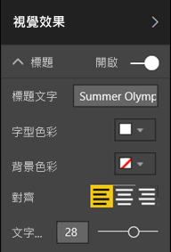

**圖 13：新增頁面標題**

**卡片**

針對卡片視覺效果，開啟 [格式化] 窗格 (油漆滾筒圖示)，並開啟 [背景]。 選取透明度為 0% 的白色。 接著開啟 [標題]，並將 [字型色彩] 選取為白色，然後將 [背景色彩] 選取為黑色。

**交叉分析篩選器**

到目前為止，這兩個交叉分析篩選器有不同的格式，但這沒有任何設計意義。 針對兩個交叉分析篩選器，將背景色彩變更為青色。  青色是不錯的選擇，因為它是頁面調色盤的一部分；您可以在區域分布圖、樹狀圖和直條圖中看到它。

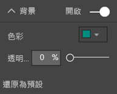

**圖 14：變更交叉分析篩選器背景色彩**

新增細白色框線。

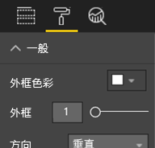

**圖 15：將框線新增至交叉分析篩選器**

在青色中，很難看出灰色字型，因此請將 [項目] 色彩變更為白色。

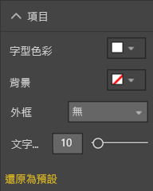

**圖 16：變更交叉分析篩選器字型色彩**

最後，在 [標題] 下，將 [字型色彩] 變更為白色，並新增黑色 [背景色彩]。

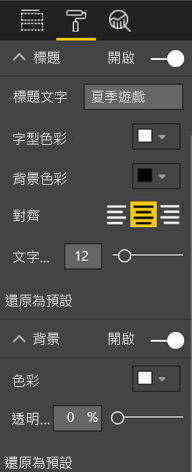

**圖 17：格式化交叉分析篩選器標題**

**矩形圖形**

矩形也會在黑色背景中消失。  若要修正此問題，請選取圖形，並在 [格式化圖案] 窗格中開啟 [背景]。

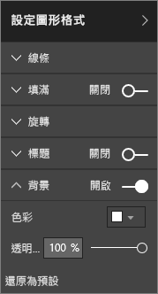

**圖 18：格式化圖形**

**直條圖、泡泡圖、區域分布圖和樹狀圖**

將白色背景新增至報表頁面上的其餘視覺效果。 從 [格式化] 窗格中，展開 [線條] 選項，然後將 [線條色彩] 設定為白色並將 [粗細] 設定為 3。

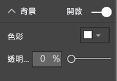

**圖 19：將白色背景新增至其餘視覺效果**

**圖 20︰套用色彩最佳作法 (黑色背景) 的報表範例**

**圖 21︰套用色彩最佳作法 (白色背景) 的報表範例**
 

### 美學
上面已討論大部分我們視為美學的項目：對齊、色彩、字型選項、雜亂這類項目。  但是，有一些值得討論之報表設計的最佳作法，而且它們會處理報表的整體外觀。  

請記住您報表的功能是符合商務需求，而不是漂亮。  但需要某些程度的美觀，尤其是第一印象。 Nashville 顧問 Tony Bodoh 說明「情感是在半秒內引發，然後才開始邏輯思考」。  讀者要先喜歡您的報表頁面，才會花更多的時間深入了解。 如果您的頁面看起來是雜亂無章、令人混淆、不專業等，則讀者絕不會察覺到它想要表達的意涵。

TDI 部落客和 TechTarget 產業分析師 Wayne Eckerson 的見解也極為類似。  設計報表就像裝飾房間。  過了一段時間後，您購買花瓶、沙發、茶几和油畫。  另外，您喜歡所有這些元素。 但是，雖然每個個別選項都合理，但是物件會衝突或搶走注意力。

請專注於︰

* 建立一般主題或尋找您的報表，並將它套用至報表的所有頁面
* 使用獨立影像和其他圖形來支援實際意涵，而不要轉移對實際意涵的注意力
* 並套用本文到目前為止討論過的所有最佳作法。

## 視覺效果設計原則
我們已經查看過報表設計原則，以及如何組織報表元素，輕鬆地快速掌握報表。  我們現在將查看視覺效果本身的設計原則。  而在下一節中，我們將深入討論個別視覺效果，並討論一些更常用類型的最佳作法。

在本節中，我們將離開範例報表頁面一段時間，並查看其他範例。  我們在完成視覺效果設計原則之後，將回到我們的範例報表頁面，並套用我們所學習的內容 (含逐步指示)。  

### 規劃 – 選擇正確的視覺效果
就像開始建置之前一定要先規劃報表一樣，您也需要規劃每個視覺效果。  請問您自己：「嘗試使用此視覺效果所呈現的內容為何？」 然後找出最適合的視覺效果類型。 您可以使用橫條圖顯示整個銷售循環的進度，但瀑布圖或漏斗圖是否比較適合？ 如需此作業的說明，請閱讀本白皮書的最後一節：＜視覺效果類型和最佳作法＞，以描述一些更常見類型的最佳作法。  如果您選擇的第一個視覺效果類型最後不是最佳選項，也請不要太過驚訝。  請嘗試數種視覺效果類型，確認哪一種視覺效果類型對該點是最佳選擇。

了解類別與數量資料之間的差異，並知道哪些視覺效果類型最適合與哪些資料類型搭配運作。 量化資料通常稱為量值，而且一般是數字。 類別資料通常稱為維度，而且可以進行分類。 這會在下面的＜選擇正確的量值＞中深入討論。

若只是為了讓您的報表看起來令人印象深刻，則請避免使用花俏或更複雜的視覺效果類型。 您只需要用來傳達意涵的最簡單選項。 水平橫條圖和簡單折線圖可以快速傳達資訊。  它們是熟悉且合用的圖表，而且大部分讀者可以輕鬆地解釋。  新增的優點是大部分的人都是從左到右、從上到下閱讀，因此，可以快速掃描和瞭解這兩種圖表類型。

您的視覺效果是否需要捲動才能表達它的意涵？ 如果可以的話，請避免捲動。  請嘗試套用篩選並利用階層/向下鑽研，而且，如果這些未排除捲軸，請考慮選擇不同的視覺效果類型。 如果您還是需要捲動，則水平捲動的容忍度高於垂直捲動。

即使您為所要表達的意涵選擇絕對最佳視覺效果，還是可能需要表達其意涵的協助。  這是放置標籤、標題、功能表、色彩和大小的位置。 我們稍後將在＜設計元素＞一節討論這些設計元素。

### 選擇正確量值
視覺效果所表達的意涵是否具吸引力？ 是否有關係嗎？  請不要因建置視覺效果而建置視覺效果。 您可能認為資料將表達有趣的意涵，但並沒有。 請不要害怕從頭開始，並尋找更多有趣的意涵。 或者，意涵可能就在那裏，但需要以不同的方式進行測量。

例如，假設您想要測量銷售經理是否成功。 用來執行這項作業的測量為何？  是否可以透過查看總銷售量或總收益、前一年的成長或目標之目標的效能來進行最佳測量？ 銷售人員 Sally 的收益可能最大，而且，如果您使用橫條圖顯示銷售人員的總收益，則她與其他業務人員相較之下就像搖滾之星。  但是，如果 Sally 的銷售成本很高 (出差費用、運費成本、製造成本等)，則只是查看銷售量並無法表達其最佳意涵。

#### 反映事實/不扭曲事實
建置的視覺效果可能會扭曲事實。 提供資料愛好者可分享「錯誤」視覺效果的網站。 而且，註解中的一般佈景主題會讓建立和發佈該視覺效果的公司失望。  將會傳送無法信任它們的訊息。

因此，請建立視覺效果，這些視覺效果不會刻意扭曲事實，以及不會操作來表達您要它們表達的意涵。  範例如下︰

**圖 22：失真圖**

在此範例中，4 家公司似乎沒有很大的差異，而且 CorpB 比其他 3 家更為成功。  但請注意，X 軸不是從零開始，而且公司之間的差異可能落在錯誤範圍內。  以下是具有從零開始之 X 軸的相同資料。

**圖 23：實際圖**

讀者預期且通常假設 X 軸是從零開始。 如果您決定不從零開始，則作法最好不要扭曲結果，並考慮新增視覺效果提示或文字方塊來指出與基準的偏差。  

### 設計元素
選取類型和量值並建立視覺效果之後，就適合微調顯示，以達到最大效率。  本節涵蓋︰

* 配置、空間和大小
* 文字元素︰標籤、註解、功能表、標題
* 排序
* 視覺效果互動
* 色彩

#### 調整視覺效果來最佳使用空間
如果您嘗試將多個圖表放入報表，則將 data-ink (資料/墨水比) 最大化有助於突出您資料中的故事。如上所述，Edward Tufte 創造 'data-ink' (資料/墨水比) 這個新詞︰目標是盡可能移除圖表中任意數目的標記，而不損害讀者解譯資料的能力。

在下面的第一組圖表中，有多餘的軸標籤 (2014 年 1 月、2014 年 4 月等) 和標題 (「依日期」)。 每個圖表的標題也需要每個圖表有專用水平空間。 我們移除圖表標題並開啟個別軸標籤，來移除一些墨水，以及更有效地運用整體空間。 我們可以移除前兩個圖表的軸標籤，進一步減少墨水並使用更多資料空間。

如果您想要呼叫特定時段，則可以在所有圖表後面繪製線條或矩形，協助上下繪製視角來輔助進行比較。

**圖 24：之前**

**圖 25：之後**

**開啟和關閉軸標題**

選取要啟用的視覺效果，並開啟 [格式化] 窗格。 展開 [X 軸] 或 [Y 軸] 的選項，並拖曳滑桿來開啟或關閉 [標題]。

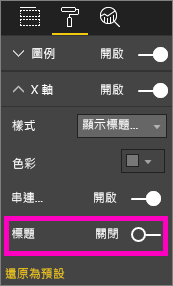

**圖 26：開啟和關閉軸標題**

**開啟和關閉軸標籤**

選取要啟用的視覺效果，並開啟 [格式化] 窗格。 在 [X 軸] 和 [Y 軸] 旁邊是滑桿。  拖曳滑桿來開啟或關閉軸標籤。

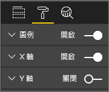

**圖 27：開啟和關閉軸標籤**

> [!TIP]
> 您可能會關閉 Y 軸標籤的一種情況是已開啟 [資料標籤] 時。
> 
> 

**移除視覺效果標題**

選取要啟用的視覺效果，並開啟 [格式化] 窗格。 將 [標題] 的滑桿設定為 [關閉]。

**圖 28：移除視覺效果中的標題**

請考慮讀者如何檢視報表，並確認您的視覺效果和文字夠大且夠暗到足以讀取。 如果您的頁面上有比例較大的視覺效果，則讀者可能會假設它最為重要。 在不會讓報表看起來雜亂且令人困惑的視覺效果之間放置足夠的空間。  對齊視覺效果，有助於引導讀者的角度。

**調整視覺效果**

選取要啟用的視覺效果。 抓住並拖曳其中一個控點來調整大小。

**圖 29：調整視覺效果**

**移動視覺效果**

選取要啟用的視覺效果。 選取並按住視覺效果正中間的移駐夾列，並將視覺效果拖曳至其新位置。

**圖 30：移動視覺效果**

#### 屬於視覺效果一部分的標題和標籤
請確定標題和標籤都可讀取而且容易理解。 標題和標籤中的文字必須是具有醒目色彩的最佳大小 (例如黑色，而非預設的灰色)。 是否記得我們的樣式指南 (請參閱上面的＜文字＞)？ 色彩和大小數目限制 -- 不同的字型大小和色彩太多，會讓頁面看起來忙碌且造成混淆。  請考慮將相同的字型色彩和大小用於報表頁面上所有視覺效果的標題，並選擇報表頁面上所有標題的相同對齊方式。  

**格式化窗格**

針對下面列出的每個格式化調整，選取油漆滾筒圖示來開啟 [格式化] 窗格。

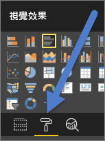

**圖 31：開啟 [格式化] 窗格**

然後選取要調整的視覺效果元素，並確定它設定為 [開啟]。 視覺效果元素範例如下：[X 軸]、[Y 軸]、[標題]、[資料標籤] 和 [圖例]。 下面的範例會顯示 [標題] 元素。

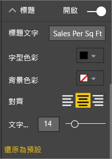

**圖 32：格式化視覺效果標題**

**設定文字大小**

您可以調整標題和資料標籤的文字大小，但無法對 X軸、Y 軸或圖例進行調整。  具體來說，針對資料標籤，使用不同的 [顯示單位] 和 [小數位數]，直到您找到在報表上顯示的最佳詳細層級為止。   

**設定文字對齊方式**

標題對齊方式的選項為靠左、靠右和置中。  請選擇一個，並將該相同的設定套用至頁面上的所有視覺效果。  

**設定文字位置**

您可以調整某些 Y 軸和圖例的文字位置。   不論您做出哪種選擇，都請對其他 Y 軸以及頁面上的任何其他圖例執行相同的作業。

**設定標題和標籤長度**

請調整標題、軸標題、資料標籤和圖例的長度。 如果您決定要顯示其中任何元素，則調整長度 (以及文字大小) 可確保不會截斷任何項目。 針對 [標題] 和 [圖例]，設定為 [標題文字]，而且這是您輸入要出現在視覺效果上之實際標題的位置。 針對 [X 軸] 和 [Y 軸]，設定是 [樣式]，而且您從下拉式清單中進行選取。 針對 [資料標籤]，設定是 [顯示] 和 [小數位數]。 使用 [顯示] 下拉式清單選取測量單位︰百萬、千、無、自動等。使用 [小數位數] 欄位，告訴 Power BI 要顯示多少小數位數。

**設定文字色彩**

您可以調整標題、軸和資料標籤的文字色彩。  

#### 不屬於視覺效果一部分的標題和標籤
在本白皮書稍早，我們已討論如何將文字方塊新增至報表頁面。 有時，視覺效果上的標題不足以表達其意涵。  新增文字方塊，以將其他資訊傳達給報表的讀者。  
為了避免您的報表頁面看起來太過混淆或過於忙碌，請持續使用文字方塊字型、大小、色彩和對齊方式。 若要調整文字方塊中的文字，請選取文字方塊，以顯示 [格式化] 功能表。

**圖 33：格式化文字方塊中所使用的字型**

#### 排序
提供更快速見解的真正簡單機會是設定視覺效果的排序。 例如，根據橫條中的值依遞減或遞增順序排序橫條圖，可讓您快速顯示大量遞增資訊，而不需要使用更多不動產。

若要排序圖表，請選取圖表右上方的省略符號 (...)，並選取 [排序]，然後選擇您要排序的欄位和方向。 如需詳細資訊，請參閱[變更視覺效果的排序方式](power-bi-report-change-sort.md)。

#### 圖表互動和相互作用
其中一個最吸引人的 Power BI 功能是可以編輯圖表彼此互動的方式。  根據預設，圖表會交叉反白顯示︰當您選取資料點時，會亮起其他圖表的相關資料，不相關的資料則變暗。 您可以覆寫此行為以使用任何圖表作為實際篩選，來節省您頁面上的不動產。 若要這樣做，請選取功能表列中的 [視覺互動]。

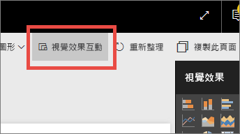

**圖 34：視覺效果互動**

然後，針對頁面上的每個視覺效果，決定是要篩選選取的視覺效果、反白顯示選取的視覺效果，還是不執行任何動作。 並非所有視覺效果都可以反白顯示，而且針對那些視覺效果，將無法使用反白顯示控制。 如需詳細資訊，請參閱 [Power BI 中的視覺效果互動](service-reports-visual-interactions.md)。

> [!TIP]
> 針對 Power BI 的新讀者，可能無法立即看到這項按一下報表並與之互動的功能。 新增文字方塊，協助他們了解可按一下以深入了解的項目。
> 
> 

#### 在視覺效果中使用色彩
在本白皮書稍早，我們談到您要如何在報表中使用色彩之計劃的重要性。 本章會有些重疊，但主要適用於如何在個別視覺效果中使用色彩。 並套用相同原則︰使用色彩將報表結合在一起、新增重要資料的重點，以及改善讀者對視覺效果的理解。 不同的色彩太多會讓人分心，而且讀者很難知道要去哪裡進行尋找。 請不要犧牲對美麗的理解。 色彩只有在可改善理解力時才新增。

> [!TIP]
> 請知道您的對象和任何固有色彩規則。  例如，在美國，綠色通常表示「良好」，紅色則通常表示「不好」。
> 
> 

本主題會細分以涵蓋︰

1. 資料色彩
2. 資料標籤色彩
3. 類別值的色彩
4. 數值的色彩

**使用色彩來反白顯示感興趣的資料**

使用色彩的最簡單方式是變更一個或多個資料點的色彩來提醒您注意它。 在此範例中，奧運會比賽已從 4 年循環變更為 2 年循環的替代夏季和冬季比賽時，色彩會變更。

**圖 35：使用色彩來表達意涵**

您可以從 [格式化] 窗格中的 [資料色彩] 索引標籤來變更資料點色彩。 若要個別自訂每個資料點，請確定 [全部顯示] 設定為 [開啟]。

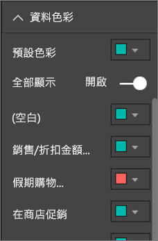

**圖 36︰設定資料點色彩**

> [!NOTE]
> Power BI 會將預設佈景主題套用至您的報表視覺效果。  已選擇佈景主題色彩，來提供多樣性和對比。 若要轉移對預設佈景主題調色盤的注意力，請選取 [自訂色彩]。
> 
> 

**圖 37︰選擇自訂色彩**

在 Power BI Desktop 中，您甚至可以使用第二個系列來反白顯示極端值或線條的某一段︰

**圖 38︰ 使用 Desktop 來繪製極端值**

在這裡，[極端值] 序列中的值只存在於平均 8 月溫度低於 60 時。 作法是使用下列公式來建立 DAX 計算結果欄︰

極端值 = if(Editions[Temp]<60, Editions[Temp], BLANK())

在範例中，有 3 個極端值︰1952 年、1956 年和 2000 年。

**標籤和標題的色彩**

在您探索可用的所有格式化選項時，會發現有許多不同的位置可新增標題和圖例的色彩。 例如，您可以變更資料標籤和軸標題的色彩。 繼續進行時請小心。  您一般會想要將單一色彩用於所有視覺標題。  與本白皮書中的所有指導方針相同，一定會有一些情況和原因需要「打破規則」，但是，如果您決定要打破規則，則最好有充分的理由。

**類別值的色彩**

包含一系列的圖表通常有圖例中的類別值。 例如，下面圖例中的每個色彩都代表不同類別的國家/地區。

**圖 39︰已套用預設色彩**

預設會選擇 Power BI 所使用的色彩，以提供類別值的良好分色，以輕鬆進行區分。 人們有時會變更這些色彩以符合其公司配置等，但可能會造成問題。

**圖 40：套用為單一色彩之色調的色彩**

此視覺效果已透過著重於單一色調並改變色彩濃度，導入類別間之排序的錯覺。 這表示較暗的泡泡高於或低於較淡色調的一些刻度。 在這類類別值中通常沒有固有順序，但依字母順序除外。
若要變更預設色彩，請開啟 [格式化] 窗格，並選取 [資料色彩]。

**數值的色彩**

對於沒有某個固有順序和數值的欄位，您也可以依值將資料點上色。 這可能有助於顯示整個資料的值分配，同時允許在單一圖表上顯示兩個變數。 例如，這個圖表清楚指出，雖然中國的獎牌數最多，但是日本和泰國參與更多的奧運會比賽。

**圖 41：依值將資料點上色**

若要建立這張圖表，請將值新增至 [色彩飽和度] 欄位，然後在 [格式化] 窗格中調整這些色彩。

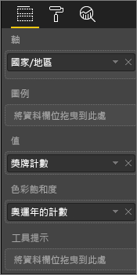

**圖 42：新增色彩飽和度欄位**

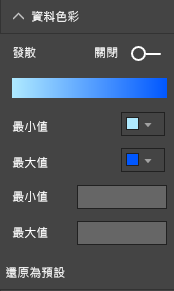

**圖 43：調整用於飽和度的色彩**

色彩也可以用來強調中央值的變異。 例如，將正值加上綠色，並將負值加上紅色。 指派正值或負值的色彩時，請注意文化差異；並非所有文化都使用紅色表示錯誤並使用綠色表示良好！

**圖 44：強調中央值變異的色彩**
 

### 視覺效果設計原則 – 已套用至範例報表頁面
現在讓我們採用上面所討論的視覺效果原則，並將它們套用至我們的範例報表。

之前

**圖 45︰我們範例報表 (之前)**

之後

**圖 46︰我們範例報表 (之後)**

#### 我們做了什麼？
1. 交叉分析篩選器︰已新增頁面層級篩選，然後只選取金、銀、銅，來移除交叉分析篩選器中的空格。 針對 [單一選取] 和 [全選]，已將 [選取控制項] 變更為 [關閉]。
2. 泡泡︰圖例中的項目太多，因此會捲動到螢幕外部。  已移除圖例，並改為開啟 [類別標籤]。 客戶可以停留在泡泡上方，以查看詳細資料。 已縮短標題，並移除「依 countryregion」，因為這不喻自明。 開啟兩者的軸標籤，讓圖表更容易了解。
3. 區域分布圖：已變更 [資料色彩]，讓它更為醒目。 開啟 [發散]、將 [最小值] 設為粉紅色，並將 [最大值] 設為紅色。
4. 樹狀圖︰已移除僅針對 USA 所設定的篩選。 將 [資料標籤] 設定為 1 位小數位數。 視覺效果之前使用根本不實用的 [類別] 欄位，因為它幾乎一律是 33% (金/銀/銅)。  已選取不同的更有趣欄位 (性別)。 依據設計，已將 [水上運動] 變更為藍色，並將 [體育運動] 設為灰色。
5. 頂端橫條圖︰已縮短標題、已移除資料標籤、已關閉圖例標題。 已變更標題的文字順序，使其符合下面的圖表。
6. 底端橫條圖︰依年份遞增排序，以符合上述圖表。 已變更色彩來符合類別。 已變更標題。 已關閉圖例，來清出更多空間供資料使用。 已開啟不會顯示在報表中的資料標籤 (因為視覺效果太小，無法讀取標籤)，但會在以焦點模式開啟視覺效果時顯示。 [了解焦點模式](service-focus-mode.md)。 已將[事件計數 (相異)] 新增至 [工具提示]，因此，現在，當您停留在堆疊直條圖上方時，工具提示也會告訴您該年競爭多少事件。
7. 視覺效果互動：因為一律要讓兩張卡片顯示遊戲和運動總計，所以已關閉其互動。

## 視覺效果類型和最佳作法
Power BI 一開始提供許多視覺效果類型。  對這些項目，新增來自 Microsoft 和 Power BI 社群的自訂視覺效果，而且總視覺效果選項數目會變成太多，而無法記錄在這裡。 但是，讓我們看看一些最常用的原生視覺效果類型。  

### 折線圖

折線圖是查看一段時間之資料的強大方式。  查看資料表中的資料，並不會真正利用我們的眼睛找出尖峰、低谷、循環和模式的速度。  
下面的範例顯示獲頒獎牌數目以及贏得這些獎牌之運動員數目的趨勢。  

**圖 47：折線圖**

#### 最佳作法
* 使用者查看折線圖時，看到的第一個事項是曲線的形狀。  這表示您必須有 X 軸，才能讓曲線對這類時間或分佈類別有意義。  如果您將產品或地理位置這類類別欄位放在 X 軸上，則因為曲線的形狀未提供有意義的資訊，所以折線圖不怎麼有趣。
* 如果您選擇像這樣在彼此上下方放置多個圖表，以更輕鬆地跨序列進行比較，則請對齊 X 軸。 您可以使用篩選，確保顯示相同的值範圍。  例如，如果您查看日期範圍，請確定它們是相同的日期範圍。  例如，兩個圖表上的 1896 年到 2012 年。
* 請充分利用空間。  如果它適合您的資料，請設定 Y 軸的開始和結束點，以消除圖表上下方的空白空間，並專注於實際資料點。 若要這樣做，請選取油漆滾筒圖示來開啟 [格式化] 窗格。 展開 [Y 軸] 區域，並設定 [開始] 和 [結束] 點。
  
  
  
  **圖 48︰設定開始和結束點**
* 明確設定開始和結束點的另一個原因是您要比較使用相同 Y 軸欄位之相同頁面上的兩張以上圖表。  例如，如果您正在查看累計事件計數、英國的計數範圍從 1 到 70，而且澳洲的計數範圍從 1 到 12，則 2 個折線圖將顯示極不同的 Y 軸 (圖 X)。 這很難快速進行比較。 而是設定圖表以使用相同的 Y 軸範圍 (圖 X)。
  
  
  
  **圖 49：Y 軸不同的折線圖**
  
  
  
  **圖 50：Y 軸相符的折線圖**

如需詳細資訊，請參閱：

* [自訂 X 和 Y 軸](power-bi-visualization-customize-x-axis-and-y-axis.md)
* [折線圖和不規則間隔](http://www.perceptualedge.com/articles/visual_business_intelligence/line_graphs_and_irregular_intervals.pdf)
* [折線圖 101](http://www.columnfivemedia.com/data-visualization-101-line-charts)

### 橫條圖/直條圖

如果折線圖是查看一段時間之資料的標準作法，橫條圖就是查看不同類別間特定值的標準作法。  如果您根據數字來排序橫條，則會立即看到前幾個值和分佈。  水平橫條圖最適合與稍長的標籤搭配運作。  

**圖 51：水平橫條圖**

#### 最佳作法
* 顯示值的資料標籤。  這可讓您更輕鬆地識別特定值。 若要這樣做，請開啟 [格式化] 窗格，並將 [資料標籤] 設定為 [開啟]。
  
  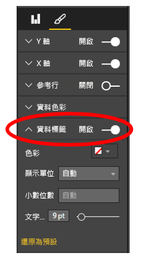
  
  **圖 52：開啟資料標籤**
* 上述的橫條圖實際用於比較一個量值與**單一時間點**的多個量值。  雖然上述折線圖顯示一段時間的趨勢，但是橫條圖則顯示單一類別在特定時間點的趨勢。  橫條圖顯示西班牙是全世界失業率最差的其中一個國家，失業率為 25%。
* 整個橫條圖/長條圖無法放入配置的空間時，Power BI 會新增捲軸。 可能也可以的話，請建構視覺效果和報表來顯示整個圖表，讓讀者了解整個分佈的概觀。  不幸的是，在我們的範例中，這不可能提供全球各地大量數目的國家/地區。
  
  使用篩選是一種限制所包含值的方法。 例如，新增視覺效果層級篩選，只在失業率高於 20% 時才顯示國家/地區。
* 您可以向下鑽研整個橫條圖/長條圖，並重新備份。  這是將更多資訊封裝至視覺效果而不需使用更多不動產的不錯方法。  下面的範例具有 [地區] > [國家/地區] 的階層。  按兩下構成該地區之國家/地區的地區列向下鑽研。  如需鑽研的詳細資訊，請參閱[視覺效果的向下鑽研](power-bi-visualization-drill-down.md)。
  
  
  
  **圖 53：向下鑽研**

如需橫條圖和直條圖的詳細資訊︰

* [橫條圖 101](http://blog.newscred.com/article/data-visualization-101-bar-charts/3c53044d4add7c31e79a3f80128771f4?page=thankyou)
* [Data Visualization Catalogue: Bar Chart](http://www.datavizcatalogue.com/methods/bar_chart.html#.VYV-hY3bLJw)
* [Data Visualization Catalogue: Multi-set Bar Chart](http://www.datavizcatalogue.com/methods/multiset_barchart.html#.VYV_gI3bLJw)

### 堆疊橫條圖/直條圖

在橫條或直條內堆疊不同的類別，以將另一個維度新增至橫條圖/直條圖。  現在，圖表會傳達一個整體趨勢的相關資訊 (根據高度/長度)，也會顯示該趨勢上類別的影響。 下圖顯示 2014 年營收超過 60 億以上之頂尖美式足球團隊的整體成長。

**圖 54：堆疊直條圖**

此堆疊直條圖顯示總營收將成長一段時間，而且「商業」和「廣播」類別會持續增加一段時間，而這會導致整體營收增加。  但是，此圖表無法讓您輕鬆比較這 3 個類別對彼此的影響。 例如，如何比較「商業」的成長與「廣播」和「比賽日」的成長？  這項資料的較佳選項或這項資料的隨附視覺效果將會是折線圖。  

**圖 55：轉換成折線圖**

在此折線圖中，很容易就可以看到商業營收在廣播和比賽日之後如何成長地最多。

#### 最佳作法
* 與直條圖/橫條圖相同，您可以選擇使用水平或垂直顯示。   如果您有很長的標籤，則水平是較好的選擇，如果您有時間序列資料，則垂直是較好的選擇。  
* 如果您想要顯示一段時間的趨勢和其他變更模式，則請避免堆疊橫條圖/直條圖。  其他圖表 (例如折線圖) 可執行較佳的工作。
* 您也可以有根據總量或總計百分比的分佈。  
* 較少提及的是，「很難比較堆疊橫條圖的區段。如果並排排列區段，而且所有成長都是從相同的基準線往上，則可以輕鬆地比較其高度，但是，互相堆疊時，工作會變得困難。此外，雖然很容易就可以看到 (營收) 的月變更，但是很難看到其他 (類別) 中的 (營收) 變更」。  
* 使用最多 100 的百分比時，100% 堆疊圖表是不錯的選擇。  在下面的範例中，我們會看到團隊的類別分佈。  百分比是相對的，並可讓我們一眼看到模式。 例如，Everton 的營收主要來自廣播 (超過 70%)，而 PSG 只會從廣播衍生其營收的 20%。  水平顯示的選項可讓您輕鬆地放入團隊標籤，以及查看營收類型的影響。
  
  
  
  **圖 56：水平堆疊圖表**

如需堆疊圖表的詳細資訊：

* [Data Visualization Catalogue: Stacked bar graphs](http://www.datavizcatalogue.com/methods/stacked_bar_graph.html#top)
* [When are 100% stacked bar graphs useful?](http://www.perceptualedge.com/blog/?p=2239)

### 組合橫條圖/直條圖

在 Power BI 中，您可以將直條圖和折線圖合併成一個組合圖。 選項為：[折線與堆疊直條圖] 和 [折線與群組直條圖]。 將兩個不同的視覺效果合併成一個視覺效果，以節省寶貴的畫布空間。

下面的兩個螢幕擷取畫面會顯示之前和之後的樣子。  第一頁有兩個不同的視覺效果︰[直條圖] 顯示一段時間的擴展，[折線圖] 則顯示一段時間的 GDP。 這些圖表適合作為組合圖，原因是它們具有相同的 X 軸 (年) 和值 (2002 年到 2012 年)。  為什麼不合併它們，以在單一視覺效果上比較這 2 個趨勢？  合併這 2 種圖表可讓您更快速地比較資料。

新的報表頁面具有單一視覺效果︰折線與堆疊直條圖。 我們可以輕鬆地建立折線與群組直條圖。  您現在可以輕鬆地找到兩個趨勢之間的關聯性。   我們可以看到，到 2008 年之前，人口和 GDP 的趨勢類似。 但從 2009 年開始，人口成長扁平化時，GDP 變動會較大。  

 **圖 57：作為兩個不同的圖表**

 **圖 58：作為單一組合圖**

#### 最佳作法
兩個視覺效果至少共用一個軸時，最適合使用組合圖。

請查看您的軸！ 是否可以輕鬆地閱讀和解譯組合圖？  或者，是否使用不同的範圍和值？ 例如，如果直條圖 Y 軸的刻度遠小於折線圖 Y 軸的刻度，則組合圖沒有任何意義。  例如，請注意一直到底端的第三條線 (青色)。

   

   **圖 59：失敗折線圖**

因此，如果您的直條圖和折線圖使用 2 個不同的量值，而且您不需要建立雙軸，則組合圖沒有任何意義。  例如，美元與百分比。 請務必包含兩個軸，以協助讀者了解圖表，也請考慮新增軸標籤。

若要這樣做，請開啟 [格式化] 窗格，並展開 [Y 軸]，然後將 [顯示次要] 設定為 [開啟]\(如果尚未開啟)。 這項設定有時很難發現；展開 [Y 軸 (直條圖)]，並向下捲動，直到您看到 [顯示次要]。 也請將 [Y 軸 (直條圖)] [標題] 設定為 [開啟]，並將 [Y 軸 (折線圖)] [標題] 設定為 [開啟]。

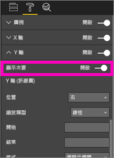

**圖 60：顯示次要軸**

**圖 61：改成建立組合圖**

* 請利用雙軸。 比較多個具有不同值範圍的量值是不錯的方式。 當您要在一個視覺效果中說明兩個量值間的相互關聯時，這是不錯的方式。

如需詳細資訊：

* [教學課程：Power BI 中的組合圖](power-bi-visualization-combo-chart.md)
* [The danger of dual-scaled Axes in visuals](http://www.perceptualedge.com/articles/visual_business_intelligence/dual-scaled_axes.pdf)

### 散佈圖

有時，我們會有許多想要一起看到的變數，而散佈圖是取得完整說明的極有用方式。  散佈圖會顯示 2 (散佈圖) 或 3 (泡泡圖) 量值之間是否有關聯性。  散佈圖一律會有兩個值座標軸，沿著水平軸顯示一組數字資料，沿著垂直軸顯示另一組數值。 此圖表顯示 x 與 y 數交集處的點，結合這些值可形成單一的資料點。 視資料之不同，這些資料點可能平均散布或不平均地散佈在水平軸。

泡泡圖會將資料點以泡泡取代，而泡泡的大小代表其他維度的資料。

下面的泡泡圖查看南美洲，並比較南美洲國家/地區的平均每人 GDP (Y 軸) GDP 總和 (X 軸) 和人口。  泡泡的大小代表該國家/地區的總人口。 巴西的人口最多 (泡泡大小) 並且分攤最大的南美洲 GDP (它是在 X 軸最遠的位置)。  但請注意，烏拉圭、智利和阿根廷的平均每人 GDP 高於巴西 (Y 軸上更高的位置)。

**圖 62：以泡泡圖表示的南美洲 GDP 和人口**

如果您新增播放軸，則可以假裝是 Hans Rosling 並表達意涵一段時間 (https://www.youtube.com/watch?v=PbaDBJWCeD4)。 若要新增播放軸，請一併將日期時間欄位拖曳至 [播放軸]。

#### 最佳作法
* 散佈圖和泡泡圖是不錯的表達意涵方式。 但它們在嘗試瀏覽資料時並不實用。  這是 Stephen Few 在下一段中指出的內容：「這種方式的強度在於用來表達意涵時。如果 Rosling 講述泡泡四處移動而且值變更 (指出他想要讓我們看到的項目) 時圖表中所發生的情況，就會出現資訊。不過，動畫的泡泡圖對於自行瀏覽和識別資料較不具效率。我懷疑 Rosling 使用這個方法來探索意涵，但僅限於在識別到意涵之後才會予以表達。我們一次只能參加一個泡泡，原因是這些泡泡將會移動，因此強制我們反覆執行動畫來了解如何運作。我們可以將軌跡新增至選取的泡泡，以檢閱這些泡泡所用的完整路徑，但是，如果軌跡用於多個泡泡，則圖表會快速變成過於雜亂。基本上，我只是指出這不是顯示這項資訊來進行瀏覽和分析的最佳方式」。
* 請新增 X 和 Y 軸標籤來協助表達意涵。  尤其是在使用泡泡圖時，會使用許多元件，而且標籤可協助讀者了解視覺效果。
* 新增資料標籤，更輕鬆地解譯視覺效果。  尤其是在使用泡泡圖時，如果您在 [圖例] 中有許多項目，則可能很難區分類似的色彩。  在上述的視覺效果中，蘇利南、哥倫比亞和厄瓜多的圖例色彩極為相似。
* 您是否要建立散佈圖，並且只看到一個彙總 X 軸與 Y 軸上所有值的資料點？ 或者，您的圖表是否彙總單一水平或垂直線的所有值？  若要修正此問題，請將欄位新增至 [詳細資料] 區域，以告知 Power BI 如何將值分組。 此欄位對於您想要繪製的每個點都不得重複。 如需協助，請參閱 [Power BI 散佈圖和泡泡圖教學課程](power-bi-visualization-scatter.md)。

### 樹狀圖

樹狀圖十分適合用來概述構成整體之不同元件的相對大小，尤其是您可以依類別將它們分組。  不論在任何時候嘗試了解新的業務，主要元件的樹狀圖都十分適合用來得知整體分佈。

在下面的第一張圖表中，您可以立即看到巴西大約佔南美洲的一半 GDP，而委內瑞拉和阿根廷的大小大約相同。

如果您想要有更廣泛的內容，但仍然可以了解對前幾個參與國家/地區的影響，則可以建立在地區內巢狀處理類別成員 (國家/地區) 的視覺效果階層。 第二個樹狀圖讓我們了解地區的第一個和最前面的相對大小，然後我們可以在每個地區內看到哪些個別國家/地區貢獻最多。 我們看到有三個大型地區 (歐洲、亞洲和北美洲)，而且我們可以在其內輕鬆地查看前幾個國家/地區。

樹狀圖的主要限制在於比較前幾名以外之不同矩形的能力有限。  它是概觀的不錯圖表，但是直條圖和橫條圖可能是更精確了解不同元件之相對大小的較好選擇。
  例如，第一個樹狀圖廣泛指出 GDP 大小的順序，但很難識別出國家/地區之間的特定差異，特別是較小的無標籤方間。 針對比較單一群組的這項資料，橫條圖或直條圖可能是較好的選擇。

**圖 63︰以樹狀圖表示的南美洲 GDP 比較**

在這裡，我們已新增另一個層級的資料 (地區)，而且我們可以看到地區的 GDP 整體貢獻，以及地區內的相對影響。 請注意，請使用非總和量值 (例如平均值) 來執行這項動作，而在非總和量值中，詳細資料的總和可能不代表彙總層級的實際值。

**圖 64：以樹狀圖顯示的地區和國家的 GDP**

如需樹狀圖的詳細資訊，請放心地按一下下面的連結。

* [Treemaps overview](http://www.perceptualedge.com/articles/b-eye/treemaps.pdf)
* [Data Visualization Catalogue: Tree maps](http://www.datavizcatalogue.com/methods/treemap.html#.VYhylI3bL7Y)

### 其他圖表
#### 圓形圖或環圈圖

一般而言，橫條圖/直條圖/折線圖可提供大部分用途。 極容易了解圓形圖和環圈圖很難讓人正確地解譯，而且事實上經常會扭曲資料。 請盡量避免使用它們。 Stephen Few 在 [Save the Pies for Dessert]([www.percetualedge.com/articles/08-21-07.pdf](http://www.perceptualedge.com/articles/08-21-07.pdf) 中詳細描寫其歷史和危險

他在比較「部分與整體之間」的關聯性時，確實解釋過一次圓形圖適用的位置。 但這是極少優於 100% 堆疊橫條圖的圖表。

您可以在 [Darkhorse Analytics 網站](http://www.darkhorseanalytics.com/blog/salvaging-the-pie)上找到有關圓形圖的另一個有趣文章 (和動畫)。

或閱讀相反的觀點：[Why Tufte is flat-out wrong about pie charts](http://speakingppt.com/2013/03/18/why-tufte-is-flat-out-wrong-about-pie-charts/)

#### 星形量測計和 KPI

星形量測計似乎就是指出目標之效能的不錯視覺效果，而且極適用於執行儀表板中。 不過，它們在兩個主要部分會發生問題。 與圓形圖相同，相較於完整 180 度弧線或目標線，很難解譯陰影區域的角度。 它也會使用大量空間來顯示單一度量。

不錯的替代方法是簡單 KPI 視覺效果

KPI 會顯示相同空間量中的值、狀態、目標、與目標的變異以及趨勢。 如果目標不符合，則綠色會變成紅色，如果選中某個中繼目標，則會變成黃色。 讀取和解譯比量測計更為簡單。

如需詳細資訊，請參閱：

* [教學課程：Power BI 中的星形量測計圖表](power-bi-visualization-radial-gauge-charts.md)
* [教學課程︰Power BI 中的 KPI](power-bi-visualization-kpi.md)

## 結論
現在，您可以測試這些最佳作法。  請保持聯絡，並分享您自己的最佳作法。 不同意我們的建議，或發現充分的理由可「打破規則」嗎？  我們也十分希望聽到這類回應。  

### 書籍建議
現在有許多好書，可協助團隊溫習視覺效果設計技術。 Stephen Few 的《Information Dashboard Design》是必讀書籍。 他在另兩本書中進行更深入地探討：《Show Me the Numbers》和《Now You See It》。 極少人收到 Edward R. Tufte 的鼓舞 (他的《The Visual Display of Quantitative Information》這本書視為該領域的經典)。 Tufte 也寫過＜Visual Explanations＞、＜Envisioning Information＞和＜Beautiful Evidence＞。 Andy Kirk 的新書《Data Visualization: A Handbook for Data Driven Design》是另一個不錯的選項。 建議的一些其他作者是︰Lachlan James、William McKnight 和 Boris Evelson (Forrester)、Darkhorse Analytics。

有其他問題嗎？ [試試 Power BI 社群](http://community.powerbi.com/)

