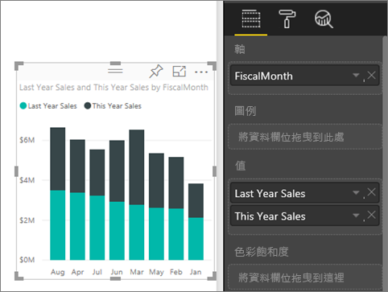
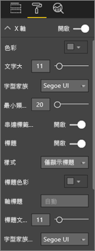
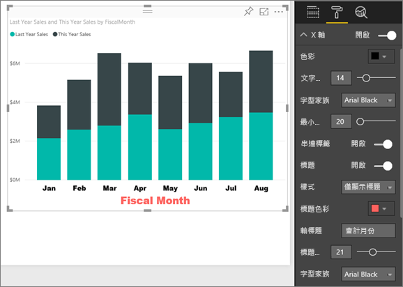
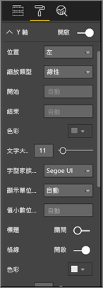
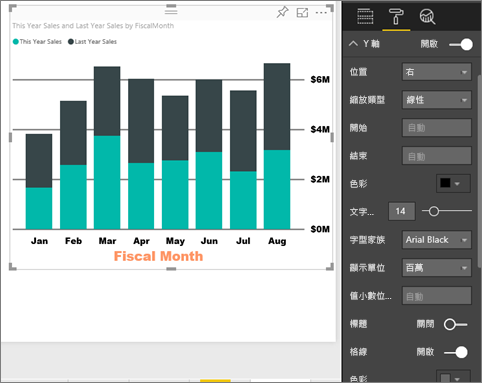
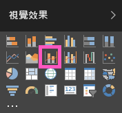
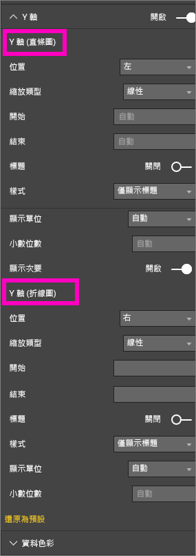
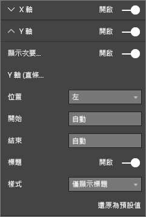

# 自訂 X 軸和 Y 軸屬性
本教學課程中，您將學到許多不同的方法，可以用來自訂視覺效果的 X 軸和 Y 軸。 並非所有視覺效果都擁有座標軸或可以自訂；例如，圓餅圖沒有軸。 且自訂選項將隨視覺效果而異，一篇文章無法涵蓋太多選項。 因此，我們將探討一些最常用的軸自訂項目，並使用Power BI 報表畫布中的視覺格式設定索引標籤以輕鬆解說。  

> [!NOTE]
> 此頁面適用於 Power BI 服務和 Power BI Desktop。 Power BI Desktop 也會提供選取 [格式] \(滾筒刷圖示 ) 時可用的自訂項目。  
>
>

觀看 Amanda 自訂 X 和 Y 軸，示範使用向上鑽研和向下鑽研時的各種串連控制方式。 然後按照以下影片的逐步指示，使用零售分析範例親自試試看。

<iframe width="560" height="315" src="https://www.youtube.com/embed/9DeAKM4SNJM" frameborder="0" allowfullscreen></iframe>

## 自訂報表中的視覺效果 X 軸
## 建立堆疊圖表視覺效果
登入 Power BI 服務，然後在[編輯檢視](service-interact-with-a-report-in-editing-view.md)開啟 [零售分析範例] 報表。 如果要跟著做，請[連接到零售分析範例](sample-datasets.md)。

1. 建立依會計月份顯示本年度和去年度銷售額的新直條圖。
2. 轉換成堆疊直條圖。

    

## 自訂 X 軸
1. 在 [視覺效果] 和 [篩選條件] 窗格中，選取 [格式] \(滾筒刷圖示 ) 以顯示自訂選項。
2. 展開 X 軸選項。

   
3. 選取 \[開啟] \(或 [關閉]) 滑桿，以開啟 X 軸或關閉。 現在請將其保持 [開啟] 。  您可能會為了保留空間給更多資料而關閉 X 軸。

    
4. 格式化文字色彩、大小和字型。 在此範例中，我們將文字的 [色彩] 設定為黑色，將 [文字大小] 設定為 14，並將 [字型] 設定為 Arial Black。  
5. 將 X 軸標題設為 [開啟] 並顯示 X 軸名稱，在此情況下為 **FiscalMonth**。  
6. 格式化標題文字色彩、大小和字型。  在此範例中，我們將 [標題色彩] 設定為橙色，將 [軸標題] 變更為 [會計月份]，並將 [標題文字大小] 設定為 21。
7. 若要依 FiscalMonth 排序，請選取圖表右上角的省略符號 (...)，然後選取 [依 FiscalMonth 排序]。

    在進行所有自訂之後，直條圖看起來應該類似這樣：

     

若要還原到目前為止所做過的所有 X 軸自訂，請選取 [X 軸] 自訂窗格底部的 [還原為預設值]。

## 自訂 Y 軸
1. 展開 Y 軸選項。

   

2. 選取 [開啟]\(或 [關閉]) 滑桿，以開啟或關閉 Y 軸。 現在請將其保持 [開啟] 。  您可能會為了保留空間給更多資料而關閉 Y 軸。
   
    
3. 將 Y 軸**位置**向右移。
4. 格式化文字色彩、大小和字型。 在此範例中，我們將文字的 [色彩] 設定為黑色，將 [文字大小] 設定為 14，並將 [字型] 設定為 Arial Black。  
5. 保持 [顯示單位] 設定為 [百萬]，並將 [值小數位數] 設定為零。
6. 對於此視覺效果，具有 Y 軸標題並不會改善視覺效果，因此將 [標題] 保持為 [關閉]。  
7. 將 [色彩] 變更為深灰色，並將 [筆觸] 增加到 2，讓格線更明顯。

    在進行所有自訂之後，直條圖看起來應該類似這樣：

     

## 使用雙重 Y 軸的自訂視覺效果
首先您要建立組合圖，其中探討門市計數對銷售的影響。  這和[組合圖教學課程](power-bi-visualization-combo-chart.md)中所建立的是相同的圖表。 然後您將格式化雙重 Y 軸。

### 建立具有兩個 Y 軸的圖表
1. 建立依 [時間] > [FiscalMonth] 追蹤 [銷售額] > [去年毛利率 %] 的新折線圖。
2. 選取省略符號 (...) 後選擇 [依月份排序]，按照月份為視覺效果排序

    

>[NOTE]: For help sorting by month, see [sorting by other criteria](power-bi-report-change-sort.md#other)
1. 一月的 GM% 為 35%，尖峰在 4 月為 45%，於 7 月下降並再次於 8 月達到尖峰。 我們去年和今年會看到類似的銷售模式嗎？
2. 將 [今年度銷售額 > 值] 和 [去年度銷售額] 新增至折線圖。 [去年 GM %] 的刻度 (沿著 0M% 格線的藍線) 遠小於 [銷售額] 的刻度，因此難以比較。 此外，Y 軸標籤百分比看起來很荒謬。      

   
5. 若要使視覺效果更容易閱讀及解譯，請將折線圖轉換成折線與堆疊直條圖。

   

6. 將 [去年毛利率 %] 從 [資料行值] 拖曳到 [行值]。 我們現在有先前建立的堆疊直條圖加上折線圖。  (選擇性地利用先前學到的內容來格式化軸字型色彩和大小)。
   

   Power BI 會建立兩個軸，因此可用不同方式調整資料集；左邊的量值為金額，而右邊的量值則為百分比。

   

### 設定次要 Y 軸的格式
1. 在 [視覺效果] 窗格中，選取滾筒刷圖示以顯示格式化選項。
2. 選取向下箭號，展開 Y 軸選項。
3. 捲動清單，直到您找到 [顯示次要] 的選項。 將 [顯示次要] 從 [關閉] 切換為 [開啟]。

   

   
4. (選擇性) 自訂兩個軸。 如果您切換欄軸或行軸的 [位置]，這兩個軸就會換邊。

   

### 將標題加入兩軸
因為這個視覺效果如此複雜，最好先加入軸標題。  標題可幫助您的同事了解視覺效果的內容。

1. 將 **Y 軸 (欄)** 及 **Y 軸 (行)** 的 [標題] 切換為 [開啟]。
2. 將 [樣式]  設定為 [僅顯示標題] 。

   
3. 組合圖現在顯示雙座標軸及其標題。

   

如需詳細資訊，請參閱[色彩格式、標籤與軸屬性的秘訣和訣竅](service-tips-and-tricks-for-color-formatting.md)。

## 考量與疑難排解
如果報表擁有者將 X 軸分類為資料類型，[類型] 選項就會顯示，以供您在連續或類別目錄之間選取。

## 後續步驟
深入了解 [Power BI 報表中的視覺效果](power-bi-report-visualizations.md)

[自訂](power-bi-visualization-customize-title-background-and-legend.md)[標題、背景和圖例](power-bi-visualization-customize-title-background-and-legend.md)

[自訂色彩和軸屬性](service-getting-started-with-color-formatting-and-axis-properties.md)

[Power BI - 基本概念](service-basic-concepts.md)

有其他問題嗎？ [試試 Power BI 社群](http://community.powerbi.com/)
