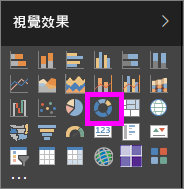
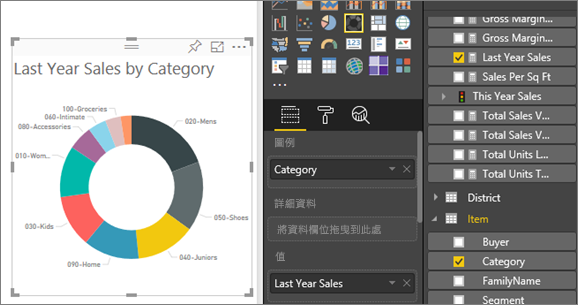

# Power BI 中的環圈圖
環圈圖類似於圓形圖之處，在於它會顯示部分與整體的關聯性。 唯一的差別在於，中央為空白，且保留空間給標籤或圖示。

## 建立環圈圖
這些指示會使用「零售分析範例」來建立環圈圖，依類別顯示今年度銷售量。 若要跟著做，請針對 Power BI 服務 (app.powerbi.com) 或 Power BI Desktop [下載範例](sample-datasets.md)。

1. 從[空白報告頁面](power-bi-report-add-page.md)開始，選取 [SalesStage] \> [銷售階段] 欄位。 如果您使用 Power BI 服務，請務必在[編輯檢視](service-interact-with-a-report-in-editing-view.md)中開啟報告。

2. 從 [欄位] 窗格中，選取 [銷售額] \> [去年度銷售額]。  
   
3. 從 [視覺效果] 窗格中，選取環圈圖的圖示 ，以將橫條圖轉換成環圈圖。 如果 [值] 區域中沒有 [去年度銷售額]，請將其拖曳到該區域。
     
   

4. 選取 [項目] \> [類別]，將其加入 [圖例] 區域。 
     
    

5. 選擇性地[調整圖表文字的大小和色彩](power-bi-visualization-customize-title-background-and-legend.md)。 

## 考量與疑難排解
* 環圈圖圖表值的總和必須達 100%。
* 太多的類別讓您難以讀取和解譯。
* 環圈圖最適合用來比較特定部分與整體，而不是在個別部分彼此之間比較。 

## 後續步驟
[Power BI 中的報表](service-reports.md)

[Power BI 中的視覺效果類型](power-bi-visualization-types-for-reports-and-q-and-a.md)

[Power BI 報表的視覺效果](power-bi-report-visualizations.md)

[Power BI - 基本概念](service-basic-concepts.md)

有其他問題嗎？ [試試 Power BI 社群](http://community.powerbi.com/)

