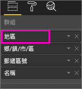
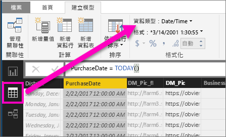

# 向下鑽研 Power BI 的視覺效果
## 向下鑽研需要階層
當視覺效果有階層時，您可以向下鑽研以顯示其他詳細資料。 例如，您可能必須有一個視覺效果，它會以運動、專業領域和活動所構成的階層，查看奧運獎牌計數。 根據預設，視覺效果會依運動 (體操、滑雪、水上運動等) 顯示獎牌計數。 但是因為它有階層，選取其中一個視覺項目 (例如橫條、線條或泡泡) 會顯示越來越詳細的圖片。 選取 [水上運動] 項目，查看游泳、跳水和水球的資料。  選取 [跳水] 項目，查看跳板、平台和同時跳水活動的詳細資料。

您可以新增階層到您擁有的報表，但是不能新增到與您共用的報表。
不確定哪些 Power BI 視覺效果包含階層？  將滑鼠停駐在視覺效果上，如果您在上方角落看到這些鑽研控制項，您的視覺效果即具有階層。

    
   

日期是獨特的階層類型。 當您將日期欄位新增到視覺效果時，Power BI 會自動新增包含年、季、月和日的時間階層。 如需詳細資訊，請參閱[視覺效果階層和向下鑽研行為](guided-learning/visualizations.yml?tutorial-step=18)或觀看以下影片。

  <iframe width="560" height="315" src="https://www.youtube.com/embed/MNAaHw4PxzE?list=PL1N57mwBHtN0JFoKSR0n-tBkUJHeMP2cP" frameborder="0" allowfullscreen></iframe>

> [!NOTE]
> 若要了解如何使用 Power BI Desktop 來建立階層，請觀賞影片 - [如何建立及新增階層](https://youtu.be/q8WDUAiTGeU)
> 
> 

## 兩種向下鑽研的方法
您有兩種不同的方法，可以向下切入 (及向上切入) 視覺效果。  本文將說明這兩種方法。 這兩種方法能達到相同的結果，因此您可以使用最喜愛的任何一種方法。

> [!NOTE]
> 如果要跟著做，請在 Power BI 服務中[開啟零售分析範例](sample-datasets.md)並建立矩形式樹狀結構圖，依**國家/地區**、**城市**、**郵遞區號**和**名稱** (群組) 來查看**今年的總單位數** (值)。  
> 
> 

## 向下切入的方法一
這個方法會使用視覺效果本身上方角落出現的鑽研圖示。

1. 在 Power BI 中，以[閱讀檢視或編輯檢視](service-reading-view-and-editing-view.md)開啟報表。 鑽研的視覺效果需要有階層。 
   
   階層會顯示在下列動畫中。  視覺效果具有由國家/地區、城市、郵遞區號和城市名稱組成的階層。 每個國家/地區有一或多個城市，每個城市有一或多個郵遞區號等等。 根據預設，視覺效果只會顯示國家/地區資料，因為「國家/地區」最先出現在清單中。
   
   
2. 若要啟用向下切入，請選取視覺效果右上角的箭號圖示。 深色圖示表示已啟用鑽研。 如果您不開啟鑽研，則選取視覺項目 (例如橫條圖和泡泡圖) 將會交叉篩選報表頁面上的其他圖表。    
   
   
3. 若要**一次向下切入一個欄位**，請在視覺效果中選取其中一個項目。 在橫條圖中，這表示按一下其中一個橫條。 在矩形式樹狀結構圖中，這表示按一下其中一個**葉子**。 請注意當您向下鑽研並重新往回時，標題會變更。 在此動畫中，它會從「國家/地區的今年總單位數」變更到「國家/地區和城市的今年總單位數」、「國家/地區、城市和郵遞區號的今年總單位數」，最後到「國家/地區、城市、郵遞區號和名稱的今年總單位數」。 若要回頭向上切入，請選取視覺效果左上角的**向上切入**圖示，如下所示。
   
   
4. 若要***一次向下切入所有欄位***，請選取視覺效果左上角的雙箭號。
   
   
5. 若要回頭向上切入，請選取視覺效果左上角的向上箭號。
   
   

## 向下切入的方法二
這個方法會使用上方 Power BI 功能表列的 [瀏覽] 下拉式清單。

1. 在 Power BI 中，以[閱讀檢視或編輯檢視](service-reading-view-and-editing-view.md)開啟報表。 鑽研的視覺效果需要有階層。 
   
   階層會顯示在下圖中。  視覺效果具有由國家/地區、城市、郵遞區號和城市名稱組成的階層。 每個國家/地區有一或多個城市，每個城市有一或多個郵遞區號等等。 根據預設，視覺效果只會顯示國家/地區資料，因為「國家/地區」最先出現在清單中。
   
   
2. 若要啟用向下切入，請選取視覺效果，讓它成為使用中，然後從 Power BI 上方功能表列選取 [瀏覽] > [向下切入]。 視覺效果右上角的向下切入圖示會變更為黑色背景。   
   
   
3. 啟用後，選取其中一個矩形式樹狀結構圖葉子，即可一次向下鑽研一個欄位。 在此範例中，已選取名為 **NC** 的國家/地區，依城市查看今年北卡羅來那州的總銷售單位數。
   
   
4. 若要一次向下鑽研所有欄位，請選取 [瀏覽] > [顯示下一個層級]。
   
   
5. 若要回頭向上鑽研，請選取 [瀏覽] > [向上鑽研]。
   
   

6. 若要查看用來建立視覺效果的資料，請選取 [查看資料]。 資料會顯示在視覺效果下方的窗格中。 當您繼續鑽研視覺效果時，此窗格會保持開啟。 如需詳細資訊，請參閱[顯示用來建立視覺效果的資料](service-reports-show-data.md)。

## 了解階層軸和階層群組
您可以將階層軸和階層群組視為可用來增加及減少您想要檢視的資料之資料粒度的機制。 任何可組織成類別和子類別的資料都適合具有階層。 當然，這包括日期和時間。

您可以在 Power BI 中建立具有階層的視覺效果，方法是選取一或多個要新增至 [軸] 區或 [群組] 區的資料欄位，並在 [值] 區中包含您要作為資料欄位查看的資料。 您可以透過視覺效果左上角和右上角是否出現切入模式圖示，來判斷資料是否為階層式。 

基本上，您可以將階層式資料簡單分為兩種類型：
- 日期和時間資料 - 如果您有 DateTime 資料類型的資料欄位，則表示您已有階層式資料。 Power BI 會自動為其值可剖析成 [DateTime](https://msdn.microsoft.com/library/system.datetime.aspx) 結構的任何資料欄位建立階層。 您只需要將一個 DateTime 欄位新增至 [軸] 或 [群組] 區。
- 類別目錄資料 - 如果您的資料所衍生的集合包含子集合，或具有共用通用值的資料列，則表示您已有階層式資料。

Power BI 可讓您一次展開一個子集，或一次展開所有子集。 您可以向下切入資料，以查看每個層級的單一子集，或同時查看每個層級的所有子集。 例如，您可以向下切入特定年份，或在階層中一面往下一面查看每年的所有結果。 相反地，您可以利用相同的方式向上切入。

下列各節描述從最高層檢視向下切入到中間層檢視，再到最底層檢視。

### 階層式資料和時間資料
在此範例中，遵循[零售分析範例](sample-datasets.md)，並建立堆疊直條圖視覺效果，依 [總銷售量] (值) 查看 [月份] (軸)。  

即使 [軸] 資料欄位是 [月份]，它仍會在 [軸] 區中建立 [年份] 類別。 這是因為 Power BI 針對所讀取的所有值，都會提供完整的 DateTime 結構。 階層最上層顯示該年的資料。

開啟向下切入模式後，按一下圖表中的橫條即可下移一層階層。 您會看到三個橫條代表可用季度的資料。 然後從左上方圖示，選擇 [向下一個階層等級展開全部]。 再執行一次，抵達階層的最底層，以顯示每個月的結果。

除了視覺效果，我們還會看到每份報表呈現資料中所反映的階層。 下表顯示從單一月份或所有月份向下切入的報表中 [顯示資料] 的結果。 

請注意，季度報表與年度報表的資料會相同，但在您向下切入至針對 [值] 所指定的詳細等級之後，您會看到單一報表變得更具體，而「所有月份」報表則有更多資料。

|展開模式|年|季|月|天|
| ---|:---:|:---:|:---:|---|
|單一|||||
|全部|||||

### 階層式類別目錄資料
來自集合與子集合的模型化資料是階層式資料。 一個很好的範例是位置資料。 假設資料來源中有一個資料表，其資料行包括國家/地區、州/省、城市和郵遞區號。 共用相同國家/地區、州/省和城市的資料是階層式資料。

在此範例中，遵循[零售分析範例](sample-datasets.md)進行。 建立堆疊直條圖視覺效果，依 [國家/地區]、[城市]、[郵遞區號] 和 [名稱] (群組) 查看 [今年總單位數] (值)。  

開啟向下切入模式後，從左上方圖示，選擇 [向下一個階層等級展開全部] 三次。
您應該會抵達階層的最底層，以顯示國家/地區、城市和郵遞區號的結果。

除了視覺效果，我們還會看到每份報表呈現資料中所反映的階層。 下表顯示向下切入單一國家/地區或所有國家/地區的報表中 [顯示資料] 的結果。 當您向下切入時，您會看到單一報表變得更具體，而「所有國家/地區」報表則有更多資料。

| 展開模式|地區|鄉/鎮/市/區|郵遞區號|名稱|
| ---|:---:|:---:|:---:|---|
|單一|||||
|全部|||||

## 考量與限制
* 如果將日期欄位新增至視覺效果不會建立階層，可能是因為「日期」欄位實際上不是儲存為日期。 如果您擁有資料集，請在 Power BI Desktop 的 [資料] 檢視中開啟它，選取包含日期的資料行，然後在 [模型] 索引標籤中將 [資料類型] 變更為 [日期] 或 [日期/時間]。 如果報表已與您共用，請連絡擁有者以要求變更。  
  
  

## 後續步驟
[Power BI 報表的視覺效果](power-bi-report-visualizations.md)

[Power BI 報表](service-reports.md)

[Power BI - 基本概念](service-basic-concepts.md)

有其他問題嗎？ [試試 Power BI 社群](http://community.powerbi.com/)

