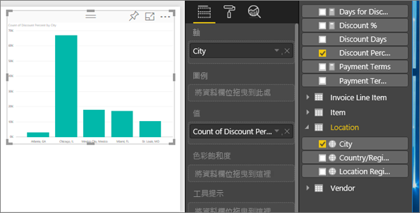
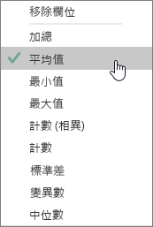
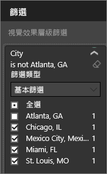
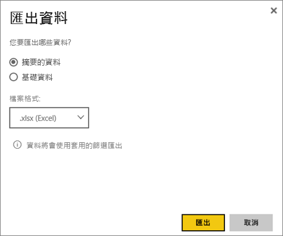

# 從視覺效果匯出資料
如果您想要查看用來建立視覺效果的資料，可以[在 Power BI 中顯示該資料](service-reports-show-data.md)或將資料匯出至 Excel 成為 .xlsx 或 .csv 檔案。   

觀看 Will 從其報表的其中一個視覺效果中匯出資料、將資料儲存為 .xlsx 檔案，並在 Excel 中開啟它。 然後遵循影片下方的逐步指示親自試試看。

<iframe width="560" height="315" src="https://www.youtube.com/embed/KjheMTGjDXw" frameborder="0" allowfullscreen></iframe>

## 從 Power BI 儀表板上的視覺效果
1. 選取視覺效果右上角的省略符號。
   
    
2. 選擇**匯出資料**圖示。
   
    
3. 資料會匯出到 .csv 檔案。 如果篩選了視覺效果，則也會篩選下載的資料。
4. 您的瀏覽器會提示您儲存檔案。  儲存之後，請在 Excel 中開啟 .csv 檔案。
   
    

## 從報表中的視覺效果
若要跟著做，請在[編輯檢視](service-reading-view-and-editing-view.md)中開啟[採購分析範例報表](sample-procurement.md)。 [新增空白的報表頁面](power-bi-report-add-page.md)。 然後遵循下列步驟來新增彙總及視覺效果層級篩選。

1. 建立新的直條圖。  從 [欄位] 窗格，選取 [位置] > [城市] 和 [發票] > [折扣百分比]。  您可能必須將**折扣百分比**移到 [值] 中。 
   
    
2. 將 [折扣百分比] 的彙總從 [計數] 變更為 [平均]。 在 [值] 中，選取 [折扣百分比] 右邊的箭號 (可能是 [折扣百分比計數])，然後選擇 [平均]。
   
    
3. 新增篩選至 [城市] 以移除 [亞特蘭大]。
   
   
   
   現在我們已經準備好試用這兩個選項來匯出資料。
4. 選取視覺效果右上角的省略符號。 選擇 [匯出資料]。
   
   
5. 如果您的視覺效果有彙總 (其中一個範例就是如果您將 [計數] 變更為 [平均]、[總和] 或 [最小])，您將有兩個選項︰[摘要的資料] 和 [基礎資料]。 如需了解彙總的協助，請參閱 [Power BI 中的彙總](service-aggregates.md)。
   
    
6. 選取 [摘要的資料] > [匯出] 並選擇 .xlsx 或 .csv。 Power BI 會匯出資料。  如果您已套用篩選至視覺效果，匯出的資料會匯出為已篩選。 當您選取 [匯出] 時，瀏覽器會提示您儲存檔案。 儲存之後，請在 Excel 中開啟檔案。
   
   **摘要的資料**︰如果您沒有彙總，或是您具有彙總，但不想要看到完整的詳細資訊，請選取此選項。 例如，如果您有顯示 4 個橫條的橫條圖，就會取得 4 列的資料。 摘要的資料會以 .xlsx 和 .csv 提供。
   
   在此範例中，我們的 Excel 匯出會顯示每個城市的總計。 因為我們篩選掉了亞特蘭大，所以它不包含在結果中。  試算表的第一列會顯示在從 Power BI 擷取資料時所使用的篩選。
   
   
7. 現在請嘗試選取 [基礎資料] > [匯出]，然後選擇 .xlsx。 Power BI 會匯出資料。 如果您已套用篩選至視覺效果，匯出的資料會匯出為已篩選。 當您選取 [匯出] 時，瀏覽器會提示您儲存檔案。 儲存之後，請在 Excel 中開啟檔案。
   
   >[!WARNING]
   >匯出基礎資料可讓使用者查看所有詳細資料 -- 資料中的每個資料行。 Power BI 服務系統管理員可以替組織關閉這項功能。 如果您是資料集擁有者，您可以將專屬資料行設定為 [隱藏]，它們就不會顯示在 Desktop 或 Power BI 服務的 [欄位] 清單中。
   
   
   **基礎資料**︰如果您的視覺效果具有彙總，而且您想要查看所有基礎詳細資料，請選取此選項。 基本上，選取 [基礎資料] 會移除彙總。 當您選取 [匯出] 時，資料會匯出到 .xlsx 檔案，且您的瀏覽器會提示您儲存檔案。 儲存之後，請在 Excel 中開啟檔案。
   
   在此範例中，我們的 Excel 匯出會為資料集裡的每個城市資料列顯示一個資料列，以及該單一項目的折扣百分比。 換句話說，資料會扁平化，而且不會彙總。 試算表的第一列會顯示在從 Power BI 擷取資料時所使用的篩選。  
   
   

## 限制與考量
* 可從 **Power BI Desktop** 和 **Power BI 服務**匯出至 .csv 的資料列數上限為 30,000。
* 可匯出至 .xlsx 的資料列數上限為 150,000。
* 使用「基礎資料」匯出將無法運作，如果資料來源是 Analysis Services 即時連線，而版本早於 2016 且模型中的資料表沒有唯一的索引鍵。  
* 使用「基礎資料」匯出將無法運作，如果已針對匯出中的視覺效果啟用「顯示沒有資料的項目」選項。
* 使用 DirectQuery 時，可匯出的最大資料量為 16 MB。 這可能會導致匯出的資料列數小於上限，特別是如果有許多資料行、有難以壓縮的資料，以及有導致增加檔案大小並減少所匯出資料列數的其他因素。
* Power BI 僅在使用基本彙總的視覺效果中支援匯出。 使用模型或報表量值的視覺效果無法進行匯出。
* 目前不支援自訂視覺效果和 R 視覺效果。
* 如果使用者在組織外部，並使用與他們共用的儀表板，即無法匯出資料。 
* 如果 .csv 檔案中有 Unicode 字元，Excel 中的文字可能無法正常顯示。 不過，以 [記事本] 開啟則會正常顯示。 Unicode 的範例包括貨幣符號和外文。 您可以將 csv 匯入 Excel，而不是直接開啟 csv，以解決這個問題。 若要這樣做：
  
  1. 開啟 Excel
  2. 從 [資料] 索引標籤選取 [取得外部資料] > [從文字]。
* Power BI 系統管理員可以停用匯出資料。

## 後續步驟
[Power BI 中的儀表板](service-dashboards.md)  
[Power BI 中的報表](service-reports.md)  
[Power BI - 基本概念](service-basic-concepts.md)

有其他問題嗎？ [嘗試在 Power BI 社群提問](http://community.powerbi.com/)

