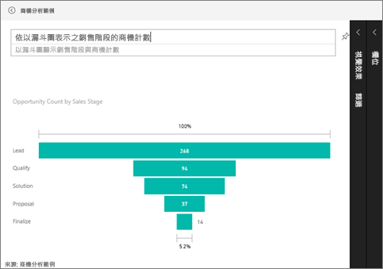

# 漏斗圖 (教學課程)
漏斗圖幫您將有循序連接階段的線性程序視覺化。 例如，銷售漏斗圖透過以下階段追蹤客戶：潛在客戶 \> 合格的潛在客戶 \> 期望 \> 合約 \> 結案。  漏斗圖的圖形一看就能表達出您追蹤中程序的健全狀況。

漏斗圖的每個階段代表總數中所佔的百分比。 因此，在大部分情況下，漏斗圖形狀像漏斗 -- 第一階段最大，然後每個後續階段比前一階段小。  梨狀的漏斗圖也很實用，能識別出程序中的問題。  但通常第一階段，也就是「引入」階段佔最大部分。

## 使用漏斗圖的時機
漏斗圖極適合：

* 當資料具有循序性，並至少通過 4 個以上的階段時。
* 當第一階段「項目」數目預期大於最後階段的數目時。
* 當您要分階段計算潛在項目 (營收/銷售額/成交量/等等) 時。
* 當您要計算及追蹤轉換率和留客率時。
* 當您要顯示線性程序中的瓶頸時。
* 當您要追蹤購物車的工作流程時。
* 當您要追蹤點選連結廣告/行銷活動的進度及成功與否時。

## 使用漏斗圖
漏斗圖：

* 可以從報表及問與答釘選。
* 可以進行排序。
* 支援多個圖表。
* 可以在相同報表頁面上，藉由其他視覺效果反白顯示及交叉篩選。
* 可以在相同報表頁面上，用於反白顯示及交叉篩選其他視覺效果。

## 建立基本漏斗圖
觀賞這段影片，了解 Will 如何使用銷售與行銷範例來建立漏斗圖。

<iframe width="560" height="315" src="https://www.youtube.com/embed/maTzOJSRB3g" frameborder="0" allowfullscreen></iframe>

現在建立您自己的漏斗圖，其中可顯示每個銷售階段中擁有的商機數。

這些指示會使用商機分析範例。 如果要跟著做，請[下載範例](sample-datasets.md)、登入 Power BI，然後選取 [取得資料] \> [範例] \> [商機分析範例] \> [連接]。

1. 在 [編輯檢視](service-interact-with-a-report-in-editing-view.md) 中，從[空白報表頁面](power-bi-report-add-page.md)開始，選取 [SalesStage] \> [銷售階段] 欄位。  
   
    
2. [將圖表轉換](power-bi-report-change-visualization-type.md)成漏斗圖。 請注意，[銷售階段]  良好地位於 [群組]  井中。 
3. 從 [欄位] 窗格，選取 [事實] \> [商機計數]。
   
    
4. 暫留在列上會顯示豐富的資訊。
   
   * 階段名稱
   * 此階段目前商機數
   * 整體轉換率 (潛在客戶 %) 
   * 至下一階段 (也稱為下滑率)，是前一階段的 % (在本案例中是提案階段/解決方案階段)
     
     
5. [將漏斗圖加入為儀表板磚](service-dashboard-tiles.md)。 
6. [儲存報表](service-report-save.md)。

## 反白顯示和交叉篩選
如需使用 [篩選] 窗格的資訊，請參閱[將篩選加入報表](power-bi-report-add-filter.md)。

在漏斗圖中反白顯示列，會篩選報表頁面上的其他視覺效果，反之亦然。 如果要跟著做，請將其他一些視覺效果加入包含漏斗圖的報表頁面中。

1. 在漏斗圖中選取 [提案] 列。 這會交叉醒目提示頁面上的其他視覺效果。 使用 CTRL 進行多重選取。
   
   
2. 若要設定視覺效果互相交叉醒目提示及交叉篩選之方式的喜好設定，請參閱[在 Power BI 中與視覺效果互動](service-reports-visual-interactions.md)

## 在問與答中建立漏斗圖
反白顯示已從 [商機追蹤] 資料集釘選了至少一個視覺效果的儀表板。  當您在問與答中輸入問題時，Power BI 從所有與所選的儀表板 (具有釘選圖格) 相關聯的資料集搜尋解答。 如需詳細資訊，請參閱 [Power BI - 基本概念](service-basic-concepts.md)。

1. 反白顯示已從 [商機追蹤] 資料集釘選了至少一個圖格的儀表板。
2. 開始在 [問與答] 問題方塊中輸入您的問題。
   
   
   
   請務必加入「做為漏斗圖」讓 Power BI 知道您偏好哪一種視覺效果。

## 後續步驟
[Power BI 中的視覺效果類型](power-bi-visualization-types-for-reports-and-q-and-a.md)

[將視覺效果釘選至儀表板](service-dashboard-pin-tile-from-report.md)

[Power BI - 基本概念](service-basic-concepts.md)

有其他問題嗎？ [試試 Power BI 社群](http://community.powerbi.com/)

