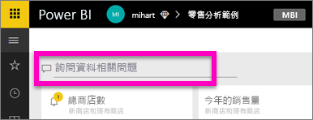
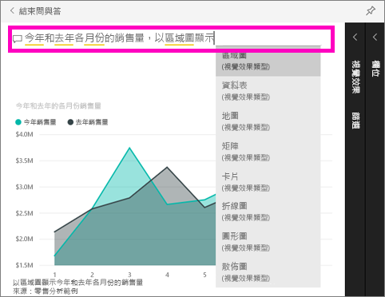

# 開始使用 Power BI 問與答 (快速入門)
## 使用 Power BI 問與答與零售分析範例
有時若要從您的資料獲得解答，最快的方法是使用自然語言詢問問題。  在本快速入門中，我們將探討由 2 種不同的方式來建立相同的視覺效果：第一種是在報表中建立，第二種則是在問與答中提問。 我們將使用 Power BI 服務，但使用 Power BI Desktop 的程序幾乎相同。

若要跟著做，您必須使用您可以編輯的報表，因此我們將使用 Power BI 提供的其中一個範例。

## 方法 1：使用報表編輯器
1. 從您的 Power BI 工作區選取 [Get Data] (取得資料) \> [範例] \> [零售分析範例]  >  [連接]。
   
    
2. 儀表板包含 [去年度銷售額和本年度銷售額] 區域圖的圖格。  選取此圖格。 
   
   * 如果此圖格是以問與答所建立，選取此圖格將開啟問與答。 
   * 但此圖格是在報表中建立，所以報表會開啟含有這個視覺效果的頁面。
3. 選取 [編輯報表] ，在 [編輯檢視] 中開啟報表。  如果您不是報表的擁有者，就不會有在 [編輯] 檢視中開啟報表的選項。
   
    
4. 選取區域圖，然後在 [欄位]  窗格中檢閱設定。  報表建立者選取了這 3 個值 ([Time > FiscalMonth] (時間 > 會計月份)、[Sales > This Year Sales] (銷售 > 本年度銷售額)、[Sales >Last Year Sales >Value] (銷售 > 去年度銷售額 > 值))，然後在 [軸] 與 [值] 庫中組織這些值，進而建立此圖表。
   
    

## 方法 2：使用問與答
我們要如何使用問與答建立與此相同的折線圖？

1. 巡覽回 [零售分析範例] 儀表板。
2. 在問題方塊中，使用自然語言輸入類似下列的內容：
   
   **今年各月份銷售額和去年各月份的銷售額，以區域圖顯示**
   
   當您輸入您的問題後，問與答會挑選最佳的視覺效果來顯示您的答案；而當您修改這個問題時，視覺效果就會動態改變。 問與答也可以用建議、自動完成及拼字校正，協助您建立問題。
   
   當您完成問題輸入後，結果會是我們在報表中所見完全相同的圖表。  但這種建立方式快很多！
   
   
3. 就如同處理報表時一樣，您可以在問與答內存取 [視覺效果]、[篩選] 和 [欄位] 窗格。  開啟這些窗格，即可進一步探索和修改您的視覺效果。
4. 若要將圖表釘選至儀表板，請選取釘選圖示 。

## 後續步驟
[Power BI 中的問與答](power-bi-q-and-a.md)

[讓資料適用於 Power BI 的問與答](service-prepare-data-for-q-and-a.md)

有其他問題嗎？ [試試 Power BI 社群](http://community.powerbi.com/)

