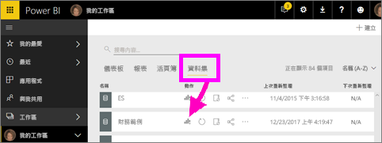
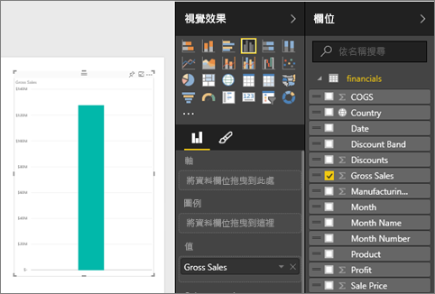
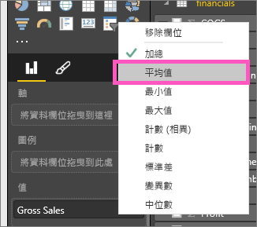
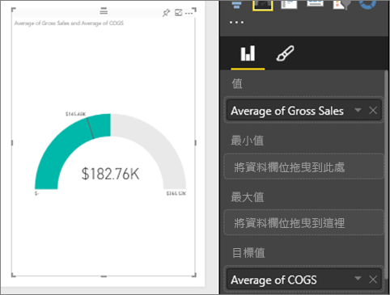
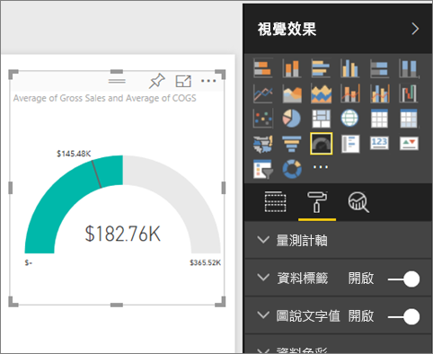
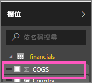
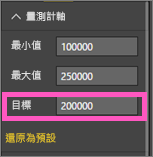

# Power BI 中的星形量測計圖表 (教學課程)
星形量測計圖表具有圓弧線段，並且會顯示針對某一目標/KPI 測量進度的單一值。  目標或目標值是由線條 (指針) 表示。 達到該目標的進度是由陰影表示。  代表該進度的值會以粗體顯示在弧線內。所有可能的值會從最小 (最左邊的值) 到最大 (最右邊的值) 平均分散在弧線上。

下列範例中，我們是汽車零售商，正在追蹤銷售團隊每個月的平均銷售額。 我們的目標是 140，以黑色指針代表。  最小的可能平均銷售量是 0，而我們將最大值設為 200。  藍色陰影顯示我們這個月的銷售量目前平均約為 120。 幸好我們還有一週的時間來達成目標。

## 使用星形量測計的時機
星形量測計極適合用來：

* 顯示目標的達成進度。
* 代表 KPI 等百分位數量值。
* 顯示單一量值的健全狀況。
* 顯示可快速掃描和了解的資訊。

### 先決條件
 - Power BI 服務或 Power BI Desktop
 - 財務範例 Excel 活頁簿：[直接下載範例](http://go.microsoft.com/fwlink/?LinkID=521962)。

## 建立基本的星形量測計
這些指示使用 Power BI 服務。 若要跟著做，請登入 Power BI 並開啟 Excel 財務範例檔案。  

或觀看 Will 說明如何建立單一計量的視覺效果︰量測計、卡片及 KPI。

<iframe width="560" height="315" src="https://www.youtube.com/embed/xmja6EpqaO0?list=PL1N57mwBHtN0JFoKSR0n-tBkUJHeMP2cP" frameborder="0" allowfullscreen></iframe>

### 步驟 1：開啟財務範例 Excel 檔案
1. 如果尚未這麼做，請[下載範例財務 Excel 檔案](sample-financial-download.md)。 請記住您儲存的位置。

2. 選取 [取得資料] \> [檔案] 並瀏覽至您儲存檔案的位置，在 [Power BI 服務] 中開啟檔案。 選取 [匯入]。 財務範例隨即加入工作區成為資料集。

3. 從 [資料集] 內容清單，選取 [財務範例]，在瀏覽模式中加以開啟。

    

### 步驟 2：建立追蹤總銷售額的量測計
1. 在 [欄位]  窗格中，選取 [總銷售額] 。
   
   
2. 將彙總變更為 [平均] 。
   
   
3. 選取量測計圖示  將直條圖轉換成量測計。
   
   Power BI 預設會建立量測計圖表，其中假設目前值 (在此案例中為平均總銷售額) 為量測計的中間點。 由於平均總銷售額是美金 $182.76K 元，開始值 (最小值) 設定為 0 且結束值 (最大值) 設定為目前值的兩倍。
   
   

### 步驟 3：設定目標值
1. 將 [COGS]  拖曳至 [目標值]  井。
2. 將彙總變更為 [平均] 。
   Power BI 會加入指針來代表我們的目標值：**$145.48K**。 請注意到我們已經超過目標。
   
   
   
   > [!NOTE]
   > 您也可以手動輸入目標值。  請參閱下方的＜使用格式化選項來手動設定最小值、最大值與目標值＞
   > 
   > 

### 步驟 4：設定最大值
在步驟 2 中，Power BI 會使用 [值] 欄位來自動設定最小值 (開始) 與最大值 (結束)。  但如果您想自行設定最大值該怎麼做？  假設您不想使用目前值的兩倍做為最大的可能值，而要將它設定為資料集裡最高的總銷售額數字？ 

1. 將 [總銷售額]  從 [欄位]  清單拖曳到 [最大值]  。
2. 將彙總變更為 [最大值] 。
   
   
   
   接著會以新的結束值 (總銷售額 121 萬) 重新繪製量測計。
   
   

### 步驟 5：儲存報表。
1. [儲存報表](service-report-save.md)。
2. [將量測計圖表加入為儀表板的磚](service-dashboard-tiles.md)。 

## 使用格式化選項來手動設定最小值、最大值與目標值
1. 將 [銷售額的最大值]  從 [最大值]  部分移除。
2. 選取油漆滾筒圖示，開啟格式化窗格。
   
   
3. 展開 [量測計軸]  並輸入 [最小]  與 [最大] 的值。
   
    
4. 移除 **COGS**旁的核取記號，以移除目前的目標值。
   
    
5. 當 [量測計軸]  下出現 [目標] 欄位時，請輸入值。
   
    
6. 可選擇繼續格式化量測計圖。

## 後續步驟
[Power BI 中的視覺效果類型](power-bi-visualization-types-for-reports-and-q-and-a.md)

[將視覺效果新增至報表](power-bi-report-add-visualizations-i.md)

[將視覺效果釘選至儀表板](service-dashboard-pin-tile-from-report.md)

[Power BI - 基本概念](service-basic-concepts.md)

有其他問題嗎？ [試試 Power BI 社群](http://community.powerbi.com/)

