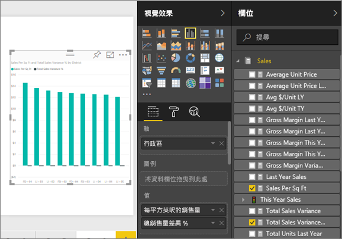
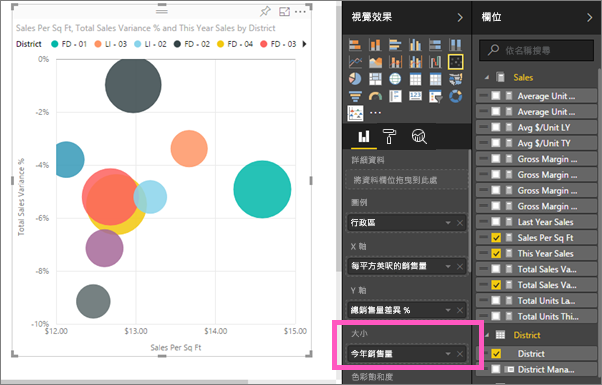
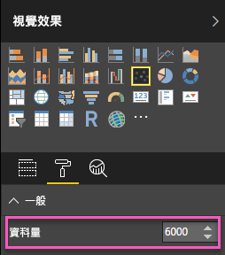
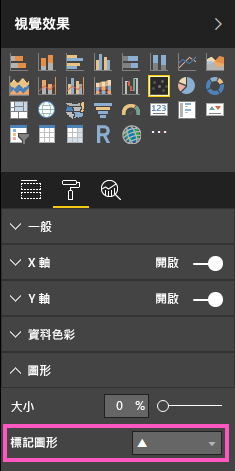
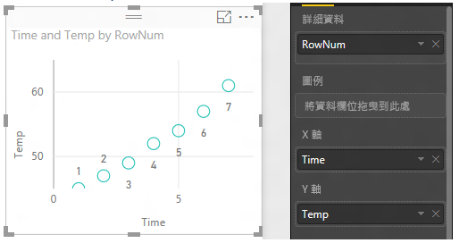
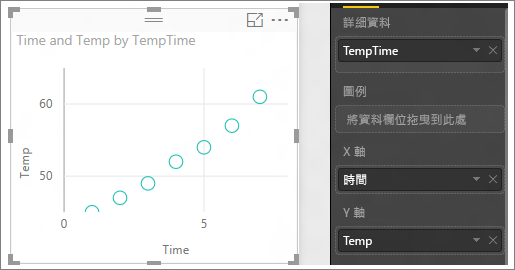

# Power BI 中的散佈圖與泡泡圖
散佈圖一律會有兩個值座標軸，沿著水平軸顯示一組數字資料，沿著垂直軸顯示另一組數值。 此圖表顯示 x 與 y 數交集處的點，結合這些值可形成單一的資料點。 視資料之不同，這些資料點可能平均散布或不平均地散佈在水平軸。

泡泡圖會將資料點以泡泡取代，而泡泡的「大小」代表其他維度的資料。

您可以設定資料點數目  

## 何時使用散佈圖或泡泡圖
### 散佈圖極適合：
* 顯示 2 (散佈圖) 或 3 (泡泡) **數值** 之間的關聯性。
* 將兩組數字繪製成一系列的 xy 座標。
* 當您想要變更水平軸的刻度時，取代折線圖。    
* 將水平軸轉為對數刻度。
* 顯示包含成對值或一組值的工作表資料。 在散佈圖中，您可以調整獨立的軸刻度，以顯示群組值的詳細資訊。
* 顯示大量資料的模式，例如，顯示線性或非線性趨勢、叢集與極端值。
* 比較大量資料點，而不考慮時間。  您在散佈圖中包含的資料越多，就能做出越好的比較。

### 泡泡圖極適合：
* 如果您的資料有 3 個資料數列，而每個數列包含一組值。
* 呈現財務數據。  不同的泡泡大小很適合以視覺化方式強調特定值。
* 與象限一起使用。

## 建立散佈圖
觀賞這段影片來了解 Will 如何建立散佈圖，然後依照下列步驟自行建立一個散佈圖。

<iframe width="560" height="315" src="https://www.youtube.com/embed/PVcfPoVE3Ys?list=PL1N57mwBHtN0JFoKSR0n-tBkUJHeMP2cP" frameborder="0" allowfullscreen></iframe>

這些指示使用零售分析範例。 若要跟著做，請針對 Power BI 服務 (app.powerbi.com) 或 Power BI Desktop [下載範例](sample-datasets.md)。   

1. 選取黃色加號圖示以建立[空白的報表頁面](power-bi-report-add-page.md)。
 
2. 從 [欄位] 窗格選取下列欄位：
   - [Sales] (銷售) > [Sales Per Sq Ft] (每平方英呎的銷售)
   - [Sales] (銷售) > [Total Sales Variance %] (總銷售差異 %)
   - [District] (區域) > District (區域)

    

    如果您使用 Power BI 服務，請務必在[編輯檢視](service-interact-with-a-report-in-editing-view.md)中開啟報告。

3. 轉換成散佈圖。 在 [視覺效果] 窗格中，選取散佈圖圖示。

   .

4. 將 [區域]  從 [詳細資料]  拖曳至 [圖例] 。 這會顯示沿著 Y 軸有繪製**總銷售差異 %** 的散佈圖，以及沿著 X 軸繪製**每平方英呎銷售**的散佈圖。 資料點色彩代表區域：

    

現在讓我們加入第三個維度。

## 建立泡泡圖

1. 從 [欄位] 窗格中，將 [銷售] > [本年度銷售] > [值] 拖曳至 [大小] 區域。 資料點會擴張為與銷售值成正比的數量。
   
   

2. 暫留在泡泡圖上。 泡泡的大小反映 **本年度銷售額**的值。
   
    

3. 若要設定泡泡圖中顯示的資料點數目，請在 [視覺效果] 窗格的 [格式] 區段中，展開 [一般] 卡片，並調整 [資料量]。 您可以將資料量上限設為任何大小，上限 10,000 (預設為 3500)。

     

   > [!NOTE]
   > 因為資料點越多可能表示載入時間越長，所以，如果您選擇發佈限制規模較高的報表，請務必在 Web 及行動裝置上測式該報表，以及確保效能符合使用者的期望。 注意，若資料點數目較多，您應以不同板型規格來測試結果，以確保效能良好。

4. 您可以將[格式、視覺效果色彩、標籤、標題、背景等項目格式化](service-getting-started-with-color-formatting-and-axis-properties.md)。 若要[改善協助工具](desktop-accessibility.md)，請考慮在每一行新增標記圖形。 為每一行使用不同的標記圖形，可讓取用者更容易地區分不同的行 (或區域)。 若要選取標記圖形，請展開 [圖形] 並選取標記圖形。

      

   您也可以將標記形狀變更為菱形、三角形或正方形：

   

## 考量與疑難排解

### **散佈圖只有一個資料點**
散佈圖有只有一個資料點，且彙總 X 軸與 Y 軸上的所有值嗎？  或其也許彙總單一水平或垂直線的所有值？

將欄位加入 [詳細資料]  區域，以告知 Power BI 如何將值分組。 此欄位對於您想要繪製的每個點都不得重複。  
像是簡單的資料列數目或 ID 欄位：

或者，如果您的資料中沒有它，請建立一個欄位，將 X 與 Y 值串連成每個點的獨特內容：

若要建立新的欄位，請[使用 Power BI Desktop 查詢編輯器新增索引資料行](desktop-add-custom-column.md)至資料集。  然後將本資料行加入您視覺效果的 [詳細資料] 區域。

## 後續步驟
 [Power BI 中的視覺效果類型](power-bi-visualization-types-for-reports-and-q-and-a.md)

[請試用 - 完全免費！](https://powerbi.com/)  

有其他問題嗎？ [試試 Power BI 社群](http://community.powerbi.com/)

