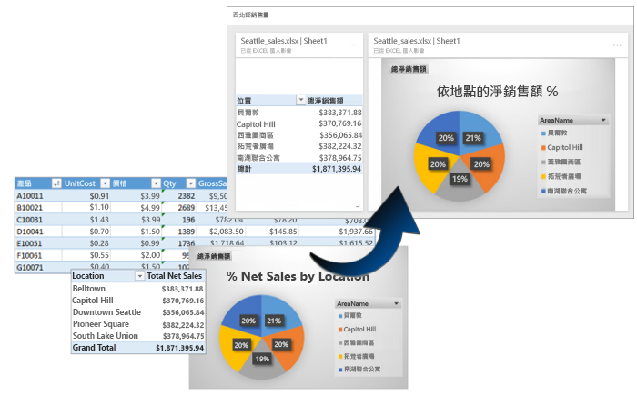
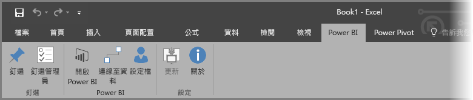
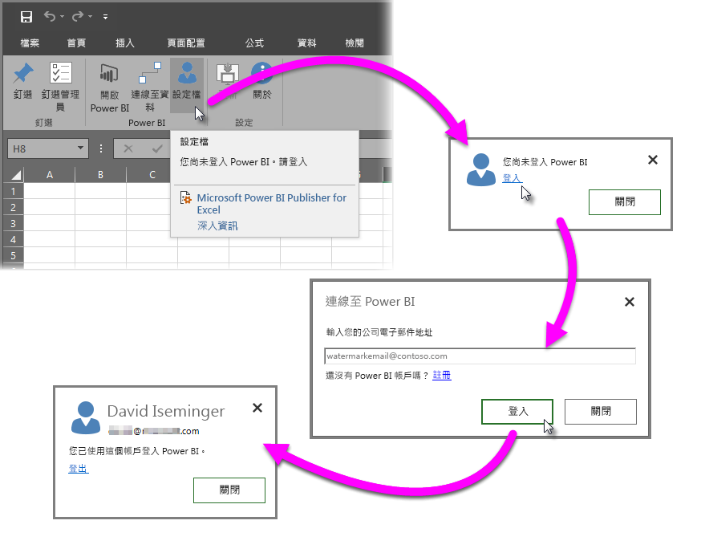
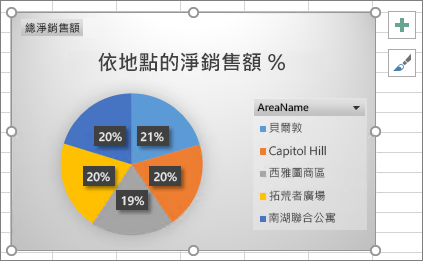
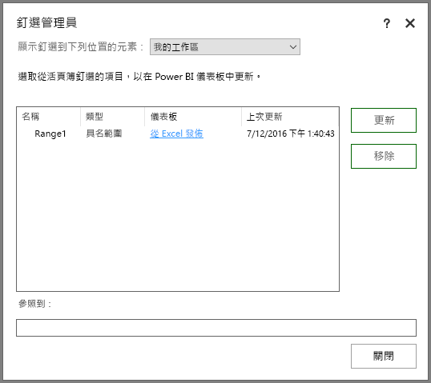
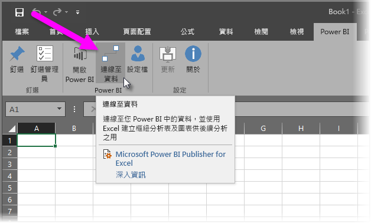
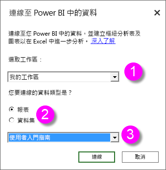
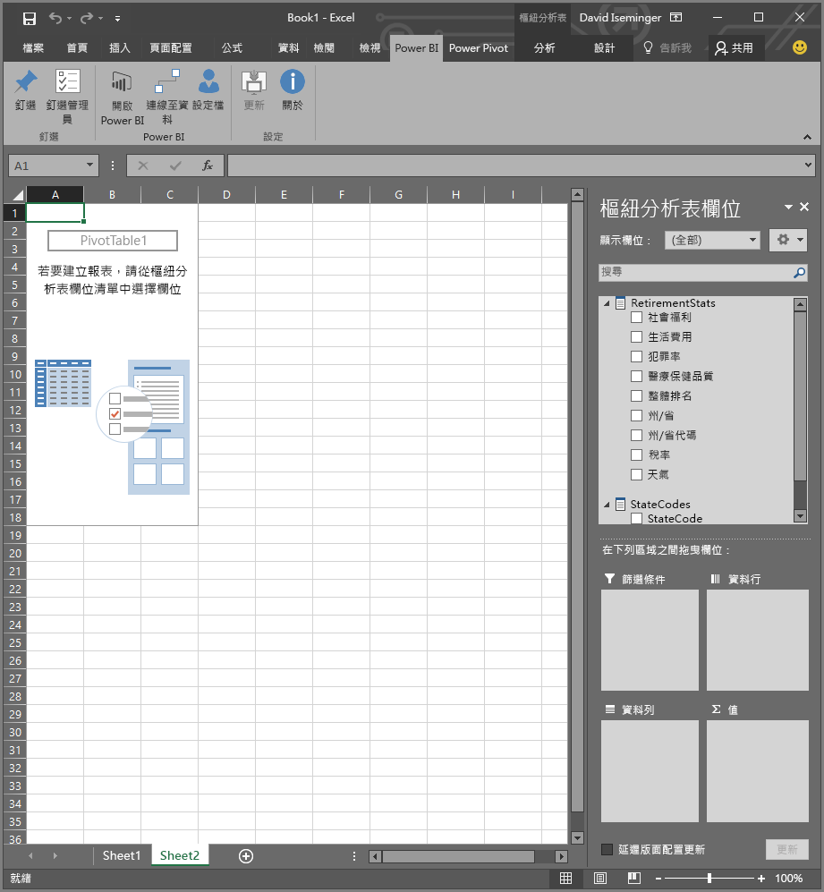
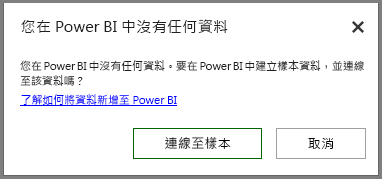

# Power BI publisher for Excel
有了 Microsoft **Power BI Publisher for Excel**，您就可以擷取 Excel 中最重要深入解析的快照集，像是樞紐分析表、樞紐分析圖和範圍，並將其釘選到 Power BI 中的儀表板。

您可以釘選什麼？ 幾乎 Excel 工作表中的所有項目。 您可以從簡單的工作表或資料表、樞紐分析表或樞紐分析圖、圖例和影像、文字等選取資料格範圍。

不能釘選的項目：您無法在 Power View 工作表中釘選 3D 地圖或視覺效果。 此外還有一些項目可以釘選，但可能不太適合，像是交叉分析篩選器或時間表篩選器。

當您釘選 Excel 中的項目時，會有新的磚加入 Power BI 中新的或現有儀表板。 新的磚是快照集，因此不屬於動態，但您仍然可以加以更新。 例如，若您對已釘選的圖表樞紐分析表或樞紐分析圖做出變更，Power BI 中儀表板的磚不會自動更新，但您仍然可以使用**釘選管理員**來更新已釘選的項目。 您會在下列各節中深入了解**釘選管理員**。

## 下載並安裝
您可以在桌面版的 Microsoft Excel 2007 及更新版本下載並安裝 Power BI Publisher for Excel 增益集。

[下載 Power BI Publisher for Excel](http://go.microsoft.com/fwlink/?LinkId=715729)

在您安裝 Publisher 後，就會在 Excel 內看到新的 **Power BI** 功能區，您可以在此登入 (或登出) Power BI、將項目釘選到儀表板以及管理已釘選的項目。

預設會啟用 **Power BI Publisher for Excel** 增益集，但如果您因為某些原因而沒有在 Excel 中看到 Power BI 功能區索引標籤，就必須加以啟用。 按一下 [檔案] >  > [選項] >  > [增益集] >  > [COM 增益集]。選取 [Microsoft Power BI Publisher for Excel]。

## 釘選一個範圍到儀表板
您可以從工作表選取任何範圍的資料格，然後將該範圍的快照集釘選到 Power BI 現有或新增的儀表板上。 您也可以將相同的快照集釘選到多個儀表板上。

開始前，請先確定您已登入 Power BI。

1. 從 Excel 的 [Power BI] 功能區索引標籤中選取 [設定檔]。 如已登入 Power BI，您會看到一個對話方塊，顯示您目前已登入的帳戶。 如果這是您想要使用的帳戶，很好，請前往下一組步驟釘選您的範圍。 如果您想要使用不同的 Power BI 帳戶，請選取 [登出]。 如果尚未登入，請前往下一個步驟 (步驟 2)。
   
   
2. 如果尚未登入，請選取 [登入] 連結：從 Excel 的 [Power BI] 功能區索引標籤中選取 [設定檔]，在 [連線到 Power BI] 對話方塊中輸入您想要使用的 Power BI 帳戶電子郵件地址，然後選取 [登入]。
   
   

登入後，請依照下列步驟將範圍釘選到儀表板：

1. 在 Excel 中，選取 [Power BI] 功能區索引標籤，即可看到 [釘選] 功能區按鈕。
2. 從 Excel 活頁簿中選取範圍。
3. 按一下 [Power BI] 功能區的 [釘選] 按鈕，顯示 [釘選至儀表板] 對話方塊。 如果您尚未登入 Power BI，系統會提示您登入。 在 [工作區] 下拉式清單中選取一個工作區。 如果您想要釘選到自己的儀表板，請確認已選取 [我的工作區]。 如果您想要釘選到群組工作區中的儀表板，請從下拉式清單中選取該群組。
4. 選擇要釘選至「現有的儀表板」或建立「新的儀表板」。
5. 按一下 [確定] 將您的選擇釘選到儀表板。
6. 在 [釘選到儀表板] 中，選取工作區中的現有儀表板或建立新的儀表板，然後按一下 [確定] 按鈕。
   
   

## 將圖表釘選到儀表板
只要在圖表上按一下，然後按一下釘選 。

## 管理已釘選的項目
有了**釘選管理員**，您可以更新 (重新整理) 在 Power BI 中已與磚建立關聯的已釘選項目。 對於已釘選到 Power BI 儀表板的項目，您也可以移除其間的釘選。

若要更新儀表板中的磚，請在 [釘選管理員] 中選取一或多個項目，然後選取 [更新]。

若要移除 Excel 中已釘選項目和儀表板中已建立關聯的磚之間的對應，請按一下 [移除]。 當您選取 [移除] 時，並「不會」從 Excel 中的工作表移除項目，也不會刪除儀表板中已建立關聯的磚。 您移除的是這兩者之間的釘選 (或稱「對應」)。 **釘選管理員**不會再顯示移除的項目。 如果您再次釘選該項目，則會以新磚的形式出現。

若要從儀表板移除已釘選的項目 (磚)，您將必須在 Power BI 中執行此動作。 在您要刪除的磚中，選取**開啟功能表**圖示 ，然後選取**刪除磚**圖示 。

## 連接至 Power BI 中的資料
從 2016 年 7 月發行的 **Power BI Publisher for Excel** 開始 (包括目前的版本，連結如上)，您可以直接連接至 Power BI 服務的資料，在 Excel 中使用樞紐分析表和樞紐分析圖分析該資料。 此功能可讓您輕鬆使用 Power BI 資料和 Excel，一起分析對您而言最重要的資料。

改善包括下列各項︰

* 任何需要連接至 Power BI 資料的驅動程式都會隨各版本自動更新，不必自行安裝或管理這些驅動程式。
* 您不用再下載 .odc 檔案來建立連線，**Power BI Publisher for Excel** 會在您選取要用的報表或資料集時自動建立連線。
* 現在可以在相同的活頁簿中建立多條連線和多份樞紐分析表
* 錯誤已改善且為 **Power BI Publisher for Excel** 專屬，而非使用預設的 Excel 訊息。

### 如何在 Excel 中連接至 Power BI 資料
若要使用 **Power BI Publisher for Excel** 連接至 Power BI 資料，請遵循下列簡易步驟︰

1. 確定已登入 Power BI。 本文前面已提供登入步驟 (或使用不同的帳戶登入)。
2. 以您要使用的帳戶登入 Power BI 後，請從 Excel 的 [Power BI] 功能區索引標籤中選取 [連接至資料]。
   
   
3. Excel 使用 HTTPS 連線連接至 Power BI，並顯示 [連線到 Power BI 中的資料] 對話方塊，您可以在此選取要選取資料的工作區 (1，如下圖)；要連線的「資料類型」，**報表**或**資料集** (2)；以及可供您選取要連接至哪個可用報表或資料集的下拉式清單 (3)。
   
   
4. 當您決定好，並從 [連線到 Power BI 中的資料] 對話方塊中選取 [連接] 時，Excel 會準備樞紐分析表並顯示 [樞紐分析表欄位] 窗格，在此您可以從連接的 Power BI 資料中選取欄位，並建立可協助分析資料的資料表或圖表。
   
   

如果您在 Power BI 中沒有任何資料，Excel 會偵測到這個狀況，並提議為您建立範例資料，供您連線及嘗試。

使用本版的 **Power BI Publisher for Excel** 需要考慮到幾件事：

* **共用資料**：[連接至資料] 不提供已與您共用，但未直接顯示在 Power BI 中的資料。
* **SSAS 內部部署**：如果您選取的資料集源自內部部署 SQL Server Analysis Services (SSAS)，而 Power BI 中的資料集使用 DirectQuery 存取資料，**Power BI Publisher for Excel** 會透過內部部署網路連線連接至該資料，而「不」經由 Power BI 連接至該資料。 如此，嘗試連線到這類資料集的所有使用者，都必須連接至內部部署網路，使用資料儲存所在 Analysis Services 執行個體採用的驗證方法驗證後，才能存取該資料。
* **必要驅動程式** - **Power BI Publisher for Excel** 會自動安裝所有必要的驅動程式，使這項功能運作。 適用於 Analysis Services 的 Excel OLE DB 驅動程式也在這些自動安裝的驅動程式中，如果使用者 (或為任何其他原因) 移除該驅動程式，就無法連接至 Power BI 資料。
* **資料集必須具有量值** - 資料集必須定義模型量值，Excel 才會將這些量值視為樞紐分析表中的值，進而正確地分析這些資料。 深入了解[量值](desktop-measures.md)。
* **群組支援** - 無法與指定的群組外部的人員共用資料集，而且也無法加以連接。
* **免費版與 Pro 版訂閱** -免費版 Power BI 的使用者因為無法執行群組相關的活動，所以在他們的工作區中，看不到任何與群組共用的資料集或報表。
* **共用報表或資料集** -無法連接到與您共用的報表或資料集。
* **使用資料表，而不要使用資料模型** - 目前不支援單從 Excel 匯入資料表 (不含資料模型) 所建立的資料集與報表，而且無法加以連接。

一旦建立了引人注目的圖表或其他視覺效果，例如某個資料範圍，您就可以輕鬆將其釘選到 Power BI 儀表板，如前文所述。

## 相關文章
相互搭配 Excel 與 Power BI 之優勢功能的方法有許多種。 如需詳細資訊，請參閱下列文章。

* [使用 Excel 分析](service-analyze-in-excel.md)
* [針對在 Excel 中分析進行疑難排解](desktop-troubleshooting-analyze-in-excel.md)

