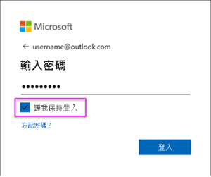

# 重新整理建立自 OneDrive 或 SharePoint Online 上 .CSV 檔案的資料集
## 有哪些優點？
當您連接至 OneDrive 或 SharePoint Online 上的 .csv 檔案時，即會在 Power BI 中建立資料集。 然後將來自 .csv 檔案的資料匯入 Power BI 中的資料集。 Power BI 再自動連接到檔案，並重新整理 Power BI 中的資料集的任何變更。 如果您編輯在 OneDrive 或 SharePoint Online 中的 .csv 檔案，則當您儲存時，這些變更通常在大約一小時內就會出現在 Power BI 中。 以 Power BI 資料集為基礎的任何視覺效果也都會自動更新。

如果檔案是在商務用 OneDrive 或 SharePoint Online 上的共用資料夾中，則其他使用者可以使用相同的檔案。 儲存之後，所做的變更通常會在一小時內於 Power BI 中自動更新。

許多組織會執行自動查詢資料庫的程序，藉此查詢之後每一天儲存至 .csv 檔案的資料。 如果檔案儲存在 OneDrive 或 SharePoint Online，而且每一天都會覆寫相同檔案 (不同於每天建立不同名稱的新檔案)，您就可以連接至 Power BI 中的該檔案。 在 OneDrive 或 SharePoint Online 上的檔案更新後，將會立即同步處理您連接至該檔案的資料集。 以該資料集為基礎的任何視覺效果也都會自動更新。

## 支援的項目有哪些？
逗號分隔值的檔案是純文字檔，因此不支援連接至外部資料來源和報表。 您無法排程從逗號分隔檔案建立的資料集重新整理。 不過，當該檔案位在 OneDrive 或 SharePoint Online 上時，Power BI 會自動約每小時將檔案的任何變更與資料集同步處理。

## OneDrive 或商務用 OneDrive。 有何不同？
如果您有個人 OneDrive 和商務用 OneDrive，建議您保留任何您想要連接至商務用 OneDrive 中 Power BI 的檔案。 原因如下：您可能使用兩個不同的帳戶來登入它們。

因為您用來登入 Power BI 的帳戶通常與用來登入商務用 OneDrive 的帳戶相同，所以通常可以無縫連接到 Power BI 中的商務用 OneDrive。 但如果使用個人 OneDrive，您很可能要以不同的 [Microsoft 帳戶](https://account.microsoft.com)登入。

當您使用 Microsoft 帳戶登入時，請確定選取 [讓我保持登入]。 Power BI 之後可將任何更新與在 Power BI 中的資料集同步處理

如果您變更無法與 Power BI 中資料集同步處理之 OneDrive 上的 .csv 檔案 (因為您的 Microsoft 帳戶認證可能已更改)，您將必須連接到該檔案，並從您的個人 OneDrive 將它再匯入一次。

## 發生錯誤時
如果放在 OneDrive 上的 .csv 檔案中的資料已變更，而在 Power BI 無法中反映這些變更，則很有可能是因為 Power BI 無法連接到您的 OneDrive。 請嘗試連接到該檔案再匯入一次。 如果系統提示您登入，請確定您已選取 [讓我保持登入]  。

## 後續步驟
[對重新整理問題進行疑難排解的工具](service-gateway-onprem-tshoot.md)
[對重新整理進行疑難排解的案例](refresh-troubleshooting-refresh-scenarios.md)

有其他問題嗎？ [嘗試在 Power BI 社群提問](https://community.powerbi.com/)

