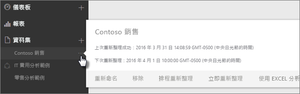
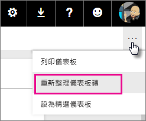
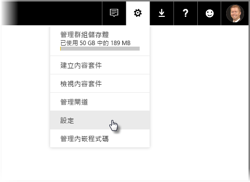
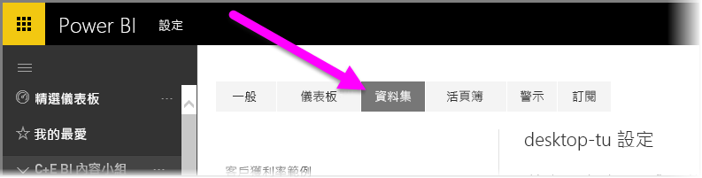
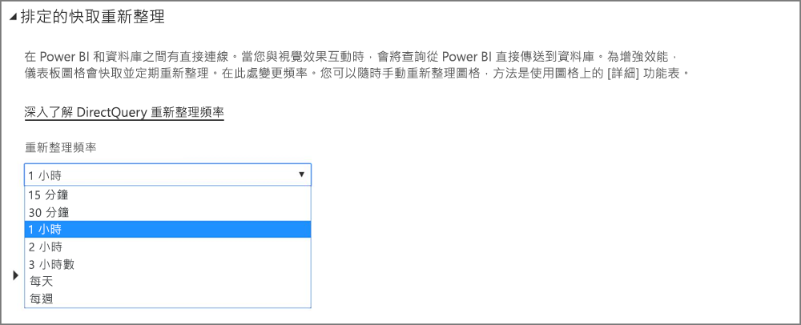

# Power BI 的資料重新整理
若要做出正確決策，確保您能夠一直取得最新資料就相當重要。 您可能已經使用 Power BI 中的 [取得資料] 連接及上傳一些資料，也已經建立一些報表和儀表板。 現在，您想要確定您的資料都是最新且最優良的。

在許多情況下，您完全不需要執行任何動作。 某些資料 (像是來自 Salesforce 或 Marketo 內容套件的資料) 會為您自動重新整理。 如果您的連線使用即時連線或 DirectQuery，資料就會更新到最新。 但在其他情況下 (例如連接到外部線上資料來源或內部部署資料來源的 Excel 活頁簿或 Power BI Desktop 檔案)，您將必須手動重新整理或設定重新整理排程，好讓 Power BI 可以為您重新整理報表和儀表板中的資料。

此篇文章與其他幾篇旨在協助您了解 Power BI 中資料重新整理的真正運作方式、您是否需要設定重新整理排程，以及需要就地升級哪些項目以順利重新整理您的資料。

## 了解資料重新整理
設定重新整理前，請務必了解您要重新整理的內容，以及取得資料的來源。

「資料來源」  是您在報表與儀表板中所探索資料的實際來源；例如 Google Analytics (分析) 或 QuickBooks 等線上服務、Azure SQL Database 等雲端資料庫，或您組織中本機電腦或伺服器上的資料庫或檔案。 這些是所有資料來源。 資料來源的類型會決定重新整理其資料的方式。 我們將在稍後＜什麼資料可以重新整理？[一節探討各類型資料來源的重新整理](#what-can-be-refreshed)。

「資料集」  會在您使用 [取得資料] 連接及上傳來自內容套件、檔案的資料，或連接至即時資料來源時，自動在 Power BI 中建立。 在 Power BI Desktop 和 Excel 2016 中，您也可以如同使用 [取得資料] 一般，將檔案直接發佈到 Power BI 服務。

在每個案例中，[我的工作區] 或 [群組]\(Power BI 服務的容器) 中都會建立並顯示資料集。 當您選取資料集的 **省略號 (...)** 時，就可以瀏覽報表中的資料、編輯設定和設定重新整理。

資料集可以從一個或多個資料來源取得資料。 例如，您可以使用 Power BI Desktop 從您組織中的 SQL Database 取得資料，並從 OData 摘要線上取得其他資料。 然後，當您將檔案發行至 Power BI 時，只有一個資料集會建立，但其中同時包含 SQL Database 和 OData 摘要的資料來源。

資料集包含資料來源的相關資訊、資料來源認證，並在大部分情況下也包含從資料來源複製的資料子集。 當您在報表和儀表板中建立視覺效果時，看到的是資料集內的資料；而在 Azure SQL Database 的即時連線等情況時，資料集則會定義您直接從資料來源看到的資料。 對於 Analysis Services 的即時連線，資料集定義直接來自 Analysis Services。

> *當您重新整理資料時，您更新的是資料集中的資料，這個資料集從資料來源儲存在 Power BI 中。這次重新整理是完整的重新整理，而非累加式。*
> 
> 

每當您重新整理資料集內的資料時，無論方式是 [立即重新整理] 或設定重新整理排程，Power BI 都會使用資料集內的資訊來連接到為其定義的資料來源，查詢更新的資料，然後將更新的資料載入資料集。 報表或儀表板中的所有視覺效果都是以自動更新的資料為基礎。

在繼續討論之前，必須先了解其他一些重要事項︰

> *無論您重新整理資料集的頻率有多高，或查看即時資料的頻率有多高，都必須先讓資料來源中的資料處於最新狀態。*
> 
> 

大部分組織都一天處理一次資料，通常是在晚上。 如果您為建立自連接到內部部署的資料庫 Power BI Desktop 檔案的資料集排程重新整理，而且您的 IT 部門會在晚上處理一次該 SQL 資料庫，您就只需要將排程的重新整理設定為一天執行一次。 例如，在處理資料庫之後、開始工作之前。 當然您也不一定要這樣做。 Power BI 提供許多方式來連接經常更新或甚至是即時的資料來源。

## 重新整理的類型
Power BI 內有四種主要的重新整理類型。 封裝重新整理、模型/資料重新整理，磚重新整理和視覺效果容器重新整理。

### 封裝重新整理
這會同步處理 Power BI Desktop 或 Excel 和 Power BI 服務及 OneDrive 或 SharePoint Online 之間的檔案。 這不會提取原始資料來源的資料。 Power BI 的資料集只會使用 OneDrive 或 SharePoint Online 內的檔案內容加以更新。

### 模型/資料重新整理
這是指使用原始資料來源的資料，重新整理 Power BI 服務裡的資料集。 這項作業會使用排程的重新整理或立即重新整理完成。 這需要用來處理內部部署資料來源的閘道。

### 磚重新整理
只要資料變更，磚重新整理就會更新儀表板上的磚視覺效果快取。 約每 15 分鐘發生一次。 您也可以選取儀表板右上角的 **省略符號 (...)** ，然後選取 [更新儀表板的圖格]，以強制執行圖格的重新整理。

如需常見的磚重新整理錯誤詳細資訊，請參閱[為磚錯誤疑難排解](refresh-troubleshooting-tile-errors.md)。

### 視覺效果容器重新整理
只要資料變更，重新整理視覺效果容器就會更新報表內的快取報表視覺效果。

## 什麼資料可以重新整理？
在 Power BI 中，您通常會使用 [取得資料] 從本機磁碟檔案、OneDrive 或 SharePoint Online 匯入資料、從 Power BI Desktop 發佈報表，或直接連接到您組織中的雲端資料庫。 幾乎所有 Power BI 中的資料都可以重新整理，但會依據您的資料集建立來源和連接的資料來源，決定是否有這個需要。 讓我們來看看這些類型如何重新整理資料。

在進一步討論前，以下有幾項重要定義要了解：

**自動重新整理**  - 這表示定期重新整理資料集時，不需要任何使用者設定。 Power BI 已經為您進行資料重新整理設定。 若是線上服務提供者，通常都是一天進行一次重新整理。 若是從 OneDrive 載入的檔案，就會針對非來自外部資料來源的資料每小時進行自動重新整理。 雖然您可以設定不同的排程重新整理設定以及手動重新整理，但也可能不需要這麼做。

**使用者設定的手動或排程重新整理** – 這表示您可以使用 [立即重新整理] 手動重新整理資料集，或使用資料集設定中的 [排程重新整理] 設定重新整理排程。 連接到外部線上資料來源和內部部署資料來源的Power BI Desktop 檔案和 Excel 活頁簿需要這種重新整理。

> [!NOTE]
> 當您設定排程重新整理的時間時，在開始前可能會有最多一小時的延遲。
> 
> 

**即時/DirectQuery** – 這表示 Power BI 和資料來源之間有即時連線。 針對內部部署的資料來源，系統管理員必須在企業閘道器中設定資料來源，但可能不需要使用者互動。

> [!NOTE]
> 為了增強效能，會自動更新使用 DirectQuery 連接資料的儀表板。 您也可以隨時手動重新整理磚，方法是使用磚上的 [詳細] 功能表。
> 
> 

## 本機檔案和 OneDrive 或 SharePoint Online 上的檔案
連接到外部線上資料來源和內部部署資料來源的Power BI Desktop 檔案和 Excel 活頁簿支援資料重新整理。 這只會重新整理 Power BI 服務的資料集資料。 不會更新您的本機檔案。

將您的檔案保留在 OneDrive 或 SharePoint Online 上，並從 Power BI 加以連接，可提供大量彈性。 雖然有許多彈性，這卻也讓此類型最難以了解。 儲存在 OneDrive 或 SharePoint Online 中的檔案排程重新整理，和封裝重新整理不一樣。 如需深入了解，請參閱[重新整理的類型](#types-of-refresh)一節。

### Power BI Desktop 檔案

| **資料來源** | **自動重新整理** | **使用者設定的手動或排程重新整理** | **需要閘道** |
| --- | --- | --- | --- |
| 會使用 \[取得資料] \(位於功能區) 連接到任何所列資料來源，以及從中查詢資料。 |否 |是 |否 (請參閱下文) |
| [取得資料] 是用於連接和瀏覽即時的 Analysis Services 資料庫。 |是 |否 |是 |
| [取得資料] 是用於連接和瀏覽支援的內部部署 DirectQuery 資料來源。 |是 |否 |是 |
| 會使用 [取得資料] 連接到 Azure SQL Database、Azure SQL 資料倉儲、Azure HDInsight Spark，以及從中查詢資料。 |是 |是 |否 |
| [取得資料] 是用來連接到任何所列內部部署資料來源 (Hadoop 檔案 (HDFS) 及 Microsoft Exchange 除外)，以及從中查詢資料。 |否 |是 |是 |

> [!NOTE]
> 如果您使用 [ **Web.Page** ](https://msdn.microsoft.com/library/mt260924.aspx)函式，則在您於 2016 年 11 月 18 日之後重新發佈資料集或報表的情況下，會需要閘道器。
> 
> 

如需詳細資訊，請參閱[重新整理建立自 OneDrive 上 Power BI Desktop 檔案的資料集](refresh-desktop-file-onedrive.md)。

### Excel 活頁簿

| **資料來源** | **自動重新整理** | **使用者設定的手動或排程重新整理** | **需要閘道** |
| --- | --- | --- | --- |
| 未載入 Excel 資料模型之工作表中的資料表。 |是，每小時 *(僅限 OneDrive/SharePoint Online)* |僅手動 *(僅限 OneDrive/SharePoint Online)* |否 |
| 連結到 Excel 資料模型中資料表的工作表中資料表 (連結的資料表)。 |是，每小時 *(僅限 OneDrive/SharePoint Online)* |僅手動 *(僅限 OneDrive/SharePoint Online)* |否 |
| 會使用 Power Query* 連接到任何所列線上資料來源，以及從中查詢資料，並將資料載入 Excel 資料模型。 |否 |是 |否 |
| Power Query* 是用來連接到任何所列內部部署資料來源 (Hadoop 檔案 (HDFS) 及 Microsoft Exchange 除外)，以及從中查詢資料，並將資料載入 Excel 資料模型。 |否 |是 |是 |
| 會使用 Power Pivot 連接到任何所列線上資料來源，以及從中查詢資料，並將資料載入 Excel 資料模型。 |否 |是 |否 |
| 會使用 Power Pivot 連接到任何所列內部部署資料來源，以及從中查詢資料，並將資料載入 Excel 資料模型。 |否 |是 |是 |

*\*Power Query 在 Excel 2016 中稱為 [取得與轉換資料]。*

如需詳細資訊，請參閱[重新整理建立自 OneDrive 上 Excel 活頁簿的資料集](refresh-excel-file-onedrive.md)。

### OneDrive 或 SharePoint Online 上的逗點分隔值 (.csv) 檔案

| **資料來源** | **自動重新整理** | **使用者設定的手動或排程重新整理** | **需要閘道** |
| --- | --- | --- | --- |
| 簡單的逗號分隔值 |是，小時 |僅手動 |否 |

如需詳細資訊，請參閱[重新整理建立自 OneDrive 上逗點分隔值 (.csv) 檔案的資料集](refresh-csv-file-onedrive.md)。

## 內容套件
Power BI 中的內容套件有兩種類型：

**來自線上服務的內容套件**：例如 Adobe Analytics、SalesForce 和 Dynamics CRM Online。 從線上服務建立的資料集會每天自動重新整理一次。 雖然您可能不需要手動重新整理或設定重新整理排程，仍然可以選擇這麼做。 因為線上服務位於雲端，所以不需要閘道器。

**組織的內容套件**：由您組織中的使用者建立與共用。 內容套件取用者無法設定重新整理排程或手動重新整理。 只有內容套件建立者可以為內容套件中的資料集設定重新整理。 重新整理設定會隨資料集繼承。

### 來自線上服務的內容套件

| **資料來源** | **自動重新整理** | **使用者設定的手動或排程重新整理** | **需要閘道** |
| --- | --- | --- | --- |
| 位於 [取得資料] &gt;> [服務] 的線上服務 |是 |是 |否 |

### 組織的內容套件
組織內容套件是否附有資料集的重新整理功能，取決於資料集。 請參閱上文與本機檔案、OneDrive 或 SharePoint Online 相關的資訊。

如需深入了解，請參閱[組織的內容套件簡介](service-organizational-content-pack-introduction.md)。

## 內部部署資料來源的即時連線和 DirectQuery
您可以透過內部部署資料閘道，從 Power BI 向您的內部部署資料來源發出查詢。 當您與視覺效果互動時，會將查詢從 Power BI 直接傳送到資料庫。 接著傳回更新的資料，視覺效果隨即更新。 因為 Power BI 和資料庫之間有直接連接，所以不需要排程重新整理。

當連接到使用即時連接的 SQL Server Analysis Services (SSAS) 資料來源時，不像 DirectQuery，SSAS 來源的即時連接，即使在載入報表時都可以對快取執行。 此行為可改善報表的負載效能。 您可以使用 [重新整理] 按鈕向 SSAS 資料來源要求最新的資料。 SSAS 資料來源的擁有者可以設定資料集的排程快取重新整理頻率，以確保需要時能取得最新狀態的報表。 

當您設定內部部署資料閘道的資料來源時，可以使用該資料來源當作排程的重新整理選項。 這就如同個人閘道器的替代方案。

> [!NOTE]
> 如果您的資料集設定為即時或 DirectQuery 連接，則會大約每小時或在與資料互動時重新整理資料集。 您可以在 Power BI 服務的 [排定的快取重新整理] 選項中，手動調整 [重新整理頻率]。
> 
> 

| **資料來源** | **即時/DirectQuery** | **使用者設定的手動或排程重新整理** | **需要閘道** |
| --- | --- | --- | --- |
| Analysis Services 表格式 |是 |是 |是 |
| Analysis Services 多維度 |是 |是 |是 |
| SQL Server |是 |是 |是 |
| SAP HANA |是 |是 |是 |
| Oracle |是 |是 |是 |
| Teradata |是 |是 |是 |

若要深入了解，請參閱[內部部署資料閘道](service-gateway-onprem.md)

## 雲端資料庫
使用 DirectQuery，在 Power BI 和雲端資料庫之間就會有直接連線。 當您與視覺效果互動時，會將查詢從 Power BI 直接傳送到資料庫。 接著傳回更新的資料，視覺效果隨即更新。 另外，因為 Power BI 服務和資料來源都位於雲端，所以不需要個人閘道。

如果視覺效果中沒有任何使用者互動，大約每小時即自動重新整理資料。 您可以使用 [排定的快取重新整理] 選項變更該重新整理頻率，然後設定重新整理頻率。

若要設定頻率，請選取 Power BI 服務右上角的**齒輪**圖示，然後選取 [設定]。

[設定] 頁面隨即出現，您可以在其中選取要調整頻率的資料集。 在該頁面上，選取上方的 [資料集] 索引標籤。

選取資料集，您將會在右窗格中看到該資料集的選項集合。 針對 DirectQuery/即時連接，您可以使用相關下拉式功能表將重新整理頻率設定為 15 分鐘到每週，如下圖所示。

| **資料來源** | **即時/DirectQuery** | **使用者設定的手動或排程重新整理** | **需要閘道** |
| --- | --- | --- | --- |
| SQL Azure 資料倉儲 |是 |是 |否 |
| HDInsight 上的 Spark |是 |是 |否 |

如需深入了解，請參閱 [Azure 和 Power BI](service-azure-and-power-bi.md)。

## 即時儀表板
即時儀表板使用 Microsoft Power BI REST API 或 Microsoft 串流分析來確保資料皆為最新。 因為即時儀表板不需要使用者設定重新整理，所以不屬於此文章的範圍。

| **資料來源** | **自動** | **使用者設定的手動或排程重新整理** | **需要閘道** |
| --- | --- | --- | --- |
| 使用 Power BI REST API 或 Microsoft 串流分析開發的自訂應用程式 |是，即時串流 |否 |否 |

如需深入了解，請參閱[在 Power BI 中建立即時儀表板](https://msdn.microsoft.com/library/mt267603.aspx)。

## 設定排程的重新整理
若要了解如何設定排程的重新整理，請參閱[設定排程的重新整理](refresh-scheduled-refresh.md)。

## 資料重新整理常見案例
有時候，要了解 Power BI 中資料重新整理的最好方式就是查看範例。 以下是部份較常見的資料重新整理案例：

### 具有資料表的 Excel 活頁簿
您的 Excel 活頁簿有多個資料表，但皆未載入 Excel 資料模型中。 您使用 [取得資料] 從本機磁碟將活頁簿檔案上傳到 Power BI 並建立儀表板。 但是，您對本機磁碟上活頁簿的多個資料表進行了些許變更，並且想要以新資料更新 Power BI 中的儀表板。

不幸的是，在此案例中，重新整理不受支援。 為了重新整理儀表板的資料集，您必須重新上傳活頁簿。 不過，這裡有個很棒的解決方案：將您的活頁簿檔案放到 OneDrive 或 SharePoint Online！

當您連接到 OneDrive 或 SharePoint Online 上的檔案時，報表和儀表板會依據資料在檔案中的原樣加以顯示。 在此情況下即為您的 Excel 活頁簿。 Power BI 會每小時自動檢查檔案是否更新。 如果您對活頁簿 (存放於 OneDrive 或 SharePoint Online) 進行變更，這些變更會在一小時內反映於您的儀表板和報表中。 您完全不需要設定重新整理。 然而，如果您需要立即在 Power BI 中查看更新，可以使用 [立即重新整理] 手動重新整理資料集。

若要深入了解，請參閱 [Power BI 中的 Excel 資料](service-excel-workbook-files.md)或[重新整理建立自 OneDrive 上 Excel 活頁簿的資料集](refresh-excel-file-onedrive.md)。

### 連接到您公司中 SQL 資料庫的 Excel 活頁簿
假設您在本機電腦上有個名為 SalesReport.xlsx 的 Excel 活頁簿。 Excel 中的 Power Query 是用以連接到公司中伺服器的 SQL 資料庫，以及查詢載入資料模型中的銷售資料。 每天早上，您都會開啟活頁簿，並點擊 [重新整理] 更新您的 PivotTables。

現在您想要在 Power BI 中瀏覽銷售資料，因此使用 [取得資料] 從本機磁碟連接及上傳 SalesReport.xlsx 活頁簿。

在此情況下，您可以手動重新整理 SalesReport.xlsx 資料集內的資料，或設定重新整理排程。 因為資料實際上是來自您公司的 SQL 資料庫，所以您必須下載及安裝閘道器。 一旦安裝並設定閘道後，您就必須前往 SalesReport 資料集的設定，並登入資料來源；但您只需要執行此動作一次。 您接著可以設定重新整理排程，以便 Power BI 自動連接到 SQL 資料庫並取得更新的資料。 您的報表和儀表板也將自動更新。

> [!NOTE]
> 這只會更新 Power BI 服務中的資料集資料。 本機檔案不會作為重新整理的一部分進行更新。
> 
> 

若要深入了解，請參閱 [Power BI 中的 Excel 資料](service-excel-workbook-files.md)、[Power BI Gateway - Personal](service-gateway-personal-mode.md)、[內部部署資料閘道](service-gateway-onprem.md)、[重新整理建立自本機磁碟上 Excel 活頁簿的資料集](refresh-excel-file-local-drive.md)。

### 包含來自 OData 摘要之資訊的 Power BI Desktop 檔案
在此情況下，您可在 Power BI Desktop 中使用 [取得資料] 連接及匯入來自 OData 摘要的人口普查資料。  您在 Power BI Desktop 中建立數個報表，然後將檔案命名為 WACensus，並儲存在電腦中的共用。 接著將檔案發佈到 Power BI 服務。

在此情況下，您可以手動重新整理 WACensus 資料集內的資料或設定重新整理排程。 因為資料實際上是來自線上 OData 摘要，所以您不需要安裝閘道器，但必須前往 WACensus 資料集的設定並登入 OData 資料來源。 您接著可以設定重新整理排程，以便 Power BI 自動連接到 OData 摘要，並取得更新的資料。 您的報表和儀表板也將自動更新。

如需深入了解，請參閱[從 Power BI Desktop 發佈](desktop-upload-desktop-files.md)、[重新整理建立自本機磁碟上 Power BI Desktop 檔案的資料集](refresh-desktop-file-local-drive.md)、[重新整理建立自 OneDrive 上 Power BI Desktop 檔案的資料集](refresh-desktop-file-onedrive.md)。

### 來自組織中另一位使用者的共用內容套件
您已連接到組織的內容套件。 其中包含儀表板、多個報表和資料集。

在此案例中，您無法為資料集設定重新整理。 建立內容套件的數據分析師必須確認資料集已經依據所用的資料來源重新整理。

如果來自內容套件的儀表板和報表未更新，您將告知建立內容套件的數據分析師。

如需深入了解，請參閱[組織的內容套件簡介](service-organizational-content-pack-introduction.md)、[使用組織的內容套件](service-organizational-content-pack-copy-refresh-access.md)。

### 來自 Salesforce 等線上服務提供者的內容套件
過去在 Power BI 中，您使用 [取得資料] 從 Salesforce 等線上服務提供者連接並匯入資料。 嗯，其實沒什麼該做的動作。 您的 Salesforce 資料集已自動排程為每天重新整理一次。 

如同大部分的線上服務提供者，Salesforce 會一天更新一次資料，時間通常在晚上。 您可以手動重新整理您的 Salesforce 資料集，或設定重新整理排程，但不一定要這麼做，因為 Power BI 會自動重新整理資料集，您的報表與儀表板也會同時更新。

如需深入了解，請參閱[適用於 Power BI 的 Salesforce 內容套件](service-connect-to-salesforce.md)。

## 疑難排解
如果發生錯誤，問題通常起因於 Power BI 無法登入資料來源，或資料集連接至內部部署資料來源時，閘道器為離線。 請確認 Power BI 可以登入資料來源。 如果您用以登入資料來源的密碼已變更，或 Power BI 從資料來源登出，請務必嘗試在 [資料來源認證] 中再次登入您的資料來源。

如需疑難排解的詳細資料，請參閱[為重新整理問題疑難排解的工具](service-gateway-onprem-tshoot.md)和[疑難排解重新整理案例](refresh-troubleshooting-refresh-scenarios.md)。

## 後續步驟
[對重新整理問題進行疑難排解的工具](service-gateway-onprem-tshoot.md)  
[對重新整理進行疑難排解的案例](refresh-troubleshooting-refresh-scenarios.md)  
[Power BI Gateway - Personal](service-gateway-personal-mode.md)  
[內部部署資料閘道](service-gateway-onprem.md)  

有其他問題嗎？ [嘗試在 Power BI 社群提問](http://community.powerbi.com/)

