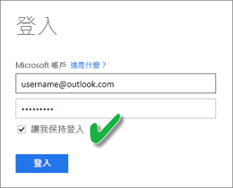

# 重新整理建立自 OneDrive 或 SharePoint Online 上 Excel 活頁簿的資料集
您可以將儲存於本機電腦，或商務用 OneDrive 與 SharePoint Online 這類雲端儲存體的 Excel 活頁簿加以匯入。 我們將討論使用雲端儲存體存放 excel 檔案的優點。 如需如何將 Excel 檔案匯入 Power BI 的詳細資訊，請參閱[從 Excel 活頁簿檔案取得資料](service-excel-workbook-files.md)。

## 有哪些優點？
為了讓您在 Excel 中所做的工作與 Power BI 服務保持同步，最好的方法就是從 OneDrive 或 SharePoint Online 匯入檔案。 已載入檔案模型的任何資料都將匯入至該資料集，而且任何您已在該檔案中建立的報表都將載入至 Power BI 中的報表。 如果您變更放在 OneDrive 或 SharePoint Online 上的檔案，例如加入新的量值、變更資料行名稱，或編輯視覺效果，一旦儲存之後，這些變更通常會在大約一小時內在 Power BI 中更新。

當您從個人 OneDrive 匯入 Excel 活頁簿時，活頁簿中的任何資料，像是工作表中的資料表和 (或) 載入到 Excel 資料模型的資料，以及此資料模型的結構都將匯入 Power BI 中的新資料集。 任何 Power View 視覺效果都會在報表中重新建立。 Power BI 會自動連結 OneDrive 或 SharePoint Online 上的活頁簿，大約每個小時檢查更新。 如果活頁簿已變更，Power BI 會重新整理 Power BI 服務中的資料集和報表。

您可以重新整理 Power BI 服務中的資料集。 當您手動重新整理或排程重新整理資料集時，Power BI 會直接連接到外部資料來源，以查詢更新的資料，然後載入資料集。 重新整理 Power BI 中的資料集，並不會重新整理 OneDrive 或 SharePoint Online 上活頁簿中的資料。 

## 支援的項目有哪些？
在 Power BI 中，從 Power BI Desktop 檔案建立的資料集支援 [立即重新整理] 和 [排程重新整理]，這些檔案是從本機磁碟匯入，本機磁碟使用 [取得資料]/查詢編輯器連接下列任何資料來源並載入資料︰  

### Power BI Gateway - Personal
* Power BI Desktop 的 [取得資料] 和查詢編輯器都會顯示所有的線上資料來源。
* Power BI Desktop 的 [取得資料] 和查詢編輯器都會顯示所有的內部部署資料來源，但 Hadoop 檔案 (HDFS) 與 Microsoft Exchange 除外。

<!-- Refresh Data sources-->
[!INCLUDE [refresh-datasources](./includes/refresh-datasources.md)]

> [!NOTE]
> 必須安裝並執行閘道器，才能讓 Power BI 連接至內部部署資料來源並重新整理資料集。
> 
> 

## OneDrive 或商務用 OneDrive。 有何不同？
如果您有個人 OneDrive 和商務用 OneDrive，建議您保留任何您想要匯入至商務用 OneDrive 中 Power BI 的檔案。 原因如下：您可能使用兩個不同的帳戶來登入它們。

因為您用來登入 Power BI 的帳戶通常與用來登入商務用 OneDrive 的帳戶相同，所以通常可以無縫連接到 Power BI 中的商務用 OneDrive。 但如果使用個人 OneDrive，您很可能要以不同的 [Microsoft 帳戶](http://www.microsoft.com/account/default.aspx)登入。

當您使用 Microsoft 帳戶登入時，請確定選取 [讓我保持登入]。 Power BI 之後可將您在 Power BI Desktop 檔案中進行的任何更新與在 Power BI 中的資料集同步處理  
    

如果您變更無法與 Power BI 中資料集或報表同步處理之 OneDrive 上的檔案 (因為您的 Microsoft 帳戶認證可能已更改)，您將必須連接到您的檔案，並從您的個人 OneDrive 將它再上傳一次。

## 連接至 Excel 檔案的選項
當您連接至商務用 OneDrive 或 SharePoint Online 上的 Excel 活頁簿時，可使用兩個選項來取得 Power BI 活頁簿中的內容。

[**將 Excel 資料匯入至 Power BI**](service-excel-workbook-files.md#import-or-connect-to-an-excel-workbook-from-power-bi) – 當您從商務用 OneDrive 或 SharePoint Online 匯入 Excel 活頁簿時，會依上述方式運作。

[**在 Power BI 中連接、管理及檢視 Excel**](service-excel-workbook-files.md#one-excel-workbook--two-ways-to-use-it) – 使用此選項時，會建立連接，以直接從 Power BI 連接到商務用 OneDrive 或 SharePoint Online 上的活頁簿。

當您以這種方式連接到 Excel 活頁簿時，在 Power BI 中將不會建立資料集。 不過，活頁簿將會出現在 Power BI 服務中的 [報表] 下方，其名稱旁有 Excel 圖示。 不同於 Excel Online，當您從 Power BI 連接到您的活頁簿時，如果您的活頁簿具有與外部資料來源的連接，且該連接會將資料載入 Excel 資料模型中，您就可以設定重新整理排程。

當您以這種方式設定重新整理排程時，唯一的差異在於，重新整理資料都會送至 OneDrive 或 SharePoint Online 中的活頁簿資料模型，而不是 Power BI 中的資料集。

## 如何確定資料已載入 Excel 資料模型？
當您使用 Power Query (Excel 2016 中的 [取得和轉換資料]) 來連接到資料來源時，您有幾個載入資料位置的選項。 若要確定您將資料載入資料模型，您就必須在 [載入]  對話方塊中選取 [新增這項資料到資料模型]  選項。

> [!NOTE]
> 這裡的圖片顯示的是 Excel 2016。
> 
> 

在 [導覽] 中，按一下 [載入至...]。  
    

或者，如果您在 [導覽] 中按一下 [編輯]  ，您就會開啟 [查詢編輯器]。 其中您可以按一下 [關閉並載入至...]。  
    

接著請確定在 [載入至] 中已選取 [將此資料加入資料模型] 。  
    

### 如果在 Power Pivot 中使用 [取得外部資料]？
沒問題。 每當您使用 Power Pivot 連接和查詢來自內部部署或線上資料來源的資料時，資料就會自動載入至資料模型。

## 我要如何排程重新整理？
當您設定重新整理排程時，Power BI 會直接連接到資料來源，方法是使用資料集內的連接資訊和認證來查詢更新資料，然後將更新資料載入資料集。 此外，也會更新任何在 Power BI 服務中該資料集上的報表和儀表板視覺效果。

如需如何設定排程重新整理的詳細資訊，請參閱[設定排程重新整理](refresh-scheduled-refresh.md)。

## 發生錯誤時
如果發生錯誤，問題通常起因於 Power BI 無法登入資料來源，或資料集連接至內部部署資料來源時，閘道器離線。 請確認 Power BI 可以登入資料來源。 如果您用以登入資料來源的密碼已變更，或 Power BI 從資料來源登出，請務必嘗試在 [資料來源認證] 中再次登入您的資料來源。

請務必核取 [傳送重新整理失敗通知電子郵件給我] 。 您會想要立刻知道排定的重新整理是否失敗。

## 重要注意事項
\*不支援重新整理連接至 Power Pivot 並從中查詢的 OData 摘要。 當使用 OData 摘要作為資料來源時，請使用 Power Query。

## 疑難排解
有時候重新整理資料可能不會如預期執行。 這通常是閘道連線問題之故。 請參閱閘道疑難排解文章，以取得工具和已知的問題。

[為內部部署資料閘道進行疑難排解](service-gateway-onprem-tshoot.md)

[對 Power BI Gateway - Personal 進行疑難排解](service-admin-troubleshooting-power-bi-personal-gateway.md)

有其他問題嗎？ [試試 Power BI 社群](http://community.powerbi.com/)

