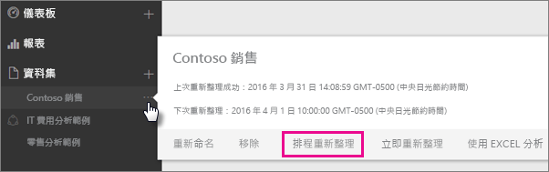
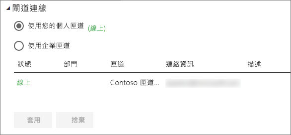
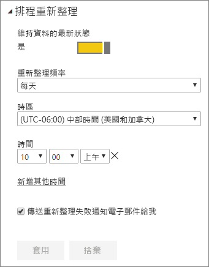

# 設定排定的重新整理

>[!NOTE]
>閒置兩個月之後，就會暫停資料集重新整理排程。 如需詳細資訊，請參閱本文稍後的[*排程重新整理*](#schedule-refresh)一節。
> 
> 

如果您的資料集支援透過 [立即重新整理] 和 [排程重新整理] 進行重新整理的排程，有幾項重要的需求與設定可讓您順利重新整理。 這些項目分別為 [閘道連接]、[資料來源認證] 和 [排程重新整理]。 讓我們分別探討。

此處說明 [Power BI Gateway - Personal](personal-gateway.md) 及 [Power BI Gateway - Enterprise](service-gateway-onprem.md) 皆能使用的選項。

若要前往排程重新整理畫面，您可以執行下列動作：

1. 選取 [資料集] 底下所列資料集旁的**省略符號 (...)**。
2. 選取 [排程重新整理]。
   
    

## 閘道連接
根據線上可使用的個人或企業閘道，您可在此處看到不同選項。

如果沒有可用的閘道，您會看到 [閘道設定] 為停用。 您也會看到一則訊息說明如何安裝個人閘道。

如果您已設定個人閘道，且該閘道為上線狀態，即可供選取。 如果無法使用，它會顯示為離線。

如果適用的話，您也可以選取企業閘道。 如果針對指定閘道設定的資料來源 [使用者] 索引標籤中列出您的帳戶，就只會顯示企業閘道。

## 資料來源認證
### Power BI Gateway - Personal
如果您是使用個人閘道來重新整理資料，則必須提供用於連接至後端資料來源的認證。 如果您是透過線上服務連接到內容套件，排定的重新整理會沿用您輸入的連接認證。

只有第一次在該資料集上進行重新整理時，才需要登入資料來源。 進入之後，這些認證會隨資料集保留。

> [!NOTE]
> 對於某些驗證方法，如果您用以登入資料來源的密碼過期或已變更，就必須同時對資料來源認證中的資料來源加以變更。
> 
> 

如果發生錯誤，問題通常起因於閘道無法登入 Windows 啟動服務而處於離線，或 Power BI 無法登入資料來源以查詢更新的資料。 如果重新整理失敗，請檢查資料集的設定。 如果閘道服務離線，您可以在 [閘道狀態] 查看錯誤。 如果 Power BI 無法登入資料來源，您可以在 [資料來源認證] 查看錯誤。

### 內部部署資料閘道
如果您使用內部部署資料閘道來重新整理資料，就不需要提供認證，因為閘道管理員會定義資料來源的認證。

> [!NOTE]
> 連線到內部部署 SharePoint 以進行資料重新整理時，Power BI 僅支援「匿名」、「基本」及 Windows (NTLM/Kerberos) 驗證機制。 Power BI 不支援使用 *ADFS* 或任何「表單型驗證」機制進行內部部署 SharePoint 資料來源重新整理。
> 
> 

## 排程重新整理
[排定的重新整理] 區段可讓您定義資料集重新整理的頻率和時段。 有些資料來源不需要具備閘道即可進行設定， 但有些項目就需要閘道。

您必須將 [維持資料的最新狀態] 滑桿設為 [是]，才能進行設定。

> [!NOTE]
> Power BI 服務的目標是在您排定的重新整理時間 **15 分鐘**內初始化資料重新整理。
> 
> 

> [!NOTE]
> 閒置兩個月之後，就會暫停資料集重新整理排程。 當沒有使用者瀏覽以資料集建置的任何儀表板或報表時，資料集會視為非使用中。 屆時，資料集擁有者會傳送電子郵件，指出暫停已排程的重新整理，而該資料集的重新整理排程會顯示為 [停用]。 若要繼續已排程的重新整理，只需重新瀏覽以該資料集建置的任何儀表板或報表即可。
> 
> 

## 支援的項目有哪些？
針對不同的閘道，有些特定資料集可支援排定的重新整理。 下列參考可讓您了解哪些項目適用。

### Power BI Gateway - Personal
**Power BI Desktop**

* Power BI Desktop 的 [取得資料] 和查詢編輯器都會顯示所有的線上資料來源。
* Power BI Desktop 的 [取得資料] 和查詢編輯器都會顯示所有的內部部署資料來源，但 Hadoop 檔案 (HDFS) 與 Microsoft Exchange 除外。

**Excel**

> [!NOTE]
> Excel 2016 和更新版本現已將 Power Query 列在功能區的 [資料] 區段中，[取得和轉換資料] 下。
> 
> 

* Power Query 中顯示的所有線上資料來源。
* Power Query 中顯示的所有內部部署資料來源，但 Hadoop 檔案 (HDFS) 與 Microsoft Exchange 除外。
* Power Pivot 中顯示的所有線上資料來源。\*
* Power Pivot 中顯示的所有內部部署資料來源，但 Hadoop 檔案 (HDFS) 與 Microsoft Exchange 除外。

<!-- Refresh Data sources-->
[!INCLUDE [refresh-datasources](./includes/refresh-datasources.md)]

## 疑難排解
有時候重新整理資料可能不會如預期執行。 這通常是閘道連線問題之故。 請參閱閘道疑難排解文章，以取得工具和已知的問題。

[為內部部署資料閘道進行疑難排解](service-gateway-onprem-tshoot.md)

[對 Power BI Gateway - Personal 進行疑難排解](service-admin-troubleshooting-power-bi-personal-gateway.md)

## 後續步驟
[Power BI 的資料重新整理](refresh-data.md)  
[Power BI Gateway - Personal](personal-gateway.md)  
[內部部署資料閘道](service-gateway-onprem.md)  
[為內部部署資料閘道進行疑難排解](service-gateway-onprem-tshoot.md)  
[對 Power BI Gateway - Personal 進行疑難排解](service-admin-troubleshooting-power-bi-personal-gateway.md)  

有其他問題嗎？ [嘗試在 Power BI 社群提問](http://community.powerbi.com/)

