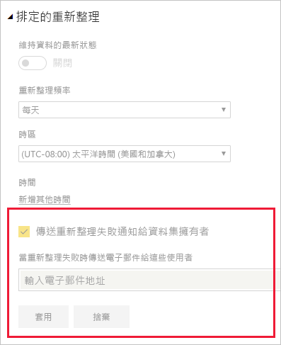

# 重新整理疑難排解案例

您可以在這裡找到在 Power BI 服務內重新整理資料時可能面臨到的不同狀況的相關資訊。

> [!NOTE]
> 如果您遇到下列以外的案例且發生問題，您可以在[社群網站](https://community.powerbi.com/)上要求進一步協助，也可以建立[支援票證](https://powerbi.microsoft.com/support/)。
>
>

## 電子郵件通知

如果您是從電子郵件通知進入本文，且不想再收到關於重新整理問題的電子郵件，請洽詢 Power BI 系統管理員。請要求其從 Power BI 中適當資料集中移除您的電子郵件或所訂閱電子郵件清單。 Power BI 系統管理員可以從 Power BI 管理入口網站中的下列區域執行此動作。

## 無法使用 Web 連接器來進行重新整理

如果您有使用 [**Web.Page**](https://msdn.microsoft.com/library/mt260924.aspx) 函式的 Web 連接器指令碼，且您已經在 2016 年 11 月 18 日之後更新資料集或報表，則必須使用閘道器才能讓重新整理功能正常運作。

## 重新整理不支援的資料來源

設定資料集時，您可能會收到錯誤，指出此資料集使用的資料來源不支援重新整理。 如需詳細資訊，請參閱[針對不支援重新整理的資料來源進行疑難排解](service-admin-troubleshoot-unsupported-data-source-for-refresh.md)。

## 儀表板在重新整理後不反映變更

請等候大約 10-15 分鐘，讓儀表板磚反映重新整理後的情況。 如果仍未顯示，請將視覺效果重新釘選到儀表板上。

## 設定認證時發生 GatewayNotReachable 問題

嘗試設定資料來源的認證時，您可能會遇到 `GatewayNotReachable` 問題。 這可能是閘道器過期的結果。 請安裝最新的閘道器並再試一次。

## 正在處理錯誤:發生下列系統錯誤:類型不符

這可能是 Power BI Desktop 檔案或 Excel 活頁簿內的 M 指令碼問題， 也可能是因為 Power BI Desktop 版本過期所致。

## 圖格重新整理錯誤

如需使用儀表板圖格可能發生的錯誤和說明，請參閱[為磚錯誤疑難排解](refresh-troubleshooting-tile-errors.md)。

## 更新使用 AAD OAuth 之來源的資料時，重新整理失敗

許多不同資料來源都會使用 Azure Active Directory (**AAD**) OAuth 權杖，而此權杖大約會在一小時後過期。 因為 Power BI 服務在載入資料時最多等待兩個小時，所以載入資料所需的時間會比權杖到期日還要久 (超過一小時)。 在此情況下，資料載入程序可能會因認證錯誤而失敗。

使用 AAD OAuth 的資料來源包括 **Microsoft Dynamics CRM Online**、**SharePoint Online** (SPO) 和其他項目。 如果您要連接至這類資料來源，並且在資料載入時間超過一小時時發生認證失敗，則這可能是原因。

Microsoft 正在調查解決方案，以允許資料載入程序重新整理權杖，然後繼續。 不過，如果您的 Dynamics CRM Online 或 SharePoint Online 執行個體 (或其他 AAD OAuth 資料來源) 太大，而超過兩小時資料載入閾值，您也可能會發生 Power BI 服務的資料載入逾時。

另請注意，為了讓重新整理正常運作，在使用 AAD OAuth 連線至 **SharePoint Online** 資料來源時，您必須使用與登入 **Power BI 服務**所使用的相同帳戶。

## 重新整理時未壓縮的資料限制

匯入 **Power BI 服務**中的資料集大小上限為 1 GB。 這些資料集會極度壓縮以確保高效能。 此外，在共用的容量中，服務會將重新整理期間處理的未壓縮資料量限制為 10 GB。 這項限制已考量壓縮，因此比 1 GB 高出許多。 Power BI Premium 中的資料集不受此限制。 如果 Power BI 服務中的重新整理因此而失敗，請減少資料匯入 Power BI 中的資料，然後再試一次。

## 排定的重新整理逾時

匯入資料集的排定重新整理會於兩個小時後逾時。 針對 **Premium** 工作區中的資料集，此逾時增加至五個小時。 如果您遇到此限制，請考慮縮減資料集的大小或複雜度，或考慮將資料集分成較小的片段。

## 排程重新整理失敗

如果資料列中的排程重新整理失敗四次，Power BI 即會停用重新整理功能。 請解決根本的問題，然後重新啟用排程的重新整理。

## 禁止存取資源  

此錯誤的發生原因可能是因為快取認證到期。 請登入 Power BI 並前往 https://app.powerbi.com?alwaysPromptForContentProviderCreds=true 以清除網際網路瀏覽器快取。 這會強制更新認證。

## 因密碼變更或認證過期導致資料重新整理失敗

資料重新整理可能會因為快取的認證到期而失敗。 請登入 Power BI 並前往 https://app.powerbi.com?alwaysPromptForContentProviderCreds=true 以清除網際網路瀏覽器快取。 這會強制更新認證。

## 後續步驟

- [Power BI 的資料重新整理](refresh-data.md)  
- [為內部部署資料閘道進行疑難排解](service-gateway-onprem-tshoot.md)  
- [對 Power BI Gateway - Personal 進行疑難排解](service-admin-troubleshooting-power-bi-personal-gateway.md)  

有其他問題嗎？ [嘗試在 Microsoft Power BI 社群提問](https://community.powerbi.com/)

