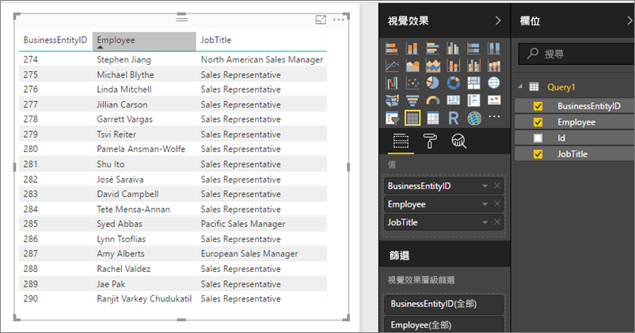

# 在 Power BI 報表伺服器中存取共用資料集作為 OData 摘要
您可以從 Power BI Desktop 使用 OData 摘要存取共用資料集。

1. 您可以使用 OData 摘要 URL 連線到 OData 來源。
   
    
2. 您將資料帶入 Power BI Desktop 之後，可以在 [查詢編輯器] 中對它進行修改。
   
    
3. 現在您可以使用資料來設計報表。
   
    

務必使用 [進階選項]，以便開啟 [開啟類型資料行]，並且據以在 Power Query 中格式化資料行以符合您的需求。

深入了解[在 Power BI Desktop 中連線到 OData 摘要](../desktop-connect-odata.md)。

有其他問題嗎？ [嘗試在 Power BI 社群提問](https://community.powerbi.com/)

