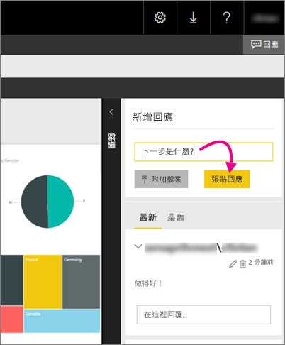

# 在報表伺服器中將註解新增至報表 - Power BI 報表伺服器

您可以在報表伺服器的入口網站中新增報告的註解，包括 Power BI 報告。 註解會與報告在一起，任何人只要有正確權限，都可以看到報告的註解。 如需詳細資料，請參閱下方的[權限](#permissions)一節。

## 新增或檢視註解

1. 開啟報表伺服器上的編頁報告或 Power BI 報告。
2. 在右上角選取 [註解]  。

    ![選取 [註解]](media/add-comments/report-server-web-portal-comments-button.png)

    在 [註解] 窗格中，您可以看到任何現有的註解。
3. 撰寫您的註解，然後選取 [張貼註解]  。

    

    您的註解會連同先前的任何註解，一起顯示在入口網站的窗格中。 在 Power BI 行動裝置應用程式中，註解不會隨著報告一起出現。

   > [!TIP]
   > 您知道嗎？ 您可以[在 Power BI 行動裝置應用程式中標註 Power BI 報告](../consumer/mobile/mobile-annotate-and-share-a-tile-from-the-mobile-apps.md)，並與其他人共用已標註的報告。

## 權限

根據您的權限，您可以：

* 看不到註解。
* 看到所有註解，以及張貼、編輯和刪除您自己的註解。
* 看到所有註解，張貼、編輯和刪除您自己的註解，以及刪除其他人的註解。

## 後續步驟
* [什麼是 Power BI 報表伺服器？](get-started.md)  

有其他問題嗎？ [嘗試在 Power BI 社群提問](https://community.powerbi.com/)

