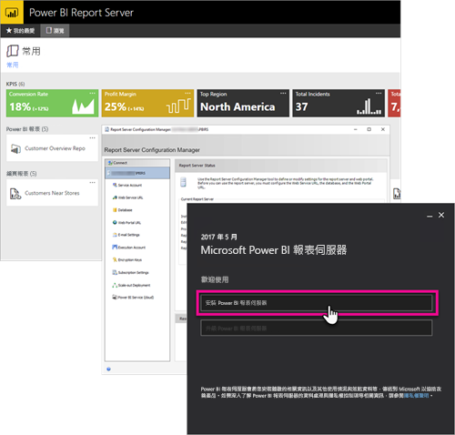

# 系統管理員概觀：Power BI 報表伺服器
本文是 Power BI 報表伺服器的系統管理員概觀，這個內部部署位置可用於儲存及管理您的 Power BI 報表、行動報表及分頁報表。 此文章將介紹規劃、部署及管理「Power BI 報表伺服器」的概念，並提供詳細資訊連結。

 
## 安裝和移轉
您必須安裝 Power BI 報表伺服器，才可開始使用。 我們有文章說明如何處理這樣的工作。

請先參閱報表伺服器的[系統需求](system-requirements.md)，再開始安裝、升級或移轉至 Power BI 報表伺服器。

### 安裝中
如果您要部署新的「Power BI 報表伺服器」，可以使用下列協助文件。 

[安裝 Power BI 報表伺服器](install-report-server.md)

### 移轉
SQL Server Reporting Services 沒有任何就地升級。 若您有現有的 SQL Server Reporting Services 執行個體，且想要設為 Power BI 報表伺服器，就必須加以移轉。 若為其他原因，也建議您執行移轉。 檢閱移轉文件以了解詳細資料。

[移轉報表伺服器安裝](migrate-report-server.md)

## 設定報表伺服器
設定報表伺服器時，您有許多選項可用。 您要使用 SSL 嗎？ 您要設定電子郵件伺服器嗎？ 您要與 Power BI 服務整合，以釘選視覺效果嗎？

您的多數設定都將在報表伺服器組態管理員中進行。 查看[組態管理員](/sql/reporting-services/install-windows/reporting-services-configuration-manager-native-mode)文件以取得詳細資料。

## 安全性
安全性與保護對所有組織而言都至關重要。 您可以在[安全性](/sql/reporting-services/security/reporting-services-security-and-protection)文件中，了解驗證、授權、角色與權限。

## 後續步驟
[安裝 Power BI 報表伺服器](install-report-server.md)  
[尋找您的報表伺服器產品金鑰](find-product-key.md)  
[安裝針對 Power BI 報表伺服器最佳化的 Power BI Desktop](install-powerbi-desktop.md)  
[下載報表產生器](https://www.microsoft.com/download/details.aspx?id=53613)  
[下載 SQL Server Data Tools (SSDT)](/sql/ssdt/download-sql-server-data-tools-ssdt)

有其他問題嗎？ [嘗試在 Power BI 社群提問](https://community.powerbi.com/)