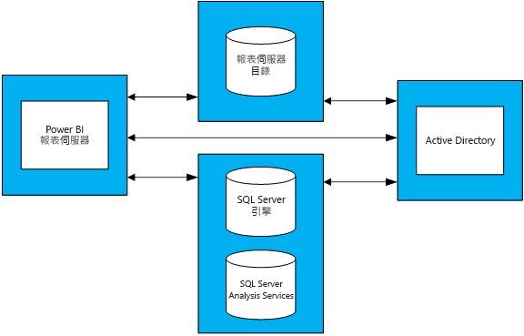

# Power BI 報表伺服器的容量規劃指引
Power BI 報表伺服器是客戶可以在其防火牆後方內部部署的自助 BI 和企業報告解決方案。 它結合 Power BI Desktop 的互動式報表功能與 SQL Server Reporting Services 的內部部署伺服器平台。 隨著企業內的分析和報告使用量愈來愈大，估算所需的硬體基礎結構和軟體授權以依照企業使用者總數來調整規模會是項挑戰。 本文旨在提供 Power BI 報表伺服器容量規劃的相關指引，文中並共用對報表伺服器的各種工作負載所執行的多項負載測試結果。 雖然組織的報表、查詢和使用模式差異很大，但本文中所呈現的結果，以及所使用的實際測試及其執行方式的詳細描述，可作為任何人在部署 Power BI 報表伺服器之初期規劃程序的參考點。

## 執行摘要
我們對 Power BI 報表伺服器執行兩種不同的工作負載類型；每種工作負載都需要轉譯不同類型的報表，以及執行各種入口網站作業。 

* 在「Power BI 報表 (大量)」工作負載中，最常執行的作業 (也就是 60% 的時間所執行的作業) 是轉譯 Power BI 報表。
* 在「編頁報表 (大量)」工作負載中，最常執行的作業是轉譯編頁報表。

在 Power BI 報表伺服器的四部伺服器拓撲下，且預期任何時間都不會有超過 5% 的使用者存取報表伺服器，下表描述 Power BI 報表伺服器在至少 99% 可靠性下所能處理的使用者數目上限。 

| 工作負載 | 8 核心/32 GB RAM | 16 核心/64 GB RAM |
| --- | --- | --- |
| **Power BI 報表 (大量)** (>60%) |1,000 位使用者 |3,000 位使用者 |
| **編頁 (RDL) 報表 (大量)** (>60%) |2,000 位使用者 |3,200 位使用者 |

在每個回合中，負荷最高的資源是 CPU。 因此，比起增加記憶體或硬碟空間量，增加 Power BI 報表伺服器的核心數會更大幅地提高系統的可靠性。 

## 測試方法
所使用的測試拓撲是以 Microsoft Azure 虛擬機器為基礎，而不是廠商特定的實體硬體。 所有機器均裝載於美國地區。 這反映了內部部署與公用雲端中硬體虛擬化的一般趨勢。 

### Power BI 報表伺服器拓撲
Power BI 報表伺服器部署是由下列虛擬機器所組成：

* Active Directory 網域控制站：SQL Server 資料庫引擎、SQL Server Analysis Services 和 Power BI 報表伺服器需要此項目才能安全地驗證所有要求。
* SQL Server 資料庫引擎和 SQL Server Analysis Services：這是我們儲存所有資料庫，以在轉譯報表時供報表取用的位置。
* Power BI 報表伺服器
* Power BI 報表伺服器資料庫。 此報表伺服器資料庫會與 Power BI 報表伺服器裝載在不同的機器上，因此不需要與 SQL Server 資料庫引擎競爭記憶體、CPU、網路和磁碟資源。

請參閱附錄 1.1＜Power BI 報表伺服器拓撲＞和附錄 1.2＜Power BI 報表伺服器虛擬機器設定＞，以完整設定拓撲中所使用的每部虛擬機器。

### 測試
負載測試回合中所使用的測試已公開在稱為 [Reporting Services LoadTest](https://github.com/Microsoft/Reporting-Services-LoadTest) (報表服務負載測試) 的 GitHub 專案中。 此工具可讓使用者研究 SQL Server Reporting Services 和 Power BI 報表伺服器的效能、可靠性、延展性和可復原性特性。 此專案是由四組測試案例所組成：

* 模擬轉譯 Power BI 報表的測試，
* 模擬轉譯行動報表的測試，
* 模擬轉譯小型和大型編頁報表的測試，以及 
* 模擬執行各種入口網站作業的測試。 

所有測試都是為了執行端對端作業所撰寫 (例如轉譯報表、建立新的資料來源等)。 它們會藉由向報表伺服器提出一或多個 Web 要求 (透過 API) 來完成此工作。 在真實世界中，使用者可能需要執行一些中繼作業，才能完成這些端對端作業之一。 例如，若要轉譯報表，使用者必須前往入口網站，巡覽至報表所在的資料夾，然後按一下報表將它轉譯。 雖然測試不會執行完成端對端工作所需的所有作業，但仍會加諸 Power BI 報表伺服器所遇到的大部分負載。 您可以探索 GitHub 專案，以深入了解所使用的不同報表類型及所執行的各種作業。  

> [!NOTE]
> 此工具並未正式受到 Microsoft 支援，但是產品小組會參與由其他參與者所發起的專案，並回答其問題。

### 工作負載
測試中使用 2 個工作負載設定檔：Power BI 報表 (大量) 和編頁報表 (大量)。 下表描述對報表伺服器所執行之要求的分佈。

| 活動 | Power BI 報表 (大量)，發生頻率 | 編頁報表 (大量)，發生頻率 |
| --- | --- | --- |
| **轉譯 Power BI 報表** |60% |10% |
| **轉譯編頁 (RDL) 報表** |30% |60% |
| **轉譯行動報表** |5% |20% |
| **入口網站作業** |5% |10% |

### 使用者負載
對於每個測試回合，會根據兩個工作負載之一所指定的頻率來執行測試。 測試一開始有 20 位並行使用者對報表伺服器提出要求。 使用者負載會接著逐漸增加，直到可靠性低於 99%目標為止。

## 結果
### 並行使用者產能
如前所述，測試一開始有 20 位並行使用者向報表伺服器提出要求。 此並行使用者數目會接著逐漸增加，直到所有要求的 1% 失敗為止。 下表中的結果指出伺服器在失敗率低於 1% 的尖峰負載下，所能處理的並行使用者要求數目。

| 工作負載 | 8 核心/32 GB | 16 核心/64 GB |
| --- | --- | --- |
| **Power BI 報表 (大量)** |50 位並行使用者 |150 位並行使用者 |
| **編頁報表 (大量)** |100 位並行使用者 |160 位並行使用者 |

### 總使用者產能
在 Microsoft，我們有幾個小組所使用的 Power BI 報表伺服器生產環境部署。 當我們分析此環境的實際使用量時，我們觀察到任何給定時間 (即使在每日尖峰負載期間) 的並行使用者數目通常不會超過使用者總數的 5%。 使用此 5% 並行率作為基準，我們可以推測 Power BI 報表伺服器在 99% 可靠性下所能處理的使用者總數。

| 工作負載 | 8 核心/32 GB | 16 核心/64 GB |
| --- | --- | --- |
| **Power BI 報表 (大量)** |1,000 位使用者 |3,000 位使用者 |
| **編頁報表 (大量)** |2,000 位使用者 |3,200 位使用者 |

## 摘要
對於每個負載測試回合，CPU 是 Power BI 報表伺服器機器上尖峰負載時負荷最高的資源。 因此，第一個應該增加的資源是核心數。 或者，您可以考慮在拓撲中新增更多裝載 Power BI 報表伺服器的伺服器來相應放大。

本文中呈現的結果是從執行一組特定報表衍生而來，該報表以特定方式重複取用一組特定資料。 這是有用的參考點，但請記住，您的使用將取決於報表、查詢、使用模式與 Power BI 報表伺服器的部署。

## 附錄
### 1 拓撲
**1.1 Power BI 報表伺服器拓撲**

為了只專注於不同設定下的 Power BI 報表伺服器行為，已修正每種機器類型的 VM 設定 (裝載 Power BI 報表伺服器的機器除外)。 每部機器已根據第二代 (v2) D 系列機器佈建進階儲存體磁碟。 您可以在 [[一般目的] 區段](https://azure.microsoft.com/pricing/details/virtual-machines/windows/)下找到有關每個 VM 大小的詳細資訊。

| 虛擬機器類型 | 處理器 | 記憶體 | Azure VM 大小 |
| --- | --- | --- | --- |
| **Active Directory 網域控制站** |2 個核心 |7 GB |Standard_DS2_v2 |
| **SQL Server 資料庫引擎和 Analysis Services** |16 個核心 |56 GB |Standard_DS5_v2 |
| **報表伺服器資料庫** |16 個核心 |56 GB |Standard_DS5_v2 |

**1.2 Power BI 報表伺服器虛擬機器設定** 

裝載 Power BI 報表伺服器的虛擬機器使用不同的處理器和記憶體組態。 不同於其他 VM，此機器已根據第三代 (v3) D 系列機器佈建進階儲存體磁碟。 您可以在 [[一般目的] 區段](https://azure.microsoft.com/pricing/details/virtual-machines/windows/.)下找到有關此 VM 大小的詳細資訊

| 虛擬機器 | 處理器 | 記憶體 | Azure VM 大小 |
| --- | --- | --- | --- |
| **Power BI 報表伺服器 (小型)** |8 個核心 |32 GB |Standard_D8S_v3 |
| **Power BI 報表伺服器 (大型)** |16 個核心 |64 GB |vStandard_D16S_v3 |

### 2 執行 LoadTest 工具
如果您想要對自己或 Microsoft Azure 的 Power BI 報表伺服器部署執行 Reporting Services LoadTest 工具，請遵循下列步驟。

1. 從 GitHub (https://github.com/Microsoft/Reporting-Services-LoadTest) 複製 Reporting Services LoadTest 專案。  
2. 在專案目錄中，您會找到一個稱為 RSLoadTests.sln 的方案檔。 在 Visual Studio 2015 或更新版本中開啟此檔案。
3. 決定您是要對自己或 Microsoft Azure 的 Power BI 報表伺服器部署執行這項工具。 如果您要對自己的部署執行這項工具，請移至步驟 5。
4. 請遵循 https://github.com/Microsoft/Reporting-Services-LoadTest#create-a-sql-server-reporting-services-load-environment-in-azure 中列出的指示，在 Azure 中建立 Power BI 報表伺服器環境。
5. 完成部署環境後，請按照 https://github.com/Microsoft/Reporting-Services-LoadTest#load-test-execution 上列出的指示執行測試。

有其他問題嗎？ [嘗試在 Power BI 社群提問](https://community.powerbi.com/)
