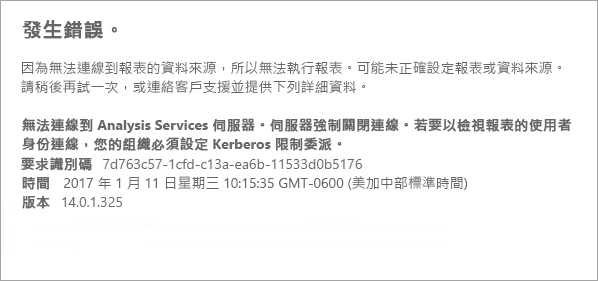

# <a name="configure-kerberos-to-use-power-bi-reports"></a>設定 Kerberos 使用 Power BI 報表
<iframe width="640" height="360" src="https://www.youtube.com/embed/vCH8Fa3OpQ0?showinfo=0" frameborder="0" allowfullscreen></iframe>

了解如何設定報表伺服器進行資料來源的 Kerberos 驗證，這些是用在分散式環境 Power BI 報表內的資料來源。

Power BI 報表伺服器能夠裝載 Power BI 報表。 報表伺服器支援許多資料來源。 雖然這篇文章特別著重於 SQL Server Analysis Services，您可以使用概念並套用到其他資料來源，例如 SQL Server。

您可以在單一電腦上安裝 Power BI 報表伺服器、SQL Server 和 Analysis Services，一切運作應如常，不需要額外的設定。 這非常適合測試環境。 如果將這些服務安裝在不同的機器上，也就是所謂的分散式環境，可能會發生錯誤。 在此環境中，您需要使用 Kerberos 驗證。 實作此作業有必要的設定。 

具體而言，將需要設定限制委派。 您的環境中可能已設定 Kerberos，但它也許未設定限制委派。

## <a name="error-running-report"></a>執行報表時發生錯誤
如未正確設定報表伺服器，您可能會收到下列錯誤。

    Something went wrong.

    We couldn’t run the report because we couldn’t connect to its data source. The report or data source might not be configured correctly. 

在 [技術性詳細資料] 中您會看見下列訊息。

    We couldn’t connect to the Analysis Services server. The server forcibly closed the connection. To connect as the user viewing the report, your organization must have configured Kerberos constrained delegation.



## <a name="configuring-kerberos-constrained-delegation"></a>設定 Kerberos 限制委派
有數個項目必須設定，Kerberos 限制委派才能運作。 這包括服務帳戶的服務主體名稱 (SPN) 和委派設定。

> [!NOTE]
> 為設定 SPN 和委派設定，您必須是網域系統管理員。
> 
> 

我們需要設定或驗證下列內容。

1. 報表伺服器設定中的驗證類型。
2. 報表伺服器服務帳戶的 SPN。
3. Analysis Services 服務的 SPN。
4. Analysis Services 電腦上 SQL Browser 服務的 SPN。 這僅限具名執行個體。
5. 報表伺服器服務帳戶的委派設定。

## <a name="authentication-type-within-report-server-configuration"></a>報表伺服器設定內的驗證類型
我們需要設定報表伺服器的驗證類型，以執行 Kerberos 限制委派。 這是在 **rsreportserver.config** 檔案內完成。 此檔案的預設位置是 `C:\Program Files\Microsoft Power BI Report Server\PBIRS\ReportServer`。

在 rsreportserver.config 檔案中，您會想要精確 **Authentication/AuthenticationTypes** 區段。

我們想要確定 RSWindowsNegotiate 是列在驗證類型清單中的第一個。 它看起來應該如下所示。

```
<AuthenticationTypes>
    <RSWindowsNegotiate/>
    <RSWindowsNTLM/>
</AuthenticationTypes>
```

如果先前必須變更組態檔，您會想要停止並啟動報表伺服器，確定變更生效。

如需詳細資訊，請參閱 [Configure Windows Authentication on the Report Server](https://docs.microsoft.com/sql/reporting-services/security/configure-windows-authentication-on-the-report-server) (在報表伺服器上設定 Windows 驗證)。

## <a name="spns-for-the-report-server-service-account"></a>報表伺服器服務帳戶的 SPN
接下來，我們需要確定報表伺服器是否有可用的有效 SPN。 這是以針對報表伺服器設定的服務帳戶為根據。

### <a name="virtual-service-account-or-network-service"></a>虛擬服務帳戶或網路服務
如果您的報表伺服器已針對虛擬服務帳戶或網路服務帳戶進行設定，您就不必採取任何動作。 這些都在電腦帳戶的內容中。 電腦帳戶預設會有主機 SPN。 這些會涵蓋 HTTP 服務並為報表伺服器所用。

如果您使用的是和電腦帳戶不同的虛擬伺服器名稱，主機項目將不會涵蓋您，而且您需要手動新增該虛擬伺服器主機名稱的 SPN。

### <a name="domain-user-account"></a>網域使用者帳戶
如果您的報表伺服器設定為使用網域使用者帳戶，您即必須對該帳戶手動建立 HTTP SPN。 這可以使用隨附於 Windows 的 setspn 工具來完成。

> [!NOTE]
> 您需要有網域系統管理員的權限才能建立 SPN。
> 
> 

建議您建立兩個 SPN。 一個使用 NetBIOS 名稱，另一個使用完整的網域名稱 (FQDN)。 SPN 的格式應該如下。

    <Service>/<Host>:<port>

Power BI 報表伺服器會使用 HTTP 服務。 HTTP SPN 不會列出連接埠。 在此，我們在意的服務是 HTTP。 SPN 主機會是您在 URL 中使用的名稱。 一般會是電腦名稱。 如果您在負載平衡器後方，這可能是虛擬名稱。

> [!NOTE]
> 您可以查看在瀏覽器中的網址列中輸入的內容，或查看入口網站 [URL] 索引標籤上的報表伺服器設定管理員，來驗證 URL。
> 
> 

如果您的電腦名稱是 ContosoRS，則 SPN 可能如下。

| SPN 類型 | SPN |
| --- | --- |
| 完整網域名稱 (FQDN) |HTTP/ContosoRS.contoso.com |
| NetBIOS |HTTP/ContosoRS |

### <a name="location-of-spn"></a>SPN 的位置
所以，您把 SPN 放在哪兒呢？ SPN 會放在您使用服務帳戶的任何位置。 如果您使用的是虛擬服務帳戶或網路服務，這就是電腦帳戶。 雖然我們之前說過，您只需要為虛擬 URL執行這項操作。 如果您使用報表伺服器服務帳戶的網域使用者，則 SPN 會放在該網域使用者的帳戶上。

例如，如果我們使用網路服務帳戶，而我們的電腦名稱是 ContosoRS，則我們會將 SPN 放在 ContosoRS 上。

如果我們使用 RSService 的網域使用者帳戶，則會將 SPN 放在 RSService 上。

### <a name="using-setspn-to-add-the-spn"></a>使用 SetSPN 新增 SPN
我們可以使用 SetSPN 工具新增 SPN。 電腦帳戶和網域使用者帳戶會完全遵循上例。

如果我們使用 contosoreports 的虛擬 URL，FQDN 和 NetBIOS SPN 將 SPN 放在電腦帳戶上會看起來如下。

      Setspn -a HTTP/contosoreports.contoso.com ContosoRS
      Setspn -a HTTP/contosoreports ContosoRS

如果 SPN 主機使用電腦名稱，FQDN 和 NetBIOS SPN 將 SPN 放在網域使用者帳戶上看起來如下。

      Setspn -a HTTP/ContosoRS.contoso.com RSService
      Setspn -a HTTP/ContosoRS RSService

## <a name="spns-for-the-analysis-services-service"></a>Analysis Services 服務的 SPN
Analysis Services 的 SPN 和我們對 Power BI 報表伺服器做過的類似。 如果您擁有具名執行個體，SPN 格式會略有不同。

我們在 Analysis Services 使用的是 MSOLAPSvc.3 服務。 我們會在 SPN 上指定連接埠位置的執行個體名稱。 SPN 的主機部分會是電腦名稱或叢集虛擬名稱。

Analysis Services SPN 的範例看起來如下。

| 類型 | 格式 |
| --- | --- |
| 預設執行個體 |MSOLAPSvc.3/ContosoAS.contoso.com<br>MSOLAPSvc.3/ContosoAS |
| 具名執行個體 |MSOLAPSvc.3/ContosoAS.contoso.com:INSTANCENAME<br>MSOLAPSvc.3/ContosoAS:INSTANCENAME |

SPN 的放置也類似前面提及的 Power BI 報表伺服器內容。 它是以服務帳戶為基礎。  如果您使用本機系統或網路服務，則是在電腦帳戶的內容中。 如果您使用 Analysis Services 執行個體的網域使用者帳戶，則 SPN 會放在該網域使用者的帳戶上。

### <a name="using-setspn-to-add-the-spn"></a>使用 SetSPN 新增 SPN
我們可以使用 SetSPN 工具新增 SPN。 本例的電腦名稱會是 ContosoAS。

FQDN 和 NetBIOS SPN 將 SPN 放在電腦帳戶上看起來如下。

    Setspn -a MSOLAPSvc.3/ContosoAS.contoso.com ContosoAS
    Setspn -a MSOLAPSvc.3/ContosoAS ContosoAS

FQDN 和 NetBIOS SPN 將 SPN 放在網域使用者帳戶上看起來如下。

    Setspn -a MSOLAPSvc.3/ContosoAS.contoso.com OLAPService
    Setspn -a MSOLAPSvc.3/ContosoAS OLAPService

## <a name="spns-for-the-sql-browser-service"></a>SQL Browser 服務的 SPN
如果您有 Analysis Services 具名執行個體，您也需要確定有瀏覽器服務的 SPN。 這對 Analysis services 而言是唯一的。

SQL Browser 的 SPN 和我們對 Power BI 報表伺服器做過的類似。

我們在 SQL Browser 使用 MSOLAPDisco.3 服務。 我們會在 SPN 上指定連接埠位置的執行個體名稱。 SPN 的主機部分會是電腦名稱或叢集虛擬名稱。
您不必為執行個體名稱或連接埠指定任何內容。

Analysis Services SPN 的範例看起來如下。

    MSOLAPDisco.3/ContosoAS.contoso.com
    MSOLAPDisco.3/ContosoAS

SPN 的放置也類似前面提及的 Power BI 報表伺服器內容。 此處的差異是 SQL Browser 一律在本機系統帳戶下執行。 這表示 SPN 一律會在電腦帳戶上。 

### <a name="using-setspn-to-add-the-spn"></a>使用 SetSPN 新增 SPN
我們可以使用 SetSPN 工具新增 SPN。 本例的電腦名稱會是 ContosoAS。

FQDN 和 NetBIOS SPN 將 SPN 放在電腦帳戶上看起來如下。

    Setspn -a MSOLAPDisco.3/ContosoAS.contoso.com ContosoAS
    Setspn -a MSOLAPDisco.3/ContosoAS ContosoAS

如需詳細資訊，請參閱[需要 SQL Server Browser 服務的 SPN](https://support.microsoft.com/kb/950599)。

## <a name="delegation-settings-on-the-report-server-service-account"></a>報表伺服器服務帳戶的委派設定
最後必須設定的部分是報表伺服器服務帳戶的委派設定。 您可以使用不同的工具來執行這些步驟。 為符合本文的目的，我們會緊守住 Active Directory 使用者和電腦。

您需要前往 Active Directory 使用者及電腦內的報表伺服器服務帳戶內容來啟動。 如果使用虛擬服務帳戶或網路服務，就會是電腦帳戶，不然就是網域使用者帳戶。

我們會想要使用通訊協定傳輸來設定限制委派。 使用限制委派，您需要明確讓我們委派的目標服務。 我們將要把 Analysis Services 服務 SPN 和 SQL Browser SPN 新增至 Power BI 報表伺服器可以委派的清單中。

1. 以滑鼠右鍵按一下報表伺服器服務帳戶，然後選取 [內容]。
2. 選取 [委派] 索引標籤。
3. 選取 [信任這台電腦，但只委派指定的服務]。
4. 選取 [使用任何驗證通訊協定]。
5. 在 [這個帳戶可以呈送委派認證的服務:] 下，選取 [新增]。
6. 在新的對話方塊中，選取 [使用者或電腦]。
7. 輸入 Analysis Services 服務的服務帳戶，然後選取 [確定]。
8. 選取您建立的 SPN。 它的開頭為 `MSOLAPSvc.3`。 如果您新增了 FQDN 與 NetBIOS SPN，它就會兩個都選取。 您可能只會看到一個。
9. 選取 [確定] 。  您現在應該會在清單中看到 SPN。
10. 或者，您可以選取 [展開] 來顯示清單中的 FQDN 和 NetBIOS SPN。
11. 再次選取 [新增]。 現在我們要新增 SQL Browser SPN。
12. 在新的對話方塊中，選取 [使用者或電腦]。
13. 輸入 SQL Browser 服務所在電腦的電腦名稱，並選取 [確定]。
14. 選取您建立的 SPN。 它的開頭為 `MSOLAPDisco.3`。 如果您新增了 FQDN 與 NetBIOS SPN，它就會兩個都選取。 您可能只會看到一個。
15. 選取 [確定]。 如果選取 [展開]，對話方塊應該如下。
    
    
16. 選取 [確定]。
17. 重新啟動 Power BI 報表伺服器。

## <a name="running-a-power-bi-report"></a>執行 Power BI 報表
上述所有設定都就緒後，您的報表應該會正確顯示。 


雖然此設定在使用 Kerberos 的大多數情況下都可行，但您可根據環境使用不同的設定。 如果仍無法載入報表，請連絡您的網域系統管理員進一步調查，或連絡支援人員。

## <a name="next-steps"></a>後續步驟
[系統管理員概觀](admin-handbook-overview.md)  
[安裝 Power BI 報表伺服器](install-report-server.md)  

有其他問題嗎？ [嘗試在 Power BI 社群提問](https://community.powerbi.com/)

