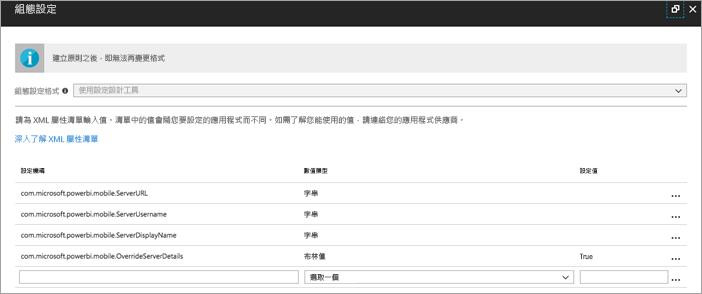
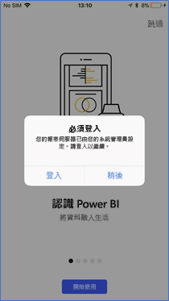
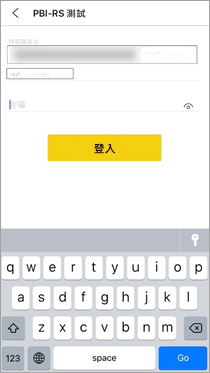

# 從遠端設定 Power BI iOS 行動裝置應用程式對報表伺服器的存取

在本文中，您可以了解如何使用組織的 MDM 工具來設定 Power BI iOS 行動裝置應用程式對報表伺服器的存取。 若要進行此設定，IT 系統管理員會使用要推送到應用程式的必要資訊，來建立應用程式設定原則。 

 Power BI iOS 行動裝置應用程式的使用者，可利用已設定的報表伺服器連線，更輕鬆地連線到其組織的報表伺服器。 

## 在 MDM 工具中建立應用程式組態原則 

若您是系統管理員，請在 Microsoft Intune 中遵循這些步驟，來建立應用程式設定原則。 應用程式組態原則的建立步驟與體驗，在其他 MDM 工具中可能不同。 

1. 與您的 MDM 工具連線。 
2. 建立新的應用程式組態原則並為其命名。 
3. 選擇要將此應用程式組態原則發佈給哪些使用者。 
4. 建立機碼值組。 

下表提供各組的詳細說明。

|索引鍵  |類型  |描述  |
|---------|---------|---------|
| com.microsoft.powerbi.mobile.ServerURL | 字串 | 報表伺服器 URL   開頭應為 http/https |
| com.microsoft.powerbi.mobile.ServerUsername | 字串 | [選擇性]   用於與伺服器連線的使用者名稱。   若沒有此名稱，應用程式會提示使用者鍵入用於連線的使用者名稱。| 
| com.microsoft.powerbi.mobile.ServerDisplayName | 字串 | [選擇性]   預設值為「報表伺服器」   應用程式中用來代表伺服器的易記名稱 | 
| com.microsoft.powerbi.mobile.OverrideServerDetails | 布林值 | 預設值為 True  當其設定為 "True" 時，會覆寫已在行動裝置中的所有報表伺服器定義。 將會刪除已設定的現有伺服器。   Override 設為 True 也會讓使用者無法移除該組態。   設為 “False” 則會新增推送的值，保留任何現有設定。   如果在行動裝置應用程式中已設定了相同的伺服器 URL，應用程式就會脫離該設定的原狀。 應用程式不會要求使用者重新驗證相同的伺服器。 |

以下是使用 Intune 設定設定原則的範例。

## 終端使用者連線到報表伺服器

 假設您對通訊群組清單發佈了應用程式設定原則。 則當通訊群組清單上的使用者與裝置，啟動 iOS 行動裝置應用程式時，會有如下的體驗。 

1. 他們會看到訊息顯示行動裝置應用程式已設有報表伺服器，然後點選 [登入]。

    

2.  在 [連線到伺服器] 頁面上，報表伺服器的詳細資料已填入。 他們會點選 [連線]。

    

3. 他們會鍵入密碼以進行驗證，然後點選 [登入]。 

    

現在，他們可以檢視儲存在報表伺服器上的 KPI 和 Power BI 報表，並與其互動。

## 後續步驟
[系統管理員概觀](admin-handbook-overview.md)  
[安裝 Power BI 報表伺服器](install-report-server.md)  

有其他問題嗎？ [嘗試在 Power BI 社群提問](https://community.powerbi.com/)

