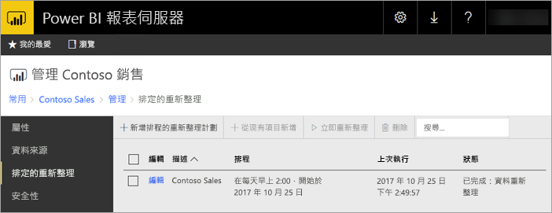
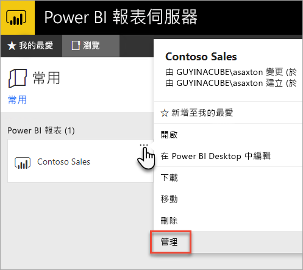
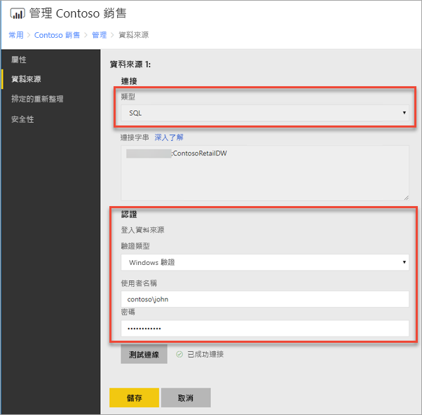
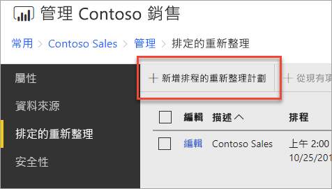
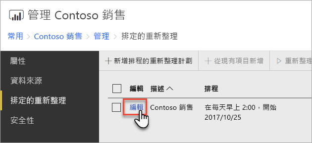

# 如何設定 Power BI 報表排程的重新整理
若要重新整理 Power BI 報表中的資料，必須建立排程的重新整理計劃。 這是在 Power BI 報表的「管理」區域內完成的。

## 設定資料來源認證
在建立排程資料重新整理計劃之前，您必須設定要在 Power BI 報表中使用之**每個資料來源**的認證。

1. 在 Web 入口網站中，以滑鼠右鍵按一下 Power BI 報表，然後選取 [管理]。
   
    
2. 在左側功能表中，選取 [資料來源] 索引標籤。
3. 針對顯示的每個資料來源，選擇連線至該資料來源時要使用的驗證類型。 輸入適當認證。
   
    

## 建立排程重新整理計劃
請遵循下列步驟以建立排程的重新整理計劃。

1. 在 Web 入口網站中，以滑鼠右鍵按一下 Power BI 報表，然後選取 [管理]。
   
    
2. 在左側功能表中，選取 [排程的重新整理] 索引標籤。
3. 在 [排程的重新整理] 分頁上，選取 [新增排程的重新整理計劃]。
   
    
4. 在 [新增排程的重新整理計劃] 分頁上，輸入描述，然後針對您想要重新整理資料模型的時間設定排程。
5. 完成時，選取 [建立排程的重新整理計劃]。
   
    

## 修改排程重新整理計劃
修改排程的重新整理計劃類似於建立。

1. 在入口網站中，以滑鼠右鍵按一下 Power BI 報表，然後選取 [管理]。
   
    
2. 在左側功能表中，選取 [排程的重新整理] 索引標籤。
3. 在 [排程的重新整理] 分頁上，選取您想要管理之重新整理計劃旁邊的 [編輯]。
   
    
4. 在 [編輯排程的重新整理計劃] 分頁上，輸入描述，然後針對您想要重新整理資料模型的時間設定排程。
5. 完成時，請選取 [套用]。
   
    

## 檢視排程重新整理計劃的狀態
在入口網站中檢視排程重新整理計劃的狀態。

1. 在入口網站中，以滑鼠右鍵按一下 Power BI 報表，然後選取 [管理]。
   
    
2. 在左側功能表中，選取 [排程的重新整理] 索引標籤。
3. 在 [排程的重新整理] 分頁中，最右邊的資料行會顯示計劃的狀態。
   
   | **狀態** | **描述** |
   | --- | --- |
   | 新增排程的重新整理計劃 |計劃已建立，但尚未執行。 |
   | 重新整理 |重新整理處理程序已啟動。 |
   | 將模型串流到 Analysis Server |從報表伺服器目錄資料庫將模型複製到裝載的 Analysis Services 執行個體。 |
   | 重新整理資料 |重新整理模型內的資料。 |
   | 從模型移除認證 |從模型移除用來連線到資料來源的認證。 |
   | 將模型儲存至目錄 |重新整理資料已完成，而且重新整理的模型已儲存回報表伺服器目錄資料庫。 |
   | 已完成：資料重新整理 |重新整理已完成。 |
   | 錯誤： |重新整理期間發生錯誤，而且會顯示。 |

必須重新整理網頁，才能查看目前的狀態。 狀態不會自動變更。

## 後續步驟
若要了解建立與修改排程，請參閱[建立、修改和刪除排程](https://docs.microsoft.com/sql/reporting-services/subscriptions/create-modify-and-delete-schedules)。

如需如何針對排程的重新整理進行疑難排解的詳細資訊，請參閱[針對 Power BI 報表伺服器中排程的重新整理進行疑難排解](scheduled-refresh-troubleshoot.md)。

有其他問題嗎？ [嘗試在 Power BI 社群提問](https://community.powerbi.com/)

