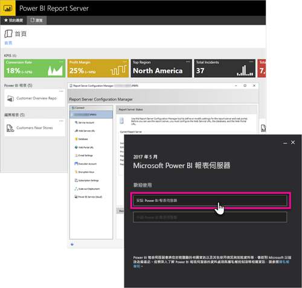

# 開發人員手冊概觀, Power BI 報表伺服器

歡迎使用 Power BI 報表伺服器的開發人員手冊，您可於此內部部署位置中儲存和管理您的 Power BI 報表、行動報表及編頁報表。

本手冊會反白顯示您作為開發人員所具有的選項，以使用 Power BI 報表伺服器。

## 內嵌

對於 Power BI 報表伺服器中的任何報表，您可透過將查詢字串參數 `?rs:Embed=true` 新增至 URL，在 iFrame 內進行內嵌。 此技術適用於 Power BI 報表及其他報表類型。

### 報表檢視器控制項

對於編頁報表，您可以利用報表檢視器控制項。 有了它，您就可以將控制項置於 .NET 視窗或 Web 應用程式內。 如需詳細資訊，請參閱[開始使用報表檢視器控制項](https://docs.microsoft.com/sql/reporting-services/application-integration/integrating-reporting-services-using-reportviewer-controls-get-started)。

## API

您有數個 API 選項可選，能與 Power BI 報表伺服器互動。 此技術包括下列各項。

* [REST API](rest-api.md)
* [URL 存取](https://docs.microsoft.com/sql/reporting-services/url-access-ssrs)
* [WMI 提供者](https://docs.microsoft.com/sql/reporting-services/wmi-provider-library-reference/reporting-services-wmi-provider-library-reference-ssrs)

您也可以使用開放原始碼 [PowerShell 公用程式](https://github.com/Microsoft/ReportingServicesTools)來管理報表伺服器。

> [!NOTE]
> PowerShell 公用程式目前不支援 Power BI Desktop 檔案 (.pbix)。

## 自訂延伸模組

延伸模組程式庫是一組類別、介面和實值型別，包含在 Power BI 報表伺服器中。 此程式庫提供系統功能存取，並設計作為 Microsoft .NET Framework 應用程式用來擴充 Power BI 報表伺服器元件所在的基礎。

您可以建置數種類型的延伸模組。

* 資料處理延伸模組
* 傳遞延伸模組
* 編頁報表的轉譯延伸模組
* 安全性延伸模組

如需深入了解，請參閱[延伸模組程式庫](https://docs.microsoft.com/sql/reporting-services/extensions/reporting-services-extension-library)。

## 後續步驟

[開始使用報表檢視器控制項](https://docs.microsoft.com/sql/reporting-services/application-integration/integrating-reporting-services-using-reportviewer-controls-get-started)  
[使用 Web 服務和 .NET Framework 建置應用程式](https://docs.microsoft.com/sql/reporting-services/report-server-web-service/net-framework/building-applications-using-the-web-service-and-the-net-framework)  
[URL 存取](https://docs.microsoft.com/sql/reporting-services/url-access-ssrs)  
[ 延伸模組程式庫](https://docs.microsoft.com/sql/reporting-services/extensions/reporting-services-extension-library)  
[WMI 提供者](https://docs.microsoft.com/sql/reporting-services/wmi-provider-library-reference/reporting-services-wmi-provider-library-reference-ssrs)

有其他問題嗎？ [嘗試在 Power BI 社群提問](https://community.powerbi.com/)