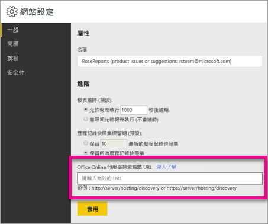

# <a name="configure-your-report-server-to-host-excel-workbooks-using-office-online-server-oos"></a>使用 Office Online Server (OOS) 設定報表伺服器來裝載 Excel 活頁簿

除了在 Web 入口網站中檢視 Power BI 報表，Power BI 報表伺服器可以使用 [Office Online Server](https://docs.microsoft.com/officeonlineserver/office-online-server-overview) (OOS) 來裝載 Excel 活頁簿。 您的報表伺服器會成為發佈和檢視自助服務 Microsoft BI 內容的單一位置。


## <a name="prepare-server-to-run-office-online-server"></a>準備伺服器以執行 Office Online Server

在將執行 Office Online Server 的伺服器上，執行這些程序。 此伺服器必須是 Windows Server 2012 R2 或 Windows Server 2016。 Windows Server 2016 需要 Office Online Server 2017 年 4 月或更新版本。

### <a name="install-prerequisite-software-for-office-online-server"></a>安裝 Office Online Server 的必要軟體

1. 以系統管理員身分開啟 Windows PowerShell 提示，並執行此命令來安裝必要角色和服務。

    **Windows Server 2012 R2：**

    ```
    Add-WindowsFeature Web-Server,Web-Mgmt-Tools,Web-Mgmt-Console,Web-WebServer,Web-Common-Http,Web-Default-Doc,Web-Static-Content,Web-Performance,Web-Stat-Compression,Web-Dyn-Compression,Web-Security,Web-Filtering,Web-Windows-Auth,Web-App-Dev,Web-Net-Ext45,Web-Asp-Net45,Web-ISAPI-Ext,Web-ISAPI-Filter,Web-Includes,InkandHandwritingServices,NET-Framework-Features,NET-Framework-Core,NET-HTTP-Activation,NET-Non-HTTP-Activ,NET-WCF-HTTP-Activation45,Windows-Identity-Foundation,Server-Media-Foundation
    ```

    **Windows Server 2016：**

    ```
    Add-WindowsFeature Web-Server,Web-Mgmt-Tools,Web-Mgmt-Console,Web-WebServer,Web-Common-Http,Web-Default-Doc,Web-Static-Content,Web-Performance,Web-Stat-Compression,Web-Dyn-Compression,Web-Security,Web-Filtering,Web-Windows-Auth,Web-App-Dev,Web-Net-Ext45,Web-Asp-Net45,Web-ISAPI-Ext,Web-ISAPI-Filter,Web-Includes,NET-Framework-Features,NET-Framework-45-Features,NET-Framework-Core,NET-Framework-45-Core,NET-HTTP-Activation,NET-Non-HTTP-Activ,NET-WCF-HTTP-Activation45,Windows-Identity-Foundation,Server-Media-Foundation
    ```

    系統提示時，請重新啟動伺服器。
2. 安裝下列軟體：

   * [.NET Framework 4.5.2](https://go.microsoft.com/fwlink/p/?LinkId=510096)
   * [適用於 Visual Studio 2013 的 Visual C++ 可轉散發套件](https://www.microsoft.com/download/details.aspx?id=40784)
   * [適用於 Visual Studio 2015 的 Visual C++ 可轉散發套件](https://go.microsoft.com/fwlink/p/?LinkId=620071)
   * [Microsoft.IdentityModel.Extention.dll](https://go.microsoft.com/fwlink/p/?LinkId=620072)

### <a name="install-office-online-server"></a>安裝 Office Online Server

如果您打算使用任何利用外部資料存取的 Excel Online 功能 (例如 Power Pivot)，請注意 Office Online Server 必須位在與其使用者相同的 Active Directory 樹系中，以及您打算使用 Window 型驗證存取的任何外部資料來源。

1. 從 [Volume Licensing Service Center (VLSC)](http://go.microsoft.com/fwlink/p/?LinkId=256561) 下載 Office Online Server。 下載位於 VLSC 入口網站的這些 Office 產品下方。 基於開發目的，您可以從 MSDN 訂閱者下載中下載 OOS。
2. 執行 Setup.exe。
3. 在 [閱讀 Microsoft 軟體授權條款] 頁面上，選取 [我接受這份合約]，然後選取 [繼續]。
4. 在 [選擇檔案位置] 頁面上，選取您要安裝 Office Online Server 檔案的資料夾 (例如 C:\Program Files\Microsoft Office Web Apps*)，然後選取 [立即安裝]。 如果您指定的資料夾不存在，則安裝程式會建立它。

    建議您在系統磁碟機上安裝 Office Online Server。

5. 安裝程式完成安裝 Office Online Server 時，請選取 [關閉]。

### <a name="install-language-packs-for-office-web-apps-server-optional"></a>安裝 Office Web Apps Server 的語言套件 (選擇性)

Office Online Server Language Pack 可讓使用者以多國語言檢視網頁 Office 檔案。

若要安裝語言套件，請遵循下列步驟。

1. 從 [Microsoft 下載中心](http://go.microsoft.com/fwlink/p/?LinkId=798136)下載 Office Online Server Language Pack。
2. 執行 **wacserverlanguagepack.exe**。
3. 在 [Office Online Server Language Pack 精靈] 的 [閱讀 Microsoft 軟體授權條款] 頁面上，選取 [我接受這份合約]，然後選取 [繼續]。
4. 安裝程式完成安裝 Office Online Server 時，請選取 [關閉]。

## <a name="deploy-office-online-server"></a>部署 Office Online Server

### <a name="create-the-office-online-server-farm-https"></a>建立 Office Online Server 伺服器陣列 (HTTPS)

使用 New-OfficeWebAppsFarm 命令，來建立包含單一伺服器的新 Office Online Server 伺服器陣列，如下列範例所示。

```
New-OfficeWebAppsFarm -InternalUrl "https://server.contoso.com" -ExternalUrl "https://wacweb01.contoso.com" -CertificateName "OfficeWebApps Certificate"
```

**參數**

* **–InternalURL** 是執行 Office Online Server 的伺服器完整網域名稱 (FQDN)，例如 `http://servername.contoso.com`。
* **–ExternalURL** 是可在網際網路上存取的 FQDN。
* **–CertificateName** 是憑證的易記名稱。

### <a name="create-the-office-online-server-farm-http"></a>建立 Office Online Server 伺服器陣列 (HTTP)

使用 New-OfficeWebAppsFarm 命令，來建立包含單一伺服器的新 Office Online Server 伺服器陣列，如下列範例所示。

```
New-OfficeWebAppsFarm -InternalURL "http://servername" -AllowHttp
```

**參數**

* **–InternalURL** 是執行 Office Online Server 的伺服器名稱，例如 `http://servername`。
* **–AllowHttp** 設定伺服器陣列使用 HTTP。

### <a name="verify-that-the-office-online-server-farm-was-created-successfully"></a>確認已成功建立 Office Online Server 伺服器陣列

建立伺服器陣列之後，伺服器陣列的詳細資料會顯示在 Windows PowerShell 提示字元中。 若要確認已正確安裝和設定 Office Online Server，請使用網頁瀏覽器存取 Office Online Server 探索 URL，如下列範例所示。 探索 URL 是設定 Office Online Server 伺服器陣列時所指定的 *InternalUrl* 參數，後接 */hosting/discovery*，例如：

```
<InternalUrl>/hosting/discovery
```

如果 Office Online Server 如預期運作，您應該會在網頁瀏覽器中看到 Web Application Open Platform Interface Protocol (WOPI) 探索 XML 檔案。 該檔案的前幾行應該類似下列範例：

```
<?xml version="1.0" encoding="utf-8" ?> 
- <wopi-discovery>
- <net-zone name="internal-http">
- <app name="Excel" favIconUrl="<InternalUrl>/x/_layouts/images/FavIcon_Excel.ico" checkLicense="true">
<action name="view" ext="ods" default="true" urlsrc="<InternalUrl>/x/_layouts/xlviewerinternal.aspx?<ui=UI_LLCC&><rs=DC_LLCC&>" /> 
<action name="view" ext="xls" default="true" urlsrc="<InternalUrl>/x/_layouts/xlviewerinternal.aspx?<ui=UI_LLCC&><rs=DC_LLCC&>" /> 
<action name="view" ext="xlsb" default="true" urlsrc="<InternalUrl>/x/_layouts/xlviewerinternal.aspx?<ui=UI_LLCC&><rs=DC_LLCC&>" /> 
<action name="view" ext="xlsm" default="true" urlsrc="<InternalUrl>/x/_layouts/xlviewerinternal.aspx?<ui=UI_LLCC&><rs=DC_LLCC&>" /> 
```

### <a name="configure-excel-workbook-maximum-size"></a>設定 Excel 活頁簿大小上限

Power BI 報表伺服器中所有檔案的檔案大小上限為 100 MB。 若要保持同步，您需要在 OOS 中手動設定此項目。

```
Set-OfficeWebAppsFarm -ExcelWorkbookSizeMax 100
```

## <a name="using-effectiveusername-with-analysis-services"></a>搭配使用 EffectiveUserName 與 Analysis Services

針對利用 EffectiveUserName 之 Excel 活頁簿內的連線，允許 Analysis Services 的即時連線。 為了讓 OOS 利用 EffectiveUserName，您需要針對 Analysis Services 執行個體，以系統管理員身分新增 OOS 伺服器的電腦帳戶。 需要有 Management Studio for SQL Server 2016 或更新版本，才能執行此作業。

在 Excel 活頁簿內，目前只支援內嵌 Analysis Services 連線。 使用者的帳戶必須擁有連線至 Analysis Services 的權限，因為對使用者進行 Proxy 處理的能力無法使用。

在 OOS 伺服器上，執行下列 PowerShell 命令。

```
Set-OfficeWebAppsFarm -ExcelUseEffectiveUserName:$true
Set-OfficeWebAppsFarm -ExcelAllowExternalData:$true
Set-OfficeWebAppsFarm -ExcelWarnOnDataRefresh:$false
```

## <a name="configure-a-power-pivot-instance-for-data-models"></a>設定資料模型的 Power Pivot 執行個體

安裝 Analysis Services Power Pivot 模式執行個體，可讓您使用要使用 Power Pivot 的 Excel 活頁簿。 確定執行個體名稱是 *POWERPIVOT*。 針對 Analysis Services Power Pivot 模式執行個體，以系統管理員身分新增 OOS 伺服器的電腦帳戶。 需要有 Management Studio for SQL Server 2016 或更新版本，才能執行此作業。

為了讓 OOS 使用 Power Pivot 模式執行個體，請執行下列命令。

```
New-OfficeWebAppsExcelBIServer -ServerId <server_name>\POWERPIVOT
```

如果您尚未允許外部資料，請從上述的 Analysis Services 步驟中執行下列命令。

```
Set-OfficeWebAppsFarm -ExcelAllowExternalData:$true
```

### <a name="firewall-considerations"></a>防火牆考量

若要避免防火牆問題，您可能需要開啟連接埠 2382 和 2383。 您也可以針對 Power Pivot 執行個體，將 *msmdsrv.exe* 新增為應用程式防火牆原則。

## <a name="configure-power-bi-report-server-to-use-the-oos-server"></a>設定 Power BI 報表伺服器以使用 OOS 伺服器

在 [網站設定]的 [一般] 頁面上，輸入 OOS 探索 URL。 OOS 探索 URL 是 *InternalUrl*，在部署 OOS 伺服器時使用，後接 */hosting/discovery*。 例如，`http://servername/hosting/discovery` 是針對 HTTP。 而 `https://server.contoso.com/hosting/discovery` 是針對 HTTPS。

若要到達 [網站設定]，請選取右上方的**齒輪圖示**，然後選取 [網站設定]。

只有具有 [系統管理員] 角色的使用者才會看到 Office Online Server 探索 URL 設定。



輸入探索 URL 並選取 [套用] 之後，在入口網站內選取 Excel 活頁簿時應該會在入口網站內顯示入口網站。

## <a name="limitations-and-considerations"></a>限制與考量

* 您會有活頁簿的唯讀功能。

## <a name="next-steps"></a>後續步驟

[系統管理員概觀](admin-handbook-overview.md)  
[安裝 Power BI 報表伺服器](install-report-server.md)  
[下載報表產生器](https://www.microsoft.com/download/details.aspx?id=53613)  
[下載 SQL Server Data Tools (SSDT)](http://go.microsoft.com/fwlink/?LinkID=616714)

有其他問題嗎？ [嘗試在 Power BI 社群提問](https://community.powerbi.com/)