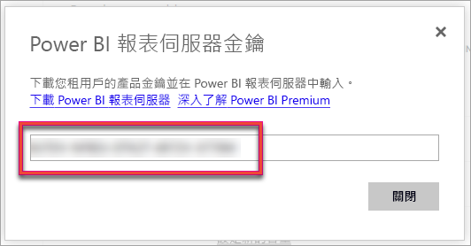
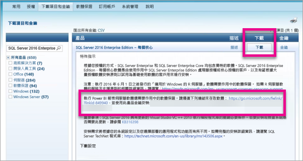

# 如何找到您的報表伺服器產品金鑰
了解如何找到您的 Power BI 報表伺服器產品金鑰，以在生產環境中安裝您的伺服器。

<iframe width="640" height="360" src="https://www.youtube.com/embed/6CQnf-NGtpU?rel=0&amp;showinfo=0" frameborder="0" allowfullscreen></iframe>

您已下載 Power BI 報表伺服器，並具有 SQL Server Enterprise 軟體保證合約。 或者，您已購買 Power BI Premium。 您想要在生產環境中安裝伺服器，但需要產品金鑰才能執行此作業。 產品金鑰在哪裡？ 

根據您的購買內容，產品金鑰會在下列兩個位置的其中一個。

## 已購買 Power BI Premium
如已購買 Power BI Premium，則可在 Power BI 管理入口網站的 [容量設定] 索引標籤內，存取 Power BI 報表伺服器產品金鑰。 這只適用於全域系統管理員，或已獲指派 Power BI 服務系統管理員角色的使用者。

![[Premium 設定] 內的 Power BI 報表伺服器金鑰](media/find-product-key/pbirs-product-key.png)

選取 [Power BI 報表伺服器金鑰] 會顯示一個包含產品金鑰的對話方塊。 您可以複製金鑰，並在安裝時使用。

## 已購買軟體保證合約
如果您有 SQL Server Enterprise SA 合約，您可以從[大量授權服務中心](https://www.microsoft.com/Licensing/servicecenter/)取得您的產品金鑰。 請在最新的 Service Pack 下尋找 SQL Server 的最新版本。 如果您在此看不到，請在最新版 SQL Server 的 RTM 版本下查看。

> [!NOTE]
> 您需要查看 download 區段下方。 而非 keys 區段。
> 
> 

## 後續步驟
[安裝 Power BI 報表伺服器](install-report-server.md)  
[安裝針對 Power BI 報表伺服器最佳化的 Power BI Desktop](install-powerbi-desktop.md)  
[安裝報表產生器](https://docs.microsoft.com/sql/reporting-services/install-windows/install-report-builder)  
[下載 SQL Server Data Tools (SSDT)](http://go.microsoft.com/fwlink/?LinkID=616714)

有其他問題嗎？ [嘗試在 Power BI 社群提問](https://community.powerbi.com/)

