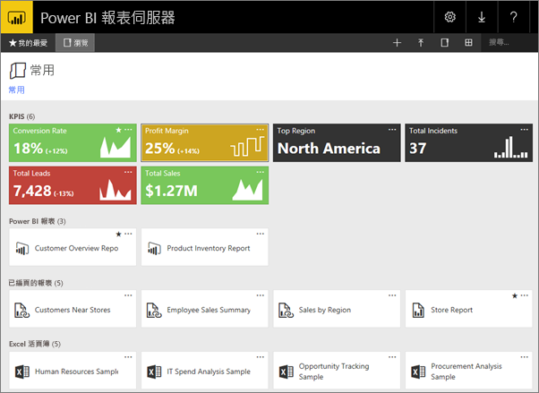
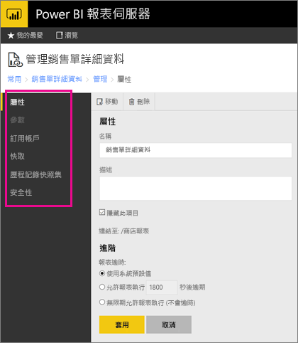

# 管理入口網站中的內容 
Power BI 報表伺服器入口網站是可檢視、儲存和管理您的 Power BI、行動裝置、編頁報表及 KPI 的內部部署位置。

您可在任何新式瀏覽器中檢視入口網站。 在入口網站中，報表和 KPI 是以資料夾組織，您可將它們標示為 [我的最愛]。 您也可以在此儲存 Excel 活頁簿。 您可以從入口網站啟動建立報表所需要的工具︰

* 使用 Power BI Desktop 建立的 **Power BI 報表**：在入口網站和 Power BI 行動裝置應用程式中檢視報表。
* 在 [報表產生器] 中建立的**編頁報表**：現代化外觀、固定版面配置且針對列印最佳化的文件。
* 直接在入口網站中建立 **KPI**。

您可以在入口網站中瀏覽報表伺服器資料夾或搜尋特定的報表。 您可以檢視報表、其一般屬性，以及報表記錄中擷取的舊報表複本。 依據您的權限，您也可以訂閱報表，傳遞至您的電子郵件收件匣或檔案系統的共用資料夾。

## 入口網站的角色和權限
入口網站應用程式會在瀏覽器中執行。 當您啟動入口網站時，頁面、連結以及您看到的選項，都會隨著您在報表伺服器上的權限而異。 如果您獲派具有完整權限的角色，您就可以存取完整的應用程式功能表與頁面組合來管理報表伺服器。 如果您獲派的角色具有檢視和執行報表的權限，您就只能看到進行這些活動所需的功能表與頁面。 針對不同的報表伺服器，甚至單一報表伺服器的不同報告和資料夾，您可以有不同的角色指派。

## 啟動入口網站
1. 開啟網頁瀏覽器。
   
    請參閱此[支援的網頁瀏覽器和版本](browser-support.md)清單。
2. 在網址列中鍵入入口網站 URL。
   
    預設的 URL 是「 http://[電腦名稱]/reports」。
   
    報表伺服器可能設定使用特定的連接埠。 例如，「 http://[電腦名稱]:80/reports」 或「 http://[電腦名稱]:8080/reports」。
   
    您會看到入口網站將項目分組為下列類別︰
   
   * KPI
   * 行動報表
   * 編頁報表
   * Power BI Desktop 報表
   * Excel 活頁簿
   * 資料集
   * 資料來源
   * 資源

## 管理入口網站中的項目
Power BI 報表伺服器會提供您儲存在入口網站之項目的詳細控制。 例如，您可以對個別的編頁報表設定訂用帳戶、快取、快照集及安全性。

1. 選取項目右上角的 更多選項  (...)，然後選取 管理  。
   
    ![選取 [管理]](media/getting-around/report-server-web-portal-manage-ellipsis.png)
2. 選擇您想要設定的屬性或其他功能。
   
    
3. 選取 [ **套用**]。

深入了解[在入口網站中使用訂閱](https://docs.microsoft.com/sql/reporting-services/working-with-subscriptions-web-portal)。

## 後續步驟
[什麼是 Power BI 報表伺服器？](get-started.md)

有其他問題嗎？ [嘗試在 Power BI 社群提問](https://community.powerbi.com/)

