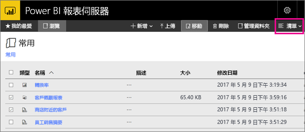

# 瀏覽 Power BI 報表伺服器入口網站
Power BI 報表伺服器入口網站是可檢視、儲存和管理您的 Power BI、行動裝置、編頁報表及 KPI 的內部部署位置。

您可在任何新式瀏覽器中檢視入口網站。 在入口網站中，報表和 KPI 是以資料夾組織，您可將它們標示為 [我的最愛]。 您也可以在此儲存 Excel 活頁簿。 您可以從入口網站啟動建立報表所需要的工具︰

* 以 Power BI Desktop 建立的 **Power BI 報表**：在入口網站及 Power BI 行動裝置應用程式中檢視它們。
* 以報表產生器建立的**編頁報表**：具有現代化外觀、適合列印的最佳化固定配置文件。
* 直接在入口網站中建立 **KPI**。

您可以在入口網站中瀏覽報表伺服器資料夾或搜尋特定的報表。 您可以檢視報表、其一般屬性，以及報表記錄中擷取的舊報表複本。 依據您的權限，您也可以訂閱報表，傳遞至您的電子郵件收件匣或檔案系統的共用資料夾。

## 入口網站工作
您可以使用入口網站處理多項工作，包括︰

* 檢視、搜尋、列印及訂閱報表。
* 建立、保護和維護資料夾階層，以組織伺服器上的項目。
* 設定報表執行屬性、報表記錄和報表參數。
* 建立共用的排程與共用的資料來源，以便管理排程與資料來源連線。
* 建立資料驅動的訂閱以擴大報表的收件者清單。
* 建立連結的報表，以不同的方式重複使用及重新設定現有報表的用途。
* 下載並開啟 Power BI Desktop (報表伺服器)、報表產生器及行動報表發行工具等常用工具。
* [建立 KPI](https://docs.microsoft.com/sql/reporting-services/working-with-kpis-in-reporting-services)。
* 傳送意見反應或提出功能要求。
* [建立入口網站的品牌](https://docs.microsoft.com/sql/reporting-services/branding-the-web-portal)
* [使用 KPI](https://docs.microsoft.com/sql/reporting-services/working-with-kpis-in-reporting-services)
* [使用共用資料集](https://docs.microsoft.com/sql/reporting-services/work-with-shared-datasets-web-portal)

## 入口網站的角色和權限
入口網站是在瀏覽器中執行的 Web 應用程式。 當您啟動入口網站時，頁面、連結以及您看到的選項，都會隨著您在報表伺服器上的權限而異。 如果您獲派具有完整權限的角色，您就可以存取完整的應用程式功能表與頁面組合來管理報表伺服器。 如果您獲派的角色具有檢視和執行報表的權限，您就只能看到進行這些活動所需的功能表與頁面。 針對不同的報表伺服器，甚至單一報表伺服器的不同報告和資料夾，您可以有不同的角色指派。

## 啟動入口網站
1. 開啟網頁瀏覽器。
   
    請參閱此[支援的網頁瀏覽器和版本](browser-support.md)清單。
2. 在網址列中鍵入入口網站 URL。
   
    預設的 URL 是「http://[電腦名稱]/reports」。
   
    報表伺服器可能設定使用特定的連接埠。 例如，「http://[電腦名稱]:80/reports」 或「http://[電腦名稱]:8080/reports」。
   
    您會看到入口網站將項目分組為下列類別︰
   
   * KPI
   * 行動報表
   * 編頁報表
   * Power BI Desktop 報表
   * Excel 活頁簿
   * 資料集
   * 資料來源
   * 資源

## 建立和編輯 Power BI Desktop 報表 (.pbix 檔案)
您可以在入口網站中檢視、上傳、建立、組織和管理 Power BI Desktop 報表的權限。

### 建立 Power BI Desktop 報表
1. 選取 [新增] > [Power BI 報表]。
   
    
   
    Power BI Desktop 應用程式隨即開啟。
   
    
2. 建立您的 Power BI 報表。 如需詳細資料，請參閱[快速入門：Power BI 報表](quickstart-create-powerbi-report.md)。
3. 將您的報表上傳至報表伺服器。

### 編輯現有的 Power BI Desktop 報表
1. 選取 [報表] 磚右上角的省略符號 (**...**) > [在 Power BI Desktop 中編輯]。
   
    
   
    Power BI Desktop 應用程式隨即開啟。
2. 變更並儲存...[如何？]

## 建立和編輯編頁報表 (.rdl 檔案)
您可以在入口網站中檢視、上傳、建立、組織和管理編頁報表的權限。

### 建立編頁報表
1. 選取 [新增] > [編頁報表]。
   
    報表產生器應用程式隨即開啟。
   
    
2. 建立您的編頁報表。 如需詳細資料，請參閱[快速入門：編頁報表](quickstart-create-paginated-report.md)。
3. 將您的報表上傳至報表伺服器。

### 編輯現有的編頁報表
1. 選取 [報表] 磚右上角的省略符號 (...) > [在報表產生器中編輯]。
   
    
   
    報表產生器應用程式隨即開啟。
2. 變更並儲存。

## 上傳及組織 Excel 活頁簿
您可以上傳、組織和管理 Power BI Desktop 報表及 Excel 活頁簿的權限。 它們在入口網站中會分組在一起。

活頁簿儲存在 Power BI 報表伺服器中，其和其他資源檔案類似。 選取其中一個活頁簿，下載到本機桌面。 再次上傳到報表伺服器即可儲存您所做的變更。

## 管理入口網站中的項目
Power BI 報表伺服器會提供您儲存在入口網站之項目的詳細控制。 例如，您可以對個別的編頁報表設定訂用帳戶、快取、快照集及安全性。

1. 選取項目右上角的省略符號 (...)，然後選取 [管理]。
   
    ![選取 [管理]](media/getting-around/report-server-web-portal-manage-ellipsis.png)
2. 選擇您想要設定的屬性或其他功能。
   
    
3. 選取 [ **套用**]。

深入了解[在入口網站中使用訂閱](https://docs.microsoft.com/sql/reporting-services/working-with-subscriptions-web-portal)。

## 標記最愛的報表和 KPI
您可以將想要的報表和 KPI 標記為 [我的最愛]。 這樣會更容易尋找，因為在入口網站和 Power BI 行動應用程式，它們全都蒐集在單一 [我的最愛] 資料夾中。 

1. 選取要設為最愛的 KPI 或報表右上角的省略符號 (**…**)，然後選取 [加到我的最愛]。
   
    
2. 選取入口網站功能區上 [我的最愛]，在入口網站 [我的最愛] 頁面上與其他最愛項目一併查看。
   
    
   
    現在在 Power BI 行動應用程式中，您會從 Power BI 服務看到這些 [我的最愛] 以及您最愛的儀表板。
   
    

## 隱藏或檢視入口網站中的項目
您可以隱藏入口網站中的項目，也可以選擇檢視隱藏的項目。

### 隱藏項目
1. 選取項目右上角的省略符號 (...)，然後選取 [管理]。
   
    ![選取 [管理]](media/getting-around/report-server-web-portal-manage-ellipsis.png)
2. 選取 [隱藏此項目]。
   
    ![選取 [隱藏]](media/getting-around/report-server-web-portal-hide-property.png)
3. 選取 [ **套用**]。

### 檢視隱藏的項目
1. 選取右上角的 [磚]\(或 [清單]) > [顯示隱藏的項目]。
   
    項目隨即出現。 它們顯示為灰色，但您仍然可以開啟和編輯它們。
   
    

## 搜尋項目
您可以輸入搜尋小組，會看到可以存取的所有項目。 結果會分類成 KPI、報表、資料集和其他項目。 接著您可以與結果互動，將它們加到我的最愛。  

## 移動或刪除 [清單] 檢視中的項目
根據預設，入口網站以 [磚] 檢視來顯示內容。

您可以切換到 [清單] 檢視，方便您一次移動或刪除多個項目。 

1. 選取 [磚] > [清單]。
   
    
2. 選取項目，然後選取 [移動] 或 [刪除]。

## 後續步驟
[使用者手冊](user-handbook-overview.md)  
[快速入門：編頁報表](quickstart-create-paginated-report.md)  
[快速入門：Power BI 報表](quickstart-create-powerbi-report.md)

有其他問題嗎？ [嘗試在 Power BI 社群提問](https://community.powerbi.com/)

