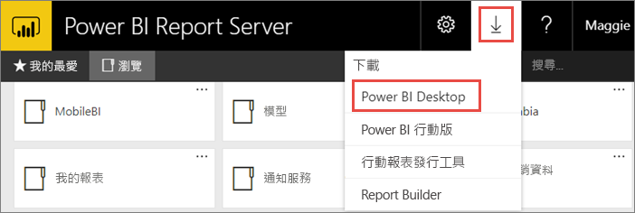
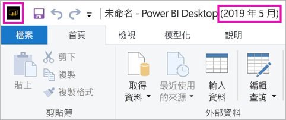
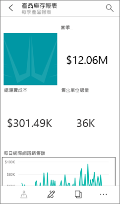

# 安裝針對 Power BI 報表伺服器最佳化的 Power BI Desktop

若要建立 Power BI 報表伺服器的 Power BI 報告，您必須下載並安裝針對 Power BI 報表伺服器最佳化的 Power BI Desktop。 此版本與搭配 Power BI 服務使用的 Power BI Desktop 不同。 例如，Power BI 服務的 Power BI Desktop 版本包含 Power BI 報表伺服器版發行後才擁有的預覽功能。 使用此版本可確保報表伺服器可與已知版本的報告和模型互動。 

好消息是，您可以將 Power BI Desktop 和針對 Power BI 報表伺服器最佳化的 Power BI Desktop，並排安裝在同一部電腦上。

## 下載及安裝 Power BI Desktop

要確定您所擁有的針對 Power BI 報表伺服器最佳化之最新版 Power BI Desktop 最簡單的方式，是從報表伺服器的 web 入口網站開始。

1. 在報表伺服器 web 入口網站中，選取 [下載]  箭號 > [Power BI Desktop]  。

    

    或直接移至[Microsoft Power BI Desktop](https://www.microsoft.com/download/details.aspx?id=56723) （已最佳化的 Power BI 報表伺服器-2019 年） 在 Microsoft 下載中心取得。

2. 在 [下載中心] 頁面上，選取 [下載]  。

3. 根據您的電腦，選取： 

    - **PBIDesktopRS.msi** (32 位元版本) 或

    - **PBIDesktopRS_x64.msi** (64 位元版本)。

1. 下載安裝程式之後，執行 Power BI Desktop (2019 年) 安裝精靈。

2. 在安裝結束時，選取**啟動 Power BI Desktop**。

    其會自動啟動，一切即就緒。

## 確認您使用的版本正確
確認您使用正確 Power BI Desktop 的方式非常簡單：請查看 Power BI Desktop 中的啟動畫面或標題列。 標題列會指出該版本的發行年份和月份。 而且，Power BI 標誌的色彩也會反轉，從黃底黑圖案變成黑底黃圖案。

Power BI 服務的 Power BI Desktop 版本不會在標題列中顯示年份和月份。

## 副檔名關聯
如果在同一部電腦上，同時安裝 Power BI Desktop 和針對 Power BI 報表伺服器最佳化的 Power BI Desktop，則最近安裝的 Power BI Desktop 會與 .pbix 檔案有檔案關聯。 因此，當您按兩下 .pbix 檔案時，便會啟動最近安裝的 Power BI Desktop。

如果您擁有 Power BI Desktop，並接著安裝針對 Power BI 報表伺服器最佳化的 Power BI Desktop，則所有 .pbix 檔案都會預設在後者中開啟。 如果您偏好在開啟 .pbix 檔案時，預設啟動 Power BI Desktop，那麼請[從 Microsoft Store 重新安裝 Power BI Desktop](http://aka.ms/pbidesktopstore)。

您隨時可以開啟您想要先用的 Power BI Desktop 版本， 然後再從 Power BI Desktop 中開啟檔案。

編輯在 Power BI 報表伺服器，從 Power BI 報表，或從入口網站中，建立新的 Power BI 報表一律會開啟 Power BI Desktop 的正確版本。

## 考量與限制

Power BI 報表伺服器、Power BI 服務 (http://app.powerbi.com)) 和 Power BI 行動裝置應用程式中的 Power BI 報表行為幾乎完全相同，但部分功能不同。

### 在瀏覽器中

Power BI 報表伺服器報表支援幾乎所有的視覺效果，包括自訂視覺效果。 Power BI 報表伺服器報表不支援：

* R 視覺效果
* ArcGIS 地圖
* 階層連結
* Power BI Desktop 預覽功能

### 在 Power BI 行動裝置應用程式中

Power BI 報表伺服器報表支援 [Power BI 行動裝置應用程式](../consumer/mobile/mobile-apps-for-mobile-devices.md)中的所有基本功能，包括：

* [手機報表配置](../desktop-create-phone-report.md)：您可以針對 Power BI 行動裝置應用程式來最佳化報表。 在您的行動電話上，最佳化的報表會有特殊圖示，以及版面配置。
  
    

Power BI 報表伺服器報表不支援 Power BI 行動裝置應用程式中的下列功能：

* R 視覺效果
* ArcGIS 地圖
* 自訂視覺效果
* 階層連結
* 地理篩選或列代碼

## 適用於舊版 Power BI 報表伺服器的 Power BI Desktop

如果您的報表伺服器是舊版，則需要 Power BI Desktop 的對應版本。 以下是下載先前版本的連結。

- Microsoft Power BI Desktop ([已最佳化的 Power BI 報表伺服器-2019 年 1 月](https://go.microsoft.com/fwlink/?linkid=2055039))

## 後續步驟

現在您已安裝 Power BI Desktop，即可開始建立 Power BI 報表。

[建立 Power BI 報表伺服器的 Power BI 報表](quickstart-create-powerbi-report.md)  
[什麼是 Power BI 報表伺服器？](get-started.md)

有其他問題嗎？ [嘗試在 Power BI 社群提問](https://community.powerbi.com/)
