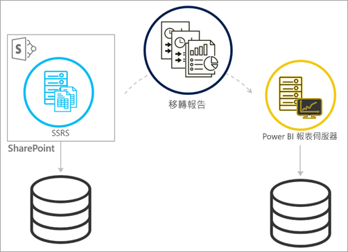
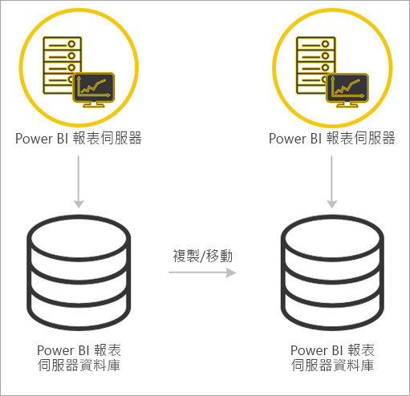

# <a name="migrate-a-report-server-installation"></a>移轉報表伺服器安裝
了解如何將現有的 SQL Server Reporting Services (SSRS) 執行個體移轉到 Power BI 報表伺服器執行個體。

移轉的定義是指將應用程式資料檔案移至新的 Power BI 報表伺服器執行個體。 您可能會因為以下常見原因而移轉安裝︰

* 您想從 SQL Server Reporting Services 移至 Power BI 報表伺服器
  
  > [!NOTE]
  > 沒有 SQL Server Reporting Services 至 Power BI 報表伺服器的就地升級。 必須移轉。
  > 
  > 
* 您有大規模的部署或更新需求
* 您要變更您的安裝硬體或拓撲
* 您遇到導致無法升級的問題

## <a name="migrating-to-power-bi-report-server-from-ssrs-native-mode"></a>從 SSRS (原生模式) 移轉至 Power BI 報表伺服器
從 SSRS (原生模式) 執行個體移轉至 Power BI 報表伺服器包含幾道步驟。


> [!NOTE]
> SQL Server 2008 Reporting Services 及以上版本才支援進行移轉。
> 
> 

* 備份資料庫、應用程式及組態檔
* 備份加密金鑰
* 複製裝載您報表的報表伺服器資料庫
* 安裝 Power BI 報表伺服器。 如果您使用相同的硬體，您可以在與 SSRS 執行個體相同的伺服器上安裝 Power BI 報表伺服器。 如需有關安裝 Power BI 報表伺服器的詳細資訊，請參閱[安裝 Power BI 報表伺服器](install-report-server.md)。

> [!NOTE]
> Power BI 報表伺服器的執行個體名稱會是 *PBIRS*。
> 
> 

* 使用報表伺服器組態管理員設定報表伺服器，並連接至複製的資料庫。
* 執行 SSRS (原生模式) 執行個體所需的任何清除作業

## <a name="migration-to-power-bi-report-server-from-ssrs-sharepoint-integrated-mode"></a>從 SSRS (SharePoint 整合模式) 移轉至 Power BI 報表伺服器
從 SSRS (SharePoint 整合模式) 移轉至 Power BI 報表伺服器並不像原生模式般直接易懂。 雖然這些步驟會提供一些指引，但您在 SharePoint 中可能會有其他檔案和資產需要在這些步驟之外管理。



您會需要將特定報表伺服器內容從 SharePoint 移轉至 Power BI 報表伺服器。 這是假設您已在環境中安裝 Power BI 報表伺服器。 如需有關安裝 Power BI 報表伺服器的詳細資訊，請參閱[安裝 Power BI 報表伺服器](install-report-server.md)。

如果您想要將報表伺服器內容從 SharePoint 環境複製到 Power BI 報表伺服器，您必須使用如 **rs.exe** 等工具複製內容。 將報表伺服器內容從 SharePoint 環境複製到 Power BI 報表伺服器所使用的指令碼如下例。

> [!NOTE]
> 此範例指令碼應適用於 SharePoint 2010 及以上版本和 SQL Server 2008 Reporting Services 及以上版本。
> 
> 

### <a name="sample-script"></a>範例指令碼
```
Sample Script
rs.exe
-i ssrs_migration.rss -e Mgmt2010
-s http://SourceServer/_vti_bin/reportserver
-v st="sites/bi" -v f="Shared Documents“
-u Domain\User1 -p Password
-v ts=http://TargetServer/reportserver
-v tu="Domain\User" -v tp="Password"
```

## <a name="migrateing-from-one-power-bi-report-server-to-another"></a>從 Power BI 報表伺服器移轉至另一個
從 Power BI 報表伺服器進行移轉的程序與從 SSRS (原生模式) 進行移轉相同。



* 備份資料庫、應用程式及組態檔
* 備份加密金鑰
* 複製裝載您報表的報表伺服器資料庫
* 安裝 Power BI 報表伺服器。 您「無法」在與移轉來源相同的伺服器上安裝 Power BI 報表伺服器。 如需有關安裝 Power BI 報表伺服器的詳細資訊，請參閱[安裝 Power BI 報表伺服器](install-report-server.md)。

> [!NOTE]
> Power BI 報表伺服器的執行個體名稱會是 *PBIRS*。
> 
> 

* 使用報表伺服器組態管理員設定報表伺服器，並連接至複製的資料庫。
* 執行舊的 Power BI 報表伺服器安裝所需的任何清除作業。

## <a name="next-steps"></a>後續步驟
[系統管理員手冊](admin-handbook-overview.md)  
[安裝 Power BI 報表伺服器](install-report-server.md)  
[使用 rs.exe 公用程式和 Web 服務編寫指令碼](https://docs.microsoft.com/sql/reporting-services/tools/script-with-the-rs-exe-utility-and-the-web-service)

有其他問題嗎？ [嘗試在 Power BI 社群提問](https://community.powerbi.com/)

