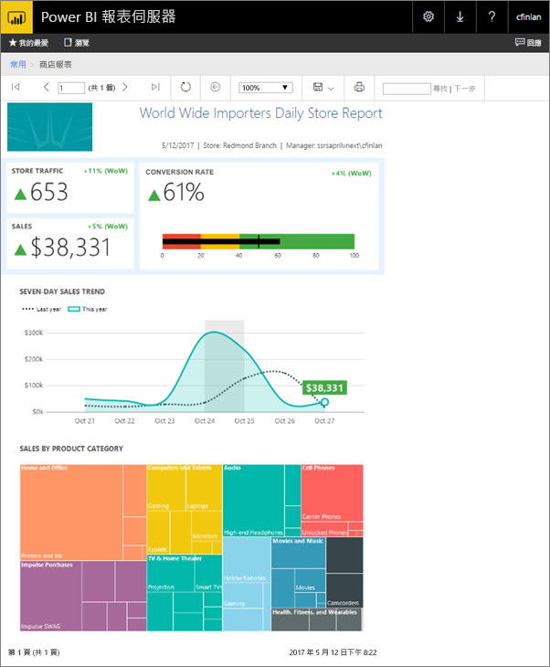
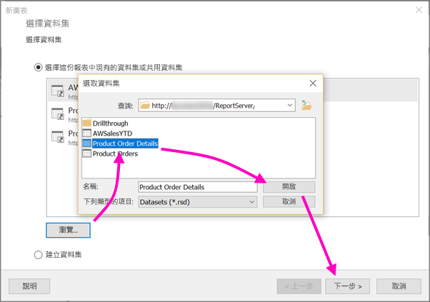
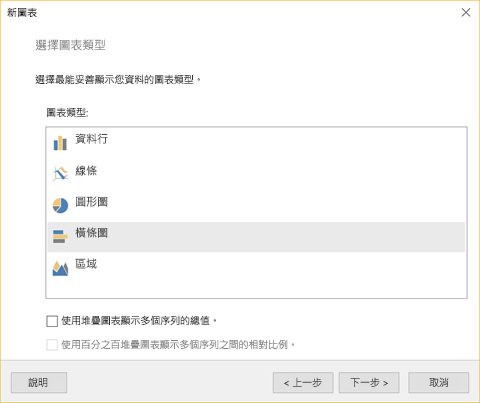
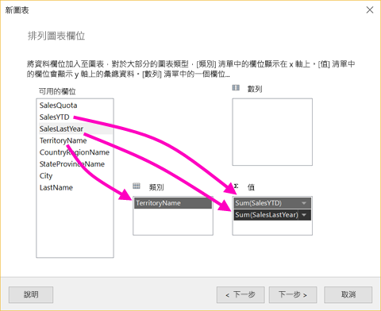
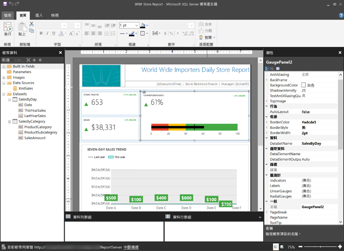

# 建立 Power BI 報表伺服器的編頁報表
正如其名，編頁報表可以執行至許多頁面。 其配置使用固定的格式，且提供精確的自訂項目。 編頁報表為 .rdl 檔案。

您可以在 Power BI 報表伺服器入口網站中儲存及管理編頁報表，就如同您在 SQL Server Reporting Services (SSRS) 入口網站一樣。 在 SQL Server Data Tools (SSDT) 的報表產生器或報表設計師中建立和編輯，然後將其發行至其中一個入口網站。 接著貴組織的報表讀者可在瀏覽器，或其行動裝置上的 Power BI 行動裝置應用程式中加以檢視。

如果您已在報表產生器或報表設計師中建立編頁報表，就可建立 Power BI 報表伺服器的編頁報表。 若否，以下是一些快速入門步驟。

## 步驟 1︰安裝並啟動報表產生器
您可能已安裝報表產生器，可建立 SSRS 伺服器的報表。 您可以使用相同版本或報表產生器來建立 Power BI 報表伺服器的報表。 如果您尚未安裝，此程序很簡單。

1. 在 Power BI 報表伺服器入口網站中，選取 [新增] >  [編頁報表]。
   
    ![[新增編頁報表] 功能表](media/quickstart-create-paginated-report/reportserver-new-paginated-report-menu.png)
   
    如果您尚未安裝報表產生器，其現在會引導您完成安裝程序。
2. 安裝完畢後，報表產生器會開啟到 [新報表或資料集] 畫面。
   
    ![[新報表或資料集] 畫面](media/quickstart-create-paginated-report/reportserver-paginated-new-report-screen.png)
3. 選取您想要建立之報表類型的精靈︰
   
   * 資料表或矩陣
   * 圖表
   * 地圖
   * 空白
4. 讓我們以 [圖表精靈] 作為起始。
   
    [圖表精靈] 會指引您在報表中建立基本圖表的步驟。 您可於該處以近乎無限多種的方式自訂您的報表。

## 步驟 2︰執行 [圖表精靈]
[圖表精靈] 會指引您在報表中建立視覺效果的基本步驟。

編頁報表可連接至各種資料來源，包括 Microsoft SQL Server 和 Microsoft Azure SQL Database，以及 Oracle 和 Hyperion 等等。 了解[編頁報表支援的資料來源](connect-data-sources.md)。

在 [圖表精靈] 的第一頁 [選擇資料集] 中，您可以建立資料集，或選擇伺服器上的共用資料集。 「資料集」會從外部資料來源的查詢傳回報表資料。

1. 選取 [瀏覽] > 選取伺服器上的共用資料集 > [開啟] > [下一步]。
   
    
   
     需要建立資料集嗎？ 請參閱[建立共用或內嵌資料集](https://docs.microsoft.com/sql/reporting-services/report-data/create-a-shared-dataset-or-embedded-dataset-report-builder-and-ssrs)。
2. 選擇圖表類型，在此情況下為橫條圖。
   
    
3. 將欄位拖放至 [類別]**、**[系列] 及 [值] 方塊來加以排列。
   
    
4. 選取 [下一步] >  [完成]。

## 步驟 3︰設計報表
現在您已在 [報表設計] 檢視中。 請注意，資料為預留位置資料，而不是您的資料。

![[報表設計] 檢視](media/quickstart-create-paginated-report/reportserver-paginated-preview-report.png)

* 若要檢視您的資料，請選取 [執行]。
  
     
* 若要返回 [設計] 檢視，請選取 [設計]。

您可以修改剛剛建立的圖表，變更其配置、值、圖例等近乎所有項目。

您也可以新增各種其他視覺效果︰量測計、資料表、矩陣、表格、地圖等等。 您可以新增多個頁面的頁首和頁尾。 請參閱[報表產生器教學課程](https://docs.microsoft.com/sql/reporting-services/report-builder-tutorials)自行嘗試。

## 步驟 4︰將報表儲存至報表伺服器
當您的報表就緒時，將其儲存到 Power BI 報表伺服器。

1. 在 [檔案] 功能表上，選取 [另存新檔]，並將其儲存到報表伺服器。 
2. 現在您可以在瀏覽器中加以檢視。
   
    

## 後續步驟
您有許多絕佳的資源可用，讓您設計報表設計師和 SQL Server Data Tools 的報表產生器中的報表。 報表產生器教學課程是不錯的起點。

* [報表產生器教學課程](https://docs.microsoft.com/sql/reporting-services/report-builder-tutorials)
* [什麼是 Power BI 報表伺服器？](get-started.md)  

有其他問題嗎？ [嘗試在 Power BI 社群提問](https://community.powerbi.com/)

