# <a name="quickstart-embed-a-power-bi-report-server-report-using-an-iframe-in-sharepoint-server"></a>快速入門：在 SharePoint 伺服器中使用 iFrame 來內嵌 Power BI 報表伺服器報表

在本快速入門中，您將了解如何在 SharePoint 頁面中使用 iFrame 來內嵌「Power BI 報表伺服器」報表。 如果您使用 SharePoint Online，則「Power BI 報表伺服器」必需可供公開存取。 在 SharePoint Online 中，與 Power BI 服務搭配運作的「Power BI 網頁組件」並無法與「Power BI 報表伺服器」搭配運作。 

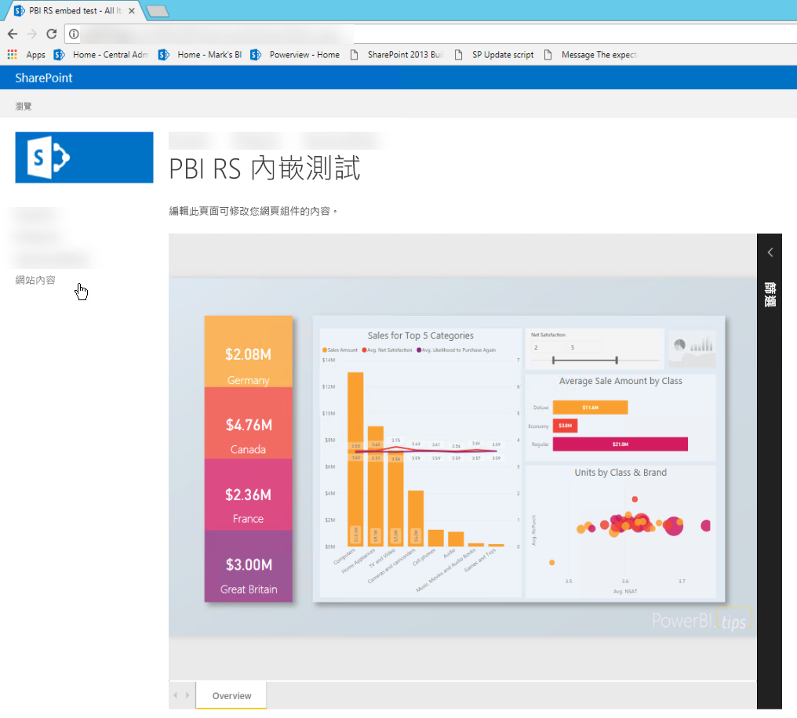
## <a name="prerequisites"></a>先決條件
* 您將必須安裝並設定 [Power BI 報表伺服器](https://powerbi.microsoft.com/en-us/report-server/)。
* 您將必須安裝[已針對 Power BI 報表伺服器最佳化的 Power BI Desktop](install-powerbi-desktop.md)。
* 您將必須安裝並設定 [SharePoint](https://docs.microsoft.com/en-us/sharepoint/install/install)環境。

## <a name="creating-the-power-bi-report-server-report-url"></a>建立 Power BI 報表伺服器報表 URL

1. 從 GitHub 下載範例 - [部落格示範](https://github.com/Microsoft/powerbi-desktop-samples)。

    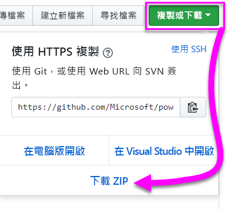

2. 在**已針對 Power BI 報表伺服器最佳化的 Power BI Desktop** 中，開啟來自 GitHub 的範例 PBIX 檔案。

    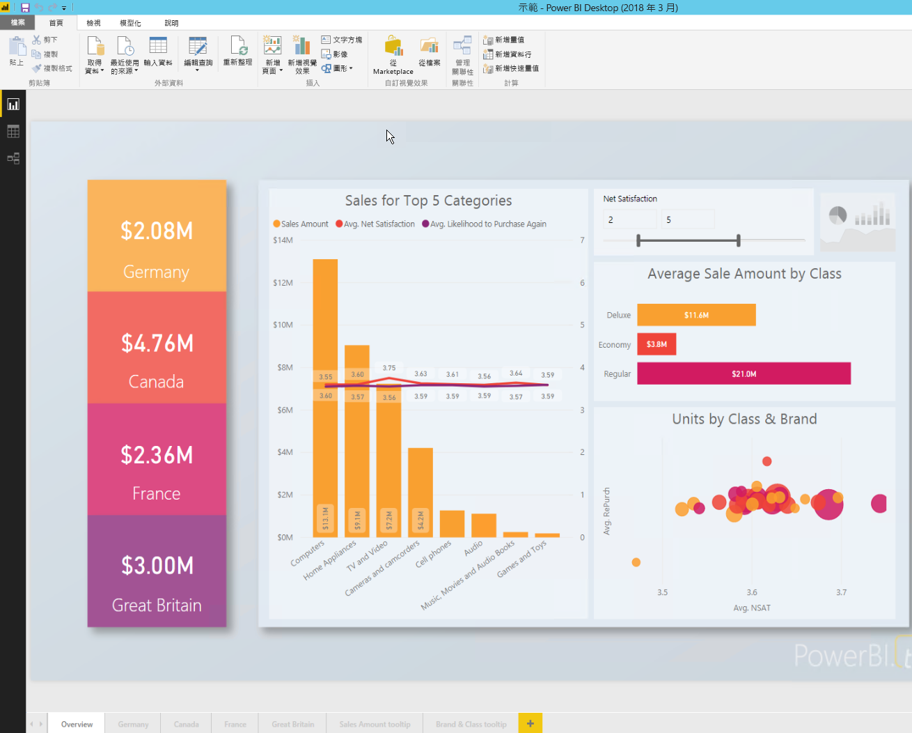

3. 將報表儲存至「Power BI 報表伺服器」。 

    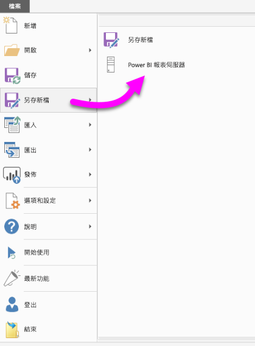

4. 在「入口網站」中檢視報表。

    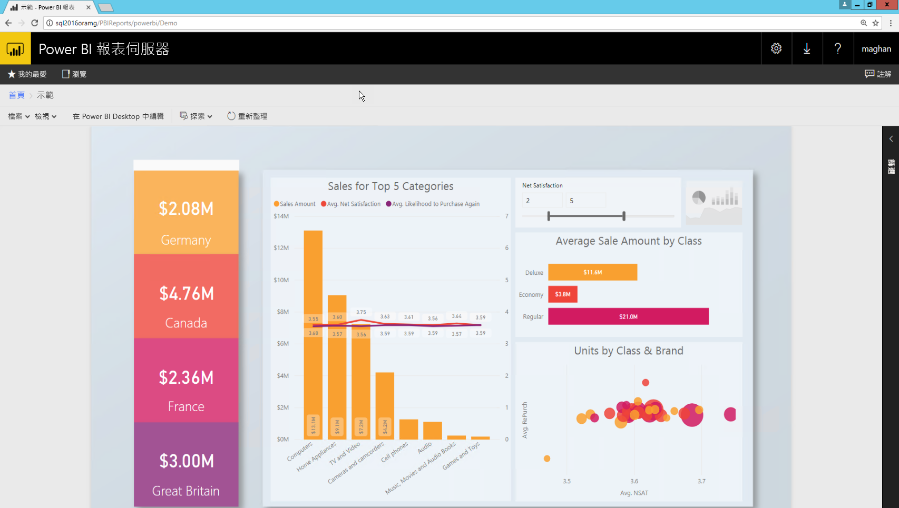

### <a name="capturing-the-url-parameter"></a>擷取 URL 參數

取得您的 URL 之後，便可以在 SharePoint 頁面內建立 iFrame 來裝載報表。 您可以針對任何「Power BI 報表伺服器」報表 URL，新增查詢字串 `?rs:embed=true` 來將報表內嵌至 iFrame。 

   例如：
    ``` 
    http://myserver/reports/powerbi/Sales?rs:embed=true
    ```
## <a name="embedding-a-power-bi-report-server-report-in-a-sharepoint-iframe"></a>在 SharePoint iFrame 中內嵌 Power BI 報表伺服器報表

1. 瀏覽至 SharePoint [網站內容] 頁面。

    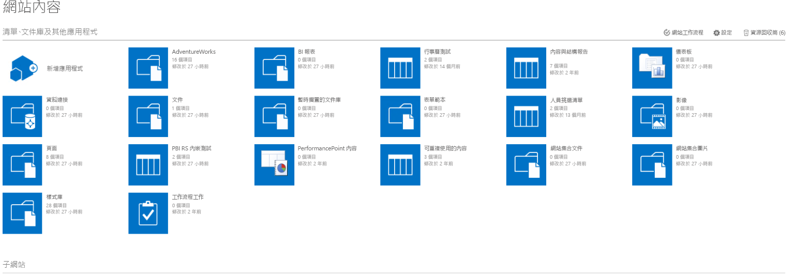

2. 選擇您想要新增報表的頁面。

    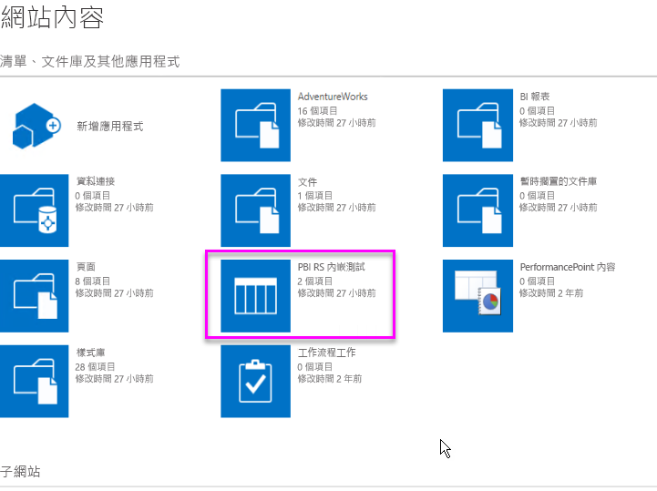

3. 選取右上方的齒輪圖示，然後選取 [編輯頁面]。

    ![[編輯頁面] 選項](media/quickstart-embed/quickstart_embed_07.png)

4. 選取 [新增網頁組件]。

    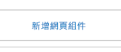

5. 在 [類別] 底下，選取 [媒體及內容]，在 [組件] 底下，選取 [內容編輯器]，然後選取 [新增]。

    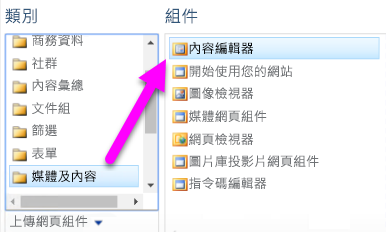 ![選取 [新增]](media/quickstart-embed/quickstart_embed_091.png)

6. 選取 [按一下此處新增內容]。

    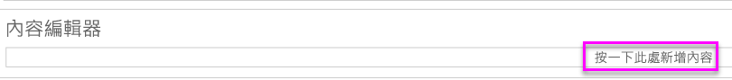

7. 在功能區中，選取 [文字格式] 索引標籤，然後選取 [編輯來源]。

     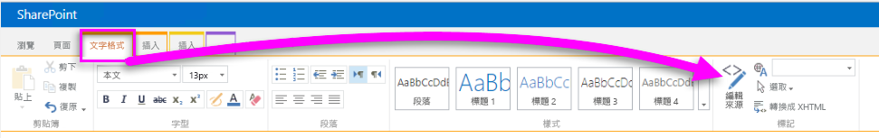

8. 在 [編輯來源] 視窗中，貼上您的 iFrame 程式碼，然後選取 [確定]。

    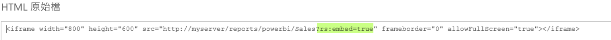

     例如：
     ```
     <iframe width="800" height="600" src="http://myserver/reports/powerbi/Sales?rs:embed=true" frameborder="0" allowFullScreen="true"></iframe>
     ```

9. 在功能區中，選取 [頁面] 索引標籤，然後選取 [停止編輯]。

    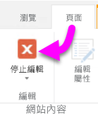

10. 現在，您應該會在頁面上看到報表。

    

## <a name="next-steps"></a>後續步驟

[快速入門︰建立 Power BI 報表伺服器的 Power BI 報表](quickstart-create-powerbi-report.md)  
[快速入門︰建立 Power BI 報表伺服器的編頁報告](quickstart-create-paginated-report.md)  

有其他問題嗎？ [嘗試在 Power BI 社群提問](https://community.powerbi.com/) 