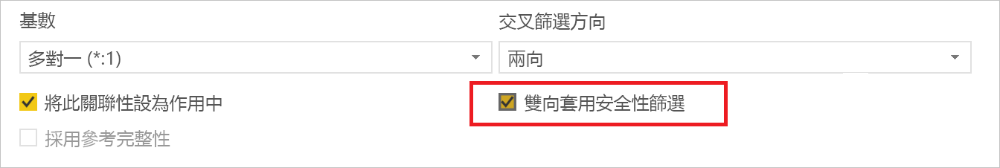
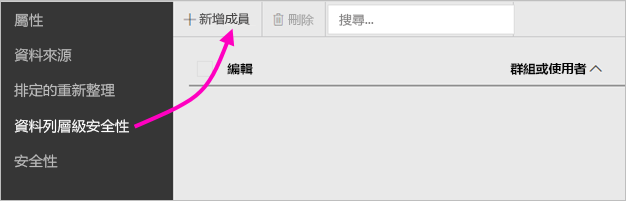
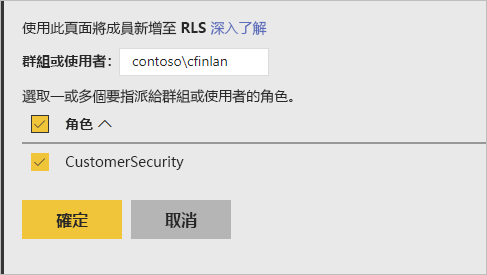
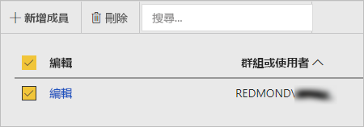

# Power BI 報表伺服器中的資料列層級安全性 (RLS)

在 Power BI 報表伺服器中設定資料列層級安全性 (RLS) 可以限制指定使用者的資料存取權。 篩選會限制資料列層級的資料存取，您可以在角色中定義篩選。  如果您目前在 Power BI 報表伺服器中使用預設權限，任何具有 Power BI 報表發行者或內容管理員權限的使用者，都可以指派成員給該報表的角色。    

您可以使用 Power BI Desktop 對匯入 Power BI 的報表設定 RLS。 您也可以對使用 DirectQuery 的報表 (像是 SQL Server) 設定 RLS。  請注意，如果您的 DirectQuery 連線對報表讀取器使用整合式驗證，就不會採用 RLS。 針對 Analysis Services 即時連線，您可以在內部部署模型上設定資料列層級安全性。 即時連線資料集不會顯示安全性選項。 

[!INCLUDE [rls-desktop-define-roles](../includes/rls-desktop-define-roles.md)]

## 雙向交叉篩選

根據預設，不論關聯性設定為單向或雙向，資料列層級安全性篩選都會使用單向篩選。 您可以手動啟用資料列層級安全性的雙向交叉篩選。

- 選取關聯性，並選取 [套用雙向安全性篩選] ****  核取方塊。 

    

請在根據使用者名稱或登入識別碼實作 [動態資料列層級安全性](https://docs.microsoft.com/sql/analysis-services/supplemental-lesson-implement-dynamic-security-by-using-row-filters)時，選取此方塊。 

如需詳細資訊，請參閱[在 Power BI Desktop 中使用 DirectQuery 雙向交叉篩選](../desktop-bidirectional-filtering.md)和[保護表格式 BI 語意模型](http://download.microsoft.com/download/D/2/0/D20E1C5F-72EA-4505-9F26-FEF9550EFD44/Securing%20the%20Tabular%20BI%20Semantic%20Model.docx)技術白皮書。

[!INCLUDE [rls-desktop-view-as-roles](../includes/rls-desktop-view-as-roles.md)]

## 將成員新增到角色 

當您在 Power BI 報表伺服器中儲存報表後，可以在伺服器上管理安全性，以及新增或移除成員。 僅具有該報表發行者或內容管理員權限的使用者具有而且可使用資料列層級安全性選項。

 如果報表沒有所需角色，您必須在 Power BI Desktop 中將其開啟，新增或修改角色，然後將其儲存回 Power BI 報表伺服器。 

1. 請在 Power BI Desktop 中，將報表儲存到 Power BI 報表伺服器。 您必須使用針對 Power BI 報表伺服器最佳化的 Power BI Desktop 版本。
2. 在 Power BI 報表服務中，選取報表旁邊的省略符號 (**…**)。 

3. 選取 [管理] **** > [資料列層級安全性]。 

     

    在 [資料列層級安全性] 頁面上，將成員新增到您在 Power BI Desktop 中建立的角色。

5. 若要新增成員，請選取 [新增成員]。

1. 以使用者名稱格式 (網域\使用者) 在文字方塊中輸入使用者或群組，並選取您要指派給他們的角色。 這個成員必須在您組織中。   

    

    您也可以在這裡輸入使用者主體名稱，視您設定 Active Directory 的方式而定。 在此情況下，報表伺服器會在清單中顯示相對應的使用者名稱。

1. 按一下 [確定] 以套用。   

8. 若要移除成員，請選取其名稱旁邊的方塊，並選取 [刪除]。  您可以同時刪除多名成員。 

    

## username() 和 userprincipalname()

您可以在資料集內使用 DAX 函式 username() 或 userprincipalname()。 您可以在 Power BI Desktop 中將它們用在運算式內。 當您發佈了模型後，Power BI 報表伺服器就會使用它們。

在 Power BI Desktop 內，username() 會以「網域\使用者」的格式傳回使用者，userprincipalname() 會以 user@contoso.com 的格式傳回使用者。

在 Power BI 報表伺服器中，username() 和 userprincipalname() 都會傳回使用者的使用者主體名稱 (UPN)，這類似於電子郵件地址。

如果您目前在 Power BI 報表伺服器中使用自訂驗證，它會傳回您為使用者設定的使用者名稱格式。  

## 限制 

以下為 Power BI 模型上資料列層級安全性目前的限制。 

具有使用 username() DAX 函式之報表的使用者現在將會發現有新行為，當以整合式安全性使用 DirectQuery 時，使用者主體名稱 (UPN) 會傳回 EXCEPT。  因為該案例中不採用 RLS，所以該案例中的行為不會變更。

您只能在使用 Power BI Desktop 建立的資料集上定義 RLS。 如果您想要針對以 Excel 建立的資料集啟用 RLS，必須先將檔案轉換成 Power BI Desktop (PBIX) 檔案。 深入了解[轉換 Excel 檔案](../desktop-import-excel-workbooks.md)。

僅支援使用所儲存認證的擷取、轉換、載入 (ETL) 及 DirectQuery 連線。 使用整合式驗證對 Analysis Services 和 DirectQuery 連線的即時連線會在基礎資料來源中處理。 

如果您目前以整合式安全性使用 DirectQuery，您的使用者可能會注意到：
- RLS 已停用，而且所有檔案皆會傳回。
- 使用者無法更新其角色指派，並會在 [RLS 管理] 頁面上發生錯誤。
- 在 DAX 使用者名稱函式方面，您會繼續收到格式為「網域\使用者」的使用者名稱。 

報表作者要在上傳報表後，跟著將角色指派給自己，才有權檢視 Power BI 報表伺服器中的報表資料。 

 

## 常見問題集 

### 我可以為 Analysis Services 資料來源建立這些角色嗎？ 

如果已將資料匯入 Power BI Desktop，就可建立。 如果您目前使用即時連線，就無法在 Power BI 服務中設定 RLS。 已在 Analysis Services 模型內部部署中定義 RLS。 

### 我可以使用 RLS 來限制使用者能夠存取的資料行或量值嗎？ 

否。 如果使用者具有特定資料列的存取權，就可以查看該資料列的所有資料行。 

### RLS 是否可讓我隱藏詳細資料，但允許存取以視覺效果摘要的資料？ 

否，您可以保護個別資料列，但使用者一律可以查看詳細資料或摘要的資料。 

### 如果我已經指派現有的角色和成員，還可以在 Power BI Desktop 中新增角色嗎？ 

可以，如果您目前已經在 Power BI 報表伺服器中定義角色或指派成員，您還是可以建立其他角色並重新發佈報表，您目前的指派並不會受到影響。 
 

## 後續步驟

[什麼是 Power BI 報表伺服器？](get-started.md) 
[管理員手冊](admin-handbook-overview.md)  

有其他問題嗎？ [嘗試在 Power BI 社群提問](https://community.powerbi.com/)