# 教學課程：探索 VM 中的 Power BI 報表伺服器入口網站
在本教學課程中，您會建立一部已經安裝「Power BI 報表伺服器」的 Azure 虛擬機器，以便體驗如何檢視、編輯和管理範例 Power BI 及編頁報表與 KPI。

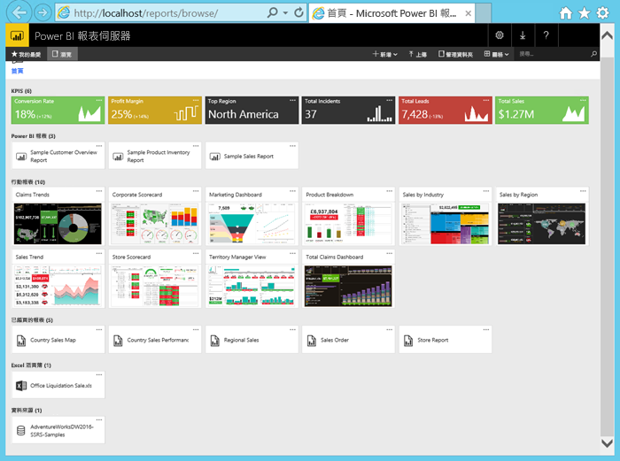

以下是您將在本教學課程中執行的工作：

> [!div class="checklist"]
> * 建立 VM 並連線至 VM
> * 開始探索 Power BI 報表伺服器入口網站
> * 標記某個我的最愛項目
> * 檢視和編輯 Power BI 報表
> * 檢視、管理及編輯編頁報表
> * 在 Excel Online 中檢視 Excel 活頁簿

針對本教學課程，您需要一個 Azure 訂用帳戶。 如果您還沒有訂用帳戶，請先[建立免費帳戶](https://azure.microsoft.com/free/?WT.mc_id=A261C142F)，再開始進行。

## 建立 Power BI 報表伺服器 VM

幸運的是，Power BI 小組已建立一個已經安裝「Power BI 報表伺服器」的 VM。

1. 在 Azure Marketplace 中，開啟 [Power BI 報表伺服器](https://azuremarketplace.microsoft.com/marketplace/apps/reportingservices.technical-preview?tab=Overview)。  

2. 選取 [立即取得]。
3. 若要同意接受提供者的使用規定和隱私權原則，請選取 [繼續]。

    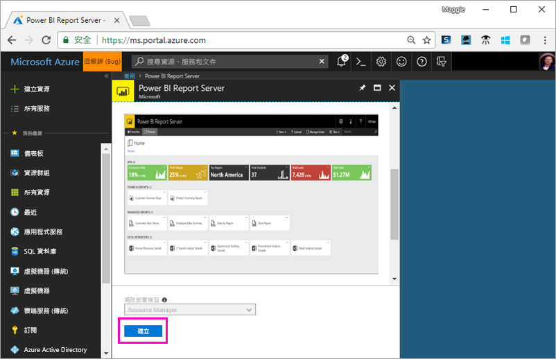

4. **步驟 1 基本**，針對 [VM 名稱]，將其命名為 **reportservervm**。

5. 建立使用者名稱和密碼。

6. 針對 [資源群組]，保留 [新建]，然後將其命名為 **reportserverresourcegroup**。

    若您瀏覽過一次以上的教學課程，則在第一次之後，需要為資源群組提供不同的名稱。 您無法在同一個訂用帳戶中，使用兩次相同的資源群組名稱。 

7. 保留其他預設值 > [確定]。

    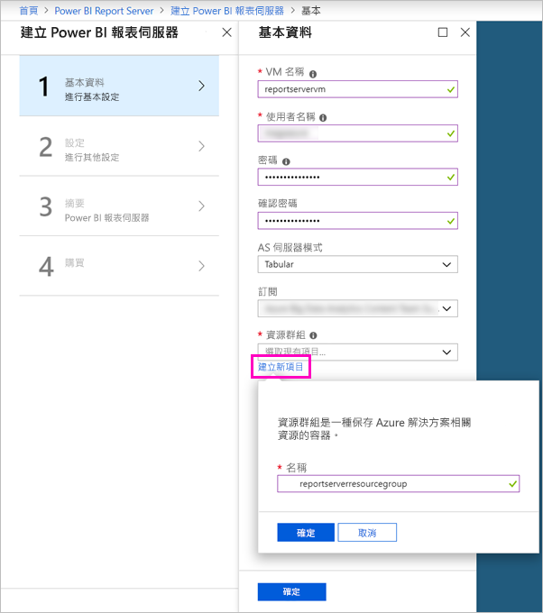

8. **步驟 2 設定**，保留預設值 > [確定]。

9. **步驟 3 摘要** > [確定]。

10. **步驟 4**，檢閱使用規定和隱私權原則 > [建立]。

    **提交 Power BI 報表伺服器 的部署**程序需要數分鐘的時間。

## 連線至虛擬機器

1. 在 Azure 左側瀏覽窗格中，選取 [虛擬機器]。 

2. 在 [依名稱篩選] 方塊中，輸入 "report"。 

3. 選取名為 **REPORTSERVERVM**的 VM。

    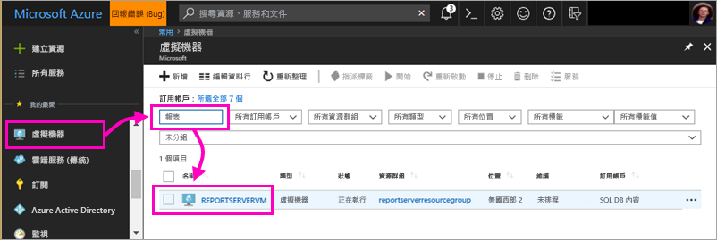

4. 在 REPORTSERVERVM 虛擬機器底下，選取 [連接]。

    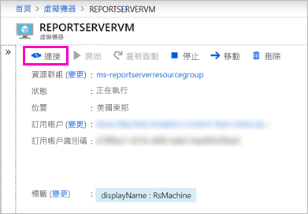

5. 在 [遠端桌面連線] 對話方塊中，選取 [連接]。

6. 輸入您為 VM 建立的名稱和密碼 > [確定]。

7. 下一個對話方塊會指出無法識別遠端電腦的身分識別。 請選取 [是]。

   您看，新的 VM 開啟了。

## VM 上的 Power BI 報表伺服器

當 VM 開啟時，您會在桌面上看到下列項目。

|數字  |意義  |
|---------|---------|
| | 啟動 SQL Server Data Tools 來建立編頁 (.RDL) 報表 |
| | 範例 Power BI (.PBIX) 報表  |
| | 連結至「Power BI 報表伺服器」文件   |
| | 啟動已針對「Power BI 報表伺服器」最佳化的 Power BI Desktop (2018 年 3 月)  |
| | 在瀏覽器中開啟「Power BI 報表伺服器」入口網站   |

按兩下 [報表伺服器入口網站] 圖示。 瀏覽器會開啟 http://localhost/reports/browse。 在入口網站中，您會看到各種依類型分組的檔案。 

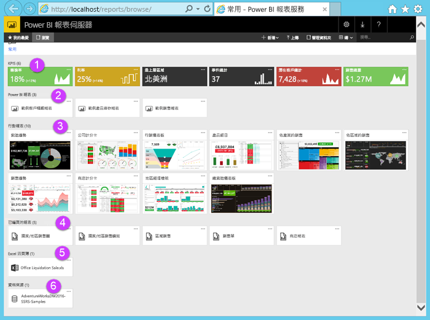

|數字  |意義  |
|---------|---------|
| | 在入口網站中建立的 KPI |
| |  Power BI (.PBIX) 報表  |
| | 在「SQL Server 行動報表發行工具」中建立的行動報表  |
| |  在「報表產生器」或 SQL Server Data Tools 中建立的編頁報表  |
| | Excel 活頁簿   | 
| | 編頁報表的資料來源 | 

## 標記我的最愛
您可以將想要的報表和 KPI 標記為 [我的最愛]。 這樣會更容易尋找，因為在入口網站和 Power BI 行動應用程式，它們全都蒐集在單一 [我的最愛] 資料夾中。 

1. 選取 [獲利率] KPI 右上角的省略符號 (**…**) > [加入我的最愛]。
   
    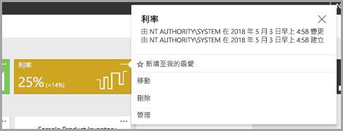
2. 選取入口網站功能區上 [我的最愛]，在入口網站 [我的最愛] 頁面上與其他最愛項目一併查看。
   
    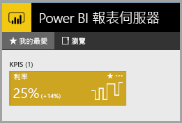

3. 選取 [瀏覽] 以返回入口網站。
   
## 以清單檢視來檢視項目
根據預設，入口網站以 [磚] 檢視來顯示內容。

您可以切換到 [清單] 檢視，方便您一次移動或刪除多個項目。 

1. 選取 [磚] > [清單]。
   
    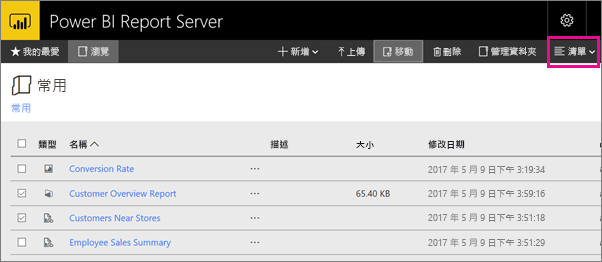

2. 返回 [圖格] 檢視，選取 [清單] > [圖格]。

## Power BI 報表

您可以在入口網站中檢視 Power BI 報表並與其互動，以及直接從入口網站啟動 Power BI Desktop。

### 檢視 Power BI 報表

1. 在入口網站中的 [Power BI 報表] 底下，選取 [範例客戶概觀報表]。 報表隨即在瀏覽器中開啟。

1. 選取樹狀圖中的 [美國] 區塊，以查看它如何在其他視覺效果中醒目標示相關的值。

    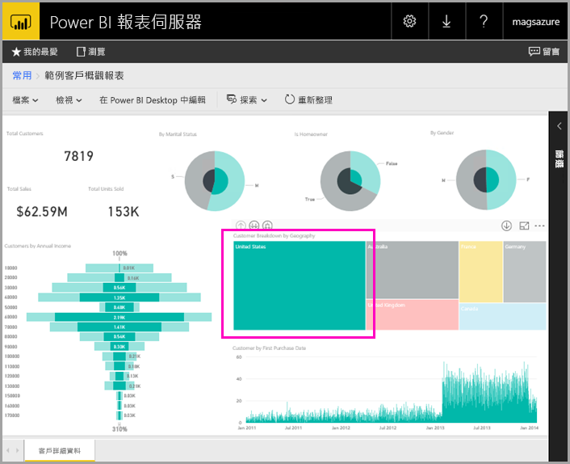

### 在 Power BI Desktop 中編輯

1. 選取 [在 Power BI Desktop 中編輯]。

1. 選取 [允許] 以允許此網站在您的電腦上開啟程式。 

     報表隨即在 Power BI Desktop 中開啟。 請注意頂端列中的名稱「Power BI Desktop (2018 年 3 月)」。 這是已針對「Power BI 報表伺服器」最佳化的版本。

    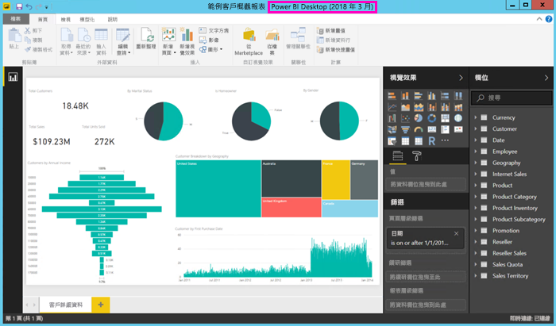

     請使用安裝在 VM 上的 Power BI Desktop 版本。 您不可跨網域來上傳報表。

3. 在 [欄位] 窗格中，展開 [客戶] 資料表，然後將 [職業] 欄位拖曳至 [報表層級篩選]。

    ![將欄位拖曳至 [篩選] 窗格](media/tutorial-explore-report-server-web-portal/power-bi-report-server-desktop-filter.png)

1. 請儲存報表。

1. 返回瀏覽器中的報表，然後選取 [重新整理] 圖示。

    ![瀏覽器 [重新整理] 圖示](media/tutorial-explore-report-server-web-portal/power-bi-report-server-browser-refresh.png)

8. 展開右邊的 [篩選] 窗格以查看您新增的 [職業] 篩選。 選取 [專業]。

    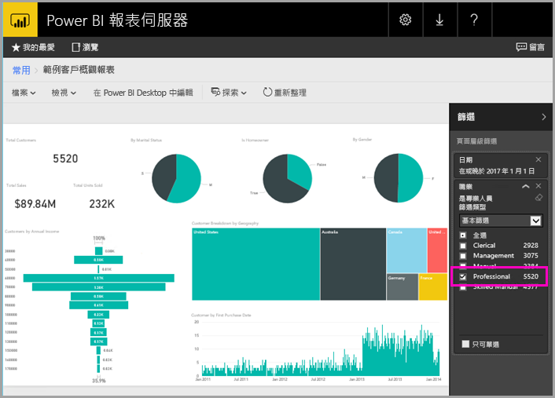

3. 選取 [瀏覽] 以返回入口網站。

## 編頁 (RDL) 報表

您可以從入口網站檢視和管理編頁報表，以及啟動「報表產生器」。

### 管理編頁報表

1. 在入口網站中的 [編頁報表] 底下，選取 [銷售訂單] 旁邊的省略符號 (...) > [管理]。

1. 選取 [參數]，將 [SalesOrderNumber] 的預設值變更為 **SO50689** > [套用]。

   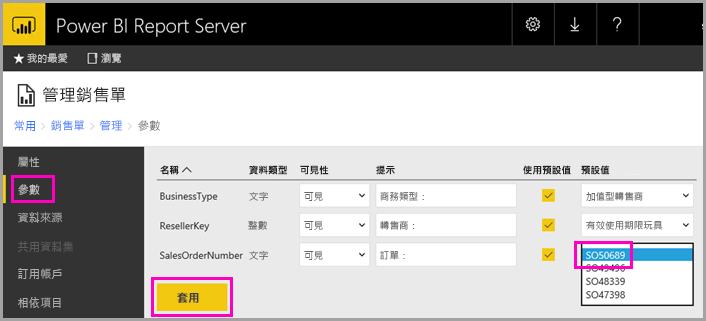

3. 選取 [瀏覽] 以返回入口網站。

### 檢視編頁報表

1. 在入口網站中，選取 [銷售訂單]。
 
3.  您會看到它開啟至您所設定的[訂單] 參數 **SO50689**。 

    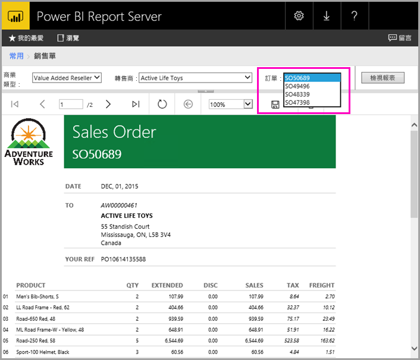

    您可以在這裡變更該參數及其他參數，而無須變更預設值。

1. 選取 [訂單 SO48339] > [檢視報表]。

4. 您會看到這是 2 頁中的第 1 頁。 請選取向右箭號來查看第 2 頁。 資料表會在該頁面繼續。

    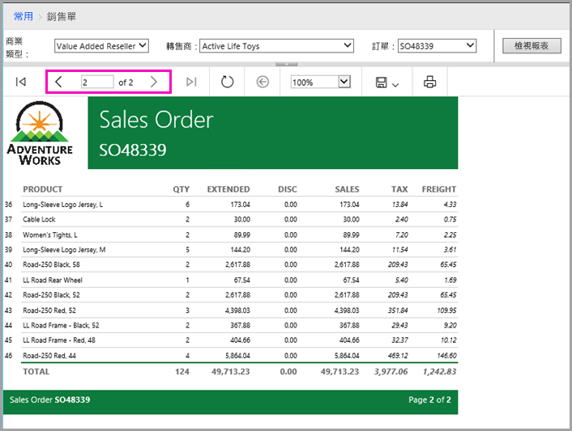

5. 選取 [瀏覽] 以返回入口網站。

### 編輯編頁報表

您可以在「報表產生器」中編輯編頁報表，並且可以直接從瀏覽器中啟動「報表產生器」。

1. 在入口網站中，選取 [銷售訂單] 旁邊的省略符號 (...) > [在報表產生器中編輯]。

1. 選取 [允許] 以允許此網站在您的電腦上開啟程式。

1. [銷售訂單] 報表隨即在「報表產生器」的 [設計檢視] 中開啟。

    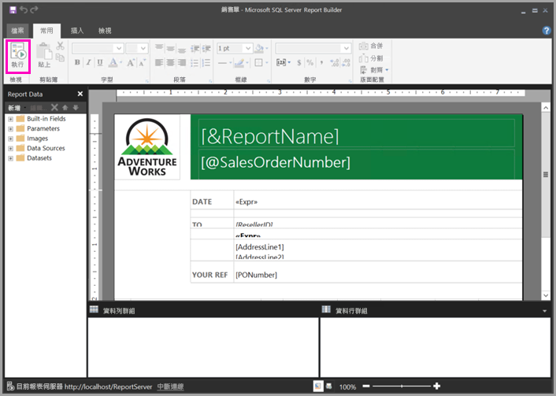

1. 選取 [執行] 以預覽報表。

    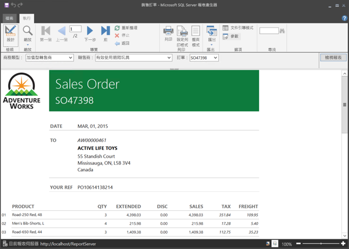

5. 關閉「報表產生器」並返回瀏覽器。

## 檢視 Excel 活頁簿

您可以在「Power BI 報表伺服器」的 Excel Online 中檢視 Excel 活頁簿並與其互動。 

1. 選取 Excel 活頁簿 [Office Liquidation Sale.xlsx]。 系統可能會要求您輸入認證。 選取 [取消]。 
    報表隨即在入口網站中開啟。
1. 選取交叉分析篩選器中的 [設備]。

    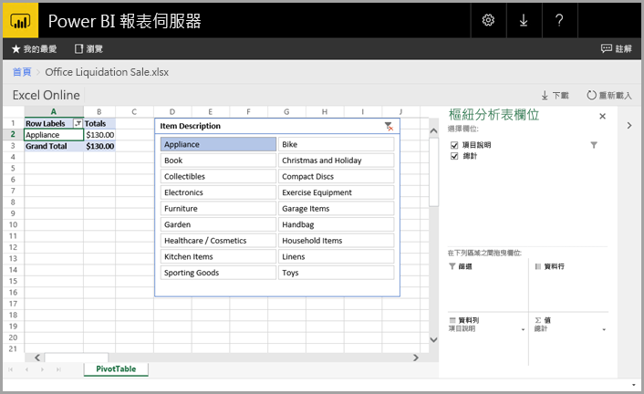

1. 選取 [瀏覽] 以返回入口網站。

## 清除資源

既然您已完成本教學課程，現在即可刪除資源群組、虛擬機器及所有相關資源。 

- 若要這樣做，請選取 VM 的資源群組，然後選取 [刪除]。

## 後續步驟

在本教學課程中，您已建立具有「Power BI 報表伺服器」的 VM。 您已嘗試入口網站的某些功能，並已在 Power BI 報表和編頁報表的個別編輯器中開啟這些報表。 此 VM 已安裝了 SQL Server Analysis Services 資料來源，所以您可以嘗試使用這些相同的資料來源，建立您自己的 Power BI 以及分頁的報表。 

若要深入了解如何為「Power BI 報表伺服器」建立報表，請繼續進行。

> [!div class="nextstepaction"]
> [建立 Power BI 報表伺服器的 Power BI 報表](./quickstart-create-powerbi-report.md)

