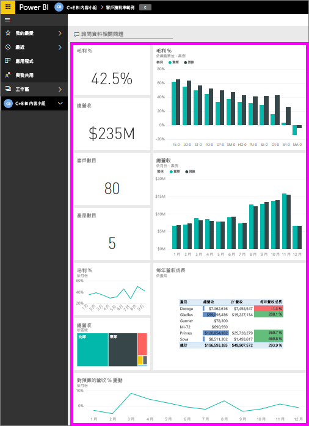
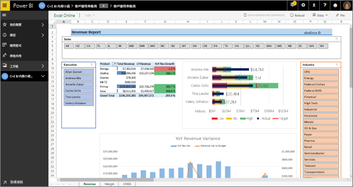
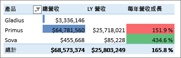
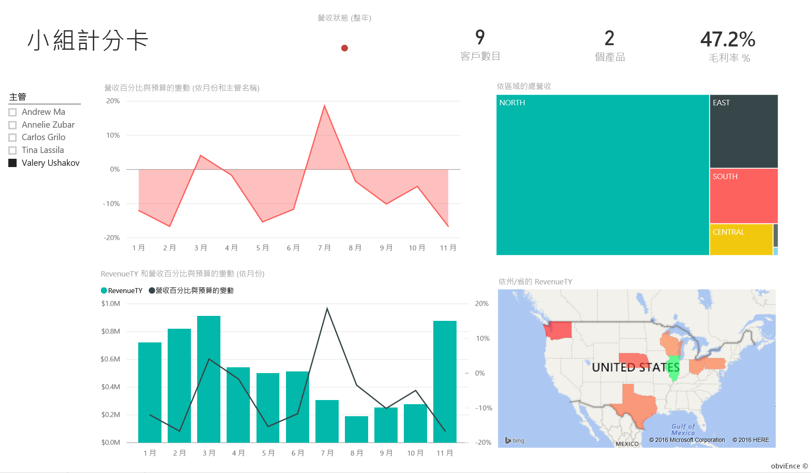
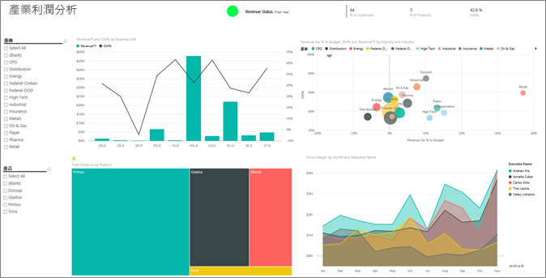
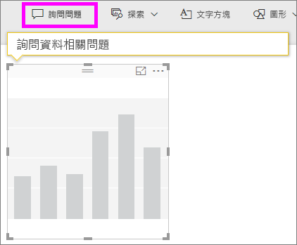
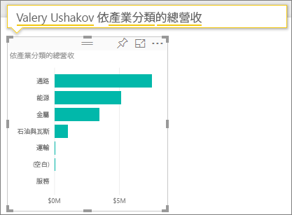
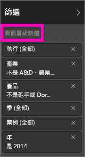
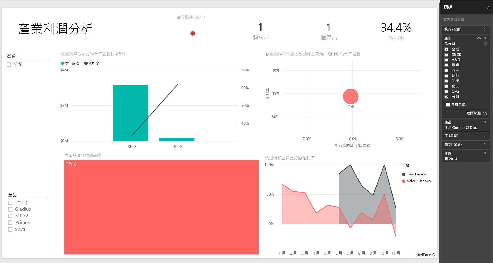
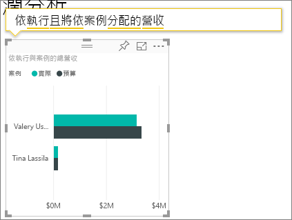

# Power BI 的客戶獲利率範例：導覽

## 瀏覽客戶獲利率範例概觀
「客戶獲利率範例」內容套件包含製作行銷資料的公司儀表板、報表和資料集。 CFO 建立這個儀表板是為了查看轄下 5 個業務單位經理 (或主管)、產品、客戶和毛利 (GM) 的關鍵度量。 她一眼即可看出影響獲利率的因素。

<<<<<<< 標頭 

此範例是系列中的一部分，該系列說明您可如何使用 Power BI 的商業導向資料、報表及儀表板。 此為來自 obviEnce 的匿名真實資料 ([www.obvience.com](http://www.obvience.com/))。 資料會以數種格式提供：內容套件/應用程式、Excel 活頁簿，或 .pbix Power BI Desktop 檔案。 請參閱[範例資料集](sample-datasets.md)。

## 先決條件
想要跟著做嗎？ 本教學課程使用 Power BI 服務和「客戶獲利率」範例內容套件。  因為報表的使用體驗皆非常類似，您也可以示使用 Power BI Desktop 和範例 PBIX 檔案來進行教學課程。 下方提供連線到內容套件和 PBIX 檔案的指示。

### 取得此範例的內容套件

1. 開啟 Power BI 服務 (app.powerbi.com) 並登入。
2. 在左下角選取 [取得資料]。
   
    
3. 在顯示的 [取得資料] 頁面上，選取 [範例]。
   
   
4. 選取 [客戶獲利率範例]，然後選擇 [連線]。  
   
   
5. Power BI 會匯入內容套件，並將新的儀表板、報表及資料集新增到您目前的工作區。 新的內容會以黃色星號標示。 使用範例讓 Power BI 進行測試回合。  
   
   
  
### 取得此範例的 .pbix 檔案

或者，您可以下載此範例為 .pbix 檔案，其設計目的是要用於 Power BI Desktop。 [客戶獲利率範例](<http://download.microsoft.com/download/6/A/9/6A93FD6E-CBA5-40BD-B42E-4DCAE8CDD059/Customer>> Profitability Sample PBIX.pbix)

### 取得此範例的 Excel 活頁簿

如果您想要深入了解此範例的資料來源，我們也有以 [(Excel 活頁簿)](http://go.microsoft.com/fwlink/?LinkId=529781) 的格式提供它。 活頁簿包含的 Power View 工作表可供您檢視及修改。 若要查看未經處理的資料，請選取 [Power Pivot] > [管理]。
=======

此範例是系列中的一部分，該系列說明您可如何使用 Power BI 的商業導向資料、報表及儀表板。 此為來自 obviEnce 的匿名真實資料 ([www.obvience.com](http://www.obvience.com/))。 資料會以數種格式提供：內容套件/應用程式、Excel 活頁簿，或 .pbix Power BI Desktop 檔案。 請參閱[範例資料集](sample-datasets.md)。

### 先決條件
想要跟著做嗎？ 在 [Power BI 服務](https://powerbi.com)中，前往 [取得資料] > [範例] > [客戶獲利率] > [連線]，以取得自己的範例複本。
>>>>>>> def2c8e086d65b6a3fb92247175730746226ae3e

## 儀表板告訴我們什麼？

在 [我的工作區] 下，尋找客戶獲利率範例的儀表板：

### 全公司的儀表板圖格
1. 開啟 Power BI 服務中的儀表板。 該儀表板磚可讓 CFO 看到對她而言很重要的高階公司度量。  當她看到值得關注的項目時，她可以選取圖格深入探究資料。

2. 檢閱儀表板左側的磚。

    

- 本公司的毛利為 42.5%。
- 我們有 80 位客戶。
- 我們銷售 5 種不同的產品。
- 我們對預算的收益差異 % 在二月為最低，但在三月來到最高。
- 我們的營收大部分來自東部和北部地區。 毛利從未超過預算，ER-0 和 MA-0 則需要進一步調查。
- 年度總收益接近預算。

### 經理特定儀表板圖格
儀表板右側的磚能提供小組計分卡。 CFO 需要追蹤其轄下經理，而這些圖格能讓她使用 GM% 全面掌握收益狀況。 如果任一經理的 GM% 趨勢不盡人意，她就可以進一步調查。

- 除了 Carlos 以外的所有主管皆已超越其銷售目標。 但 Carlos 的實際銷售額是最高的。 
- Annelie 的 GM% 最低，但我們可以看到它三月之後穩定增加。
- 相反地，Valery 的 GM% 卻巨幅下滑。 
- 而 Andrew 這一年的變動劇烈。 

## 探索儀表板的基礎資料
儀表板具有連結到報表和 Excel 活頁簿的磚。 

### 開啟 Excel 線上資料來源
此儀表板上的兩個磚，[Target vs Actual] \(目標與實際\) 和 [Year Over Year Revenue Growth] \(逐年營收成長\)，都是從 Excel 活頁簿釘選而來。 當您選取其中任何一個磚時，Power BI 隨即開啟該磚的資料來源 (在此範例中為 Excel Online)。

1. 選取從 Excel 釘選的其中一個磚。 Excel Online 會在 Power BI 服務內開啟。
2. 注意到該活頁簿的資料分散於 3 個索引標籤中。 開啟 [Revenue] \(營收\)。
3. 我們來看看 Carlos 還未達到其目標的原因。  
    a. 使用 [Executive] \(主管\) 滑桿，選取 [Carlos Grilo]。   
    b. 從第一個樞紐分析表可看出 Carlos 銷售最多的產品 Primus，其營收與去年相比下降了 152%。 且 [YoY] \(逐年\) 圖表顯示他在大多數月份中的預算都低於標準。  

    

    

4. 繼續探索，如果發現感興趣的項目，選取右上角的 [釘選]  將它[釘選到儀表板](service-dashboard-pin-tile-from-excel.md)。

5. 使用瀏覽器的上一頁箭頭來返回儀表板。 

### 開啟基礎 Power BI 報表
「客戶獲利率」範本儀表板上大部分的磚，都是從基礎「客戶獲利率」範本報表中釘選而來。 

1. 選取其中一個磚，以在 [閱讀檢視] 中開啟該報表。 

2. 報表有 3 個頁面。 報表底部的每個索引標籤都代表一個頁面。 

    

    * 「小組計分卡」著重於 5 位管理員的效能和他們的「客戶個資清冊」。
    * 「產業利潤分析」提供一種方法，用以分析相較於整個產業現況的我方獲利率。
    * 「主管計分卡」提供可用 Cortana 檢視的格式化各主管檢視。

### [小組計分卡] 頁面

讓我們仔細觀察兩個小組成員，看看有什麼發現。 在左側的交叉分析篩選器中選取 Andrew 的名字來篩選報表頁面，只顯示與他有關的資料。

* 如需快速查看 KPI，請查看 Andrew 的**營收狀態**：他的狀態為綠色。 他的業績很好。
* 「按月對預算的營收差異 %」區域圖顯示，除了二月份下跌，Andrew 整年的表現都很不錯。 他負責的區域在東部，手上有 49 位客戶和 5 項產品 (共 7 項)。 他的 GM% 不是最高或最低。
* 「總稅收和按月對預算的營收差異 %」顯示平穩甚至有獲利。但是當您按一下區域樹狀結構圖 [中部] 的方塊篩選資料時，您會發現 Andrew 只有三月份在印第安納州有營收。 這是故意為之，還是有什麼需要一探究竟嗎？

現在來看看 Valery。 在交叉分析篩選器中，選取 Valery 的名字來篩選報表頁面，只顯示與她有關的資料。  

* 請注意 [總稅收狀態] 的紅色 KPI。 這肯定需要進一步探查。
* 她的營收差異也十分令人擔憂，她連自己的邊際收益都達不到。
* Valery 手上只有 9 位客戶、負責 2 項產品，而且幾乎只和北部的客戶打交道。 這個特點能夠說明其度量的巨幅波動。
* 在樹狀結構圖中選取 [北部]  方塊，顯示 Valery 在北部的毛利與她整體的毛利一致。
* 選取其他的 [區域]  方塊會發現一個有趣的現象：她的 GM% 從 23% 到 79%，而她的營收數字在北部以外的所有區域，都是絕對季節性的。

繼續探究為什麼 Valery 的區域業績不佳。 看看區域、其他業務單位和報表的下一頁：「產業利潤分析」。

### 產業利潤分析
這個報表頁面提供不同的資料面。 它著眼於整個產業的毛利，按區段切分。 CFO 用這個頁面比較公司暨業務單位的度量與產業度量，幫助她解釋趨勢和獲利率。 您可能會納悶為什麼「每月毛利和主管姓名」的區域圖放在這個頁面，因為它是小組特定的。 它在這裡有助於我們依業務單位主管篩選頁面。  

獲利率如何依產業變化？ 如何依產業切分產品和客戶？ 請從左上角選取一或多個產業。 (從 CPG 產業開始) 若要清除篩選器，選取橡皮擦圖示。

在泡泡圖中，CFO 會尋找最大的泡泡，因為它們對營收的影響最大。 在區域圖中的主管姓名上按一下，依主管篩選頁面，讓您更容易依產業區段查看每一位經理的影響力。

* Andrew 影響的區域遍及許多不同的產業區段，其 GM% (多為好的一面) 和差異 % 的變化也極大。 
* Annelie 的圖表很類似，除了她專注於少數幾個產業區段，聚焦於聯邦區段及短劍產品。 
* Carlos 目標明確，在服務區段取得豐厚的利潤。 他在高科技區段及對他而言嶄新的工業區段的差異 % 成長驚人，與預算相較，表現十分突出。 
* Tina 負責少數幾個區段且擁有最高的 GM%，但她的泡泡都不大，這表示她對公司營收的影響最小。 
* Valery 只負表一種產品，只處理 5 個產業區段。 她的產業影響力有季節性，但一直都是大型的泡泡，這表示她對公司營收的影響巨大。 產業可否說明她不盡人意的表現？

### 主管計分卡
這個頁面會格式化為 Answer Card for Cortana。 若要深入了解，請參閱[建立 Answer Card for Cortana](service-cortana-answer-cards.md)。

## 利用問與答問來提問以深入探索資料
我們的分析有助於判斷哪些產業讓 Valery 產生最多收益。 讓我們使用問與答。

1. 選取 [編輯報表] 以在 [編輯檢視] 中開啟該報表。 只有在您「擁有」該報表的情況下，才能使用 [編輯檢視] (有時稱為**建立者**模式)。 反之，如果此報表是與您共用的，您將無法在 [編輯檢視] 中開啟它。

2.  從頂端的功能表列，選取 [詢問問題] 來開啟問與答問題方塊。

    

3. 輸入 **Valery 依各項產業分列的總營收**。 請注意當您輸入問題時，視覺效果更新的方式。
   
    
   
   配銷是 Valery 最大的收益區域。

### 加入篩選器更深入探究
讓我們看看 [配銷]  產業。  

1. 開啟 [Industry Margin Analysis] \(產業利潤分析\) 報表頁面。
2. 在不選取報表頁面上任何視覺效果的情況下，展開右側的篩選窗格 (如果未展開)。 [篩選] 窗格應該只會顯示頁面層級篩選。  
   
   
3. 找到 [產業] 的篩選，然後選取箭號來展開清單。 讓我們新增 [配銷] 產業的頁面篩選。 首先，清除 [全選] 核取方塊，以清除所有選取項目。 然後僅選取 [配銷]。  
   
   
4. 「每月毛利和主管姓名」區域圖告訴我們，只有 Valery 和 Tina 在此產業有客戶，而且 Valery 只有在六月到十一月這段時間才需要處理這項產業的業務。   
5. 在「每月毛利和主管」區域圖圖例中，依序選取 [Tina] 和 [Valery]。 請注意，和 Valery 相比，Tina 的「產品總收益」部分真的很小。 
6. 若要查看實際的營收，請使用問與答要求**依主管及案例顯示配銷的總營收**。  
   
     

    我們可以類似的方法瀏覽其他產業，甚至加入客戶，以在視覺效果中了解 Valery 績效的成因。

這是安全的作業環境。 您一律可以選擇不儲存變更。 但如果儲存了變更，您也可以隨時移至 [取得資料]  ，重新複製此範例。

您也可以[只下載此範例的資料集 (Excel 活頁簿)](http://go.microsoft.com/fwlink/?LinkId=529781).

## 下一步：連接到您的資料
我們希望本教學已示範 Power BI 儀表板、問與答和報表如何讓您深入了解客戶的資料。 現在換您登場 — 連接到您自己的資料。 您可以透過 Power BI 連接到各式各樣的資料來源。 深入了解[開始使用 Power BI](service-get-started.md).

[返回 Power BI 中的範例](sample-datasets.md)  

